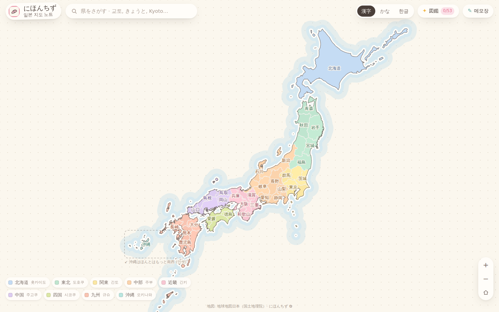
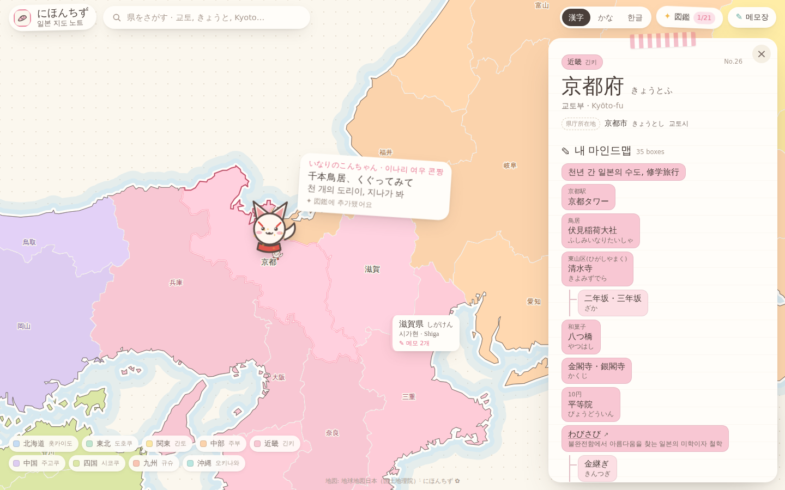
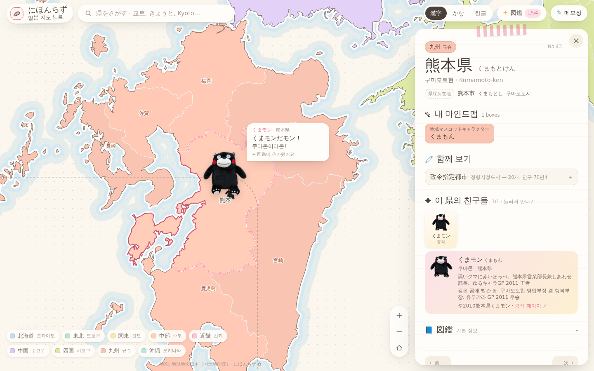
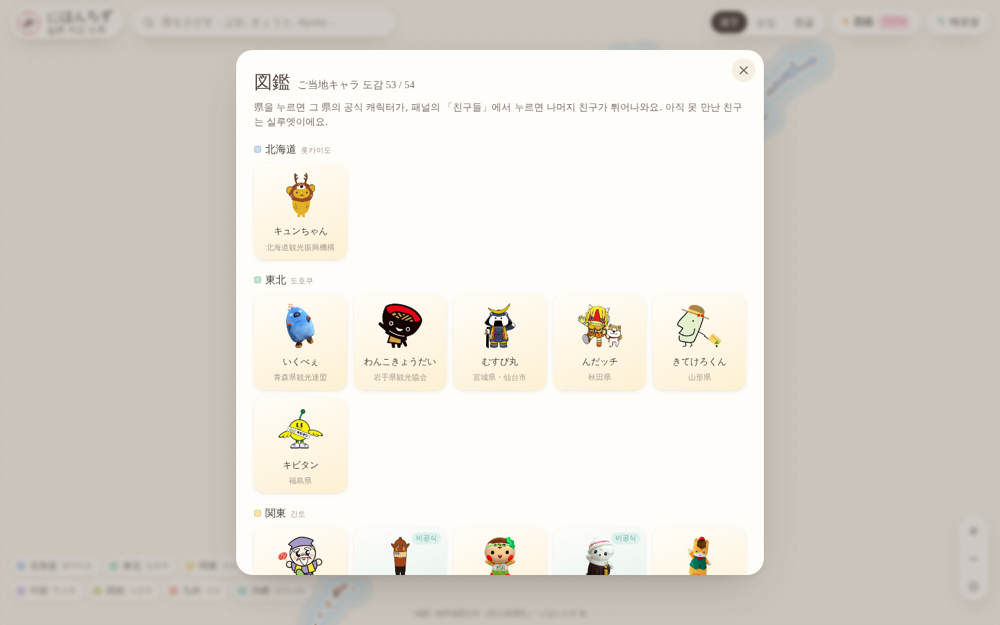
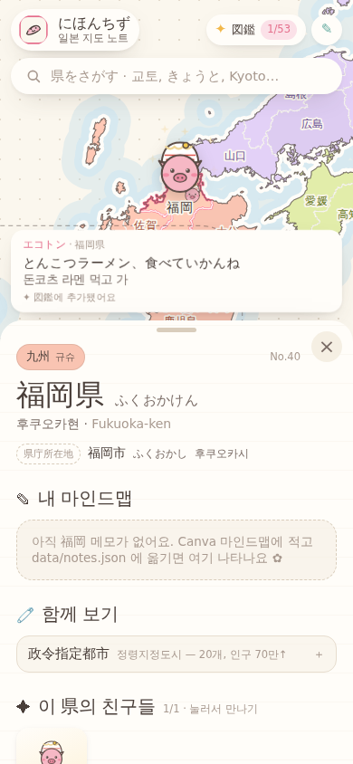
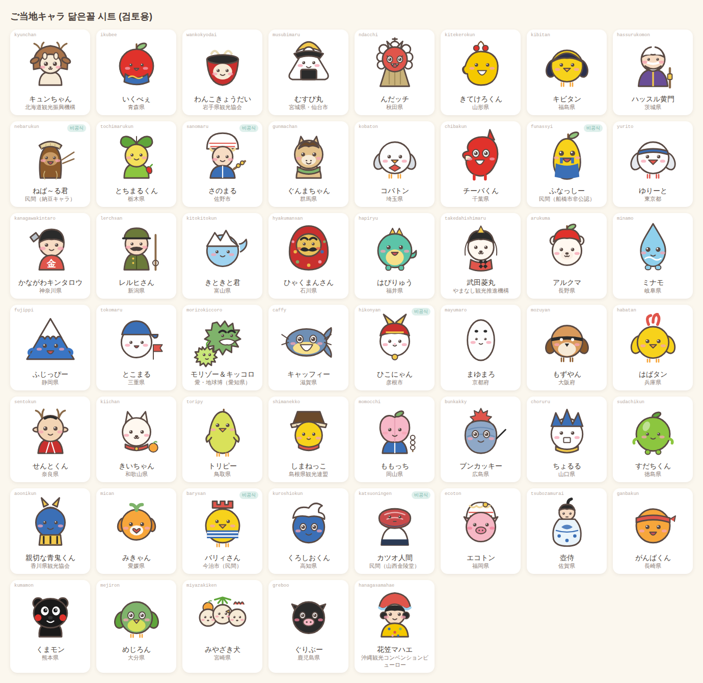

# にほんちず — 일본 지도 노트

일본 47도도부현(都道府県)을 눌러보며 익히는 인터랙티브 지도.
내가 Canva 마인드맵에 정리해 둔 메모가 각 県 패널에 **마인드맵 트리 그대로** 붙어 있고,
県을 누르면 그 지역의 실제 마스코트가 튀어나오는 이스터에그가 있다.

> 다음 단계: 노션에 모아둔 일본어 단어와 연결 (같은 데이터 구조 위에 페이지를 추가하면 됨).

## 빠른 시작

> **브랜치 주의 — 이 저장소에는 프로젝트가 여럿 있습니다.** 브랜치마다 내용이 완전히 다릅니다.
>
> | 브랜치 | 내용 | 실행 | 포트 |
> | --- | --- | --- | --- |
> | `nihonchizu` | **にほんちず (이 프로젝트)** | `nihon` | 5004 |
> | `claude/battery-charge-discharge-webapp-dq4ja3` | 충방전 워크벤치 (bml) | `bml` | 5003 |
> | `claude/friendly-meitner-lldvar` | DFT 판 | `dft` | 5001 |
>
> **이 프로젝트의 집은 `nihonchizu` 브랜치입니다.** `main` 은 이 프로젝트가 아니고 머지하지 않습니다
> ([ADR 0001](docs/adr/0001-branch-is-the-home.md)). `-b` 로 브랜치를 지정해 클론하는 것이 정상 절차입니다.
> 한 폴더에서 다른 프로젝트 브랜치와 오가지 마세요 — 둘 다 쓴다면 `git worktree` 로 폴더를 나눕니다.

```bash
git clone -b nihonchizu https://github.com/yonghoon7153-source/Yonghoon-DEM-DFT.git nihonchizu
cd nihonchizu
./tools/nihon install     # nihon 을 PATH 에 등록 (1회)
nihon                     # 최신화 → 의존성 → 개발 서버 → http://localhost:5004
```

이미 bml 이나 dft 를 받아 둔 폴더가 있다면, 그 저장소에 워크트리로 붙입니다:

```bash
git -C ~/Yonghoon-DEM-DFT fetch origin nihonchizu
git -C ~/Yonghoon-DEM-DFT worktree add ~/nihonchizu nihonchizu
cd ~/nihonchizu && ./tools/nihon install && nihon
```

Windows 는 WSL 안에서 위 그대로 합니다 (`git config --global core.autocrlf input` 을 먼저 —
CRLF 로 받으면 스크립트가 "bad interpreter" 로 죽습니다). `tools/nihon.cmd` 를 Windows PATH 에
두면 PowerShell 에서도 `nihon` 을 칠 수 있습니다. 문제가 나면 `nihon doctor`.

## 어떻게 생겼나

| 전체 지도 | 県을 눌렀을 때 (교토 + まゆまろ) |
|---|---|
|  |  |

| 구마모토 + くまモン | 図鑑 (ご当地キャラ 도감) |
|---|---|
|  |  |

| 폰 | 마스코트 그림 시트 (`tools/mascot-sheet.html`) |
|---|---|
|  |  |

## 무엇이 들어있나

| 기능 | 설명 |
|------|------|
| 지도 | 국토지리원 地球地図日本 경계 데이터를 단순화한 TopoJSON. 휠/핀치 줌, 드래그, 더블탭 없음(실수 방지). 오키나와는 규슈 서쪽 인셋 박스로 이동. |
| 라벨 | 漢字 / かな / 한글 전환 (기억됨). 줌 레벨에 따라 겹치지 않게 자동 표시. |
| 검색 | 한자·가나·한글·로마자·영어·현청 소재지로 검색. `/` 키로 포커스. |
| 패널 | 다이어리 페이지 느낌. **내 마인드맵**(Canva 메모 트리) → **함께 보기**(瀬戸内, 다리, 정령지정도시 등 여러 県에 걸친 메모) → **図鑑**(현청·명물·관광·한마디). |
| 지방 보기 | 범례 칩을 누르면 지방으로 줌 + 지방 메모 + 소속 県 + 그 지방의 친구들. |
| 이스터에그 | 県을 누르면 그 県의 **실제 공식 캐릭터**(くまモン, ぐんまちゃん, チーバくん…)가 튀어나오고, 패널의 「친구들」에서 ひこにゃん·ふなっしー 같은 비공식 친구도 만난다. 숨은 친구도 있다 — 튀어나온 みきゃん 을 세 번 톡톡 누르면? 모두 54종. 발견하면 図鑑에 모이고 지도에 스티커로 붙는다 (localStorage). 로고를 누르면 벚꽃. |
| 메모장 | 어느 県에도 안 붙는 메모(테이블 매너, 방향 단어, 지도의 도시 읽기). |
| 딥링크 | `#kyoto`, `#region/kinki` 처럼 URL 로 바로 열기. |

## 데이터 (DB)

전부 `data/` 아래 JSON. 빌드 전에 `npm run data:check` 가 형식·참조를 검사한다.

```
data/
├─ prefectures.json   47개 県: 이름(ja/kana/romaji/ko/en), 지방, 현청, 명물, 관광, 한마디, 마스코트 id
├─ regions.json       9개 지방: 이름, 지도 색, 글자색
├─ mascots.json       마스코트 이름·소개·대사·크레딧 (그림은 public/mascots/<id>.webp)
├─ notes.json         ★ 내 마인드맵 레이어 (Canva → 트리)  ← 가장 자주 고칠 파일
├─ schema/            각 파일의 JSON Schema (에디터 자동완성용)
└─ raw/               원본 지리 데이터 + 출처
```

### notes.json 쓰는 법

박스 하나 = `item`. 선으로 이어진 박스는 `children`. Canva 박스 위의 작은 캡션은 `cap`.

```jsonc
"kyoto": {
  "star": false,                       // 마인드맵의 ★
  "items": [
    { "t": "清水寺", "sub": "きよみずでら", "cap": "東山区",
      "children": [ { "t": "二年坂・三年坂", "sub": "ざか" } ] },
    { "t": "わびさび", "sub": "불완전함에서 아름다움을 찾는 미학",
      "url": "https://www.notion.so/…" }                      // 링크 박스
  ]
}
```

- `t` 큰 글씨 · `sub` 괄호 안 작은 글씨 · `cap` 캡션 · `ko` 한국어 이름 배지 · `url` 링크 · `kind: "photo"` 사진 자리
- 여러 県/지방에 걸치는 메모는 `extras[]` 에 넣고 `targets` 로 어디에 보여줄지 지정
- 지방 메모는 `regions.<id>.memo`

원본 Canva 마인드맵의 사진은 저작권 문제로 넣지 않았다 (`kind: "photo"` 로 자리만 표시).

### 지도 데이터 다시 만들기

```
npm run geo:build     # data/raw/japan.topojson → public/geo/japan.topo.json + src/generated/prefecture-geo.json
```

단순화 강도, 작은 섬 제거 기준, 오키나와 인셋 이동량은 `scripts/build-geo.mjs` 상단 상수.

## 코드 구조

```
tools/nihon             한 줄 실행기 (sync → deps → dev) · tools/shots.mjs 스크린샷 QA
docs/                   adr/ 설계 결정 · CHECKLIST.md 요청사항 · log.md 작업 로그 · index.md
index.html              마크업 (헤더·지도·패널·모달)
src/main.ts             상태·이벤트 연결, 해시 라우팅
src/map/map.ts          d3-geo + d3-zoom 지도, 라벨 배치, 스티커
src/ui/panel.ts         県/지방/메모장 패널 렌더
src/ui/notes-render.ts  마인드맵 트리 → 칩
src/ui/easter.ts        마스코트 팝업, 図鑑, 벚꽃
src/mascots/visual.ts   마스코트 그림 (공식 WebP · 그림이 없을 때만 art.ts 의 닮은꼴 SVG)
src/styles/*.css        tokens(색·폰트) / base / app
scripts/                geo 빌드, 데이터 검증
```

디자인 토큰(색, 폰트)은 `src/styles/tokens.css` 한 곳에서 바꾼다.
폰트: Kiwi Maru(제목, ja) · Zen Maru Gothic(본문, ja) · Gowun Dodum(본문, ko) · Gaegu(손글씨, ko) — 모두 Google Fonts.

## 명령

| 명령 | 설명 |
|------|------|
| `nihon` | 최신화 + 의존성 + 개발 서버 (http://localhost:5004) |
| `nihon check` | 커밋 전 검사: 데이터 검증 · 타입 · 빌드 |
| `nihon build` / `nihon preview` | 빌드(`dist/`) / 미리보기 |
| `nihon geo` | 지도 데이터 재생성 |
| `nihon feed` | 커밋 ↔ `docs/log.md` 짝 맞추기 |
| `nihon share` | 배포 주소와 Cloudflare Pages 절차 |
| `nihon doctor` | 환경 점검 |
| `make help` | 같은 것들의 Makefile 판 (`make sync`, `make check` …) |

커밋 제목은 `type: 제목` 으로 쓰고, 같은 제목을 `docs/log.md` 에 한 줄 남긴다 (훅이 알려 준다).

## 배포 — `https://nihoncheese.bmlwork.kr`

정적 사이트라 서버도 터널도 없다 ([ADR 0004](docs/adr/0004-share-through-cloudflare-pages.md)).
운영은 **Cloudflare Pages** (프로젝트 `nihoncheese`, 지금 주소 **https://nihoncheese.pages.dev**).
대시보드에서 한 번만 연결한다 — 2026-09-27 연결함:

1. Cloudflare → **Compute → Workers & Pages → Create application** → 맨 아래 **Continue to Pages**
   (위의 Connect GitHub 는 Workers 용) → **Import an existing Git repository** → 이 저장소.
2. Production branch **`nihonchizu`** · Framework preset None · Build command `npm run build` ·
   Build output directory `dist` · 환경변수 없음 (Node 는 빌드 이미지 기본 22).
3. 만든 뒤 **Settings → Build → Branch control → Preview branch: None**. 이 저장소의 다른 브랜치(bml·dft 등)는
   다른 프로젝트라, 켜 두면 거기 push 할 때마다 미리보기 빌드가 돌고 실패 표시가 붙는다.
4. 프로젝트 → **Custom domains → Set up a custom domain → `nihoncheese.bmlwork.kr` → Activate domain**.
   `bmlwork.kr` 은 bml 이 쓰는 도메인(`bml.bmlwork.kr` · `test.bmlwork.kr`)이고 같은 Cloudflare 계정 DNS 에 있어서
   CNAME 이 자동으로 들어간다. 서브도메인이라 추가 비용이 없다.
   새 프로젝트는 https 인증서가 붙기까지 몇 분 걸린다 (그동안 `ERR_SSL_VERSION_OR_CIPHER_MISMATCH`).
5. 이후 이 브랜치에 push 할 때마다 자동 배포. `public/_headers` 의 캐시·보안 헤더도 적용된다.

GitHub Pages 는 수동 실행용 대안으로 남겨 두었다 (`.github/workflows/deploy.yml`, 저장소 설정에서
Pages Source = GitHub Actions 와 `github-pages` 환경의 Deployment branches 에 `nihonchizu` 허용 필요).

## 출처 · 라이선스

- 지도 경계: [地球地図日本（国土地理院）](https://www.gsi.go.jp/kankyochiri/gm_jpn.html) — [dataofjapan/land](https://github.com/dataofjapan/land) 변환본. 비영리 이용 시 출처 표기 (사이트 하단에 표기).
- 폰트: Google Fonts (OFL).
- 마스코트: 실제 ご当地キャラクター. 각 캐릭터의 권리는 각 자치체·단체·기업에 있다. 공식 일러스트는 규정이 허용하는 범위에서 크레딧과 함께 쓰고(예: ©2010熊本県くまモン — 지금 54종 중 53종), 사용자가 고른 대체 그림은 출처와 「공식 그림 아님」 을 표시하며(かながわキンタロウ — いらすとや), 그림이 없는 캐릭터는 이 프로젝트가 그린 닮은꼴에 「공식 그림 아님」 을 표시한다 ([ADR 0003](docs/adr/0003-real-mascots-with-credits.md)).
- 県 기본 정보(名物·観光·ひとこと)는 일반 상식 수준으로 정리한 것 — 틀린 게 있으면 `data/prefectures.json` 에서 고치면 된다.
