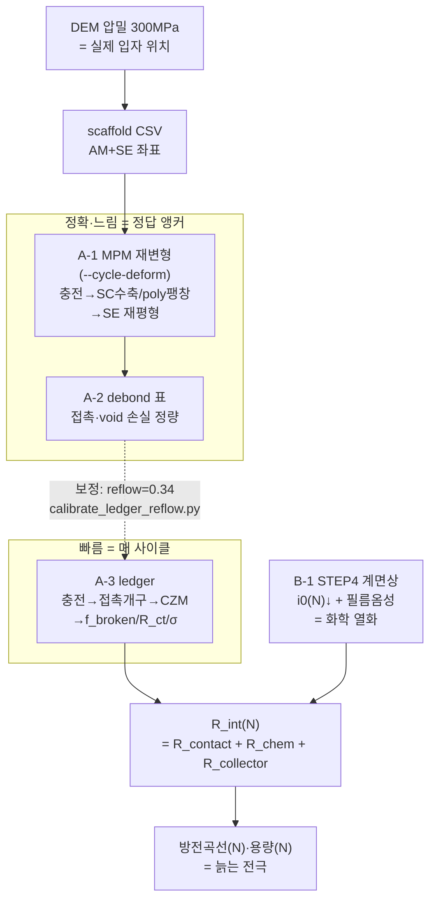

# 진짜 열화 전극 모델 — 전체 지도 (plain, 2026-07-22)

"사이클 돌수록 진짜로 늙는 전극"을 시뮬레이션하는 **하이브리드** 모델의 한눈 지도.
(사용자 "큰 그림 모르겠다" 대응 + 매뉴스크립트 프레이밍.)

## 한 문장
**느리지만 정확한 MPM으로 빠른 ledger를 보정**하면, 빠른 ledger로 매 사이클 돌려도 정확한 열화가 나온다.

## 왜 하이브리드인가
| 모델 | 잘하는 것 | 못하는 것 | 속도 |
|---|---|---|---|
| **MPM** (역학/형상) | 입자 재변형, plastic 재유동, 형상 | 접촉망 transport, 반복사이클(느림) | 느림(GPU 10분) |
| **ledger** (접촉망) | 접촉 끊김·percolation·σ 부기 | plastic 재유동(강체구) | 빠름(초) |
→ MPM으로 **정답 앵커**를 몇 개 찍고, 그걸로 ledger를 **보정** → ledger가 빠르게 전 사이클 커버.

## 흐름도

## 조각별 plain 설명
- **A-1** (`mpm3d_compaction.py --cycle-deform`): 충전하면 단결정(SC) 입자가 −5.1% 수축, poly는 외피
  팽창. MPM이 SE 재유동까지 정확히 계산 → "접촉이 진짜 어떻게 변하나"의 **정답**. GPU 필요.
- **A-2** (`cycle_geom_debond.py`): A-1 전/후 비교표 (SC 접촉 −19%, poly 계면 홀드). ⚠ crack 아님(coverage/void만).
- **A-3** (`cycle_contact_ledger.py`): 빠른 근사. **보정됨** — `--reflow-recover 0.34`(A-1 앵커서 회귀)로
  강체구가 놓치는 SE 재유동(34% 회복)을 심음. `--poly-mode expand-void`로 poly=내부void 분리.
- **B-1** (`step4_dyn.py`): 화학 쪽. 계면상(CEI) 성장 → i0↓ → 분극↑. R_ct의 **화학 몫**(g_chem).
- **보정 도구** (`calibrate_ledger_reflow.py`): MPM 앵커 넣으면 reflow값 자동 회귀 + LOAO 오차 리포트.

## 지금 상태 (2026-07-22)
- ✅ A-1 GPU 검증 (real_14: SC −19% 접촉, poly 홀드 = 정정된 물리 blind 확인)
- ✅ A-2 · B-1 · near-null 버그 fix
- ✅ **A-3 ε(가역) 보정 착지** — reflow=0.34, 두 ΔV 일반화, LOAO 0.9~2.1%p
- 🔶 **남은 것**:
  1. **영구 열화** (반복사이클 = v2): 지금은 "충전상태(방전서 되돌아옴)"만. N 늘수록 안 돌아오는 영구
     손실 = 반복사이클 MPM 필요 (δcr·rewet DOF 보정).
  2. **교차-케이스 검증**: 지금 앵커는 real_14 한 스캐폴드. 다른 조성/케이스로 reflow 일반화 확인.
  3. **σ_e 절대 전파**: poly 내부void → σ_e 결합(앵커 대기).
  4. **metric 정합**: MPM voxel-coverage ↔ ledger Hertz-area 지표차이(reflow에 일부 혼입, 정직 표기).

## 신뢰 규율 (프레임)
- MPM·ledger 각각 **실험에 독립 보정** → 일치=교차검증, 불일치=정량화된 한계(정보). 서로 맞추기(cross-fit) 금지.
- 앵커-사이 궤적은 **ASSUMED-FORM**(검증 전까지). in-sample 아니라 **LOAO/blind**로 오차 노출.
- 근거 없는 magnitude는 "측정/검증"으로 위장 금지(§F1 provenance).
