# 황화물 전고체전지 양극 통합 시뮬레이션 — STEP1 → STEP5 최종 설명서

### 처음 보는 대학원생을 위한 자립형 안내서 (2026-07-28 최종판)

> **읽는 법.** §0–§2 는 "왜·무엇을"(10분) · **§3 은 이 문서의 핵심 — 실제 전극의 어디까지가
> 구현됐고 어디가 범위 밖인지**(꼭 읽을 것) · §4–§8 은 단계별 상세 · §9 는 STEP4 딥다이브
> (건너뛰어도 흐름은 안 끊김) · §10–§13 은 검증·실행·용어 · **§14 는 남은 일(TODO)**.
>
> **최종판 변경(2026-07-28)**: STEP4 **연속 사이클(v2 chaining)** — 스케줄이 이제 진짜 사이클로
> 이어짐(상태 전달 + Rest 실물리) · STEP4 **near-null 대수술**(부유 pruning · GPU V-cycle ·
> σ-대비 cap)로 저율/첨가제 후막이 실행 가능해짐(0.2C 스텝당 3시간 → 1분) · 뷰어 JSON 크래시
> 잠복버그 수정 · 주간보고 porosity provenance 정정.

---

## 0. 왜 이걸 만드나 (문제 정의)

**전고체전지(ASSB)** 양극에는 액체 전해질이 없다. **고체전해질(SE) 분말**과 **활물질(AM, 여기선
NCM 양극재)** 분말을 섞어 **눌러 굳힌** 복합체다. 성능을 가르는 것은 화학식이 아니라 **미세구조** —
입자들이 얼마나 조밀하게 쌓였는지, 어디서 서로 닿았는지, 그 접촉을 통해 이온·전자가 어떻게
흐르는지다.

문제는 **실험으로 내부를 볼 수 없다**는 것이다:

| 실험 | 주는 것 | 못 주는 것 |
|---|---|---|
| SEM/EDS | 단면 한 장의 형상 | 3D 연결성, 전류가 실제로 어디로 흐르는지 |
| EIS | 셀 전체 저항 한 숫자 | 그 저항이 **어느 접촉**에서 나오는지 |
| 충방전 곡선 | 용량·분극의 총합 | 어느 입자가 소외됐는지, 왜 그런지 |

→ 그래서 **입자 해상도 시뮬레이션**으로 내부를 복원한다. 입력은 설계 숫자(조성비, 입경, 압력,
두께, 첨가제), 출력은 실험이 못 주는 것들: **접촉망, 전도 경로, 반응 분포, 응력장, 소성 변형,
그리고 이들이 사이클과 함께 어떻게 무너지는가.**

---

## 1. 핵심 철학 — frame[5] 상보 분업 (이걸 먼저 이해해야 나머지가 보인다)

이 프로젝트에서 가장 중요한 개념 하나만 꼽으면 **"모델을 서로 맞추지 않는다"**이다.

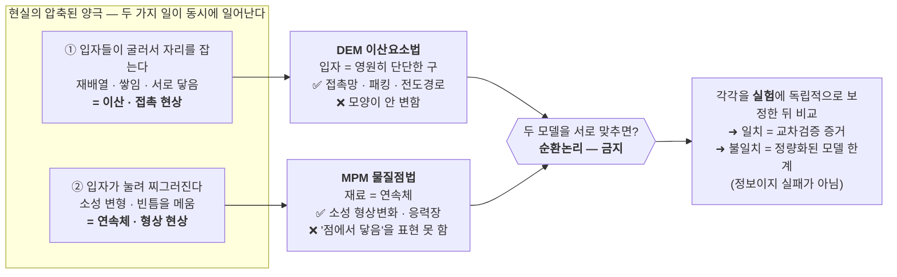

| 물리 | 담당 도구 | 이유 |
|---|---|---|
| 접촉망, 전도(σ_ion/σ_e/σ_thermal), 퍼콜레이션, 힘사슬, Furnas 패킹 dip | **DEM** | 이산 접촉 = 강체구의 강점 |
| 소성 형상변화(SEM 모폴로지), 빈틈-메움 흐름, 응력·변형장 | **MPM** | 연속체 소성 = 유일 표현 |
| 다공도, 두께, 기계적 coverage, 조성→다공도 트렌드 | **둘 다** (독립 교차검증) | 겹치는 영역 = 신뢰도 측정자 |

이 원칙이 STEP2(MPM)와 STEP3(전도)가 **왜 분리돼 있는지**, STEP5에서 **왜 "MPM이 사이클을 다
돌린다"가 물리적으로 불가능한지**를 설명한다.

---

## 2. 파이프라인 한눈에

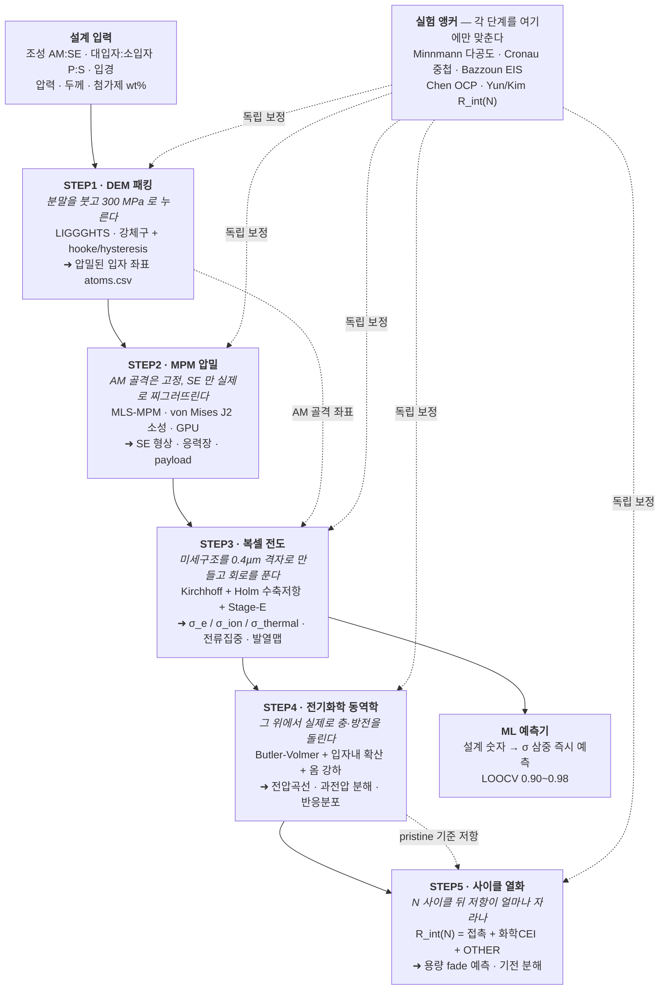

**핵심**: 각 STEP은 앞 단계의 출력을 입력으로 받지만, **보정은 서로가 아니라 실험에만** 한다(점선).

---

## 3. ★ 전극의 어디까지 구현됐나 (물리적 범위 지도)

이 절이 가장 자주 오해받는 부분이다. "전고체전지 시뮬레이션"이라 하면 셀 전체를 떠올리지만,
**우리가 입자 해상도로 재현하는 것은 양극 복합체(cathode composite) 한 층**이다.

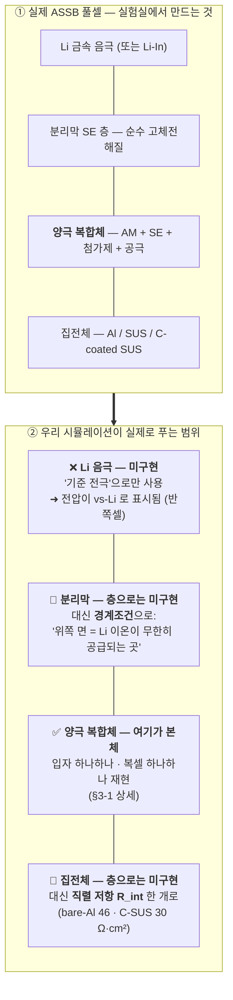

**이 축약이 정당한 이유**: 액체 전해질 셀이라면 분리막·전해질 내 **농도 분극**을 반드시 풀어야
하지만, 단일이온 고체전해질(t⁺≈1)에서는 **음이온이 움직이지 않아 농도 분극 항 자체가 존재하지
않는다**. 즉 이건 "근사"가 아니라 **그 물리가 원래 없는 것**이다.

### 3-1. 양극 복합체 안에서 구현된 상(phase) — 9종

STEP3 복셀 격자의 모든 칸은 아래 9개 중 하나의 딱지를 갖는다(코드의 `sid` 번호):

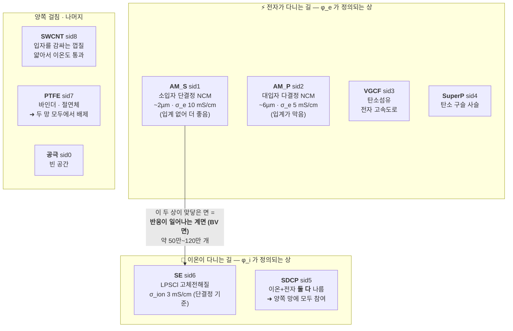

**반응 계면(BV 면)의 정의가 핵심이다.** 리튬이 AM 안으로 들어가려면 **전자와 이온이 같은 자리에
동시에 도착**해야 한다. 그래서:

> BV 면 = AM 복셀(1,2)과 이온전도 복셀(5,6,8)이 축 방향으로 맞닿은 면 — **그것도 양쪽이 각각
> 집전체·분리막까지 실제로 연결된 성분일 때만.**

고립된 SE 주머니에 닿은 면은 자동 제외된다. 즉 "기하학적 접촉"이 아니라 **반응-접근 가능한
계면**만 센다. BV 면이 0개인 입자는 **dead AM**(용량에 기여 못 함)으로 따로 집계된다.

### 3-2. 구현/미구현 정직 표

| 항목 | 상태 | 설명 |
|---|---|---|
| 양극 AM 입자 (SC/poly, 크기분포) | ✅ 완전 | DEM 실좌표·실반경, **입자별** 확산·반응 개별 계산 |
| 양극 SE (형상·소성변형) | ✅ 완전 | MPM 소성 압밀, 실제 빈틈메움 |
| 탄소 첨가제 (VGCF/SuperP/SWCNT) | ✅ 구현 | 시딩 형태·섬유 정렬·전자망 기여 |
| 바인더 PTFE | ✅ 구현 | 절연체로 배제 + 사이클 브릿지 훅 |
| SDCP (혼합전도 첨가제) | ✅ 구현 | 양쪽 망 참여 → 반응면 +18% |
| 공극 (닫힌 기공 포함) | ✅ 구현 | 다공도 · pore 네트워크 위상 |
| 집전체 계면 | 🔶 부분 | **직렬 저항 1개**로 축약 (층 구조 없음) |
| 분리막 | 🔶 부분 | **경계조건**으로만 (층 두께·저항 없음) |
| Li 금속 음극 | ❌ 없음 | 기준 전극으로만 (vs-Li 반쪽셀 규약) |
| 액체/혼성 전해질 | ❌ 없음 | 설계상 범위 밖 (단일이온 SE 전용) |
| 스택 압력의 시간 변화 | ❌ 없음 | 압밀 후 고정 |
| 열 ↔ 전기화학 커플링 | ❌ 없음 | 발열은 **계산만**, 온도 되먹임 없음(등온) |
| 셀 레벨(스택·탭·패키지) | ❌ 없음 | 범위 밖 |

**한 줄 요약**: 우리는 **양극 복합체 한 층을 현미경 수준으로** 푼다. 그 위아래는 **정확한
경계조건과 직렬 저항 한 개**로 축약하며, 단일이온 SE에서 이 축약은 물리적으로 타당하다.

---

## 4. STEP1 — DEM 패킹 (입자를 쌓는다)

**한 줄**: 설계 숫자대로 AM·SE 분말을 가상 용기에 붓고 **300 MPa로 눌러** 실제와 같은 다공도의
**압밀 베드**를 만든다.

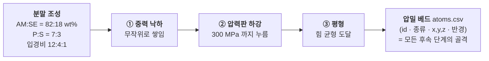

- **도구/물리**: LIGGGHTS(오픈소스 DEM). 입자는 **강체구**, 접촉은 **hooke/hysteresis**(선형-Hertz
  근사) 스프링. 압력판이 위에서 눌러 목표 압력까지 압밀.
- **★ 핵심 트릭 — 18× 연화(softening)**: SE의 실제 탄성계수는 E≈24 GPa인데 시뮬레이션에선
  **E_eff = 1.35 GPa로 18배 물렁하게** 쓴다.
  - *왜?* 강체구 DEM은 입자가 안 찌그러진다. 그런데 실제 분말은 **재배열 + 입계 미끄러짐 +
    미세파쇄**로 치밀해진다. 이 "빠진 기전들"을 **연화된 탄성계수 하나로 뭉뚱그려** 넣는 것.
  - *자의적이지 않다 — 삼중 교차검증*: ① 순수-SE에서 Cronau 중첩 11~12% 재현, ② 독립적으로 만든
    MPM이 **같은 18× 연화를 독립적으로 요구**, ③ 실험 다공도와 일치. 세 경로가 같은 답을 준다.
- **입력**: 조성(AM:SE), P:S 비, 입경, 압력, 두께.
- **출력**: 압밀 베드 `atoms.csv`.
- **검증 수식**: **Heckel** ln(1/(1−D)) = K·P + A → R² = **0.965**, 항복압 **P_y = 138 MPa**.
- **실험 앵커**: 다공도 ≈13~16% @300 MPa(Minnmann 냉간압축), 순수-SE Cronau 중첩 11~12%.
- **한계**: 입자 모양은 **절대 안 변한다**(강체). 여기서의 "치밀화"는 재배열+중첩이지 형상 소성이
  아니다 → 형상은 STEP2가 담당.

---

## 5. STEP2 — MPM 압밀 (눌러서 찌그러뜨린다)

**한 줄**: STEP1의 **실제 AM 골격을 고정**한 채, 그 사이의 **SE만 연속체 소성으로 눌러** 실제
형상변화·빈틈메움·응력장을 계산한다.

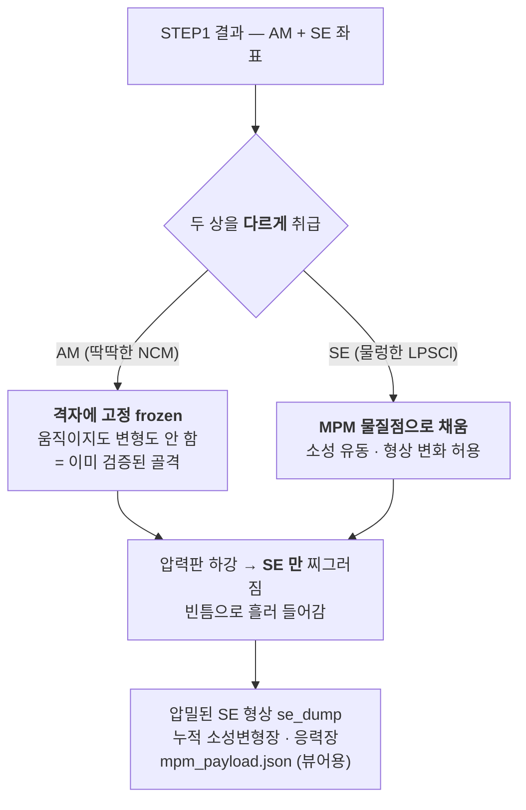

**왜 AM을 고정하나 — 4가지 이유**:
1. 이산 강체의 하중분담은 연속체가 원리적으로 표현 못 함(frame[5]).
2. 움직이게 두면 **가짜 힘사슬**이 생겨 다공도가 36~41%로 비물리적으로 커짐.
3. AM을 물질점으로 넣으면 CFL 조건/메모리가 폭발(격자 384 이상에서 터짐).
4. DEM의 AM은 **이미 300 MPa 평형에 도달한 검증된 골격** — 풀어주면 그 검증에서 멀어짐.

- **생산 파라미터(3D)**: E_SE=1.53 GPa, **ν_SE=0.49**, σ_y=0.30 GPa, 목표 0.30 GPa, readout=**wallP**.
  - *ν=0.49의 의미*: 부피 강성은 실제 LPSCl처럼 단단하게(K=25.5 GPa ≈ 실제 24), **전단만 물렁하게**
    = 부피는 보존하면서 모양만 바뀌는 **입상 유동**. 초기엔 ν=0.30을 썼는데, 그러면 부피까지
    물렁해져 SE가 짜부라지고 AM이 가짜 힘사슬을 만드는 아티팩트가 생겼다.
  - *wallP의 의미*: 압력을 "내부 평균"이 아니라 **압력판이 받는 반력**으로 읽는다. 이게 실제
    실험의 경계조건이고 격자 해상도에 영향받지 않는다.
- **★ 두 모델의 교차검증(frame[4]의 실제 사례)**: 실제 DEM 좌표를 스캐폴드로 쓴 MPM 결과 —
  다공도 **15.93% vs LIGGGHTS 15.6%**, 두께 **29.95 vs 30.28 µm**. 서로를 보정한 적이 **한 번도
  없는** 두 모델이 ±1%p 안에서 만난다. **이 1%p가 곧 모델 신뢰 구간**이다.
- **실험 앵커**: 순수-SE **Minnmann 10% @300 MPa** 재현, SEM 모폴로지(코어 보존 + 경계 평탄화).
- **한계**: 연속체라 **이산 접촉망·Furnas dip은 못 만든다**. 재료를 아무리 바꿔도 MPM은 dip을
  재현 못 한다는 것을 **재료 전체 스윕으로 증명**했다 → dip은 DEM 소유.

---

## 6. STEP3 — 복셀 전도 (전자·이온·열이 어떻게 흐르나)

**한 줄**: 압밀된 미세구조를 **복셀(3D 픽셀)**로 만들고 그 위에서 **Kirchhoff 회로**를 풀어
**전도도 3종**과 **전류 집중**을 낸다.

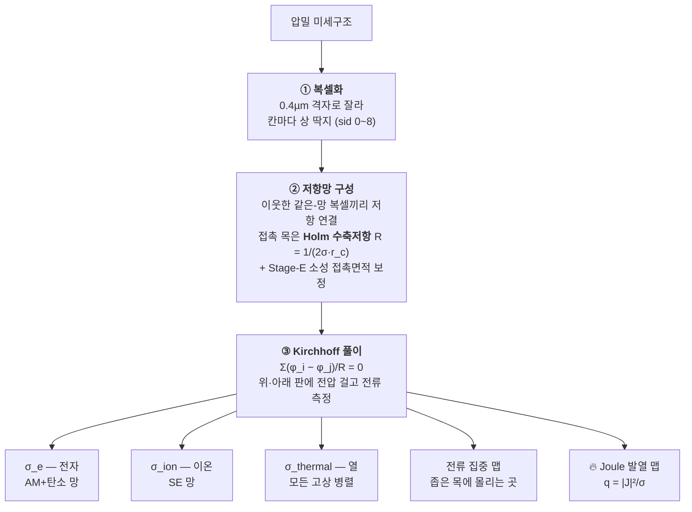

- **★ Stage-E 소성 접촉면적 보정**: 강체구의 탄성 중첩 면적(πR·δ)은 소성 접촉을 과소평가한다 →
  **Tabor(F/H)·부피 재유도**로 실제 소성 접촉면적을 다시 구한다. 5-영역 분해에 min(caps) 천장이
  있어 과압축 시에도 면적이 비물리적으로 커지지 않는다.
- **3종 전도도**:
  - **σ_ion**: SE 골격. 앵커 = Cronau 단결정 3.0 mS/cm × 결정립 크기 보정 Cronau(r_SE).
  - **σ_e**: AM(NCM) 골격 + 탄소. 단결정(입계 없음, 10 mS/cm) vs 다결정(입계 있음, 5)로 분리.
  - **σ_thermal**: AM-AM / AM-SE / SE-SE **다경로 병렬** — 그래서 단일 스케일링 법칙이 안 나오고
    Ridge 회귀가 유일한 표현이다(순수 멱법칙 0.59, EMT는 음의 R²로 실패).
- **current-focusing**: 좁은 목에서 전류밀도가 평균의 수십 배로 치솟는 지점(상위 0.2%) —
  **열화·발열의 씨앗**.
- **coverage(피복률)**: AM 표면 중 SE가 덮은 비율. **Hertz(직접 접촉) ~16-18%** vs **Tabor(소성
  퍼짐 포함) ~52%**. 두 값 모두 기하학적 ground-truth로 독립 검증됨.
- **★ v3 추가**: carbon-SE 3상 계면 면적(SE 분해 촉매 반응면) · **Joule 발열 hot-spot 맵** ·
  **주기 경계조건**(측면을 절연벽 대신 wrap — MPM RVE와 규약 일치).
- **실험 앵커**: **Bazzoun 2026** — 같은 LPSCl+NCM+LIGGGHTS+같은 저항망 기법을 실측 EIS와 COMSOL
  FEM에 검증한 독립 논문. σ_eff,ion 0.065~0.137 mS/cm, 압력 의존성(400 MPa 포화).
  **우리 방법론 자체가 외부에서 실험 검증된 셈이다.**
- **한계**: 접촉망은 있으나 시간전개(충방전)는 없음 → STEP4로.

---

## 7. STEP4 — 전기화학 동역학 (충·방전을 돌린다)

**한 줄**: STEP3의 전도망 위에서 **실제 충·방전**을 시간전개해 **전압곡선·분극·반응 분포**를 낸다.

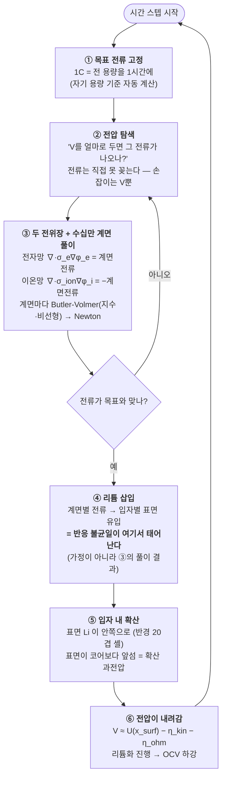

- **도구/물리**: `step4_dyn.py`. **Butler-Volmer 반응** + **구형 입자 확산** + STEP3 전도망(옴 강하).
  OCP(열역학 전압) = **NMC811 Chen 2020** 실측 테이블.
- **핵심 파라미터**: 방전창 x0=0.264 ~ **x100=0.9084**(vs-Li GITT 실측 최대), R_int 직렬(풀셀 축),
  SC/poly 크기-의존 확산계수 D_s.
- **★ 대표 결과**: 2C CCCV 충전 완주 — CC 끝 81.5/83.0% → CV 후 88.9/**89.6%**. 1C 시작 총 분극
  SBE 46 / DBE 41 mV. **갭 4.7 mV의 분해**:

  | 원인 | 기여 |
  |---|---|
  | 반응 면적 +18% | **3.6 mV (78%)** |
  | 이온 σ +5.6% | 1.0 mV (22%) |
  | 전자 σ +52% | 0.002 mV (≈0%) |

  *직관*: 같은 전류라도 **이온이 나르면 비싸다**(옴 손실이 사실상 전부 이온). 저율에서 전압 갭의
  주범은 σ_e가 아니라 **반응 면적**이다. σ_e가 빛나는 곳은 **고율·후막**이다.

### 7-1. ★ 연속 사이클 (v2 chaining — 2026-07-28 신규)

기존에는 스케줄의 각 스텝이 **독립 실행**이었다 — 방전은 항상 완충 평형에서, 충전은 항상 완방
평형에서 새로 시작. 이는 "모든 Rest가 무한히 길다"는 극한과 같아서, **반복(Loop) 사이클이 그냥
동일 결과의 복제**였다. v2 chaining이 이를 고친다:

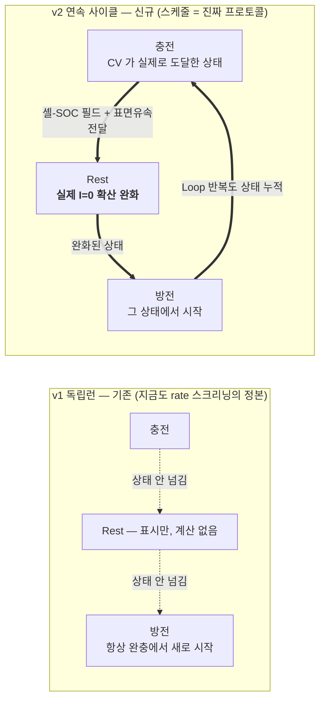

- **무엇이 전달되나**: 입자별 셸-SOC 필드(반경 20겹 × 입자 수) + 마지막 표면 유속 + dead 입자
  마스크. 전위장은 안 넘긴다(Newton이 2~3회면 다시 찾으므로 불필요 — 실측 검증).
- **Rest가 진짜 물리가 된다**: 전류 0에서 입자 내부 농도 구배가 실제로 풀린다(질량 정확 보존).
  단 **입자 사이의 전하 재분배는 아직 미모델**(REST-LOCAL) — 물성 균일 베드에선 무시 가능하나
  **poly/SC 확산계수를 분리한 베드에선 1차 효과**라 TODO에 있다(§14-2 #1).
- **안전장치**: 오염 상태(NaN·범위이탈·수렴실패) 명시 거부 · 실패 스텝 뒤 자동 SKIP(조용히
  평형에서 재시작하는 오염 방지) · 이전 시도 잔재 상태파일 자동 삭제.
- **사용법**: 웹앱 스케줄 편집 옆 **"⛓ 연속 사이클(v2)"** 체크(기본 켜짐) → zip에 `_chain` 태그.
  끄면 기존 v1(각 율을 완전이완에서 재는 rate 스크리닝 규약).
- **비교 규약**: v1과 v2는 **다른 실험**이다. 곡선을 비교할 땐 `_chain` 태그를 반드시 병기한다.

### 7-2. ★ 왜 예전엔 안 돌아갔나 — near-null 대수술 (2026-07-27)

VGCF 1wt%를 넣은 후막(119 µm, 자유도 444만)에서 2C가 **며칠 걸리고 0.2C는 사실상 불가능**했다.

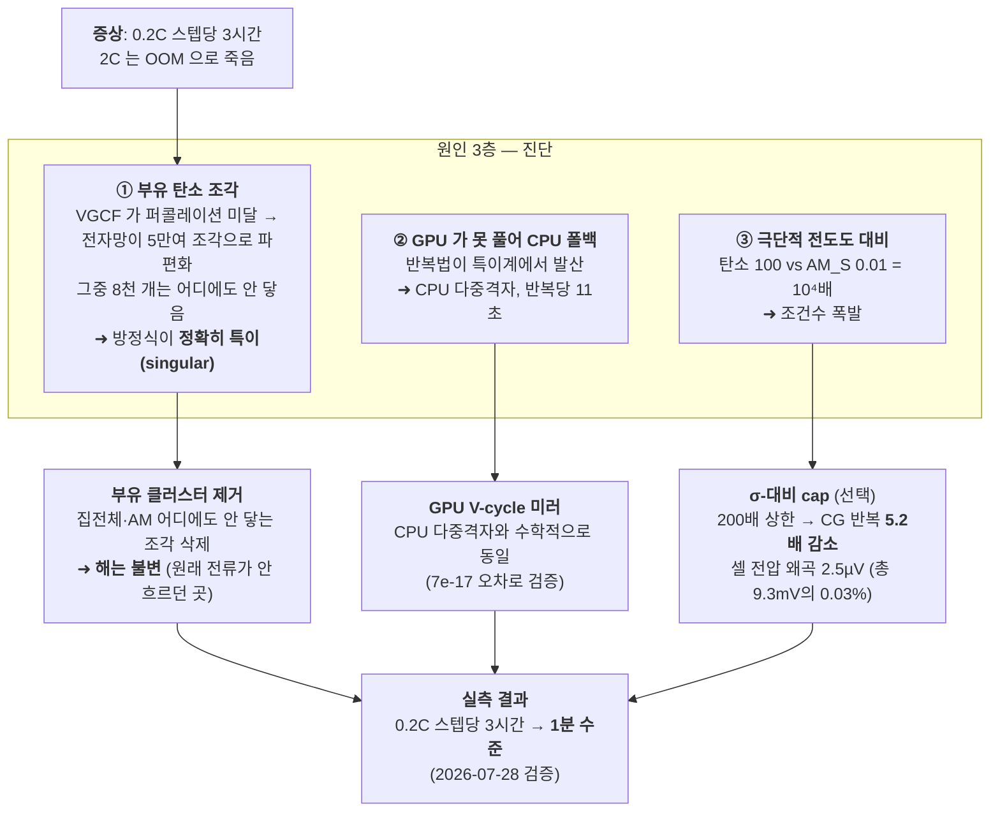

**cap 사용 규칙(중요)**: cap은 σ 값 자체를 −7.8% 바꾼다.

| 런 목적 | cap 설정 | 근거 |
|---|---|---|
| 충방전 곡선(시간전개) | **200×** | 전압 왜곡 ≤2.5 µV(무시 가능), 5배 빠름. 0.2C는 전류가 더 작아 더 안전 |
| σ 숫자를 보고하는 런 | **OFF** | σ_eff −7.8% → 코퍼스 오염 방지 (capped 런은 메타에 자동 태그) |

### 7-3. 신뢰 감사 — 매 스텝 4중 검사

쿨롱 정합(전류 적분 = 삽입 Li) · **에너지 수지**(투입 = 옴발열 + 반응열 + 저장, ~10⁻⁵) ·
**KCL**(입자별 전류 합 = 총 전류, ~10⁻⁵) · 노이즈 바닥 자가교정.
**안 닫히면 그 스텝을 거부**한다(조용히 넘어가지 않음).

---

## 8. STEP5 — 사이클 열화 (수명: 저항이 어떻게 자라나)

**한 줄**: pristine 전극(STEP1–4)이 **N 사이클 후 계면저항 R_int(N)**이 얼마나 자라는지를
**"어느 물리가 얼마나"** 정직하게 **분해**해 예측한다.

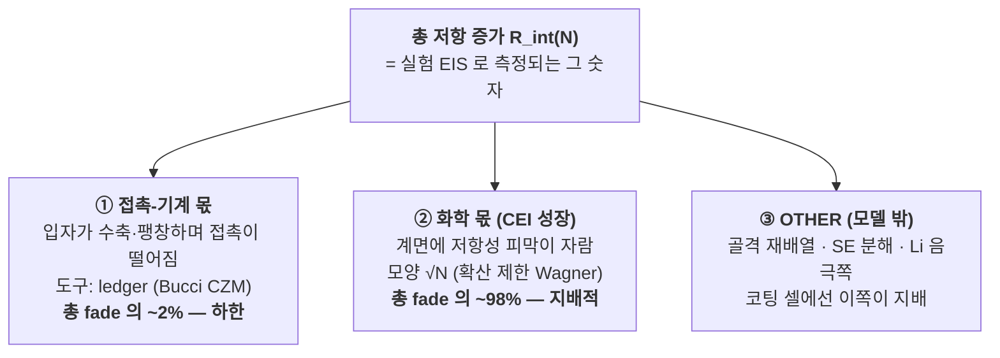

**가장 중요한 교훈**: **"MPM이 사이클을 다 돌린다"는 물리적으로 불가능**하다.
- 부피보존 소성(J2)은 영구 접촉 손실을 못 만든다 — 벌어진 틈을 도로 메워버린다.
- 고정 마스크는 방전 시 스프링백을 표현 못 한다.
- 사이클당 변형이 복셀 하나보다 작다.

→ 그래서 **각 기전을 제 도구에 맡기고 합산**한다. **적대 리뷰가 이걸 코딩 전에 차단**했다.

| 조각 | 물리 | 도구 | fade 몫 | 앵커 |
|---|---|---|---|---|
| A-1 | 충전상태 형상변화(SC 수축, poly 팽창) | MPM `--cycle-deform` | 형상(가역) | GPU 검증 |
| A-3 | 영구 접촉파단 | ledger(CZM) | **~2%**(하한) | mono 1.05× vs bimodal 1.51× |
| B-1 | 화학 계면상(CEI) 성장 | `b1_chem_fade` | **~98% 지배** | √N Park2023 · Yun/Kim |
| OTHER | 골격재배열·SE분해·Li쪽 | (모델 밖) | 코팅셀서 지배 | 실험값 대기 |

- **정직한 shape 규약**: CEI 성장 모양은 **√N**으로 가정하되, **크기(magnitude)는 실험 끝점에
  앵커**하고 **모양(shape)은 ASSUMED**로 라벨한다. 끝점 하나로는 √N과 선형을 구별할 수 없기
  때문이다. 실험 곡선이 4점 이상 들어오면 `fit_rint_curve.py`가 **모양을 확증하거나 기각**한다.
- **★ v3 사이클 기전 확장(전부 기본 OFF · 앵커 안전)**: VGCF carbon-촉매 SE분해(ADD 아닌 **SPLIT** —
  실험 끝점이 이미 carbon 포함이라 더하면 이중계산) · PTFE 브릿지 열화 · **Joule 발열 재분배**
  (Arrhenius 곱이 아니라 **끝점 보존 재분배** — LPSCl 분해율 활성화에너지가 문헌에 없어서 곱하면
  날조가 된다) · 취성→MPM crack-void · 코팅 프리셋(LNO/LZO/Li₃PO₄).
- **실험 앵커**: **Yun 2023**(우리 랩, bare SC-NMC R_ct 2.87×@100cyc), **Kim 2025**(LNO 13~20×
  억제), **Payandeh 2023**(코팅 93%@200cyc).

---

## 9. STEP4 딥다이브 (심화 — 건너뛰어도 흐름은 안 끊김)

### 9-1. 전형적 문제 크기

| 항목 | 값 |
|---|---|
| 전위 미지수(자유도) | 290만 ~ 440만 |
| AM 입자 수 | 1,271 (첨가제 케이스 4,587) |
| 반응 계면(BV 면) | 50만 ~ 121만 개 |
| 두께 / 면적용량 | 72.5 µm / 3.1 mAh/cm² (후막 케이스 119 µm) |
| 한 곡선당 시간 스텝 | 수백 |

### 9-2. 1C 전류는 어떻게 정해지나 — 손으로 정한 숫자 0개

**1C = 전체 용량을 정확히 1시간에 빼내는 전류.**  I₁C = F·c_max·|x₁₀₀−x₀|·V_AM / 3600s

| 인자 | 값 | 출처 |
|---|---|---|
| F | 96,485 C/mol | 패러데이 상수 |
| c_max | 63,104 mol/m³ | NMC811 최대 Li — PyBaMM Chen2020에서 **기계 추출**(수기 0) |
| \|x₁₀₀−x₀\| | 0.9084 − 0.264 = 0.644 | 실사용 stoich 창(vs-Li GITT 실측) |
| V_AM | 입자 총부피 | DEM 실좌표·실반경 |

교차검증: 부피용량 998 mAh/cm³ ≈ 문헌 감각(200 mAh/g × 4.8 g/cm³ = 960).
C-rate는 **자기 용량 기준** — 그래야 "1C = 1시간"이 어떤 전극에서도 성립한다.

### 9-3. 전압 곡선 읽는 법 — 분극의 성분

| 성분 | 크기(1C) | 무엇이 결정하나 |
|---|---|---|
| 반응 과전압 η_kin | 시작 ~24 mV → 완화 후 ~17 | i₀ · **반응 면적**(BV 면 수) |
| 이온 옴 η_ion | ~20 mV | σ_ion · 반응대가 분리막쪽 30 µm에 몰림 |
| 전자 옴 η_e | **~6 µV** | σ_e (이온보다 10⁴배 좋음) |
| 상태 선행(확산 불균일) | 중반부터 ~20 mV | 전류가중 ⟨U(x_surf)⟩ < U(x̄) |

**예측→실측 검증**: 이론 예측 "첫 스텝 η_kin ≈24/≈21 mV"가 프로덕션 로그에서 **24.9/22.2 mV**로
적중(1 mV 이내).

### 9-4. 반응 전선(reaction front)이 움직인다

σ_ion ≪ σ_e라서 **이온 접근성이 희소 자원**이다 → 반응이 처음엔 분리막 쪽 30 µm에 몰려 시작하고,
그 구역이 리튬화로 구동력을 잃으면 더 깊은 입자로 이동한다. 전선이 집전체 쪽으로 쓸려간다.
**1D porous-electrode 이론의 3D 실계산판**이다.

### 9-5. 로그 한 줄 읽기 (치트시트)

```
step 30 t=975.0s [cc] V=4.0100 I=8.302e-08 x̄=0.4237 ηkin=17.0mV E-bal 1.6e-05 KCL 7.3e-06 (ev 8, dt 17s)
```

`step`=시간 스텝 · `t`=경과(1C 풀방전 3600s) · `[cc]`=정전류(`[cv]`=정전압 홀드) · `V`=셀 전압 ·
`I`=실제 전류 · `x̄`=평균 리튬화(쿨롱 검산) · `ηkin`=전류가중 반응 과전압 · `E-bal`/`KCL`=보존
감사 · `(ev, dt)`=전압평가 횟수·시간폭.

### 9-6. FAQ

- **왜 느린가?** 매 스텝 수백만 미지수 × 수십만 비선형 계면 Newton-CG × 전압 탐색, 곡선은 그런
  스텝 수백 개. 빠른 공학 곡선은 PyBaMM 균질화 트윈(초 단위), **미세구조 차이**는 이 솔버만.
- **pore-τ가 "—"인 이유?** 공극이 ~7%이고 대부분 고립 기포라 관통 경로가 없다 → 정의 불가 →
  정직하게 "—". (이게 전고체 서사의 근거이기도 하다.)
- **집전체는?** 전극 밖 직렬 R_int로. 정전류에선 V−I·R_int라 상수 평행이동 → 재실행 없이
  시나리오 3개를 후처리로 얻는다.
- **복셀 계단화는 문제 없나?** 축-정렬 면적이 매끈한 구보다 ~1.5배 크다(staircase). 전극 간
  **상대 비교에서는 상쇄**되지만, PyBaMM 등과의 **절대 비교에선 caveat로 명시**한다.

---

## 10. 검증·실험 앵커 총괄표

| 단계 | 무엇을 검증 | 실험/문헌 앵커 | 우리 값 |
|---|---|---|---|
| STEP1 | 다공도·압밀곡선 | Minnmann 10%@300 · Heckel | 13~16%, P_y=138 MPa, R² 0.965 |
| STEP1 | 순수-SE 소성 floor | Cronau 중첩 5~10% | 11~12% |
| STEP2 | 순수-SE 다공도 | Minnmann 10%@300 | σ_y 0.30 → 10.0% |
| STEP2 | 복합 다공도·두께 | LIGGGHTS(독립 모델) | 15.93 vs 15.6% (±1%p) |
| STEP2 | 모폴로지 | SEM(코어보존+경계평탄) | 정성 일치 |
| STEP3 | σ_ion 절대값·압력의존 | **Bazzoun 2026** EIS+FEM | 0.065~0.137 mS/cm 범위 |
| STEP3 | σ_grain 결정립 | Cronau 2022 단결정 3.0 | Cronau(r_SE) 보정 |
| STEP3 | coverage | 기하 ground-truth(독립) | Hertz 16 / Tabor 52% |
| STEP4 | OCP·용량 | Chen 2020 NMC811 | c_max 기계추출 |
| STEP4 | 수치 패리티 | PyBaMM/COMSOL | ⏳ **매치드-조건 런 대기** |
| STEP5 | 열화 크기 | Yun 2023 R_ct 2.87×@100 | 실험 끝점 앵커 |
| STEP5 | 열화 모양 | Park 2023 √t 선형 | √N 기본(fit_rint_curve 게이트) |
| STEP5 | 코팅 억제 | Kim 2025 LNO 13~20× | --chem-x 열어둠 |

**ML 예측기**(설계 → σ 삼중): σ_ionic LOOCV **0.975** · σ_e **0.953** · σ_thermal **0.90**.

---

## 11. 무엇을 믿고, 무엇을 안 믿나 (정직한 한계)

**믿을 수 있다 (실험 교차검증됨)**: 다공도·두께(DEM↔MPM ±1%p), 순수-SE 소성 floor, σ_ion 트렌드와
압력 의존성(Bazzoun), 형상 모폴로지(SEM), Heckel 압밀곡선, 전도 삼중의 상대 비교.

**방향·기전은 믿고, 절대 크기는 실험에 맡긴다**: STEP5 열화(접촉 몫 ~2%는 하한), current-focusing
상대비교, 복합 다공도 절대값.

**모델 밖(OTHER)**: 골격 재배열의 이산 성분, SE 화학분해, Li 음극쪽.

### 11-1. COMSOL을 대체하나? (범위별 정직 답)

| | 항목 | 근거 |
|---|---|---|
| ✅ **대체 가능** | σ 삼중(이온/전자/열) | **Bazzoun 2026이 독립 입증** — 같은 재료·같은 기법을 실측 EIS+COMSOL FEM에 검증(저항망≈FEM≈실험, 32~98배 빠름). 우리는 +전자/열까지 |
| ✅ | 미세구조-해상 필드(전류·SOC·핫스팟) | COMSOL은 이미지 메시가 필요, 우리는 DEM/MPM에서 바로 = **최대 우위** |
| ✅ | 반쪽셀 V(t) (단일이온 sulfide) | 빠진 항(전해질 농도분극·이중층)은 t⁺≈1 SE에서 **물리적으로 없는 것** |
| ❌ **COMSOL 필요** | 액체/혼성 전해질·풀셀·음극 | 설계상 범위 밖 |
| ❌ | 고-CAM 절대 σ | 수축-only라 FEM 대비 ~2× 과소(정직히 bracket) |
| ❌ | 커플드 열/역학 멀티피직스 | 미구현(§14-2) |
| ❌ | 보장수렴·재료 라이브러리 | FEM식 수렴 보장 없음 (안전망 = 매스텝 KCL+에너지 감사) |

**빠진 단 하나**: STEP4의 **외부 수치 패리티 런**. 방정식·기능 패리티와 내부 검증(질량 2.7e-12 ·
Cottrell 2.9% · KCL 7e-9 · 에너지 4e-13)은 진짜지만, PyBaMM/COMSOL과의 **ΔV-RMS 매치드-조건
비교는 아직**(인프라만 준비). **V100 하루면 닫힌다.** STEP3는 이미 Bazzoun으로 닫혔다.

**절대 안 하는 것**: DEM↔MPM 상호보정(순환논리), ASSUMED를 검증된 것으로 표기, 문헌값 날조.
모든 값에 provenance 라벨(measured / assumed / ASSUMED-FORM / literature-anchored)을 붙인다.

---

## 12. 어디서 실행하나 (실무 지도)

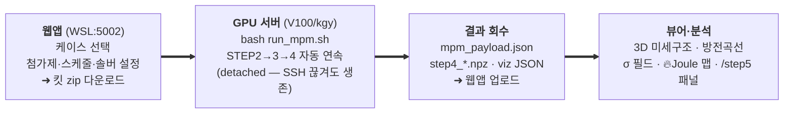

| 하고 싶은 것 | 도구 / 위치 |
|---|---|
| 새 GPU 서버 세팅 | `curl -fsSL .../scripts/setup_gpu_server.sh \| bash` (한 줄, 재실행 안전) |
| 환경·경로·지뢰 조회 | `python3 scripts/env_db.py --doctor / --machine v100 / --pitfalls` |
| STEP1 DEM 패킹 | LIGGGHTS 입력 → atoms.csv |
| STEP2 MPM 압밀(GPU) | `scripts/mpm3d_compaction.py` (킷: run_mpm.sh) |
| STEP3 전도 σ 삼중 | `scripts/network_conductivity.py`, `step3_sigma.py` |
| STEP4 충·방전 | `scripts/step4_dyn.py` (킷: step4_only.sh) |
| STEP5 접촉/화학 fade · shape 검증 | `cycle_contact_ledger.py` / `b1_chem_fade.py` / `fit_rint_curve.py` |
| 인터랙티브 패널 | 웹앱 `/step5`(fade) · `/mpm-lab`(3D 뷰어) · `/predictor`(ML) |
| EIS 실측 관리·피팅 | 웹앱 `/eis` (.mpr 업로드 → 자동 피팅) |

킷 = 웹앱이 케이스별로 만든 zip(스캐폴드 CSV + run_mpm.sh + step4_only.sh + A-1 앵커) →
GPU에서 실행. 킷은 시작 시 자동으로 코드를 최신화하므로 버전 스큐가 생기지 않는다.

---

## 13. 용어집

- **DEM / MPM**: 이산요소법(입자=강체구) / 물질점법(재료=연속체).
- **AM / SE**: 활물질(NCM 양극재) / 고체전해질(LPSCl). **P/S** = 대입자(다결정) / 소입자(단결정).
- **다공도**: 빈 공간 비율. 냉간압축 목표 ~10~16%.
- **Heckel / P_y**: 압밀 압력-밀도 관계식 / 항복압(재배열→소성 전이점).
- **Kirchhoff / Holm 수축저항**: 회로 법칙 / 좁은 접촉목의 저항 이론(1967).
- **퍼콜레이션**: 접촉이 한쪽 끝에서 반대쪽까지 **연결**되어 전류가 통하는가.
- **굴곡도 τ**: 이온이 돌아가는 정도. σ_eff = σ_grain·φ/τ².
- **coverage**: AM 표면이 SE로 덮인 비율(전자-이온 경계).
- **current-focusing**: 좁은 목에서 전류밀도가 평균의 수십 배 → 열화 씨앗.
- **Butler-Volmer**: 전극 반응속도-과전압 관계식.
- **OCP/OCV**: 개회로전압(열역학 평형 전압, SOC의 함수).
- **R_int / R_ct**: 계면 총저항 / 전하이동 저항. 단위 Ω·cm².
- **CEI**: 양극-전해질 계면상 — 사이클마다 자라 저항 증가.
- **√N Wagner 성장**: 확산제한 계면상 두께 ∝ √시간 → 저항 ∝ √N.
- **near-null**: 행렬이 "거의 특이"해서 일반 반복법이 수렴 못 하는 상태.
- **chaining**: 런 사이에 상태(입자 내부 SOC)를 넘겨 연속 사이클을 만드는 것.
- **frame[5] / frame[4]**: 상보 모델 분업 철학 / 독립 보정 후 교차검증 규약.
- **ledger**: 사이클마다 접촉 개폐를 장부처럼 추적하는 후처리 도구.
- **provenance 라벨**: 값의 출처 표기(measured/assumed/ASSUMED-FORM/literature-anchored).

---

## 14. ★ TODO — 아직 부족한 것 (2026-07-28 기준)

정직하게 3부류로 나눈다. **"모르는 걸 아는 척하지 않는다"**가 이 목록의 존재 이유다.

### 14-1. 실험·문헌 앵커 대기 (값을 못 정함 — 훅만 있고 기본값 미변경)

| # | 항목 | 왜 막혔나 | 풀리면 |
|---|---|---|---|
| 1 | **LPSCl 분해율 활성화에너지 Eₐ** | 문헌에 **없음**(전도도/계면 Eₐ는 다른 양) | Joule 발열 → 열화를 Arrhenius로 곱할 수 있음. 지금은 끝점 보존 재분배만 |
| 2 | **CEI √N shape 확증** | 실험 끝점 1개론 √N/선형 구별 불가 | `fit_rint_curve.py`에 4점 이상 넣으면 즉시 판정 |
| 3 | **Joule 절대 ΔT** | 우리 셀 기하의 실측 없음 | 발열맵이 상대→절대가 됨 |
| 4 | **SDCP 결합에너지 E_bind** | DFT 계산 대기 | SDCP 계면 모델 완성 |
| 5 | **bimodal 1.51× 재해석** | 옛 계산이 poly를 수축으로 처리한 아티팩트 | 방향(bimodal>mono)은 불변, **크기만** 재산출 필요 |
| 6 | **NCA E=175 GPa 출처** | 검증 결과 "assumed" 꼬리표 | NCA 프리셋 완전 배선 |
| 7 | **i0의 SC/PC 분리값** | 고체계 정량 문헌 **부재 확인됨** | 지금은 공유값 + 스윕 전용 |
| 8 | **SOC 후반 D_s 급락** | 방향만 알려짐, 수치 테이블 없음 | `--d-s-table` 훅 준비됨(O'Regan 2022 경로) |

### 14-2. 구현 대기 (물리는 알지만 코드가 아직)

| # | 항목 | 현재 상태 | 우선순위 |
|---|---|---|---|
| 1 | **Rest 입자간 전하 재분배 (v2.1)** | 입자 내부 완화만(REST-LOCAL) | **높음** — poly/SC 분리 베드를 rest로 체인하면 1차 효과(실측 U 스프레드 157 mV) |
| 2 | **A10-full 전기-화학-역학 CZM** | ledger 옵션A + MPM 형상만 | 중 — 완전 커플링은 큰 작업 |
| 3 | **열 ↔ 전기화학 커플링** | 발열 계산만, 온도 되먹임 없음 | 중 — 14-1 #1 없이는 반쪽 |
| 4 | **스택 압력 시간전개** | 압밀 후 고정 | 중 — 사이클 중 압력변화가 접촉에 영향 |
| 5 | **조건부 Loop**("용량 X%까지") | 횟수 Loop만 지원 | 낮 — in-run 열화 모델이 전제 |
| 6 | **B-1 per-cycle 자동 배선** | 사이클마다 수동 지정 | 낮 — 14-1 #2 앵커 대기 |
| 7 | **poly D_eff brick-layer GB 항** | 프리셋에 경로만 | 낮 — 입계 균질화 |
| 8 | **σ_e 고-CAM 절대값 보정** | 수축-only라 FEM 대비 ~2× 과소 | 낮 — 정직히 bracket 중 |

### 14-3. 실행·검증 대기 (코드는 준비됨, 돌리기만 하면 됨)

| # | 항목 | 무엇이 필요한가 |
|---|---|---|
| 1 | **STEP4 PyBaMM 매치드-조건 패리티 런** | V100 하루 — **"defensible → bullet-proof"의 마지막 조각** |
| 2 | **v2 chaining 실전 첫 런** | 연속 사이클 킷 완주(구현·검증 완료, 실런만 남음) |
| 3 | **R_int(N) 계수 확정** | WSL에서 논문 PDF 디지타이즈 |
| 4 | **ML 실학습**(sklearn/TabPFN) | WSL (클라우드엔 sklearn 없음) |
| 5 | **첨가제 stale payload 재run** | SWCNT 등 옛 payload가 현행 코드 이전 |
| 6 | **σ_e_rel 재실행**(`--poly-mode expand-void`) | 정정된 물리로 재산출 |
| 7 | **윤태영 P:S V-프로파일 대조** | 수치 디지타이즈 → 동일조건 패리티 런 |

### 14-4. 최근 닫힌 것 (2026-07-27~28)

- ✅ **STEP4 near-null 병목** — 부유 pruning + GPU V-cycle + σ-cap → 저율/후막 실행 가능(3h→1분/스텝)
- ✅ **v2 chaining** — 연속 사이클 + Rest 실물리 (3각 적대 리뷰 반영 완료)
- ✅ **뷰어 JSON 크래시** — 2스텝 이상 모든 런이 조용히 viz를 못 만들던 잠복 버그(6일간 잠복)
- ✅ **서버 부트스트랩 자동화** — 새 GPU 인스턴스가 한 줄로 복원
- ✅ **주간보고 porosity provenance 정정** — 순환 교차검증 주장 철회

---

## 15. 한 페이지 정리 (외워둘 것)

1. **입자 쌓기 → 압밀 → 전도 → 전기화학 → 열화**, 다섯 단계가 순차로 흐른다.
2. **DEM = 수송(transport), MPM = 역학(mechanics)** — **서로 안 맞추고 각각 실험에 맞춘다**.
3. 우리가 재현하는 것은 **양극 복합체 한 층**. 분리막·집전체·음극은 **경계조건과 직렬 저항**으로
   축약되며, 단일이온 SE에서 이 축약은 근사가 아니라 **물리적으로 타당**하다.
4. 18× 연화와 MPM 스캐폴드는 자의적이 아니라 **삼중 교차검증**된 물리 대리다.
5. STEP5 열화는 **접촉(~2%) + 화학 CEI(~98%, √N) + OTHER**로 정직 분해 — 크기는 실험 앵커,
   모양은 실험 곡선으로 검증한다.
6. **일치 = 교차검증, 불일치 = 정량화된 한계.** ASSUMED를 검증된 것으로 위장하지 않는다.

*(상세 근거는 단계별 전용 문서: `docs/mpm3d_calibration.md`, `docs/step3_sigma_network.md`,
`docs/step4_v2_design.md`, `docs/step4_bottleneck_analysis_20260727.md`,
`docs/step5_cycle_degradation.md`, `docs/defense_review_20260720.md`,
`docs/lit_bazzoun2026_dem_fem_rnm.md`, `docs/server_bootstrap_runbook.md`.)*
