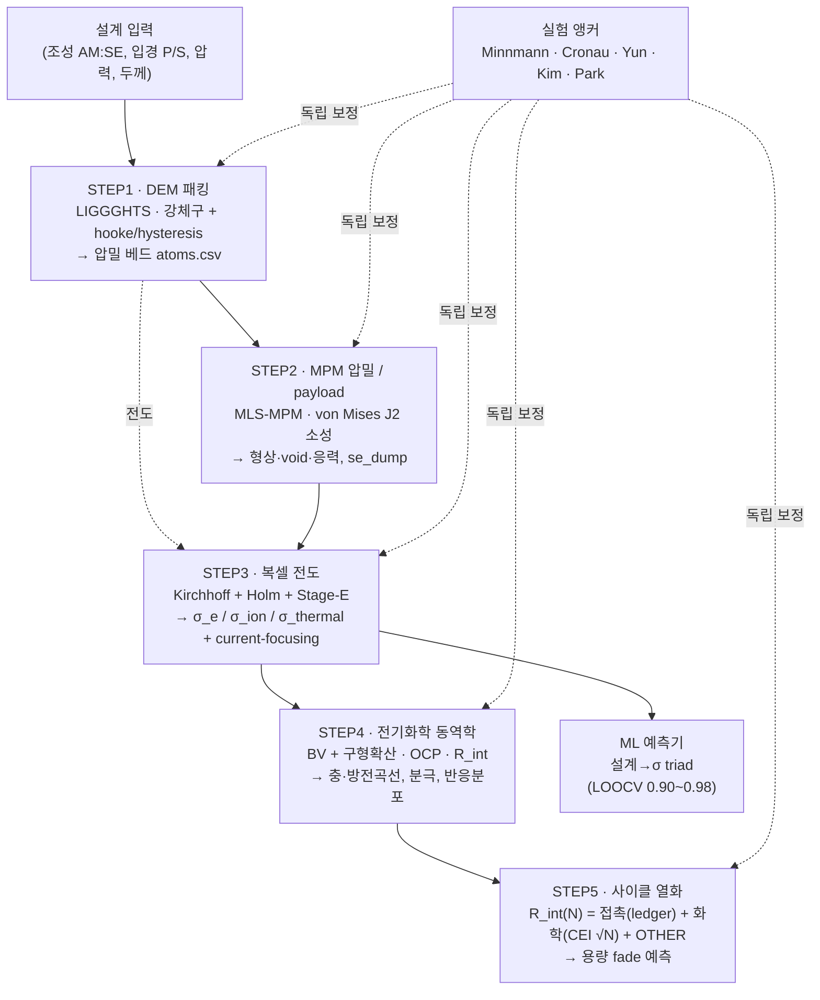

# 황화물 전고체전지 양극 통합 시뮬레이션 — STEP1 → STEP5 설명서
### (처음 보시는 분을 위한 자립형 안내서, 2026-07-23 · v3 확장 반영)
> **v3 업데이트(2026-07-23)**: STEP3 carbon-SE 계면·Joule 발열 hot-spot·periodic BC / STEP4 near-null-B
> 승자 래치 / STEP5 사이클 기전 확장(VGCF촉매·PTFE·Joule 재분배·취성→MPM·코팅 프리셋) / v3 ML 설계
> 폐루프(Sobol·SISSO·BO).  각 STEP의 ★표시가 신규.

> **한 문단 요약.** 우리는 황화물 고체전해질(LPSCl) + 단결정/코팅 NCM 양극을 **냉간압축(≈300 MPa)**
> 한 복합 양극을, 입자 하나하나의 수준에서 **디지털로 재현**하고 그로부터 **성능(전도도·용량·분극)**
> 과 **수명(사이클 열화)**을 예측한다.  다섯 단계로 흐른다: **① 입자를 쌓고(DEM) → ② 눌러서
> 압밀시키고(MPM) → ③ 그 미세구조에서 전자·이온·열 전도를 푼 뒤(복셀 Kirchhoff) → ④ 충·방전
> 전기화학을 돌리고(STEP4) → ⑤ 사이클이 지나며 어떻게 열화하는지(R_int(N))를 분해한다.**  핵심
> 원칙은 **"각 물리를 그 물리에 맞는 도구로만"** 풀고(frame[5] 상보 분업), 각 도구를 **DEM↔MPM끼리가
> 아니라 실험에 독립적으로 보정**하는 것이다.  일치하면 교차검증, 어긋나면 그 차이가 곧 정량화된
> 모델 한계 — 둘 다 결과이지 실패가 아니다.

---

## 0. 왜 이걸 만드나 (문제 정의)

**전고체전지(ASSB)**의 양극은 액체 전해질이 없다.  대신 **고체전해질(SE) 분말**과 **활물질(AM,
여기선 NCM 양극재)** 분말을 섞어 **눌러 굳힌** 복합체다.  성능을 가르는 것은 화학식이 아니라
**미세구조** — 입자들이 얼마나 조밀하게 쌓였는지, 어디서 서로 닿았는지, 그 접촉을 통해 이온·전자가
어떻게 흐르는지다.  실험만으로는 이 내부를 직접 못 본다(SEM은 단면 한 장, EIS는 전체 저항 한 숫자).

→ 그래서 **입자 해상도 시뮬레이션**으로 내부를 복원한다.  입력은 설계 숫자(조성비, 입경, 압력),
출력은 실험이 못 주는 것들: **접촉망, 전도 경로, 응력장, 소성 변형, 그리고 이들이 사이클과 함께
어떻게 무너지는가.**

---

## 1. 핵심 철학 — frame[5] 상보 모델 분업 (이걸 먼저 이해해야 나머지가 보임)

이 프로젝트에서 가장 중요한 개념 하나만 꼽으면 **"모델을 서로 맞추지 않는다"**이다.

- **DEM**(이산요소법)은 입자를 **영원히 단단한 구(rigid sphere)**로 본다.  잘하는 것: **접촉망,
  재배열, 패킹(쌓임), 전도 경로**.  못하는 것: 입자가 **눌려 찌그러지는 소성 변형**(강체라 모양이 안 변함).
- **MPM**(물질점법)은 재료를 **연속체**로 본다.  잘하는 것: **소성 변형, 형상 변화, 빈틈 메움 흐름,
  응력·변형장**.  못하는 것: **이산 접촉망**(연속체라 "이 입자와 저 입자가 점에서 닿았다"를 표현 못 함).

두 모델은 **현실의 서로 다른 절반**을 본다.  그래서 —

> **DEM과 MPM을 서로 보정하면 안 된다(순환논리).  각각을 실험에 독립적으로 맞춘 뒤 비교한다.
> 일치 = 교차검증 증거.  불일치 = 정량화된 모델 한계(정보, 실패가 아님).**

| 물리 | 담당 도구 | 이유 |
|---|---|---|
| 접촉망, 전도(σ_ion/σ_e/σ_thermal), 퍼콜레이션, 힘사슬, Furnas 패킹 dip | **DEM** | 이산 접촉 = 강체구의 강점 |
| 소성 형상변화(SEM 모폴로지), 빈틈-메움 흐름, 응력·변형장, 사이클 형상변화 | **MPM** | 연속체 소성 = 유일 표현 |
| 다공도, 두께, 기계적 coverage, 조성→다공도 트렌드 | **둘 다**(독립 교차검증) | 겹치는 영역 = 신뢰도 측정자 |

이 원칙이 STEP2(MPM)와 STEP3(DEM 전도)가 **왜 분리돼 있는지**, STEP5에서 **왜 "MPM이 사이클을
다 돌린다"가 불가능한지**를 설명한다.

---

## 2. 파이프라인 한눈에



각 STEP은 **앞 단계의 출력을 입력으로** 받고, **실험에 독립적으로 보정**된다(점선).

---

## 3. STEP1 — DEM 패킹 (입자를 쌓는다)

**한 줄**: 설계 숫자대로 AM·SE 분말을 가상 용기에 붓고 **300 MPa로 눌러** 실제와 같은 다공도의
**압밀 베드**를 만든다.

- **도구/물리**: LIGGGHTS(오픈소스 DEM).  입자는 **강체구**, 접촉은 **hooke/hysteresis**(선형-Hertz
  근사) 스프링.  압력판이 위에서 눌러 목표 압력까지 압밀.
- **핵심 트릭 — 18× 연화(softening)**: SE의 실제 탄성계수는 E≈24 GPa인데, 시뮬레이션에선
  **E_eff=1.35 GPa로 18배 물렁하게** 쓴다.  왜? 강체구 DEM은 입자가 안 찌그러지므로(소성 없음),
  실제 분말의 **재배열·입계 미끄러짐·미세파쇄** 같은 "빠진 치밀화 기전"을 **연화된 탄성계수 하나로
  뭉뚱그려** 넣는다.  이 18×는 자의적이지 않다 — 순수-SE에서 **Cronau 중첩 11~12%**, 독립적인
  MPM 치밀화, 셋이 모두 같은 연화를 요구한다(삼중 교차검증).
- **입력**: 조성(AM:SE 무게비, 예 82:18), P:S 비(대입자 poly : 소입자 SC), 입경(12:4:1 등), 압력, 두께.
- **출력**: 압밀 베드 `atoms.csv`(id, type, x, y, z, radius) — 모든 후속 단계의 골격.
- **핵심 수식(검증)**: **Heckel** ln(1/(1−D)) = K·P + A, 우리 DEM은 R²=0.965, 항복압 **P_y=138 MPa**.
- **실험 앵커**: 다공도 ≈13~16% @300 MPa(Minnmann 냉간압축), 순수-SE Cronau 중첩 11~12%.
- **한계**: 입자 모양은 절대 안 변한다(강체).  "치밀화"는 재배열+중첩이지 형상 소성이 아니다 →
  형상은 STEP2(MPM)가 담당.

---

## 4. STEP2 — MPM 압밀 / payload (눌러서 찌그러뜨린다)

**한 줄**: STEP1의 **실제 AM 골격을 고정**한 채, 그 사이의 **SE만 연속체 소성으로 눌러** 실제
형상변화·빈틈메움·응력장을 계산한다.

- **도구/물리**: MLS-MPM(Taichi GPU), **von Mises J2 소성**(부피보존 소성 흐름 = 실제 분말 치밀화).
- **생산 파라미터(3D)**: E_SE=1.53 GPa, **ν_SE=0.49**(벌크는 실제처럼 단단, 전단만 물렁 = 부피보존
  입상 흐름), σ_y=0.30 GPa, 목표 0.30 GPa, **readout = wallP**(압력판 반력 = 해상도-불변, 진짜 경계조건).
- **DEM→MPM 스캐폴드 결합**(핵심 아이디어): AM 패킹은 DEM의 강점, SE 형상은 MPM의 강점 →
  **DEM의 실제 AM 위치를 격자에 고정(frozen)**하고 **SE만 MPM 재료**로 채워 소성 압밀.  AM을 왜
  안 풀어주나: ① 이산 강체 하중분담은 연속체가 표현 못 함, ② 움직이면 힘사슬 과-차폐(36~41% 비물리),
  ③ AM-as-material은 CFL/OOM 폭발, ④ DEM AM은 이미 검증된 300 MPa 평형 골격.
- **입력**: STEP1 스캐폴드 CSV(am_scaffold, se_scaffold), 압력, 격자 해상도.
- **출력**: 압밀된 SE 형상(se_dump), 누적 소성변형장, 응력장, `mpm_payload.json`(웹뷰어용).
- **실험 앵커**: 순수-SE **Minnmann 10% @300 MPa**(σ_y 스윕 0.30→10.0% 재현), SEM 모폴로지(코어보존+
  경계평탄), 복합체 다공도 **16.7% vs LIGGGHTS 15.6%**(두 독립모델 ±1%p 일치 = frame[4] 교차검증).
- **한계**: 연속체라 **이산 접촉망·Furnas dip은 못 만든다**(그건 STEP3/DEM 소유).  MPM이 소유하는 것 =
  **형상·다공도 증분·응력장**.

---

## 5. STEP3 — 복셀 전도 (전자·이온·열이 어떻게 흐르나)

**한 줄**: 압밀된 미세구조를 **복셀(3D 픽셀)**로 만들고, 접촉망 위에서 **Kirchhoff 회로**를 풀어
**전자·이온·열 전도도 3종**과 **전류 집중**을 낸다.

- **도구/물리**: `network_conductivity.py`, `step3_sigma.py`.  각 입자=노드, 접촉=저항.
  **Holm 1967 수축저항** R = 1/(2σ·r_c)(접촉 반경 r_c로 좁아지는 목), Kirchhoff Σ(φ_i−φ_j)/R = 0.
- **Stage-E 소성 접촉면적 보정**: 강체구의 탄성 중첩(πR·δ)은 소성 접촉을 과대평가 → **Tabor(F/H)·
  부피 재유도**로 실제 소성 접촉면적을 다시 구한다(5-영역 분해, 과압축은 min(caps) 천장으로 차단).
- **3종 전도도(triad)**:
  - **σ_ion**(이온): SE 골격을 타고. 앵커 = Cronau 단결정 3.0 mS/cm × Cronau(r_SE) 결정립 보정.
  - **σ_e**(전자): AM(NCM) 골격을 타고. 단결정/다결정 입계로 나뉨(Trevisanello 방향).
  - **σ_thermal**(열): AM-AM/AM-SE/SE-SE 다경로 병렬.
- **current-focusing**(전류 집중): 좁은 목에서 전류밀도가 평균의 수십 배로 치솟는 지점(p99.8 상위
  0.2%) — 열화·발열의 씨앗.  공동 컬러바는 **케이스-최대(안 잘림)** 천장으로 표시.
- **coverage**(피복률): AM 표면 중 SE가 덮은 비율. Hertz(접촉) ~18% vs **Tabor(소성 퍼짐) ~52%**.
- **★ 2026-07-23 v3 추가**:
  - **carbon-SE 3상 계면 면적**(#30): 탄소(VGCF/SuperP/SWCNT)↔SE 복셀-면 = SE 분해 촉매 반응면(kim2024 Fig3b) → STEP5 화학열화 입력.
  - **Joule 발열 hot-spot**(#29, `--joule-heat`): 발열밀도 q=∣J∣²/σ 맵 = "어디서 발열이 몰리나"(뷰어 🔥Joule 모드).  전류가 구속 neck에 몰리고 σ 낮은 곳서 최대.
  - **periodic BC**(#28, `--periodic`): σ-solve(전자/이온/열/pore/반응)에 x,y 주기 wrap = MPM RVE 'boundary p p f' 정합(측면 절연벽 대신).
- **입력**: STEP2 payload / STEP1 베드.  **출력**: σ_e/σ_ion/σ_thermal(mS/cm), τ(굴곡도),
  퍼콜레이션 분율, current-focusing 맵, coverage, **carbon-SE 면적·Joule hot-spot(신규)**.
- **실험 앵커**: **Bazzoun 2026**(같은 LPSCl+NCM+LIGGGHTS+RNM) σ_eff,ion EIS 0.065~0.137 mS/cm,
  압력-의존 σ-vs-P(400 MPa 포화).
- **한계**: 접촉망은 있으나 시간전개(충방전)는 없음 → STEP4로.

---

## 6. STEP4 — 전기화학 동역학 (충·방전을 돌린다)

**한 줄**: STEP3의 전도망 위에서 **실제 충·방전(정전류/CV, 사이클)**을 시간전개해 **전압곡선·분극·
반응 분포**를 낸다.

- **도구/물리**: `step4_dyn.py`.  **Butler-Volmer 반응 kinetics** + **구형 입자 확산**(고체 내 Li 확산)
  + STEP3 전도망(옴 강하).  OCP(열역학 전압) = **NMC811 Chen 2020** 실측 테이블.
- **핵심 파라미터**: 방전창 x0=0.264 ~ **x100=0.9084**(NMC811 vs-Li GITT 실측), R_int 직렬(풀셀 축),
  SC/poly 크기-의존 확산계수 D_s.
- **수치 안정화(near-null-B AMG)**: 저율(0.1C/0.2C)에서 계가 near-singular → 일반 풀개가 실패.
  **near-null 벡터 기반 대수다중격자 전처리기**가 유일하게 수렴(8.3e-14, 100 it).
  **★ 승자 직행 래치(2026-07-23)**: near-null-B가 이기면 이후 솔브는 정체하는 AMG/Jacobi 사다리를
  건너뛰고 직행 → 저율 후막 ~15-34% 절감.  ★전처리는 CG 해를 안 바꿈 = 물리 불변, 속도만 개선.
- **대표 결과**: 2C CCCV 충전 완주(CC끝 81.5→CV후 89.6%), ΔV 분해(옴 4.5 + kinetics 4.8 mV) —
  방전(7.9 mV)과 대칭 = 수송-기원 양방향 확인.  σ_e ↑(SDCP)이 rate-capability를 개선.
- **입력**: STEP3 전도 그리드(step4_grid.npz), OCP/파라미터 앵커.  **출력**: 전압-시간 곡선, 과전압
  분해, 반응전류 분포, 겉보기 R_int.
- **실험 앵커**: NMC811 OCP(Chen 2020), PyBaMM/COMSOL 방정식-수준 패리티(수치 패리티 런 대기).
- **한계**: v1은 저율 선형/독립 스텝.  시간축 완화·사이클 chaining은 STEP5 방향.

---

## §6 심화 — STEP4 딥다이브 (처음 보는 대학원생용 자립 해설)

> 위 §6이 STEP4 **개요**, 이 절은 **심화**다.  STEP1→STEP5 큰 흐름만 볼 거면 **§7(STEP5)로
> 건너뛰어도 된다.**  전기화학 기초(전지 = 산화/환원 + 이온/전자 분리 수송)만 안다고 가정하고,
> STEP4가 **무엇을·왜·어떻게** 계산하는지 처음부터 끝까지 설명한다. (기준 코드 `scripts/step4_dyn.py`)

### STEP4·0. 한 문장 요약
**실제 3D 전극 미세구조(입자 1,271개, 계면 50만 개) 위에서 "정전류를 만들 전압을 찾고 → 각 계면의
반응 분배를 풀고 → 그만큼 입자들을 리튬화하고 → OCV가 내려간 만큼 전압이 내려가는" 루프를 돌려,
방전곡선 V(Q)를 미세구조로부터 직접 계산한다.**

상용 툴(COMSOL P2D/DFN)과의 차이는 하나다: 그들은 전극을 균질한 스펀지로 뭉개고 반응 분포를 이론
파라미터로 가정하지만, 우리는 DEM/MPM이 만든 **진짜 구조** 위에서 반응 분포가 **매 스텝 계산 결과로
나온다**.  그래서 "어떤 입자가 소외되는가", "배선이 나쁘면 어디부터 무너지는가"에 답할 수 있다.

### STEP4·1. 무대 — 복셀 전극이란
| 단계 | 하는 일 | 산출물 |
|---|---|---|
| STEP1 (DEM) | 분말 압축 시뮬 — AM/SE 입자의 실제 위치·반경 | 입자 좌표 |
| STEP2 (MPM) | SE의 소성 변형 압밀 + 첨가제(VGCF/PTFE/SDCP) 시딩 | 압밀 침대 |
| STEP3 (복셀화) | 0.4 µm 격자로 래스터화 → 전도망 풀이 | σ_e, σ_ion, 전류밀도 장 |
| **STEP4 (이 절)** | **그 위에서 시간전개 충방전** | **방전곡선, SOC 장, 반응분포** |

STEP4가 받는 격자(`step4_grid.npz`)에는 복셀마다 "AM / SE / VGCF / SDCP / 공극" 딱지 + 입자 id가 붙어 있다.
전형적 크기: 자유도(전위 미지수) ≈ **290만**, AM 입자 **1,271**, AM|SE 반응 계면(BV 면) **~50만**, 두께 72.5 µm,
면적용량 ≈ 3.1 mAh/cm².  핵심 그림 = **두 개의 도로망**:
```
   분리막(위)  ← Li⁺ 는 여기서 들어옴
   ┌─────────────────────────┐
   │  이온망: SE(+SDCP)       │   ← φ_i (이온 전위)가 정의되는 곳
   │     ↕ 50만 개 BV 계면    │   ← 여기서 이온↔전자 "환승"
   │  전자망: AM+VGCF+SDCP    │   ← φ_e (전자 전위)가 정의되는 곳
   └─────────────────────────┘
   집전체(아래) ← e⁻ 는 여기서 나감
```
방전 전류는 **릴레이**다: Li⁺가 이온망을 타고 내려오고 전자가 전자망을 타고 올라가 어느 AM|SE 계면에서
만나 "AM 속 Li"가 된다.  총 전류는 두 망에서 같아야 하고(직렬), 다른 것은 **어디서 만나느냐(반응 분포)** 뿐.

#### BV 면은 어떻게 정해지나
반응하려면 같은 표면 요소에 **전자 접근**(AM 내부)과 **이온 접근**(SE/SDCP)이 동시에 있어야 한다 →
BV 면 = **AM 복셀(sid 1·2)과 이온전도 복셀(sid 6=SE, 5=SDCP)이 축 방향 맞닿은 면** (양쪽 모두 판-연결 성분일 때만).
면적 A_face = vox² = 0.16 µm².  **AM|SDCP 면도 반응 면**(SDCP가 이온 운반) → DBE 반응면 +18%(425k→504k) =
"SDCP가 이온-소외 AM 표면을 반응 가능하게" 만든 효과.  고립 SE 주머니 면은 자동 제외 → "기하 접촉"이 아니라
**반응-접근 가능 계면**.  BV 면 0개 입자 = dead AM.  ⚠ 복셀 계단화로 축-정렬 면적이 매끈한 구보다 ~1.5×
(staircase) — SBE↔DBE 상대비교선 상쇄, 절대비교(pybamm 트윈)선 캐비엇 명시.

### STEP4·2. 방전 한 스텝의 해부 — 6단계 루프
##### ① 목표 전류 (정전류 운전)
1C에 해당하는 총 전류 I_target 고정 (유도 §STEP4·3).  실험의 정전류 방전기와 같다.
##### ② 전압 탐색 — 손잡이는 V뿐
전류를 직접 못 꽂는다.  제어 가능한 건 집전체 전위 V_app, 전류는 그 결과 → "V를 얼마로 두면 I_target?"을
수치로 찾는다(단조라 괄호법/Illinois; 로그 `ev 6~8` = 전압 후보 수).
##### ③ 전위장 풀이 — 두 도로망 + 50만 환승역
후보 V마다 Newton 반복:
- 전자망 ∇·(σ_e∇φ_e) = (계면에서 나가는 전류) · 이온망 ∇·(σ_ion∇φ_i) = (계면으로 들어오는 전류)
- 각 계면 f **Butler–Volmer**: η_f = φ_e − φ_i − U(x_surf);  i_f = i₀(x_surf)·[e^(α_a F η_f/RT) − e^(−α_c F η_f/RT)]

BV가 지수라 전체가 비선형 → Newton 3~4회 + 회당 CG.  Newton 잔차(`잔차 1e-08`) = 키르히호프 전류 보존 정확도.
##### ④ 리튬 삽입 — "방전"의 실체
i_f = 그 자리 Li⁺가 AM 표면에 박히는 속도 → 면별 전류를 입자별로 합산 → 표면 유입 플럭스 J_p.  여기서
**반응 불균일**이 태어난다(배선 좋은 입자↑, 소외 입자↓) — 가정 아니라 ③의 **풀이 결과**.
##### ⑤ 입자 내 확산 — 코어-셸
표면 Li이 입자 안으로 확산 — 입자마다 반경 20겹 셸(구면, D_s=3×10⁻¹⁴ m²/s), 표면 x_surf가 코어보다 앞섬.
이 표면-코어 격차 = **확산 과전압 η_diff**의 근원(뷰어 "입자 SOC 코어-셸" 모드가 이 장).
##### ⑥ 전압이 내려가는 이유
**V ≈ U(x_surf) − η_kin − η_ohm(이온·전자)**.  방전으로 x_surf↑ → 열역학 U(x)↓(NMC OCV 곡선) → 곡선이 미끄러짐.
1C 시작 총 분극 ≈ **46 mV**(TL 재계산 검증, 성분 §STEP4·4), 0.5C ≈ 21 mV.  나머지 하강은 전부 OCV 하강.
##### 시간폭 dt = 안전장치이자 물리 신호
dt는 "최속 입자 표면 Δx_surf ≤ 0.02/스텝"으로 자동조절.  붕괴 전까진 SBE·DBE dt(x̄) 궤적이 사실상 동일,
dt 급감(→~15 s)은 **양쪽 공통** x̄≈0.38–0.41(최열점 5–8× 국면).  ⚠ 전극 간 불균일은 dt가 아니라 **ηkin 갭·V갭·
면분포 시각화**로 판정(옛 "SBE 17s vs DBE 86s" 착시 정정 2026-07-17).

### STEP4·3. 1C 전류는 어떻게 정해지나 — 손으로 정한 숫자 0개
**1C = 전체 용량을 정확히 1시간에 빼내는 전류.**  I₁C = F·c_max·|x₁₀₀−x₀|·V_AM / 3600 s.
| 인자 | 값 | 출처 |
|---|---|---|
| F | 96,485 C/mol | 패러데이 |
| c_max | 63,104 mol/m³ | NMC811 max Li — pybamm Chen2020 **기계 추출**(수기 0) |
| \|x₁₀₀−x₀\| | 0.854−0.264 = 0.590 | 실사용 stoich 창 (★현행 x100=0.9084로 갱신; 이 절 예시는 옛 0.854) |
| V_AM | 1,271 구 총부피 | DEM 실좌표·실반경 |

RVE에서 I₁C = 8.303×10⁻⁸ A → **3.07 mA/cm²**(면적용량 3.07 mAh/cm² ÷ 1 h).  교차검증: 부피용량 998 mAh/cm³ ≈
문헌 감각(200 mAh/g × 4.8 g/cm³ = 960).  C-rate는 **자기 용량 기준**(그래야 1C=1시간이 모든 전극서 성립).

### STEP4·4. 전압 곡선 읽는 법 — 분극의 성분들 (TL 재계산 검증, 2026-07-17)
| 성분 | 크기 (1C) | 결정 인자 |
|---|---|---|
| 반응 과전압 η_kin | 시작 **~24 mV** → 완화 후 ~17 | i₀(=2 A/m²)·**반응면적**(BV 면 수); asinh(i/2i₀) |
| 이온 옴 η_ion | **~20 mV** | σ_ion ~2×10⁻⁴ S/cm; 반응대 분리막쪽 L/ν≈30 µm 몰림 |
| 전자 옴 η_e | **~6 µV** | σ_e ~2–3 S/cm (이온보다 10⁴× 좋음) |
| 상태 선행(확산+불균일) | 중반부터 **~20 mV** | 전류가중 ⟨U(x_surf)⟩ < U(x̄) |

합계 1C 시작: SBE **46** / DBE **41 mV**.  ✅ **예측→실측 검증**: TL 예측 "첫 스텝 ηkin ≈24/≈21 mV"가 프로덕션
로그서 **24.9/22.2 mV** 적중(1 mV 이내).  **SBE↔DBE 갭(4.7 mV) 분해**: 반응면 +18% = **3.6 mV(78%)** / 이온 σ +5.6% =
1.0 mV(22%) / 전자 σ +52% = 0.002 mV(~0%).  직관: ① 같은 전류라도 이온이 나르면 비싸다(옴 손실 사실상 전부 이온).
② **저율 V-갭 주범은 σ_e 아니라 "반응면 +18%"** — "σ_e +52%→V-갭" 직결 금지, σ_e 발현처는 고율·후막 여유·반응 분배.

### STEP4·5. 왜 믿을 수 있나 — 4중 감사 (매 스텝 로그에 찍힘)
쿨롱 정합(전류 적분 = 삽입 Li, 4자리) · **E-bal**(투입=옴발열+반응열+저장, ~10⁻⁵) · **KCL**(입자별 합 = 총, ~10⁻⁵) ·
노이즈 바닥 자가교정(float64 한계 실측).  "E-bal 1.6e-05" = 그 스텝이 에너지를 만들지도 없애지도 않음 — 안 닫히면 스텝 거부.

### STEP4·6. 자주 나오는 질문 (FAQ 발췌)
- **방·충 둘 다 선택하면 이어지나?** 아니다 — 각 런 독립(방전=x₀서, 충전=x₁₀₀서).  이력 물리(SEI·접촉변화) 없어 이어도 같음
  → 진짜 연속 사이클은 STEP5(이력)로.
- **집전체는?** 전극 밖 직렬 R_int(bare-Al 46, C-SUS 30 Ω·cm²).  정전류선 V−I·R_int 상수 평행이동 → 재실행 없이 3시나리오 후처리.
- **pore-τ가 "—"인 이유?** 공극률 ~7% 고립 기포 → 관통 안 됨 → D_rel=0 → 정의 불가 → 정직하게 "—"(=전고체 서사 근거).
- **왜 느린가?** 매 스텝 290만 미지수 × 50만 비선형 계면 Newton-CG × 전압탐색, 곡선은 그런 스텝 수백.  빠른 공학곡선은 pybamm
  균질화 트윈(초), 미세구조 차이(전극 비교)는 이 솔버만.
- **반응 전선이 위→아래로?** σ_ion≪σ_e라 이온 접근성 = 희소자원 → 반응이 분리막쪽 L/ν≈30 µm에 몰려 시작 → 리튬화로 구동력 잃고
  더 깊은 입자로 이동 → 전선이 집전체쪽 스윕.  1D porous-electrode 이론의 3D 실계산판.

### STEP4·7. 로그 한 줄 읽기 (치트시트)
```
step 30 t=975.0s [cc] V=4.0100 I=8.302e-08 x̄=0.4237 ηkin=17.0mV E-bal 1.6e-05 KCL 7.3e-06 (ev 8, dt 17s)
```
`step`=시간 스텝 · `t`=경과(1C 풀방전 3600 s) · `[cc]`=정전류(`[cv]`=정전압홀드) · `V`=셀 전압 · `I`=실제 전류 ·
`x̄`=평균 리튬화(쿨롱 검산) · `ηkin`=전류가중 반응 과전압 · `E-bal`/`KCL`=보존 감사 · `(ev,dt)`=전압평가 횟수·시간폭.

### STEP4·8. 용어 대조표 (한/영)
| 한글 | 영어 | 뜻 |
|---|---|---|
| 개방회로전압 | OCV, U(x) | 전류 0일 때 열역학 전위 (SOC 함수) |
| 과전위 | overpotential η | 반응을 그 속도로 밀기 위한 전압 |
| 교환전류밀도 | i₀ | 평형서 양방향 오가는 반응 전류 규모 |
| 분극 | polarization | OCV와 실제 전압 차 (η 합) |
| 정전류/정전압 | CC/CV (CCCV) | 운전 프로토콜 |
| 반응 분포/불균일 | reaction distribution | 어느 계면이 전류를 얼마나 |
| 코어-셸 SOC | core–shell lithiation | 입자 내부 Li 농도 단면 |
| 집중계수 | current-focusing factor | \|J\|(p99.8)/⟨J_z⟩ 무차원 |
| 복셀 DFN | voxel-resolved DFN | 미세구조 격자 위 DFN류 모델 |

*(STEP4 상세: `docs/step4_v2_design.md` · `docs/step4_v2_explainer_for_students.md` · SDCP 원고
`docs/manuscript_sdcp_sigma_e_mechanism.md`)*

---

## 7. STEP5 — 사이클 열화 (수명: R_int이 사이클과 함께 어떻게 자라나)

**한 줄**: pristine 전극(STEP1–4)이 **N 사이클 후 계면저항 R_int(N)**이 얼마나 자라는지를,
**"어느 물리가 얼마나"** 정직하게 **분해**해 예측한다.

가장 중요한 교훈: **"MPM이 사이클을 다 돌린다"는 물리적으로 불가능**(아래 ⚠).  대신 각 열화 기전을
제 도구에 맡기고 **합산**한다 —

> **총 R_int(N) = R_접촉(N) + R_화학(N) + R_OTHER(N)**

| 조각 | 물리 | 도구 | 총 fade 몫 | 앵커 |
|---|---|---|---|---|
| **A-1** | 충전상태 형상변화(SC 수축 −5.1% Kondrakov, poly 팽창) | MPM `--cycle-deform` | 형상 앵커(가역) | GPU 검증(coverage −19%) |
| **A-3** | 영구 접촉파단 | ledger(Bucci δcr CZM, recontact=forbid) | **~2%**(하한) | mono 1.05× vs bimodal 1.51× |
| **B-1** | 화학 계면상(CEI) 성장 | STEP4 interphase / `b1_chem_fade` | **~98% 지배**(bare) | √N Park2023 · 크기 Yun/Kim |
| **OTHER** | 골격재배열·SE 분해·Li쪽 | (모델 밖) | 코팅셀서 지배 | 실험값 대기 |

- **핵심 발견**: 접촉-기계 열화(ledger)는 총 fade의 **~2%뿐**.  진짜 열화는 **화학 CEI(B-1)가 지배**.
  (ledger R_ct 1.1× vs 실험 총 R_int 3.8~6.1×@1000cyc.)  → **MPM/ledger = 방향·기전, 크기·모양 =
  화학 + 실험.**
- **정직한 shape**: CEI 성장은 **√N**(확산제한 Wagner) — **Park 2023**이 코팅셀서 "계면 R vs √t 선형"을
  확인(문헌앵커).  ★단, **magnitude(크기)는 실험 끝점에 앵커**하고 **shape(모양)는 ASSUMED** — 끝점
  하나론 √N/선형 구별 불가.  그래서 `fit_rint_curve.py`로 **실험 곡선(≥4 N점)이 들어오면 shape을
  확증/기각**한다(검증 게이트).
- **코팅 인식**(요즘 양극재): nm 코팅(LNO 등)은 CEI를 **13~20× 억제**(Kim 2025) → 화학 몫이 작아지고
  잔여는 **OTHER(모델 밖)**로 이동 → `b1_chem_fade --chem-x`로 **화학 몫을 열어둠**(하드코딩 아님).
- **★ 2026-07-23 v3 사이클 기전 확장 (전부 기본 OFF·앵커-안전)**:
  - **#30 VGCF carbon-촉매 SE분해**: 탄소 3상계면이 SE 분해 촉매 → 화학 채널을 carbon-촉매몫+baseline으로
    **분해**(kim2024 비가역용량 +63%·cho2024 R_int 2.1×@100cyc).  ★이중계산 가드: 실험끝점=with-carbon 셀
    이라 carbon 이미 포함 → **ADD 아닌 SPLIT**(총 R_int 궤적 불변).
  - **#31 PTFE 브릿지 열화**: 피브릴이 접촉을 초기 더 잡아주다(dcr_eff↑) **defluorination**(Li→LiF+비정질C)으로
    놓음 → ledger에 지연 후 방출.  ⚠크기 앵커 없음 = F1 튜너블 훅(날조 금지, 기본 OFF).
  - **#29 Joule 발열→열화 재분배**(v2): 발열 몰린 복셀이 더 빨리 열화 → ΔR_total(끝점 앵커)을 q=∣J∣²/σ로
    **공간 재분배**(Σ 보존).  ★Arrhenius 곱 아님 — **LPSCl 분해-율 Eₐ가 문헌에 없어서**(전도/계면 Eₐ는
    틀린 양) = Eₐ-free 재분배.  이중계산 회피(끝점이 자기발열 이미 포함).
  - **취성→MPM crack-void**: DEM 초기압밀서 fragmentation+ 난 AM 균열이 MPM 형상에(SE ingress) — frame[5]:
    DEM=WHERE(균열 개시), MPM=morphology(형태 결과).  기본 OFF(고압/poly 전용, 저압은 near-null).
  - **코팅 프리셋 셀렉터**(`coating_presets.py` + `/step5` 드롭다운): none/LNO/LZO/Li₃PO₄/SDCP/SWCNT →
    화학 CEI 억제(크기=앵커 Kim2025, shape=√N ASSUMED, 앵커없으면 미변경).
- **입력**: ledger 접촉 궤적 + 실험 총 R_int 끝점(×@N).  **출력**: 총 R_int(N) 분해 곡선.
- **실험 앵커**: **Yun 2023**(우리 랩, bare SC-NMC R_ct 341.7→982.3 = 2.87×@100), **Kim 2025**(LNO
  13~20× 억제), **Payandeh 2023**(코팅 93%@200cyc).
- **⚠ 기각된 것(정직화 과정, 적대리뷰가 코딩 전 차단)**:
  - **v2 반복사이클 MPM**: rigid 핀-마스크는 방전 스프링백 불가 · 부피보존 J2는 영구 접촉손실 금지
    (void를 도로 메움) · 재변형이 sub-voxel → **물리적으로 불가능**.
  - **reflow=0.34 캘리브**: 지표 착시(ledger Hertz-면적 30% vs MPM 복셀-coverage 19% = 정의 차이지
    재유동 아님)로 **철회**.
- **실행 도구**: `cycle_contact_ledger.py`(접촉 fade) · `b1_chem_fade.py`(화학 N-전개) ·
  **`fit_rint_curve.py`(실험 shape 검증)** · **webapp `/step5`(인터랙티브 fade(N) 패널)**.

---

## 8. 검증·실험 앵커 총괄표

| 단계 | 무엇을 검증 | 실험/문헌 앵커 | 우리 값 |
|---|---|---|---|
| STEP1 | 다공도, 압밀곡선 | Minnmann 냉간압축 10% @300 · Heckel | 13~16%, P_y=138 MPa, R²0.965 |
| STEP1 | 순수-SE 소성 floor | Cronau 중첩 5~10% | 11~12% |
| STEP2 | 순수-SE 다공도 | Minnmann 10% @300 | σ_y0.30→10.0% |
| STEP2 | 복합 다공도·두께 | LIGGGHTS(DEM 독립) | 16.7 vs 15.6%(±1%p) |
| STEP2 | 모폴로지 | SEM(코어보존+경계평탄) | 정성 일치 |
| STEP3 | σ_ion 절대값·압력의존 | Bazzoun 2026 EIS · Varkey 2026 | 0.065~0.137 mS/cm 범위 |
| STEP3 | σ_grain 결정립 | Cronau 2022 단결정 3.0 | Cronau(r_SE) 보정 |
| STEP4 | OCP·rate | Chen 2020 NMC811 · PyBaMM | 패리티 런 대기 |
| STEP5 | 열화 크기 | Yun 2023 R_ct 2.87×@100 | 실험 끝점 앵커 |
| STEP5 | 열화 모양 | Park 2023 √t 선형(코팅) | √N 기본(fit_rint_curve 검증) |
| STEP5 | 코팅 억제 | Kim 2025 LNO 13~20× | --chem-x 열어둠 |
| STEP5 | carbon-촉매 SE분해 | kim2024 +63% · cho2024 R_int 2.1×@100 | 화학 채널 SPLIT |
| STEP5 | 자기발열 유의성 | Ayyaswamy AEM2026 (~5-30K) | Joule 재분배(Eₐ 부재→Eₐ-free) |

ML 예측기(설계→σ triad): **σ_ionic LOOCV 0.975 · σ_e 0.953 · σ_thermal 0.90** (predictor_engine, GPR+RF).
**★ v3 ML 설계 폐루프**(`ml_design_loop.py`): Sobol DOE(공간충전, 검증) → SISSO 형식발견 → Bayesian
다목적 역설계(GP+gp_hedge) — Duquesnoy 2023 원형, 우리 5-phase 비전의 폐루프.  실학습은 WSL(sklearn/pysisso/skopt).

---

## 9. 무엇을 믿고, 무엇을 안 믿나 (정직한 한계)

**믿을 수 있다(실험 교차검증됨)**: 다공도·두께(DEM↔MPM ±1%p), 순수-SE 소성 floor(Cronau/Minnmann),
σ_ion 트렌드·압력의존(Bazzoun), 형상 모폴로지(SEM), Heckel 압밀곡선.

**방향·기전은 믿고, 절대 크기는 실험 앵커에 맡긴다**: STEP5 열화(접촉-기계 몫 ~2%는 하한, 화학·OTHER
크기는 실험), current-focusing 상대비교, 복합 다공도 절대값(패킹-한계, de Larrard/DEM에 맡김).

**모델 밖(OTHER)**: 골격 재배열의 이산 성분, SE 화학분해, Li 음극쪽 — 실험값이 들어오면 채움.

**닫힘의 정확한 정의(2026-07-23)**: "**돌릴 수 있고 정직하게 분해된다**"는 닫혔다 — 파이프라인 STEP1→5가
끝까지 돌고, 매 스텝 감사(질량·KCL·에너지)가 통과하며, 각 항이 measured/assumed/ASSUMED-FORM/
literature-anchored로 라벨된다.  아래 3부류는 **미결이되 무엇이 왜 미결인지 명시**된 상태(모르는 걸
아는 척하지 않음 = 정직):

- **① 실험앵커 대기(날조 금지·미변경/스윕전용)**: LPSCl **분해-율 Arrhenius Eₐ**(문헌 부재 — 전도/계면
  Eₐ는 틀린 양 → Joule→열화는 절대 곱 금지, **끝점-보존 재분배**로만) · 코팅 **√N shape**(끝점 하나론
  구별 불가 → ASSUMED, `fit_rint_curve`가 ≥4 N점으로 게이트) · **Joule 절대 ΔT** · **SDCP E_bind**(DFT) ·
  **Kang&Shin bimodal 1.51× magnitude**(현재 `shrink-proxy` 아티팩트 → `expand-void` 재해석 필요; **방향
  bimodal>mono는 불변**, 크기만 미확정) · NCA E=175 · LZO/Li₃PO₄ 코팅 배수.
- **② 연구트랙(구현-미완, 프레임워크는 있음)**: **A10-full 전기-화학-역학 CZM**(#17 — ledger 옵션A +
  A-1 MPM만 구현, 완전 CZM-FEM 미완) · **B6 운전압 σ-시간축 decay** · **D5 R_ct/C_dl/Warburg 사이클
  시그니처**.
- **③ 수치 확증 대기(#5)**: **R_int(N) 계수확정**(WSL PDF digitize) · **STEP4 PyBaMM 매치드-조건 패리티
  런**(ΔV-RMS mV — 이게 "defensible→bullet-proof"의 유일한 남은 조각, V100 하루).

⇒ **"돌아가고 정직하게 분해된다" = 닫힘.  "실험곡선으로 shape·magnitude 확증"과 "완전 사이클 CZM" =
앵커/연구 대기.**  둘은 다른 종류의 미결이다 — 전자는 *신뢰 가능한 산출물*, 후자는 *더 강한 주장을 위한
추가 증거*.

**절대 안 하는 것**: DEM↔MPM 상호보정(순환논리), ASSUMED를 검증된 것으로 표기, 문헌값 날조.
provenance 라벨(measured / assumed / ASSUMED-FORM / literature-anchored)을 항상 붙인다.

### 9-1. COMSOL을 대체하나? (범위별 YES/NO — 정본 `docs/defense_review_20260720.md`)

5-에이전트 적대검증(코드·물리·숫자·정직·COMSOL-대체)의 결론.  **curve-fit이 아니라 정당한 물리 시스템**이다
(STEP4-v2 = 복셀-해상 SSB-특화 DFN: 전하보존 2망 FV·**완전 비선형 BV**·입자별 구형확산 ~1271개; STEP3 =
Kirchhoff 전도 = COMSOL 전도 모듈과 **같은 PDE**, 볼륨메시 대신 접촉그래프).

| | 항목 | 근거 |
|---|---|---|
| ✅ **대체 가능** | σ 삼중(이온/전자/열) 침대 | **Bazzoun 2026 독립 입증**: 같은 재료·코드·접촉물리를 실측 EIS+COMSOL FEM에 검증(RNM≈FEM≈실험, 32-98× 빠름) — 우리는 +전자/열 삼중 |
| ✅ | 미세구조-해상 전류/SOC/핫스팟 **필드** | COMSOL은 이미지 메시 필요, 우리는 DEM/MPM에서 바로 = **최대 우위** |
| ✅ | 반쪽셀 V(t) (단일이온 sulfide) | 빠진 항(전해질 NP·이중층)은 t⁺≈1 SE에서 **물리적으로 없는 것**(근사 아님) |
| ❌ **COMSOL 필요** | 액체/혼성 전해질·풀셀·음극 | 우리 범위 밖(설계상) |
| ❌ | 고-CAM 절대 σ | 수축-only → FEM 대비 ~2× 과소(정직히 bracket) |
| ❌ | 커플드 열/역학 멀티피직스 | A10-full CZM 미완(위 ②) |
| ❌ | 보장수렴·재료 라이브러리·고율 과도 | FEM식 수렴보장 없음(안전망 = 매스텝 KCL+에너지 감사) |

**빠진 단 하나(defensible→bullet-proof)**: STEP4의 **완료된 외부 수치 패리티**.  방정식·기능 패리티 +
내부 검증(selftest 19/19: 질량 2.7e-12·Cottrell 2.9%·KCL 7e-9·에너지 4e-13)은 **진짜**지만, PyBaMM/COMSOL과의
**ΔV-RMS 매치드-조건 런은 아직**(인프라만 있음).  → "COMSOL-패리티"는 **"방정식-수준 패리티·내부 검증;
수치 패리티 대기"**로 읽어야 정직.  이 한 조각(V100 하루)이 STEP4 갭을 닫는다.  STEP3는 이미 Bazzoun으로 닫힘.

---

## 10. 어디서 실행하나 (실무 지도)

| 하고 싶은 것 | 도구 / 위치 |
|---|---|
| STEP1 DEM 패킹 | LIGGGHTS 입력 → 압밀 베드 atoms.csv |
| STEP2 MPM 압밀(GPU) | `scripts/mpm3d_compaction.py`(킷: `mpm_input_from_case.py` → run_mpm.sh) |
| STEP3 전도 σ triad | `scripts/network_conductivity.py`, `step3_sigma.py`(payload에 자동) |
| STEP4 충·방전 | `scripts/step4_dyn.py`(킷: step4_only.sh) |
| STEP5 접촉 fade | `scripts/cycle_contact_ledger.py` |
| STEP5 화학 N-전개 | `scripts/b1_chem_fade.py`(--chem-x 코팅) |
| STEP5 실험 shape 검증 | `scripts/fit_rint_curve.py --csv/--points` |
| STEP5 인터랙티브 패널 | **webapp `/step5`** (슬라이더 + 실시간 분해도) |
| MPM 3D 뷰어 (🔬 2D 단면 morphology · 🔥 Joule 발열 · ⚡ σ 필드) | webapp `/mpm-lab` |
| 설계→σ ML 예측 / **v3 설계 폐루프**(Sobol·SISSO·BO) | webapp `/predictor` · `scripts/ml_design_loop.py`(WSL) |
| STEP3 carbon-SE 면적·Joule hot-spot·periodic | `mpm_webapp_payload.py --joule-heat/--periodic` |
| 취성→MPM crack-void | `dem_fracture_scaffold.py` → `mpm3d_compaction --fracture-scaffold` |
| 결과 자동 등록(V100→db) | `webapp/mpm_lab_register.py`(--dest/--url/--rsync) |

킷 = 웹앱이 케이스별로 zip 산출(스캐폴드 CSV + run_mpm.sh + step4 + A-1 앵커) → GPU(v100)에서 실행.

---

## 11. 용어집 (처음 보는 분용)

- **DEM (이산요소법)**: 입자 하나하나를 강체구로 두고 접촉힘으로 운동을 푸는 방법.
- **MPM (물질점법)**: 재료를 연속체로 두되 "물질점"이 격자 위를 움직이며 소성 변형을 푸는 방법.
- **AM / SE**: 활물질(양극재, NCM) / 고체전해질(LPSCl).  P/S = 대입자(poly, 다결정) / 소입자(SC, 단결정).
- **다공도(porosity)**: 빈 공간 비율.  낮을수록 조밀.  냉간압축 목표 ~10~16%.
- **Heckel / P_y**: 압밀 압력-밀도 관계식.  P_y = 항복압(재배열→소성 전이).
- **Kirchhoff / Holm 수축저항**: 접촉망을 전기회로로 풀 때의 회로법칙 / 좁은 접촉목의 저항 이론(1967).
- **퍼콜레이션(percolation)**: 접촉이 한쪽 끝에서 반대쪽 끝까지 **연결**되어 전류가 통하는가.
- **굴곡도(tortuosity, τ)**: 이온이 돌아가는 정도.  σ_eff = σ_grain·φ/τ².
- **coverage(피복률)**: AM 표면이 SE로 덮인 비율(전자-이온 경계).
- **current-focusing(전류 집중)**: 좁은 목에서 전류밀도가 평균의 수십 배 → 열화 씨앗.
- **Butler-Volmer**: 전극 반응속도-과전압 관계식(전기화학 kinetics).
- **OCP**: 개회로전압(열역학 평형 전압, SOC의 함수).
- **R_int / R_ct**: 계면 총저항 / 전하이동 저항.  EIS로 측정.  단위 Ω·cm²(면적기준).
- **CEI**: 양극-전해질 계면상(cathode-electrolyte interphase) — 사이클마다 자라 저항 증가.
- **√N Wagner 성장**: 확산제한 계면상 두께가 √시간(∝√사이클)로 자란다 → 저항 ∝ √N.
- **frame[5]**: 이 프로젝트의 상보 모델 분업 철학(§1).
- **ledger**: 사이클마다 접촉 개폐를 장부처럼 추적하는 후처리 도구(A-3).
- **provenance 라벨**: 값의 출처 표기(measured/assumed/ASSUMED-FORM/literature-anchored).

---

## 12. 한 페이지 정리 (외워둘 것)

1. **입자→압밀→전도→전기화학→열화**, 다섯 단계가 순차로 흐른다.
2. **DEM = 전도(transport), MPM = 역학(mechanics)** — **서로 안 맞추고 각각 실험에 맞춘다**.
3. STEP2의 18× 연화·MPM 스캐폴드는 **자의적이 아니라 삼중 교차검증**된 물리 대리.
4. STEP5 열화는 **접촉(~2%) + 화학 CEI(~98%, √N) + OTHER**로 **정직 분해** — 크기는 실험 앵커,
   모양은 실험 곡선으로 검증(fit_rint_curve).
5. **일치=교차검증, 불일치=정량화된 한계.**  ASSUMED를 검증된 것으로 위장하지 않는다.

*(상세 근거·수치는 각 단계 전용 문서: `docs/mpm3d_calibration.md`, `docs/step4_assb_window_review.md`,
`docs/step5_cycle_degradation.md`, `docs/manuscript_sdcp_sigma_e_mechanism.md`,
`docs/lit_bazzoun2026_dem_fem_rnm.md`, `docs/defense_review_20260720.md`.)*
