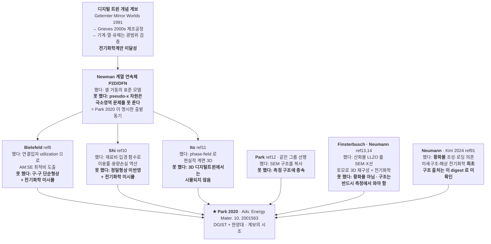
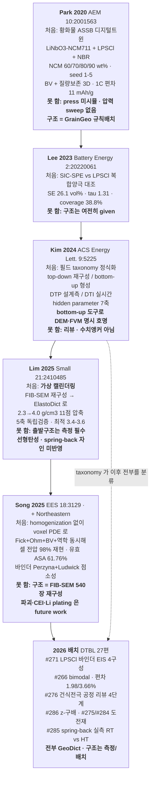
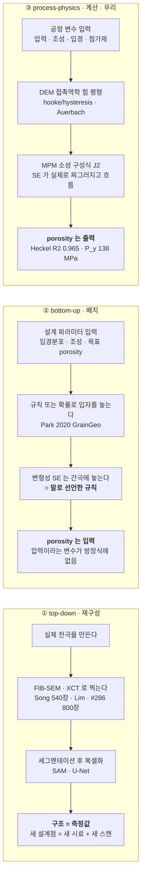

# 디지털트윈 전극 계보 안에서 우리의 자리

> **작성 2026-07-28.** 7개 digest(Park 2020 시조 · Kim 2024 ACS EL taxonomy · Lim 2025 가상캘린더링 ·
> Song 2025 EES electrochemo-mechanical · Choi 2024 E.Chem 총설 · 연세 DTBL 2026 27편 트리아지 ·
> 우리 내부 positioning 메모)를 하나로 종합한 **포지셔닝 정본**.
>
> ⚠ 이 문서는 **계보와 자리매김**만 다룬다. 이용민·문장혁 심포지엄 발표 자체의 요약, 대차대조표 원본,
> Park 2020 벤치마크 1차 대조(A2)는 `docs/symposium_2026_kbs_digest.md` §2·§3·§5-A 를 보라.
> 여기서는 그 문서를 **참조**하고 중복 서술하지 않는다.

---

## 1. 왜 이 문서인가

대학원생이 이 프로젝트에 처음 들어오면 자연스럽게 이렇게 생각한다.

> "전극 미세구조를 3D로 만들고 전도도를 계산한다 — 새로운 일이겠지."

**아니다.** 이 일에는 2020년부터 시작된 명확한 계보가 있고, 그 계보의 주인공은 우리가 학회에서
만나는 바로 그 그룹(연세대 DTBL, 이용민)이다. 그들은 6년간 27편 이상을 냈고, 상용 소프트웨어
(GeoDict, Math2Market)를 중심으로 표준 어휘·표준 검증 절차·표준 그림 형식까지 만들어 놓았다.

이 지도를 모르면 세 가지 사고가 난다.

| 사고 | 구체적 증상 |
|---|---|
| **재발명** | 이미 2020년에 published 된 것을 "우리 발견"이라 쓴다 |
| **한계 재발견** | 그들이 이미 "안 된다"고 적어 놓은 벽에 몇 달을 쓴다 |
| **과잉 주장** | 실제로는 대등하거나 뒤진 축을 "우리 우위"로 써서 심사에서 무너진다 |

동시에 반대 사고도 있다. 그들 논문을 읽고 "우리가 하는 건 이미 다 있네"라고 위축되는 것.
**그것도 틀렸다.** 이 문서의 핵심 결론은 하나다:

> **계보 전체(시조 2020 → 최신 2026)가 구조를 "측정해서 재구성"하거나 "규칙으로 배치"한다.
> 압력을 넣어서 구조를 계산하는 곳은 이 지도 위에 아직 없다.**

그 빈칸이 우리 자리다. 아래에서 그것을 지도로, 표로, 숫자로 보인다.

---

## 2. 계보 지도

### 2-1. 시조 이전 — Park 2020 이 스스로 정리한 선행 7편

Park 2020 논문의 서론은 자기 앞에 뭐가 있었는지, 그리고 각각이 뭘 못 했는지를 직접 적어 두었다.
이 목록은 우리가 만든 게 아니라 **그들의 자기 정리**다.

**읽는 법**: 이 7편이 남긴 두 개의 공백을 Park 2020 이 메우려 했다 —
(i) 신뢰성 높은 3D 구조를 **만드는** 방법, (ii) 시뮬↔실험 편차를 줄이는 것.
그런데 (i)을 **어떻게** 메웠는지가 우리 포지셔닝의 전부다(§2-3).

### 2-2. 시조 이후 — DTBL/GeoDict 라인의 확장

**세 줄 요약**
1. 2020 Park = 구조를 **규칙으로 배치**(GrainGeo) + 전기화학을 얹음.
2. 2024 Kim = 그 방법론을 **taxonomy 로 정식화**(top-down/bottom-up, DTP/DTI). 우리를 분류할 어휘가
   여기서 나온다. 그리고 그 리뷰는 bottom-up 도구로 **DEM·FVM 을 이름으로 부른다**.
3. 2025 Lim/Song = 압축과 역학을 붙였지만, **출발 구조는 반드시 FIB-SEM 으로 측정**해서 넣어야 한다.

### 2-3. ★ 구조를 얻는 세 가지 길 — 이게 전부다

**세 길의 결정적 차이는 "압력이 방정식 안에 변수로 있는가"** 하나다.
①은 압력이 실험실에 있고 모델 안에 없다. ②는 압력이 아예 없다. ③만 압력이 독립변수다.

---

## 3. 우리 자리

### 3-1. 한 문장

> **우리는 구조를 찍어서 재구성하지도(top-down), 규칙·확률로 배치하지도(bottom-up placement)
> 않는다. 압력·조성·입경이라는 공정 변수를 접촉역학과 소성 구성식에 넣어 구조를 계산하고,
> porosity·두께·접촉망은 그 결과로 창발한다.**
> — 필드 taxonomy 용어로는 **bottom-up/formation 의 process-physics-driven 하위유형**.

### 3-2. 왜 새 범주인가 — 10편 어디에도 없다는 증거

| 논문 | 구조를 어디서 얻나 | 압력이 모델 변수인가 | 소성 구성식이 있나 |
|---|---|---|---|
| Bielefeld ref8 | 구-구 기하 배치 | ✗ | ✗ |
| Shi ref10 | 재료비·입경 함수 역산 | ✗ | ✗ |
| Ito ref11 | phase-field 계면 (3D DT 에선 미시뮬) | ✗ | ✗ |
| Park ref12 | SEM 구조 복사 | ✗ | ✗ |
| Finsterbusch·Neumann ref13,14 | SEM·X선 토모 재구성 (산화물) | ✗ | ✗ |
| Neumann ref91 (황화물 최초) | **미확인** (digest 에 구조 출처 없음) | 미확인 | 미확인 |
| **Park 2020** (시조) | GrainGeo 규칙배치 | ✗ (압력 sweep 자체 없음) | ✗ — "deformable 하니 간극에 놓는다"는 **말로 된 규칙** |
| **Kim 2024** (taxonomy) | 리뷰 — bottom-up 을 "확률적 생성 모델"로 정의 | — | — (도구로 DEM·FVM 을 호명만 함) |
| **Lim 2025** (가상 캘린더링) | **FIB-SEM 재구성 필수** | △ strain-controlled 밀도 제어 | ✗ **선형탄성** (모든 상, ν=0.30) |
| **Song 2025** | **FIB-SEM 540장 재구성** | ✗ (구조는 완성품으로 주어짐) | △ 바인더 Perzyna 점소성 (압축 형성이 아니라 **사이클 역학**) |

**읽는 법 세 가지**

1. **압력 열이 전부 ✗ 또는 △다.** 압력에서 구조가 나오는 경로가 이 지도 위에 없다.
2. **가장 가까운 것은 Lim 2025** — 압축을 실제로 시뮬한다. 그러나 두 개의 갭이 있다:
   (a) 출발 구조가 측정이어야 하고, (b) 구성방정식이 **선형탄성**이라 항복면이 없다.
   항복면이 없으면 영구변형·경로의존성이 원리적으로 생길 수 없고, 저자 스스로 spring-back
   미반영을 자인한다.
3. **Kim 2024 리뷰가 우리 도구를 이름으로 부른다.** bottom-up 소절이 "discrete element method (DEM)
   and finite volume method (FVM)" 를 명시하고 그 역할을 "particle interactions and the
   **morphological changes under compression**" 이라고 정의한다. 그리고 그 리뷰의 bottom-up 예시가
   **LPSCl + NCM 70 wt%** — 우리 소재계·조성대 그대로다.
   ⇒ 즉 **taxonomy 는 우리 자리를 이미 정의해 놓았는데, 그 자리를 채운 논문이 계보 안에 없다.**

### 3-3. ⚠ 자칭할 때 반드시 붙여야 하는 단서

"우리는 bottom-up" 이라고만 쓰면 **Park 2020 규칙배치와 같은 칸에 묶인다.** 리뷰의 bottom-up 정의는
확률적 배치를 포함하고, 그 검증 예시가 바로 porosity-지정형인 Park 2020 이기 때문이다.
반드시 **process-physics-driven formation 하위유형**(압력 → 구조 인과)까지 명시할 것.

같은 이유로, 우리 내부 문서 `docs/positioning_vs_geodict.md` 의 표현
"GeoDict 은 구조를 만들지 않는다 / 미세구조 생성 ✗" 은 **틀렸다** — GrainGeo 는 실제로 구조를
*생성*한다. 정확한 차이는 "생성 여부"가 아니라 "힘 평형·항복 방정식에서 인과적으로 생성하느냐 vs
목표 통계를 만족하도록 배치하느냐" 다(§8 인용 주의 C-1).

---

## 4. 우위 표

⚠ **읽는 규칙**: `원리적`(is_principled=true) = 그들 프레임의 방정식 구조상 불가능한 것 →
"우리 우위"로 써도 된다. `미구현`(false) = 그들이 아직 안 한 것 →
**"우리가 앞선다"가 아니라 "그들이 아직 안 한 영역"으로 약하게** 쓴다.

| # | 축 | 우리 | 그들 | 근거 | 판정 |
|---|---|---|---|---|---|
| 1 | **구조 생성의 인과성** | 압력·조성 → porosity·접촉망이 **출력** | 규칙/확률 배치. porosity 는 **입력**. Park 2020 은 압력 sweep 자체가 없음 | 배치 알고리즘의 목적함수에 힘 평형도 항복 조건도 없다 → **압력이 들어갈 자리가 방정식에 원리적으로 없다** | **원리적** ⚠ 근거 축소 — 아래 |
| 2 | **소성 형상변화·void-fill** | MPM J2 (E 1.53, ν 0.49, σ_y 0.30) 로 SE 가 실제로 찌그러지고 흐름 | Park 2020 = 강체 규칙배치 / Lim 2025 = 선형탄성 + 체적보존 resampling / #266 = 강체구+FEM | 시조가 소성을 **"deformable" 이라는 형용사 + 배치 규칙**으로 대체한 것 자체가 그 프레임에 소성 구성식이 없다는 직접 증거. 선형탄성은 항복면이 없어 영구변형이 원리적으로 불가 | **원리적** (프레임 논거만) |
| 3 | **σ 에 접촉면적 변수가 있는가** | Kirchhoff + Holm R=1/(2σ·r_c) + Stage-E 소성 접촉면적 → 압력→소성→접촉면적→σ 사슬이 이어짐 | Park 2020 계보 표준식 **σ_eff = ε·σ_intrinsic/τ** — 접촉면적 변수가 **아예 없음** | 같은 ε·같은 τ면 접촉이 넓든 좁든 같은 σ. 그래서 압력 의존성을 재료상수에 경험식으로 주입할 수밖에 없다 (Park Table S1: LPSCl σ_ion = −4.45e-3·ε_s + 4.64e-3 → ε_s=0.494 에서 자기 전도도의 **47% 상실**) | **원리적** ⚠ Lim 2025 에는 이 논거 금지 — §8 C-2 |
| 4 | **Furnas 크기비 / 패킹 dip** | SE 0.5–1.5 µm ≪ AM 2–6 µm 강한 bimodal 을 **상시 운전**해 dip 대역을 탐색 | Park LPSCl 2차입자 ~8 µm ≈ NCM 8–10 µm = **사실상 등크기 혼합**(크기비 ~1) → dip 창이 **설계공간 밖** | ⚠ **원리적 아님(강등)**: 우리 `scripts/packing_dip_model.py` 가 de Larrard 선형패킹으로 **격자·압력·힘평형·소성 전부 없이** dip 을 낸다 ⇒ dip 은 **순수 기하** → 다분산 구 배치 알고리즘이면 GrainGeo 도 원리적으로 낼 수 있다. 그들이 못 낸 건 **소재 설계 선택**(등크기 SE)이지 프레임 한계가 아니다 | **그들이 아직 안 함** ⚠ 진짜 원리적 우위는 dip 자체가 아니라 **dip 위에서 접촉망 σ 를 동시에 내는 것**(#3) |
| 5 | **dead particle 판정 기준의 강도** | BV 면 = AM 복셀과 이온복셀 인접 **+ 양쪽이 각각 집전체·분리막까지 연결된 성분일 때만**(anchored-component 필터). BV 면 0 = dead | Park: dead = **같은 상 이웃과 기하학적으로 고립**된 입자(부피%). NCM ≤0.94%, LPSCl 90wt% 6–20% | 단상 기하 연결만 보므로, 전자망으로는 이어져 있으나 닿는 SE 가 고립 주머니라 반응 불가인 AM 을 **정의상 셀 수 없다**. ⇒ 그들 dead% 는 전기화학적 dead 의 **하한** | **원리적** |
| 6 | **영구 접촉손실 / 사이클 저항 배분** | 접촉별 **Bucci CZM 원장**(`cycle_contact_ledger.py`)으로 f_broken(N) 궤적 산출 → R_int(N) 을 접촉-기계 / 화학 CEI / OTHER 로 **배분** | Song 2025 = associated J2 점소성 5사이클(항복 진화만) · Park/#271/#264 = **단일 스냅샷** | ⚠ **논거 교체(강등)**: "J2 부피보존이라 틈을 못 만든다"는 **틀린 물리** — J2 등체적은 *소성 변형률 증분*에만 걸리고, 틈을 여는 구동력은 화학적 부피변화·탄성 제하(둘 다 체적성)이며 Song 은 전자를 이미 갖고 있다. **우리 MPM 도 같은 J2** 이고 우리 접촉손실도 구성식이 아니라 **후처리 CZM 원장**에서 나온다. 그들에게 없는 건 **파괴/CZM 판정**이고 그건 **저자 자인 future work** | **그들이 아직 안 함** (구현 우위) ⚠ 2% vs 98% 단독 인용 금지 — 아래 |
| 7 | **나노 접촉 물리를 큰 도메인에서 유지하는 비용** | ★**DEM 입자-접촉망 경로에 한정**: Holm 수축저항을 **간선**에 해석식으로 넣어 비용이 접촉 수에 비례(`network_conductivity.py`) | Kim 2024 리뷰가 한계 #1 로 자인: 수십 µm 도메인에서 나노 물성은 **effective property 로 뭉갠다** | 복셀/FEM 자유도는 (도메인/복셀)³ → "큰 도메인 × 나노 해상"이 조합적으로 막힘. 독립 검증: 같은 RNM 이 FEM 대비 32–98×(Bazzoun 2026) | **원리적 — 단 접촉망 경로만.** ⚠ **우리 0.4 µm 복셀 경로(STEP3/STEP4)는 해당 없음**: `step3_sigma.py:14-16` 이 "**sub-voxel constriction NOT modelled** — 1-voxel neck 면적이 face 면적으로 양자화됨" 을 명시(pore-PNM `:609` 동일 caveat). 이 축을 STEP3/4 결과에 붙이면 자기 코드가 반박한다 |
| 8 | **설계 → metric 을 구조 생성 없이** | scaling law: 설계 knob → σ 삼중 직접 (LOOCV 0.975/0.953/0.90). corpus 확보 후 설계점당 O(1) | top-down 은 시료가, bottom-up 은 생성 런이 **설계점 1개당 1개** 선행 필요 | 두 경로 모두 탐색 비용이 설계점 수에 선형으로 묶인다(리뷰 한계 #3 이 계산자원 확충을 전망으로 드는 이유) | **원리적** ⚠ corpus 분포 밖 외삽은 PI 가 넓어짐 |
| 9 | **재현성·접근성 (오픈 스택)** | LIGGGHTS + scipy + Taichi + 자체 솔버 — 전 구간 오픈 | GrainGeo·ConductoDict·PoroDict 모두 상용 라이선스 | 물리적 한계가 아니라 라이선스 사실 | **미구현 아님 — 기여 문장으로만** |
| 10 | 첨가제 상 해상 | 9상 개별 sid (AM_S/AM_P/VGCF/SuperP/SDCP/SE/PTFE/SWCNT/공극), 규약 중앙화 + 회귀테스트 | Park/Lee/#271 = 3상 · Song = 도전재+바인더를 CBM 단일상 병합 | **재구성 기반에는 원리적**(sub-µm carbon 이 voxel 이하 → 세그멘테이션 불가). Park 2020 의 3상은 **도전탄소 미포함이라는 설계 선택** | 재구성 상대 **원리적** / 규칙배치 상대 **그들이 아직 안 함** |
| 11 | 열전도 σ_thermal | 같은 접촉망에서 삼중 + Joule hot-spot 맵 | 계보 27편 + 8편 전체에 열 없음. Kim 2024 는 발열의 가치를 진술만 하고 descriptor 집합에 열이 없음 | **원리적 한계가 아님** — ConductoDict 는 같은 라플라스를 풀므로 원하면 낼 수 있다 | **그들이 아직 안 함** |
| 12 | structure-resolved 전기화학 | `step4_dyn.py` = 복셀 φ_e/φ_i 이중장 + 면별 비선형 BV Newton. 자유도 290만–440만, BV 면 50만–121만, 0.4 µm | Song 2025 = COMSOL voxel PDE, 600 nm, 도메인 ≈0.3M voxel, 단일곡선 ~2주 | **우위 아님 — 대등하다.** 우리 격자가 1.5× 곱고 자유도 ~10× 크지만, 그들은 고체역학+deformed geometry 재메싱+농축용액을 **추가로** 푼다 | **대등** (§8 D-1 자기평가 정정) |

### 4-1. ★ 적대검증이 무너뜨린 근거 — 쓰면 안 되는 문장 (2026-07-28 반영)

3-렌즈 적대검증에서 **HIGH 6건**이 나왔고, 전부 "**우리 코드/문서가 스스로 반증한다**" 유형이었다.
아래는 **인용 금지 목록**이다. (판정 자체는 위 표에 이미 반영)

| 쓰면 안 되는 문장 | 왜 무너지나 | 대신 쓸 것 |
|---|---|---|
| "Heckel R²=0.965, P_y=138 MPa 로 압밀 인과성 검증" | 우리 `heckel_analysis.py:80` 의 **자체 합격 기준이 `R²>0.97 and 500<P_y<1200`** 이고, 이 값은 **두 조건 다 실패** → 스크립트가 스스로 `⚠ deviates` 를 찍는 결과다. 게다가 그 fit 은 `R_SE=0.0005` 하드코딩 = **pure-SE 4압력** 시리즈이고, **복합체는 300 MPa 단일점**(`docs/data/densification_porosity_db.csv`)이라 "압력→porosity"를 복합계에서 보인 적이 없다 | "**pure-SE** 4압력 Heckel 선형성; P_y 138 MPa 는 LPSCl 단결정 대비 **6.5× 연질 = softening 의 정량**이지 항복물성 재현이 아니다. 복합체 다-압력 런은 **미실행**" |
| "순수-SE Minnmann 10%@300 MPa 정합 = 검증" | **순환**이다. CLAUDE.md frame[2] 가 자인하듯 18× softening 의 존재 이유가 "macroscopic porosity 를 실험에 맞추기 위해"이고, MPM 도 `mpm3d_calibration.md:67-74` 에서 σ_y 를 **스윕해 10% 에 맞는 점을 골랐다**. 즉 이건 **캘리브레이션 타깃**이지 독립 검증이 아니다 | 캘리브 점과 **전이(transfer) 검증**을 분리: 검증으로 쓸 수 있는 것은 **캘리브가 손대지 않은 축** — DEM↔MPM 독립 **15.6 vs 16.7 %**(512 격자서 16.80 % = 해상도 아티팩트 아님)·두께 **30.28 vs 30.71 µm**·Tabor coverage **48–52 vs 49.6/48.2 %** |
| "Furnas dip 은 규칙배치가 원리적으로 못 만든다" | 우리 `packing_dip_model.py` 가 **격자·압력·힘평형·소성 없이** de Larrard 만으로 dip 을 낸다 ⇒ dip 은 순수 기하 | "그들은 **등크기 SE** 를 써서 dip 창이 설계공간 밖일 뿐" (표 #4) |
| "J2 부피보존이라 영구 접촉손실이 원리적으로 불가" | J2 등체적은 **소성 변형률 증분**에만 걸린다. 틈을 여는 건 화학 부피변화·탄성 제하(체적성)이고 Song 은 전자를 보유. **우리 MPM 도 J2** 이고 우리 접촉손실은 **후처리 CZM 원장** 산물 | "그들은 **파괴/CZM 판정이 없다고 스스로 적었다**(future work)" (표 #6) |
| "STEP5 가 열화를 **기전 분해**한다 (접촉 2% / 화학 98%)" | `rint_cycle_traj.py:11-12` 가 "**양끝 R0/R_c = 측정, 사이 곡선 = assumed-form**", `:165` 라벨 "**NOT measured**". 기계 몫도 Miner 누적이 ASSUMED-FORM, Γ* 는 "**Bucci 1000 문턱 이식 불가**". 즉 **두 끝점 사이를 √N 으로 보간한 것** | "**양끝-고정 assumed-form 밴드 위의 몫-배분 시나리오**". 2%/98% 는 **밴드(√N/선형 × j 0.3–0.7) 없이 단독 인용 금지** |
| "0.4 µm 격자에서도 나노 접촉목 물리 유지" | `step3_sigma.py:14-16` 이 "**sub-voxel constriction NOT modelled**" 명시. 이 우위는 **DEM 접촉망 경로에만** 성립 | 경로를 명시: "**DEM 입자-접촉망**은 Holm 을 간선에 넣어 유지 / **복셀 STEP3-4 는 sub-voxel 미해상**(문서화된 한계)" |

> **왜 이 표를 남기나.** 여섯 문장 모두 *그럴듯하고*, 발표·원고에서 쓰고 싶어지는 것들이다. 그런데
> 전부 **반박 1줄이면 무너진다** — 그것도 우리 자신의 스크립트 한 줄로. 무너진 뒤에 잃는 것은 그 문장
> 하나가 아니라 **나머지 진짜 우위의 신뢰**다. 그래서 목록으로 못박는다.

---

## 5. 열위 표

정직하게. `closable` 은 3단계 — **메울 수 있음**(우리 코드/런으로) / **협업 필요**(실험 자산) /
**범위 밖**(설계상 안 하는 것).

| # | 축 | 그들 | 우리 | closable |
|---|---|---|---|---|
| 1 | **셀 전압의 실험 검증** | Park 1C 평균 용량편차 **~11 mAh/g** · Song coin cell **>98% 재현**(1/2/4/8C + GITT) · Lim P3D 5C **6.1%** · #266 σ 편차 1.98/3.66% | STEP4 는 매스텝 쿨롱·에너지·KCL 감사와 방정식-수준 패리티만. **미세구조→셀 V(t) 외부 실측 대조 0건**. PyBaMM 매치드-조건 패리티조차 §14-3 #1 미실행 | **메울 수 있음(런) + 협업**(다-C-rate 실측은 랩 셀 필요). 그 전까지 "우리 STEP4 는 검증된 곡선을 낸다"고 말하면 안 됨 |
| 2 | **단일입자 실측 동역학 i0 · D_s** | Song: Au 마이크로매니퓰레이터로 단일 NMC711 접촉 → i0,init 26 A/m² + **SOC 의존 닫힌형**(식3·식13). Park: ASSB 계 파라미터셋 전체 공개 | `--i0` 2.0 A/m² 는 코드 docstring 이 스스로 "⚠F1 미앵커", `--d-s` 3e-14 는 "측정 아님" 명기. §14-1 #7·#8 열려 있음 | **협업 필요** — 우리 최대 급소. SC/PC 분리 i0 는 Song 도 안 주므로 그 조각은 여전히 미해결 |
| 3 | **실측 3D 재구성 자산** | FIB-SEM(Song 540장 43.78 nm, #275 820, #286 800) + XCT(비파괴·operando) + SAM/U-Net 세그멘테이션. 재구성↔원본 부피분율 **소수 4자리** 일치 | 전무 — 구조 100% 생성. 검증은 porosity·두께·coverage 같은 **집계량**뿐, 형상 자체의 직접 대조 없음 | **범위 밖**(우리 정체성) + **검증만 협업 필요**. 황화물은 대기 부반응 때문에 무산소 조건이 추가로 필요 |
| 4 | **rate/time/cycle 의존 바인더 역학** | Song: Perzyna ε̇=A⟨f/σ_y⟩^b (b=1) + Ludwick σ_y=σ_y0+k·ε̄^n (n=2), 3 strain-rate 인장 89–97% 재현, 5사이클 항복 24→42.10 MPa 포화 < PVDF 파괴 45. #285 가 그 현상을 실측(RT +4 µm vs HT +1 µm/3주) | MPM 은 rate-independent J2. `--coh` 는 정적 cohesion. hold-relax 는 ~40 substep 순간 settling = **시간축 자체가 없음** | **메울 수 있음(대공사 L)** — 정식(Song)과 검증데이터(#285)가 동시에 확보됨. 백로그 A12. ⚠ Stage-2 범위 밖 판정이라 착수는 사용자 DISCUSS |
| 5 | **기계 ↔ 전기화학 양방향 결합** | Song: Li 삽입 strain 을 hygroscopic swelling 으로 넣고 COMSOL Deformed Geometry 로 **변형 형상이 다시 반응면적·확산경로에 되먹임** | STEP2→3→4 가 **단방향**. A10 은 후처리 접촉-원장. §14-2 #2·#3·#4 미구현 | **메울 수 있음(큰 작업)** — `--cycle-deform` 이 형상 변형 절반은 갖고 있으나 되먹임 루프가 없음 |
| 6 | **다밀도·다압력 실험 스윕의 폭** | Lim: 밀도 11점(2.3→4.0)을 **실제 제조**해 rate(0.1–10C)·400사이클·σ_e·접착까지 측정 → 시뮬-실험 폐루프로 최적 3.4–3.6 도출 | Heckel 4압력은 시뮬만. σ·crack·사이클을 동시에 훑은 밀도 스윕 없음 | **협업 필요**(실험) + **시뮬 폐루프는 단독 가능**(hook D-1) |
| 7 | **구조 신뢰성 보고 규율 — seed band · REV** | Park: seed 1–5 를 **모든 지표**에 밴드로 보고 + 목표 부피분율 대비 ±2%. Lim: **REV 14.1/13.9**(권장 최소 5) | multi-seed 는 있으나 대부분 단일 seed 대표값. **REV 를 한 번도 보고한 적 없음** | **메울 수 있음** — 새 물리 0, 보고 형식 + 기존 솔버 재활용 |
| 8 | **공개 파라미터 세트의 재현성** | Park Table S2 에 D_s·D_e·k·σ_s·σ_e(ε_s)·c_max·c_e·t₊·OCV 6-가우시안까지 전부 명시 → 제3자 재현 가능 | 핵심 동역학 파라미터가 앵커 대기 상태로 문서에만 존재 | **메울 수 있음** — 그들 세트를 브래킷 점으로 도입하면 "문헌 부재" → "문헌 1점 + 스윕" |
| 9 | **AM 내부 응력장 / 균열 잠재 공간분포** | Lim: 모든 상이 탄성 연속체라 NCM 2차입자 **내부** von Mises 분포를 얻고 crackable vol%(>100/150 MPa)를 두께방향 프로파일로 실 cracked 와 대조 | MPM 에서 AM 은 frozen 격자 장애물(물질점 없음) → **AM 내부 응력 없음**. 파괴는 접촉 단위 Auerbach 판정(공간장 아님) | **메울 수 있음(중)** — 최종 형상에 AM 을 탄성 물질점으로 넣은 **읽기 전용 응력 패스** 1회 |
| 10 | **풀셀 스택 지오메트리의 공간 해상** | Park: Li 3 µm ǀ LPSCl separator 30 µm ǀ 전극 ǀ Al 1.5 µm 를 실제 도메인화 → separator ǀ cathode 계면 근처 lithiation 불균일을 **공간적으로** 제시 | 분리막=경계조건, 집전체=직렬 R 1개, Li=기준전극. φ(z) 는 있으나 분리막 층이 도메인 안에 없음 | **부분적으로 메울 수 있음(중)** — 단일이온 SE 에서 분리막의 직렬 옴 축약은 물리적으로 타당하나 **계면 근처 공간분포**는 축약으로 못 냄. 음극은 범위 밖 유지 |
| 11 | **입자 형상·배향·코팅의 기하 표현** | Park: PSA 구 위에 SEM 다면체 1차입자(565 nm–1.55 µm)를 흩뿌려 bumpy 2차입자. #286/#276: 배향을 독립 descriptor 로 | AM·SE 모두 등방 구. 코팅은 계면 전도 프리셋이지 기하 층 아님 | **범위 밖(단기) / 연구트랙** — 비구형 DEM 은 접촉역학·Stage-E 면적·voxel 스탬프가 전부 구 가정 위에 서 있어 대공사. ⚠ 단 **섬유상 첨가제 배향은 해석적으로 이미 있음** — "배향을 전혀 못 한다"로 뭉뚱그리지 말 것 |
| 12 | **접착 / delamination** | Lim: SAICAS 접착강도가 2.3→4.0 에서 **+199%**(σ_e +130% 보다 큼), 2.8 g/cm³ 의 300사이클 급락을 접착 부족→접촉손실로 귀속. Bak 2024: 바인더 z-분포 → 계면 저항 10~1600 mΩ·cm² | 접착·박리 물리 없음. PTFE 는 절연 배제 + 사이클 브릿지 훅만 | **범위 밖(현재)** — 단 STEP5 접촉-기계 몫(Bucci G_c)과 개념적으로 같은 축이라 앵커가 들어오면 연결 가능 |
| 13 | **제조공정 전 사슬** | #276 이 건식전극을 4단계(mixing/kneading/laminating/**calendering**)로 해부 + 3대 결함 taxonomy | 압축(calendering) 한 스텝만 | **범위 밖** — 다만 우리 압축을 그들 용어 calendering 으로 재명명하고 "#276 이 정의한 framework 의 정량 엔진"으로 자리매김은 즉시 가능 |
| 14 | **스케일 사슬 + DTI** | atom→particle→electrode→cell→module/pack 전 사슬 + DTI(실시간 양방향) 범주 | 양극 복합체 한 층. 실시간 연결 없음 | **범위 밖** — 우리를 **DTP** 로 명시 자칭하면 "못 하는 것"이 아니라 "다른 범주"가 됨 |
| 15 | 유동/투과율 (FlowDict) | Stokes permeability 모듈 | 없음 | **범위 밖 + 물리적 근거 있음** — 우리 공극 ~7% 에 대부분 고립이라 관통 경로가 없어 permeability/pore-τ 정의가 성립하지 않음. 습식 침투 서사로 확장할 때만 진짜 갭 |

**⚠ 공통 GAP 을 우리 약점으로만 적지 말 것**: cycling 화학-기계 열화의 미세구조 시간전개는
그들 디지털트윈도 **단일 스냅샷**이고(Park/#271/#264 자인), delamination 도 #276 스스로
future work 라 적는다. 바인더 인장의 dried-film 한계도 양쪽 공통이다.

---

## 6. 가져올 것 — 통합 훅 목록

**A 그룹(이미 계산 중, 보고 형식만)이 압도적으로 많다.** 새 물리 없이 대조 가능성이 열린다.

### A. 이미 있다 — 단위·라벨·표만 바꾸면 됨

| # | 무엇을 | 우리 코드 위치 | 작업량 | 왜 |
|---|---|---|---|---|
| A-1 | **비표면적 a_v [1/m]** 을 정식 축으로 (AM\|SE 계면면적 / 전극부피). 이미 실측: Hertz med 9.6e4, Stage-E med 2.77e5 → **소성 몫 2.89×** | `docs/data/case_master.csv` 의 `area_AM전체_SE_total(_physics)` ÷ (box_x·box_y·thickness). 복셀측은 `mpm_webapp_payload.py:1001` n_bv_faces×vox² | S | Park Fig S8(9.5e4→3.5e4)·Song(유효 ASA 61.76%)과 **같은 SI 단위**로 붙는다. 우리 상대값 coverage 가 절대 대조 가능해짐 |
| A-2 | **R_brug 숫자 붙이기** — (a) EMT 닫힌형 대비 (b) 접촉-free 망 대비를 분리. 이온 3–10×, constriction 이 저항의 69–81% | `network_conductivity.py:964, 1012-1014, 1093, 1102` · 플롯 이미 존재 `generate_comparison_plots.py:3317` | S | "연속체는 상한만 준다"가 문헌 추정이 아니라 **우리 도구로 측정한 값**이 됨 |
| A-3 | **5축 검증 리포트 카드** (porosity/σ_e/τ/AM\|pore SSA/AM\|SE 접촉면적, m²/m³) | 전부 산출 중. 면적 환산 = (A_µm²/V_µm³)×1e6 | S | Lim 2025 Fig 2 위에 그대로 겹쳐진다. 이 커뮤니티의 사실상 표준 검증 세트 |
| A-4 | **τ 정의 정합 명시** — 우리 `pore_tau` 가 **이미 그들과 같은 규약**(TauFactor/DiffuDict, τ=ε·D/D_eff) + SE상 MacMullin 병기 | `step3_sigma.py:520-544` (docstring 에 규약 명시) · `export_comsol_2d.py:70-77` | S | ★ "τ 는 정의가 달라 비교 불가"는 **부분적으로 틀렸다**. Lim τ=2.5/2.6 은 절대값 대조가 가능한 유일한 수송 숫자. 단 물리적 의미는 반대(액체 이온경로 vs 우리 구조지표) |
| A-5 | **PNM 4축** (r_eq 분포 · pore 배위수 · closed pore% · pore-τ)을 같은 표로 | `step3_sigma.py:593 pore_pnm()` — 이미 전부 반환 | S | Lim(r_eq 0.84/0.67/0.62, CN 4.1/3.5/3.1) · Koo(closed 17.72 vs 2.4%) · #286(CN 4.20/4.44/2.94)과 직접 대조. 추가 계산 0 |
| A-6 | **유효 반응면적 비율** = (n_bv × A_face) / Σ4πR_p² | `step4_dyn.py:831-832` (같은 스코프에 두 양이 이미 있음) | S | Song 유효 ASA 61.76%(dead 38%)와 같은 축. ⚠ 복셀 계단화(축정렬 면적 ~1.5배) caveat 병기 |
| A-7 | **상별 전류밀도 A/m²** (현재는 소산 분율만) | `step3_sigma.py:327 phase_current_share` — 같은 면-순회에서 g·Δφ 를 상별로 | S | Song: CBM 222 vs AM 16.3 A/m² @1C. 우리 carbon 서사가 절대 단위로 |
| A-8 | **접촉저항 Ω·cm² 환산** | `network_conductivity.py` Holm R × Stage-E 면적 → 후처리 한 줄 | S | #266 R_c(SE-SE) 4.5e-2 Ω·cm² = 우리 Holm+Stage-E 조합의 **미시 단위 검증** 유일 경로 |
| A-9 | **밀도 g/cm³ 축 병기** (bulk_rho 가 print 만 되고 저장 안 됨) | `mpm3d_compaction.py:777` → save_metrics + `densification_porosity_db.csv` 컬럼 | S | 산업·그들 전부 압력이 아니라 **밀도**를 설계 손잡이로 쓴다. 지금 우리 코퍼스는 그들 x축 위에 못 올라감 |
| A-10 | **방전창 x0/x100 문헌 교차검증** — Song 0.242/0.91 vs 우리 0.264/0.9084 (Δ0.022/**0.002**) | `step4_dyn.py:596-599` OCP params_json 의 provenance 문자열 1줄 | S | CLAUDE.md PENDING 이 요구한 "실측 vs-Li OCP 앵커"를 **같은 반쪽셀 구성**에서. 코드 변경 0 |
| A-11 | **descriptor 라벨 정렬** (ACS EL Fig 1b 영문 원본 기준) + hidden-parameter 7축 보고카드 | 7축 전부 산출 중 — coverage/percolation/uniformity/τ/dead/side-reaction | S | 리뷰 그래픽 제목이 "Unraveling Hidden Parameters" = 이 분야가 자기 목적을 부르는 이름. 우리 출력이 그 7축을 덮는다는 표가 무료로 |
| A-12 | **DTP 라벨 + 멀티스케일 좌표** 한 문단 | `pipeline_step1_to_step5_guide.md` §1 또는 §3 | S | "실시간 트윈이 아니잖아"에 대한 선제 방어. 범위 축소가 아니라 **범주 선언** |
| A-13 | **3메커니즘 대조표** (반응면적↓ / 확산길이↑ / 전해질부피↓) — ③은 ASSB 번역 필수(SE 는 고정부피 고체) | coverage / τ / porosity·f_perc 전부 산출 중 | S | Song 이 셀 성능 괴리를 이 셋으로 분해했다는 published proof 를 우리 metric 에 붙임 |
| A-14 | **비표면적(SSA)을 구조 수용검사 축에 추가** (리뷰 2단계 규약 ①구조 일치 → ②성능 검증) | `extract_pore_mesh.py:285-286` 이 이미 계산, 검증표에는 없음 | S | 현행 §10 검증표의 구조축이 porosity·두께 2개뿐 = 규약 1단계가 미완 |
| A-15 | **spring-back 서술 정정** — DEM 축은 **LIVE**(쌍-의존 회복률 AM-AM 67%/AM-SE 33%/SE-SE 20%), MPM 만 미구현 | `dem_perturbation.py:174 driver_springback` → `--write-csv` → `network_conductivity.py` 재솔브 | S | 이걸 통째로 gap 으로 적으면 손해. 정확한 진술은 "MPM 시간의존 spring-back 미구현" |
| A-16 | **AM 배향 갭 정밀화** — 섬유상 첨가제 배향은 해석적으로 이미 있음 | `additives.py:342-346, 392` (random cap orientation 기대값 = ANALYTIC) | S | "배향을 전혀 못 한다"는 과소 진술 |
| A-17 | **GeoDict 모듈 대응표 정정** — DiffuDict ↔ `step3_sigma.py:521 pore_tau`, MatDict ↔ `extract_pore_mesh.py:285` (현행 표는 둘을 voxel_conductivity 에 뭉쳐 놓음) | `positioning_vs_geodict.md` | S | 코드를 열어보는 심사자에게 현행 표는 즉시 틀린 표. 정정하면 오히려 대응 폭이 넓어짐(3모듈) |
| A-18 | **부피변화 rate 의존 교차검증** — Song FE 2.37/1.71/0.34% (1/2/4C) | `cycle_contact_ledger.py` / `--cycle-deform` 의 AM 수축·팽창 크기 | S | 우리 ledger 가 지금 Parks/Bucci/H2→H3 를 섞어 쓰는데, **하나의 일관된 계산에서 rate 별 3점**을 주는 유일한 세트 |

### B. 계산은 도는데 출력이 없음 — 카운터/export 만 추가

| # | 무엇을 | 위치 | 작업량 | 왜 |
|---|---|---|---|---|
| B-1 | **dead-SE 부피% 배출** — anchored 필터가 이미 잘라내지만 **잘린 양을 기록하지 않음** | `step4_dyn.py:716-721` (전자망은 :726-740 에 이미 `n_pruned_e_*` 존재 → 3줄 복사) · 또는 `step3_sigma.py:751` 의 같은 패턴 | S | Park 이 dead-LPSCl 6–20% 급증 → σ 계산 자체 실패를 보고. 우리 SE-no-perc degenerate 가 정확히 같은 현상인데 **정의가 달라 대조 불가**. 같은 부피% 로 맞추면 "퍼콜레이션 문턱이 SE 입경에 따라 어느 AM% 로 이동하나"가 검증 가능한 예측이 됨 |
| B-2 | **dead-AM 을 부피분율%** 로 (현재 개수 기반) | `mpm_webapp_payload.py` `step3['rxn']['active_am_pct']` | S | Park NCM dead ≤0.94% 와 같은 단위·같은 정의 |
| B-3 | **MPM 점별 von Mises 응력 export** (`--save-vm`) | `mpm3d_compaction.py` G2P 커널 :1327-1337 에 Hencky d·mu_p·yld_p 가 이미 있음 → σ_vm = √6·μ·‖d‖ 5줄. export 패턴은 :1608-1612 `--save-dg` 복제 | S | 가이드 §1 표가 "MPM = 응력·변형장"이라 적는데 실제로는 소성변형만 export = **문서-코드 불일치**. ⚠ 우리 물질점은 SE 전용(AM frozen)이라 그들 crackable volume 과 상이 다름을 명시 |

### C. 앵커 도입 — 값이 아니라 **모양/브래킷 점**으로

| # | 무엇을 | 위치 | 작업량 | 왜 |
|---|---|---|---|---|
| C-1 | **i0 브래킷** — Park 유도 j0(x=0.5) = k·√(c_s·c_e·(c_max−c_s)) = **0.506 A/m²** (우리 2.0 의 1/4) + Song i0,init 26 A/m² → x=0.5 환산 8.5 | `step4_dyn.py:2285 --i0` · 앵커 CSV `docs/data/ncm_sc_poly_ds_i0_anchors.csv` | S | §14-1 #7 이 "고체계 i0 정량 문헌 부재"로 막혀 있음. Park 은 **실측 방전곡선과 대조된** sulfide-ASSB BV 세트를 통째로 공개한 유일 사례. ⚠ 측정치 아님 → provenance=assumed, 스윕 하한으로만 |
| C-2 | **i0(SOC) shape 셀렉터** — Song 식13 i0 = 26·exp[−7(x−0.1)²] (우리 창에서 86× 단조감소 vs 우리 열역학형 1.5× + x=0.5 대칭피크) | `step4_dyn.py:627-629 Kinetics.i0` — per-particle 진폭은 이미 분리됨(:1223) → `--i0-shape {thermo,song2025}` | S | 모양이 86× vs 1.5× 로 다르면 방전 후반 반응전선 위치와 dead-AM 판정이 바뀔 수 있음 |
| C-3 | **D_s(SOC) 닫힌형** — Song 식3 D_s = D_s,init·exp[−6(x/x_max−0.1)^5], 우리 창에서 ~8× 단조감소 + Park 3e-15 를 저단 브래킷으로 | `step4_dyn.py:524 RadialDiffusion.__init__` (현재 시간·SOC 불변 상수) | S | §14-1 #8("SOC 후반 D_s 급락 — 방향만 알고 테이블 없음")의 유일한 닫힌형 후보. 값이 아니라 **SHAPE** 를 가져오는 것 → ASSUMED-FORM + literature-anchored 라벨. ⚠ 문서가 `--d-s-table` 훅이 있다고 적지만 **실제로는 미배선** |
| C-4 | **Park Table S2 를 STEP4 대조 앵커 CSV 로** (D_s 3e-15 · D_e 1.2e-13 · k 1e-7 · c_max 47054 · t₊ 0.99 · OCV 6-가우시안) | 새 `docs/data/park2020_step4_params.csv` | S | 우리 c_max 63104 는 PyBaMM Chen2020 = **액체셀 NMC811** 유래. Park 은 **같은 SE·같은 CAM 계열 ASSB**. 대체가 아니라 두 번째 앵커로 놓고 양쪽 런 → 민감도를 정직하게 bracket |
| C-5 | **E_eff 18× softening 의 peer-reviewed 인용** — ACS EL p.5226 "the intrinsic properties of the materials cannot be fully realized [at the particle and electrode scales]" | `pipeline_step1_to_step5_guide.md` §4 · CLAUDE.md frame[2] | S | 지금 방어는 전부 자체 교차검증 = 내부 논증. **비교 대상 그룹 본인들의 동료심사 문장**을 얹으면 방어가 내부→외부로 한 층 올라간다. 계산 0, 문장 1개 |
| C-6 | **Park 벤치마크 CSV 보강 + A2 테스트 재정의** | `docs/data/park2020_asse_benchmark.csv` + `symposium_2026_kbs_digest.md` §5-A-2/§5-A-4 | S | 현재 계획(SE 를 8 µm 로 키워 12.0/19.3/28.2 에 붙는지)은 **정의상 붙을 수 없다** — 그들 porosity 는 로딩·두께가 고정한 항등식이지 압축 결과가 아님. 재정의: "같은 로딩·조성에서 300 MPa 압축 시 우리 두께·밀도가 39 µm·2.55 g/cm³ 대비 얼마나 치밀한가" — 이건 우리만 답할 수 있다 |
| C-7 | **FlowDict 부재를 정직 절에 명시** + 물리적 근거 동시 기재(공극 ~7%·대부분 고립 → permeability/pore-τ 정의 불가) | `positioning_vs_geodict.md` 정직 절 | S | "모듈 폭이 좁다"를 막연히 인정하는 것보다, 없는 모듈을 이름으로 대고 그것이 **우리 계에서 정의 불가**임을 보이는 편이 강하다 |

### D. 새 런 / 캠페인

| # | 무엇을 | 위치 | 작업량 | 왜 |
|---|---|---|---|---|
| D-1 | **과압축 성능역전 캠페인 (ASSB판)** — 압력/porosity 스윕 × STEP4 rate | STEP1→3→4 전부 production, 신규 코드 없이 런만 | M | ★ **검증 가능한 반대 예측**. 그들 역전 기전(밀도↑→액체 pore τ↑)은 ASSB 에 구조적으로 없다 — 공극은 대부분 고립이고 이온은 고체 SE 망을 탄다(Bazzoun: 400 MPa 까지 σ 단조증가 후 포화). ⇒ ASSB 의 과압축 페널티는 굴곡도가 아니라 **AM 파괴 + current-focusing** 에서 와야 한다. 같은 그림에서 **최적점의 기전이 다르다**는 것이 논문 한 편 |
| D-2 | **CBD balance curve** — 탄소 0.5/1/2/4 wt% 에서 σ_e gain 과 σ_ion loss 를 한 축에 | `cbd_morphology_roadmap.md:229` 에 계획만 존재. 경로는 `additives.py` + `step3_sigma.py` | M | 우리 CBD 결론은 "채널별 승자"까지고 **종합 최적 탄소량이 없다**. #284 가 균형점 실재를 독립 확증(2.91 wt%) → 우리는 상 해상 연속곡선 |
| D-3 | **REV 배수 보고** — 물성 분산 vs 부분체적 크기 | `step3_sigma.py solve_sigma_z` 를 중첩 서브볼륨에 반복 | M | 이 커뮤니티 심사자가 기대하는 표준 자격증(Lim 14.1/13.9, 권장 ≥5)인데 우리는 한 번도 보고 안 함. 우리 도메인이 더 작아 오히려 먼저 재보는 게 안전 |
| D-4 | **TauFactor 외부 수치 대조** — 같은 voxel 배열을 오픈소스 TauFactor 에 | `step3_sigma.py:522 pore_tau` (규약은 이미 맞춤, 수치 대조는 0회) | M | σ 는 Bazzoun 으로 외부 검증이 끝났는데 τ 는 내부 자기검증뿐. 리뷰 Fig 4 가 τ 표준 SW 로 TauFactor 명시 |
| D-5 | **STEP4 방정식-수준 패리티를 Park Fig S13 식3–9 로도** (BV 환원 / t₊≈1 하 전해질항 소거 / 비활성상 no-flux / 계면 BC) | `step4_dyn.py` · `step4_pybamm_anchor.py` · §14-3 #1 | M | 현재 유일한 외부 패리티 타깃이 PyBaMM(균질화 1D). Park 은 **구조-분해 + 같은 소재계 + 같은 단일이온 가정**의 공개 지배식 세트 → 균질화가 못 잡는 규약까지 대조. ⚠ 지오메트리 재현 불가 → 수치가 아니라 **방정식·규약** 패리티로 한정 |
| D-6 | **σ_AM(SOC) 브래킷 런** — Song Table 4: NMC711 σ_e = 0 → 1.7 S/m (SOC 0→1) | `step4_dyn.py:668-672` (per-sid 상수 테이블을 한 번만 조립) | M | 우리 헤드라인 중 하나가 "저율에서 η_e ≈ 6 µV"인데, σ_AM 이 저-SOC 에서 0 으로 떨어지면 약해질 수 있다. 완전 구현(스텝마다 재조립)은 비싸지만 **최저 끝점 1회 브래킷 런**이면 방어가 완성 |
| D-7 | **AM 내부 응력 read-only 패스** → crackable volume% | `mpm3d_compaction.py` — 압축 종료 형상에 AM 을 탄성 물질점으로 1회 | M | Lim Fig 4 형식(crackable vol% vs 밀도)을 같은 형식으로 낼 수 있게 됨. 압밀 런이 아니므로 AM-freeze 4근거 중 가짜 힘사슬·CFL/OOM 만 관리하면 됨 |
| D-8 | **coat_block 시딩 구현** — carbon 을 bulk 간극이 아니라 AM 표면 SE-코팅층 안에 | `additives.py:719-745` 에 regime 슬롯이 **이미 예약**(주석이 MPM 미구현 명시) · 재사용 시더 `:126 seed_coat` | M | ★ **우리 셋업의 진짜 한계**. 우리 voxel 결론(SuperP 전자 1.3× > VGCF)은 bulk-gap-filler regime 에서만 맞고, 同소재계 실험 verdict(Kim 2025 BE: VGCF σ_e 1.4e-2 vs SuperP 1.0e-5 S/cm, **3자릿수**)를 재현 못 한다 — carbon 위치를 모델링 안 하기 때문. 배관은 깔려 있음 |
| D-9 | **스택압을 독립변수로 노출** (Gao ref80: 저압 운전 황화물 SSB 의 **주** 열화기전 = CAM 부피변화로 생긴 입자간 void) | `cycle_contact_ledger.py` 가 이미 그 양을 계산 · §14-2 #4 | M | 우리 ledger 가 계산하는 바로 그 양을 동료심사 본문이 **주** 기전으로 지목 = STEP5 접촉몫이 변방이 아니라 정면이라는 외부 근거. 축만 열면 즉시 검증가능한 예측(압력↓→f_broken↑) |
| D-10 | **분리막 층 30 µm 를 복셀로 상단에 부착** | STEP3 격자 | M | Park 처럼 separator\|cathode 계면 근처 공간분포를 낼 수 있음. 음극은 범위 밖 유지 |

### E. 대공사

| # | 무엇을 | 위치 | 작업량 | 왜 |
|---|---|---|---|---|
| E-1 | **MPM 바인더/SE 점소성** — Perzyna λ̇=A⟨f/σ_y⟩^b (b=1) + Ludwick σ_y=σ_y0+k·ε̄_vp^n (n=2), A·k 가 변형률속도 함수 | `mpm3d_compaction.py:470 YIELD_SE` (rate-independent J2) · `:150 --coh` · 백로그 **A12** | **L** | #285 가 "무엇을"(현상 실측)만 주고 "어떻게"가 없었는데 Song 이 그 빈칸을 **완전 구성식 + 실측 파라미터 + 검증 89–97%** 로 채운다. 감사표에서 유일하게 ❗ 로 남은 항목의 구현 레시피. ⚠ 파라미터는 PVDF/액체 LIB → **정식만 전이, 수치 금지**. Stage-2 범위 밖 판정 → 착수는 사용자 DISCUSS |

---

## 7. 대조 가능 수치표

`provenance` 는 **measured**(그들이 실측) / **derived**(우리가 그들 표에서 유도, 또는 환산) /
**digitized**(그림에서 눈으로 읽음) / **assumed**(모델 입력이지 독립 측정 아님).

### 7-A. 구조 · 다공도 · 밀도

| 양 | 그들 | 우리 | 조건 · 주의 | prov |
|---|---|---|---|---|
| porosity vs NCM wt% | Park(vol% 표에서 100−Σ): 12.0 / 19.8 / 28.3 / 36.3 % @ 60/70/80/90 wt%. 심포지엄 슬라이드판: 12.0/19.3/28.2 (90 없음) | 코퍼스 중앙값 13.0(AM70) / 15.7(AM80) / 17.2(AM90) % | ★ 그들은 로딩 10 mg/cm²·두께 39 µm 가 강제하는 값(압력 sweep 없음), 우리는 300 MPa 의 출력 → **서로 다른 실험, 기울기 직접 비교 불가** | derived |
| mixture-rule 검산 (그들 porosity 가 항등식임의 증거) | ρ_el=2.56 고정 시 13.3/19.9/26.5/33.1 % → 기울기 0.66 %p/wt% = **그들 보고 기울기 0.81 의 81%** | — | ρ_NCM 4.44 · ρ_LPSCl 2.07 · ρ_NBR 1.00. 그들 vol% 표(35.1:47.7:5.2 …)를 소수 첫째자리까지 재현해 검증 | derived |
| 전극 bulk density | Park 2.5–2.6 g/cm³ (4조성 공통) · Lim 2.3→4.0 11점 | MPM n=27: 2.524–3.370, med 2.828 | ⚠ ρ_AM 규약 다름(그들 4.44 · 우리 4.8) → 계통 offset | measured |
| AM 부피분율 축의 겹침 | Park 35.1 / 40.4 / 45.0 / 49.4 vol% | φ_am n=163: min 0.287, med **0.540**, max 0.670 | 우리 중앙값이 그들 **최대점을 이미 넘는다** = 우리는 그들 탐색창 **바깥**에서 상시 운전. ⚠ ρ 규약 차 ~8% | measured |
| MPM 소성 densification 증분 | (Park 은 "deformable 하니 간극에 놓는다"는 **규칙**) | cell-fill 24.84% → **16.7%** = −8.2 %p. se_frac 0.20/0.27/0.35 → 21.3/16.7/7.1% | 그 규칙을 물리로 계산했을 때의 값. LIGGGHTS 독립값 15.6% 와 ±1.2 %p (512 격자서도 16.80% = 해상도 아티팩트 아님) | measured |
| porosity (액체계 참조) | Lim 2.3→≈49% / 4.0→≈9–10% · Song 0.23582 | 13–16% @300 MPa | ⚠ 액체계 porosity 는 **전해질이 채울 공간** = 설계 목적이 우리와 반대. 절대 대조 금지 | digitized/measured |
| bimodal ASSB (우리 P:S 스윕의 실험 짝) | #266 porosity 12.78/10.28/**8.83**/10.57/11.58 % (CAM poly:single 10:0…0:10) | 우리 a9_50 P:S 스윕 | ⚠ porosity 는 370 MPa He 펠릿·σ 는 100 MPa — 한 논문 안에서도 압력이 다름 | measured |
| 입도·두께 규약 | Park: NCM·LPSCl 2차입자 8–10 µm(꼬리 30), 두께 ~39 µm, voxel 0.5 µm · Song voxel 600 nm · Lim voxel 37.22 nm | SE 0.5–1.5 µm, AM_S 2 / AM_P 6 µm, 두께 15.4–184(med 46) µm, voxel 0.4 µm | ★ **SE 입도가 5–20× 차이** — 이 문서 최대 제약(§8 A-1) | measured |

### 7-B. 계면면적 · coverage · dead

| 양 | 그들 | 우리 | 조건 · 주의 | prov |
|---|---|---|---|---|
| **specific contact area a_v** | Park 9.5e4 → 3.5e4 1/m (NCM 60→90 wt%) | Hertz med **9.6e4** (1.9e4–2.0e5) · Stage-E physics med **2.77e5** (4.4e4–7.2e5) 1/m → **소성/탄성 2.89×** | 크기 정규화 a_v∝3φ/R 로 ~2.3× 보정 필요(그들 R 4.5 µm·φ 0.42 vs 우리 2.5 µm·0.54). 보정해도 **그들 밴드는 우리 Hertz 에 앉고 Stage-E 는 그 위 2.89×** | digitized / measured |
| NCM 비표면적 (액체계) | Lim 가상 7.04e5 / 실제 6.98e5 m²/m³ | 구 근사 3φ/r 로 ≈0.75 µm⁻¹ = 7.5e5 (추정, 실측 아님) | 자릿수 sanity 확인용 — 실제로 비교 가능한 숫자임을 보임 | measured / derived |
| NCM\|CBD 비접촉면적 | Lim 가상 8.74e5 / 실제 8.63e5 m²/m³ | (A-1 훅으로 산출 예정) | 3.3–3.6 g/cm³ 에서 거의 일정 → 3.8 에서 급증 | measured |
| 유효 활성면적 비율 | Song: 입자 SSA 2,476,784 → 미세전극 1,720,752 (−30.52%) → **유효 ASA 1,529,744 = 61.76%** (dead 38.24%) | (A-6 훅) | ⚠ Song 은 **기하 가림 회계**(AM-CBM 계면의 88% + 집전체 계면 차감), 우리 dead-AM 은 **퍼콜레이션 판정**. 등호 금지 | derived |
| coverage / AM 피복 | Lee 2023 AM coverage 38.8% · #271 35–36% (독립 2건 수렴) | Hertz 16 / Tabor 52% (기하 ground-truth 검증 완료) | 정의가 다름 — 우리는 gap 밴드 기준 2값 병기 | derived |
| **dead particle 부피%** | Park NCM: 0.94→≤0.17→0.00→0.00 % · Park LPSCl: ~0→<0.1→≤0.41→**6.16–19.82 %**(90 wt%) | 개수 기반 `active_am_pct` + anchored 필터. **dead-SE 는 % 로 안 나감**(σ_ionic=0 이진 딱지만) | ★ B-1/B-2 훅이 이 축을 연다. 그들 dead 는 단상 기하 고립 → 전기화학적 dead 의 **하한** | measured |
| 상대 ASA (도전재 위치) | Kim 2025 BE: SE@CAM 1.00 vs SE–SP@CAM **0.51** | (D-8 coat_block 필요) | 同소재계 LPSCl ASSB — 우리 bulk 시딩으로는 재현 불가 | measured |

### 7-C. 수송 (σ · τ · 접촉저항)

| 양 | 그들 | 우리 | 조건 · 주의 | prov |
|---|---|---|---|---|
| **SE 이온-퍼콜레이션 문턱 φ_SE** | Park: 0.217 성립(σ 낮음) → **0.094 계산 자체 불가** | 0.210 → 0.029 mS/cm 생존 · 0.123–0.140 → 1e-4~5e-3 붕괴/degenerate. 폼 **φ_c 0.195–0.200 FROZEN** | 그들 절벽이 (0.094, 0.217) 이고 우리 φ_c 가 그 안. 완전히 다른 방법(연속체 연결성 vs 이산 접촉망+OLS)이 같은 문턱 → frame[4] 독립 확증. ⚠ "작은 SE 가 문턱을 낮춘다"는 **미증명**(브래킷 겹침, §8 A-4) | measured |
| σ_eff,ion (실측 EIS 앵커) | Bazzoun 0.137/0.101/0.065 mS/cm (f_CAM 70/75/80 wt%) · #271 0.042–0.087 · #266 0.042–0.055 · Lee 2023 0.0428 (intrinsic 의 1.9%) | 우리 σ_ionic (envelope 안) | ★ **σ 절대 앵커는 실측 EIS 계열만** — ε·σ/τ 출력은 앵커 아님(§8 C-3) | measured / derived |
| **R_brug** (연속체 상한 / 접촉망) | — | 이온 **3–10×**. constriction 이 저항의 **69–81%**(per-edge 평균 77.5%) | 우리 도구로 연속체 상한을 재현해 측정한 값 = "연속체는 상한만 준다"의 정량 | measured |
| voxel FV vs DEM 접촉망 (같은 케이스) | — | 이온 0.250 vs 0.0436 mS/cm = **5.7×** · 전자 11.76 vs 11.75 = **일치** | input_1mAh_8_AMS_S1. 전자는 AM-AM 목이 여러 복셀 폭이라 해상됨 → **연속체와 접촉망이 만나는 조건**을 규정 | measured / derived |
| **접촉저항 (면적당)** | #266 R_c(SE-SE) = 4.5e-6 Ω·m² = **4.5e-2 Ω·cm²** | (A-8 훅) | ⚠ 그들 값은 FEM 입력(assumed)이지 측정 아님. 그래도 우리 Holm+Stage-E 의 **미시 단위 검증 유일 경로** | assumed |
| τ (굴곡도) | Lim 2.5(가상)/2.6(실제) · Lee 2023 1.31(geodesic) · #266 11.13–16.08(MacMullin류) · #286 1.86–3.09 · Koo 1.26–2.05 | pore-τ(TauFactor 규약, `step3_sigma.py:520`) · τ_Laplace,eff ~3–4 · τ_Dijkstra | ★ 정의가 **최소 3종 혼용**. **Lim 2.5/2.6 만** 우리 pore-τ 와 같은 규약(A-4). 나머지는 순위·방향만 | measured / derived |
| intrinsic σ 입력값 (그들 모델 입력) | Park NCM 전자 8.5e-4 S/cm = 0.85 mS/cm · LPSCl 이온 σ = −4.45e-3·ε_s + 4.64e-3 S/cm → ε_s=0 은 4.64, ε_s=0.494 는 **2.44 mS/cm (−47%)** | σ_AM_S 10 / σ_AM_P 5 mS/cm (LOCKED) · σ_grain 3.0 (Cronau) × Cronau(r_SE) | ⚠ 출처가 달라 **절대 대조 금지, 방향만**. 그들 4.64 는 우리 3.0·Bazzoun 펠릿 1.02 보다 높은 낙관값. **그들 intrinsic 이 ε_s 의 함수라 σ_eff 를 가져오면 조성 의존성이 이중계산** | assumed |
| 도전재 위치 효과 (同소재계) | Kim 2025 BE σ_e: SE@CAM 3.3e-2 / SE–SP@CAM **1.0e-5** / SE–VGCF@CAM **1.4e-2** S/cm (3자릿수) · σ_ion 1.3/0.9/1.6e-4 | 현재 voxel 결론 SuperP 전자 1.3× > VGCF (bulk regime 한정) | ★ **우리 결론과 방향이 반대** — carbon 위치 regime 이 다르기 때문(D-8) | measured |
| pore-PNM 4축 | Lim r_eq 0.84/0.67/0.62 µm · pore CN 4.1/3.5/3.1 (밀도 +0.2 당 −0.5) · Koo closed 17.72 vs 2.4%, r_eq 1.903 vs 2.723, CN 3 vs 4 · #286 CN 4.20/4.44/2.94 | `pore_pnm()` 이 같은 지표 산출 중 | ⚠ 그들 pore = 액체 채널, 우리 pore = 진짜 공극 → 순위·방향만 | digitized / derived |

### 7-D. 전기화학 파라미터

| 양 | 그들 | 우리 | 조건 · 주의 | prov |
|---|---|---|---|---|
| 실사용 lithiation 창 (vs-Li 반쪽셀) | Song **0.242 / 0.91** | x0 **0.264** / x100 **0.9084** → Δ0.022 / **Δ0.002** | ★ 같은 반쪽셀 구성. x100 이 0.002 차이로 맞는 것이 2026-07-20 변경의 독립 증거 | measured |
| c_s,max | Park 47,054 (NCM711) · Song 49,122 (NMC711) | 63,104 (NMC811, Chen2020 기계추출) | 재료가 다름 → 차이는 정상. 자릿수 정합 확인용 | measured |
| **i0** | Park 유도 j0(x=0.5) = **0.506 A/m²** · Song i0,init **26 A/m²** (x→0.1) → x=0.5 환산 8.5 | `--i0` 기본 **2.0 A/m²** (⚠F1 미앵커) | Park 은 3.95× 낮고 Song 은 4× 높다 → 우리 2.0 이 사이. Song 은 액체계라 고체 계면이 통상 더 느린 것 자체는 물리적으로 이상하지 않음 | derived / measured |
| **D_s** | Park **3e-15** m²/s (ASSB·LPSCl 계) · Song **3e-14** (식3) ⚠ 같은 digest Table 2 는 3e-15 — **10× 내부 충돌** | `--d-s` 기본 **3e-14** ("측정 아님" 명기) | CLAUDE.md poly 밴드 4e-15…3e-14 의 **저단을 ASSB 실계에서 재확인**. ⚠ Song 충돌은 원문 확인 전 "독립 확증"이라 쓰지 말 것 | assumed / derived |
| t₊ | Park **0.99** · Song 0.38(액체) | t₊≈1 가정 | Park 은 우리 "단일이온이라 농도분극 항이 원래 없다" 서사의 독립 지지점 | measured |
| σ_AM 의 SOC 의존 | Song NMC711 σ_e = **0 → 1.7 S/m** (SOC 0→1) | 시간전개 내내 상수 (AM_S 10 / AM_P 5 mS/cm) | 상한 17 mS/cm 는 우리 값을 감싸지만 **저-SOC 하한(→0)은 우리 가정 밖** (D-6) | assumed |
| CBD/CBM 유효 σ_e | Song CBM 375 S/m · Bak 0/115.36/375 S/m (carbon 고유 18) · #285 CBD 500 S/m | 탄소 1000 mS/cm (=100 S/m) | ⚠ **통합상 유효값**(carbon+binder+pore) — "탄소 σ 3750 mS/cm"로 인용하면 오독 | assumed |
| 조성 → 율특성 손실 | Park: NCM 60→80 wt% 에서 **0.1C 에서도 ~20 mAh/g (15%) 손실**, 저자 귀인 = specific contact area 감소 | SDCP 1C 총분극 갭 4.7 mV 중 **반응면적 +18% 가 3.6 mV(78%)** | 지표는 다르나 "접촉면적이 저율에서도 지배"라는 인과가 같은 방향 | measured |

### 7-E. 역학

| 양 | 그들 | 우리 | 조건 · 주의 | prov |
|---|---|---|---|---|
| E_SE (FEM 입력) | #266 **22 GPa**, ν 0.30, σ_SE 10 mS/cm · Bazzoun 22.1 | real 24 GPa / **E_eff 1.35(DEM) · 1.53(MPM)** softened | 그들 22 는 우리 real 24 와 정합. 우리 E_eff 는 softened proxy(§4-#1) | assumed |
| E_AM | Song 단일입자 nanoindentation **2.611 GPa**, σ_y 0.1534 GPa, ν 0.25 · Lim E_NCM622 2.61(출처는 Song 2023) | DEM rigid AM 140 GPa | ⚠ **effective**(균열·기공 포함) 값이라 bulk 140–200 GPa 보다 2자리 낮음 = 스케일 정의 차이. ★ Song σ_y 0.1534 ≈ 우리 2D MPM SE σ_y 0.15 는 **완전한 우연**(oxide AM vs sulfide SE) | measured / assumed |
| 바인더 점소성 (정식) | Song PVDF: E 1.05 GPa · σ_y 19.36 MPa · ν 0.326 · Perzyna b=1, A 0→3e-3 s⁻¹ · Ludwick n=2, k 1100→1200 MPa | 없음 (rate-independent J2) | ⚠ dried-film · 액체 LIB PVDF → **정식만 전이, 수치 금지**. 바인더 MPa 스케일은 SE E_eff GPa 와 3–4 자릿수 다른 별개 항 | measured / digitized |
| 사이클 항복 진화 | Song 5사이클 최대변형 영역 24→29→33→36→40 MPa, 외삽 포화 **42.10 < PVDF 파괴 45** (평균 yield 는 0.01%만 증가) | 없음 | 평균은 거의 불변인데 국소 최대만 진화 = **국소 소성 집중의 시그니처** | digitized |
| crackable volume % | Lim (VMS>100 MPa): 1.5–5 %(2.8/3.0) → ~10 %(3.4/3.6) → 14 %(4.0). NCM622 항복 100–150 MPa | Auerbach + Lawn 1998 접촉 파괴 단계 (F/P_c 임계) | ⚠ 저자 스스로 **crackable ≠ cracked** 명시, criterion-based fracture 를 future work 로 선언 → 우리 Auerbach 가 그 칸에 이미 있음. 단 우리는 접촉 단위, 그들은 공간장 = 상호보완 | digitized |
| 최대 von Mises | Song 314 MPa @94% 충전, 4C · Kim2024 리튬화 유발 1.10/1.48/2.44/4.19 MPa · Lim 분리막 압축 10/20/30/40 MPa | MPM 압밀 300 MPa 급 | ⚠ **하중의 기원이 전부 다름**(화학 팽창 / 분리막 / 외부 가압). 크기 비교 금지, 그림 형식만 | measured / digitized |
| AM 부피변화 (충전완료 4.3 V) | Song FE 2.37 / 1.71 / 0.34 % (1/2/4C), SSA +0.81/0.57/0.08 % | ledger 는 Parks +19% · Bucci · H2→H3 ~8% 를 섞어 씀 | ⚠ NCM711(저Ni)이라 절대 크기는 NMC811 보다 작은 게 정상 — **방향·rate 스케일링만** | derived |
| 접착강도 | Lim SAICAS: 2.3→4.0 에서 **+199%** (σ_e +130% 의 1.5배) | 없음 | CZM 접착에너지의 밀도 의존성 후보 앵커 | digitized |

### 7-F. 검증 정확도 · 계산비용

| 양 | 그들 | 우리 | 조건 · 주의 | prov |
|---|---|---|---|---|
| 셀-수준 시뮬↔실측 | Park 1C 평균 용량편차 **~11 mAh/g** (타 DT 모델 >12.5, 고율 ~80) · Song coin cell **>98%** · Lim P3D 5C **6.1%** | **없음** (§14-3 #1 미실행) | ★ 이 축에 우리가 대응할 숫자가 **없다**는 사실 자체가 §5-#1 의 근거 | measured |
| 구조 시뮬↔실측 | #266 σ_ion **1.98%** / σ_e **3.66%** · Lim 5축 <10%/~3.5% · Song 부피분율 소수 4자리 | LOOCV σ_ionic 0.975 / σ_e 0.953 / σ_thermal 0.90 | ⚠ **나란히 놓지 말 것** — 그들은 구조를 측정에서 받고 intrinsic σ 를 입력한 뒤의 재현 오차, 우리는 설계 입력에서 예측한 교차검증 = 정보량이 다름 | derived |
| 구조 신뢰성 지표 | Park 목표 부피분율 대비 **±2%** (seed 1–5 밴드) · Lim **REV 14.1/13.9** (권장 ≥5) | 미보고 | D-3 훅 | measured |
| 계산비용 | Song 단일 방전곡선 **~2주** (64-core, COMSOL 6.0, 600 nm voxel, ≈0.3M voxel) · #266 250M voxel = 50 GB / 2일 | 접촉망 Kirchhoff (FEM 대비 32–98×, Bazzoun 독립 입증) · STEP4 0.2C 스텝당 ~1분 | ⚠ **동등조건 아님** — Song 은 고체역학+deformed geometry 재메싱+농축용액을 추가로 푼다 | derived |
| AI surrogate 속도이득 (필드 기준선) | 약 **100×** (FEM 대비, Kim 2024 Fig 6a) · 단일입자 물성 기반 시뮬 오차 <3% (Fig 7c) | scaling law 는 corpus 확보 후 O(1) — ★ **실측 speedup 숫자가 우리 문서에 없음** | 리뷰가 100× 를 기준선으로 못박음 → **측정 후 기재**(날조 금지). scaling law 는 "솔버 대체"가 아니라 "솔버 출력의 압축"임을 병기 | digitized |
| 도메인 상한 (필드 관행) | Kim 2024 한계 #1: "domains of **tens of micrometers**" | RVE 두께 ~30 µm, 도메인 40×40 µm | 우리가 필드 표준 범위 안임을 확인 | derived |

---

## 8. 인용 주의

### A. 대조 자체가 성립하지 않는 것

- **A-1 ★ 입도 불일치가 최대 제약.** Park LPSCl 은 2차입자 피크 8–10 µm(꼬리 30)로 NCM 과 사실상
  등크기다. 우리(및 Bazzoun·#266)는 SE D50 0.5–1.5 µm 로 **5–20× 작다**. specific contact
  area(∝1/R) · dead-SE · 퍼콜레이션 문턱이 전부 SE 입도에 1차 민감 → **절대 대조 전 반드시
  크기 정규화(a_v∝3φ/R)를 명시하거나 추세만** 비교할 것.
- **A-2 ★ Park porosity 는 압축 결과가 아니라 항등식.** 로딩 10 mg/cm² × 두께 39 µm × 혼합밀도가
  ρ_el 2.5–2.6 을 강제하고 1−ρ_el/ρ_true 로 산술적으로 나온다. 또한 12.0/19.3/28.2 는
  **심포지엄 슬라이드 출처**이고 논문 본문은 porosity 를 직접 보고하지 않는다(vol% 표에서
  100−Σ 유도 시 12.0/**19.8**/28.3/36.3 → 70 wt% 에서 0.5 %p 차). 인용 시 출처를 명시하고
  90 wt% 36.3% 는 derived 라벨.
- **A-3 ★ "기울기 4배 = SE 크기비(Furnas)" 해석은 과잉.** 그들 기울기 0.81 %p/wt% 중
  **~0.66(81%)이 ρ_el 고정 하 mixture-rule 항등식**이다. 두 곡선은 "고정 압력의 porosity"(우리)
  vs "고정 두께·로딩의 porosity"(그들)로 **서로 다른 실험**이라 기울기 직접 비교가 물리 비교가
  아니다. 심포지엄 §5-A-2 의 해당 문장과 §5-A-4 의 A2 테스트("SE 를 8 µm 로 키워 붙는지")는
  같은 이유로 미스-스펙 — 붙어도 못 붙어도 크기비를 증명/반증하지 못한다(C-6 훅으로 재정의).
- **A-4 ★ "작은 SE 가 퍼콜레이션 문턱을 낮춘다"는 아직 미증명.** 그들 절벽 φ_SE ∈ (0.094, 0.217),
  우리 붕괴대 0.12–0.14(생존 0.21) → **브래킷이 겹친다.** 우리가 더 높은 AM wt% 까지 버티는 것은
  밀도·porosity 부기 효과일 수 있다. 심포지엄의 "그 창이 더 높은 AM% 로 확장" 예측은 **φ_SE 축에서
  다시** 세울 것.
- **A-5 조성 축이 겹치지 않는 논문들.** Lim 은 AM 96 wt%(Super P 2 + PVDF 2), 우리는 AM 70–85 +
  SE 15–30. porosity-vs-조성 기울기 비교 불가. Lim 의 bimodal 은 **AM 내부**(14:3 µm = 8:2)이고
  SE 에 해당하는 고체상이 없어 우리 Furnas 논의에 대응물이 없다.
- **A-6 압력 조건이 논문마다 다르다.** #266 은 한 논문 안에서도 porosity 370 MPa He 펠릿 / σ 100 MPa /
  제조 300 MPa 로 셋이 다르고, #271 350 · Bazzoun 400 · Kim2025 BE 370 제조/50 작동 · #264 는
  0.3 MPa **작동 스택압**(제조압 아님). 우리 300 MPa. 압력 보정 없이 절대 비교 금지.
- **A-7 액체계는 셀 절대값 전이 금지.** Lim(NCM622+LiPF₆) · Song(NMC711+LiPF₆ 반쪽셀) · Koo · #284 ·
  #285 · #286 · Bak. 전이되는 것은 **METHOD·정식·morphology 물리**뿐. 특히 τ 축은 의미가 반대다 —
  그들 τ 는 전해질로 채워진 pore 의 굴곡도라 밀도↑→τ↑→rate 악화가 성립하지만, ASSB 는 공극이
  비어 있고 이온이 고체 SE 망을 탄다. 그들의 "3.4–3.6 최적, 3.8–4.0 과캘린더링 페널티" 결론을
  ASSB 로 그대로 옮기면 오독이다(D-1 이 그 재유도).
- **A-8 Park 전극은 도전탄소 미포함**을 본문에서 명시한다. 우리 VGCF/SuperP/SWCNT 케이스와는
  σ_e·반응면·발열 어느 축에서도 비교 불가 — **무탄소 케이스끼리만**.
- **A-9 압력 sweep 없음(Park)** → densification/Heckel 앵커가 아니다.
  `docs/data/densification_porosity_db.csv` 에 직접 행을 넣지 말 것. 그 역할은
  Bazzoun·Varkey·Minnmann·우리 DEM.
- **A-10 바인더 종류가 다르다.** Park/Lee = NBR(습식), Song/Lim = PVDF, 우리 = PTFE(건식).
  배치규칙(접촉각 0·이방성 1 의 Add Binder Function)도 다르다 — **바인더 축은 대조하지 말 것**.
- **A-11 Kim 2024 Fig 4c "Percolation 0.37 vol%" 는 하이브리드 전해질 내 세라믹 필러** 맥락이라
  우리 φc_P=0.200 / φc_S=0.195 와 같은 양이 아니다. 대조표에 올리지 말 것.

### B. 값의 지위 (provenance)

- **B-1 모델 입력을 measured 로 승격하지 말 것.** Park Table S1/S2(D_s·k·σ·c_max·t₊·OCV 6-가우시안) ·
  #266 Table S15(E_SE·R_c·σ) · Song Table 3/4 는 **모델 입력**이고 방전곡선에 피팅됐을 가능성이 있다.
  우리 앵커 CSV 에 넣을 때 **provenance = assumed** 로 라벨하고 i0=0.506 · D_s=3e-15 는
  **스윕 브래킷 점**으로만. measured 로 올리면 §F1 위반.
- **B-2 그림 판독값과 stated 값을 섞지 말 것.** Park 의 σ_eff 절대값(Fig 2a,b) · contact area
  밴드(Fig S8) · 전류밀도 맵은 **log 축에서 눈으로 읽은 digitized** 값이다. stated-in-text 인 것은
  dead particle %(Fig S6/S7 라벨) · 조성 vol% 표 · Table S1/S2 · 비용량 Δ · 1C 편차뿐.
  Song 의 Perzyna A · Ludwick k · σ_AM(SOC) 곡선도 digitized.
- **B-3 통합상 유효값을 단일 재료 물성으로 인용 금지.** Song CBM(E 1.05 GPa · σ_y 19.36 MPa ·
  σ_e 375 S/m · ν 0.326)은 PVDF+SuperP **혼합체**의 유효값이다. "PVDF 모듈러스 1.05 GPa" 나
  "탄소 σ 3750 mS/cm" 는 오독.
- **B-4 effective 와 bulk 를 섞지 말 것.** Song E_AM 2.611 GPa 는 단일입자 nanoindentation
  effective(균열·기공 포함) 이라 NMC811 bulk 140–200 GPa 보다 2자리 낮다. Lim E_NCM622 2.61 도
  Lim 이 아니라 **Song 2023 유래**.
- **B-5 crackable ≠ cracked.** Lim 이 명시적으로 못박고 정확한 검출은 failure 물성 + 응력 drop
  모델이 필요한 future work 라 했다. "측정된 균열 부피"로 인용하면 안 된다.
- **B-6 dead 정의가 다르다.** Song 61.76%(기하 가림 회계) vs 우리 dead-AM(퍼콜레이션 판정),
  Park dead(단상 기하 고립) vs 우리 anchored-component. **등호 금지**, 정의 병기 필수.
- **B-7 ρ_AM 규약 불일치.** Park 은 wt%→vol% 변환에 ρ_NCM=4.44 를 그대로 쓴다(35.1/40.4/45.0 을
  소수 첫째자리까지 재현해 검증). 우리는 4.8(치밀구) → **같은 wt% 라도 vol% 축에 ~8% 계통 offset**.
  Park 이 별도로 적은 "입자 porosity 32.7%" 는 그 위에 더해지는 공극이 **아니다**(더하면 vol% 합이
  100 초과).

### C. 논거 자체가 잘못 적용되기 쉬운 것

- **C-1 ★ "GeoDict 은 구조를 만들지 않는다"는 틀렸다.** GrainGeo 는 실제로 구조를 *생성*한다.
  우리 내부 문서 `positioning_vs_geodict.md` 의 표 셀("미세구조 생성/예측 ✗")과 §3-2 도 이 모순을
  안고 있다(같은 문서가 뒤에서 Park 2020 의 GrainGeo 배치를 인정). 정확한 차이는
  **"힘 평형·항복 방정식에서 인과적으로 생성 vs 목표 통계를 만족하도록 배치"**.
- **C-2 ★ "σ 식에 접촉면적 변수가 없다"는 Lim 2025 에 쓸 수 없다.** Lim 은 ConductoDict **FVM 필드
  솔브**이고 복셀이 37 nm 로 우리(0.4 µm)보다 10× 세밀하다. 이 논문에 유효한 논거는
  **"선형탄성이라 접촉목의 소성 평탄화가 없다"** 하나뿐이다. 반대로 Bazzoun 2026 은 우리 저항망이
  고-CAM(75–80 wt%)에서 FEM 대비 과소예측함을 보였으므로 **양방향을 병기**해야 공정하다.
- **C-3 ★ σ_eff = ε·σ/τ 를 우리 앵커로 가져오면 이중계산.** Park 계보의 σ_eff 는 intrinsic σ 를
  **입력으로 받아** ε/τ 로 가중한 출력이라 우리 Kirchhoff 순추론과 정보론적 위상이 다르다.
  더 위험한 것은 LPSCl intrinsic σ 자체가 ε_s 의 함수(−4.45e-3·ε_s+4.64e-3)라는 점 —
  가져오면 **조성 의존성이 이중계산**된다. σ_ionic 절대 앵커는 실측 EIS 계열
  (Bazzoun 0.065–0.137 · #271 · #266 · Varkey · Minnmann) 유지.
- **C-4 #266 의 1.98%/3.66% 를 우리 LOOCV 와 나란히 놓지 말 것.** 그들은 구조를 측정에서 재구성하고
  intrinsic σ 를 입력한 뒤의 재현 오차, 우리는 설계 입력에서 σ 를 **예측**한 교차검증이다.
- **C-5 ★ "우리는 bottom-up" 만 쓰면 GeoDict 규칙배치와 한 통에 묶인다.** 리뷰의 bottom-up 정의는
  stochastic 배치를 포함하고 그 검증 예시(Park 2020)가 porosity-지정형이다. 반드시
  **process-physics-driven formation 하위유형**으로 한정 자칭할 것.
- **C-6 리뷰가 우리 구현을 평가·승인한 것이 아니다.** 어휘를 공급할 뿐이며 DEM/FVM 호명도 일반 도구
  언급이다. **"필드 taxonomy 가 우리를 여기에 놓는다"** 까지가 정직한 최대치이고
  "동료심사가 우리 방법을 검증했다"는 과장.
- **C-7 Kim 2024 는 framework REVIEW 이지 수치 앵커가 아니다.** 여기서 숫자를 끌어다 쓰면 출처 세탁.
- **C-8 σ_e 조성방향(single vs poly)을 뒤집지 말 것.** #266 이 poly(W-doped NCWA 13.7) ≫
  single(2.45)로 우리 기본 10/5 와 부호가 반대지만, audit #11 은 **CLOSED**(σ_S/σ_P 를 재료 INPUT
  으로 노출, NCM811 기본 10/5 유지 확정). W-doped NCWA 는 override 케이스이지 form 하자가 아니다.
- **C-9 증거를 중복 계산하지 말 것.** Koo 2025(MWCNT) 와 Koo 2026(#275, SWCNT)은 같은 lead·같은
  컨셉의 sister 논문이라 **하나의 증거 라인**이다. 진짜 독립 두 번째 증거는 Kim 2025 BE(同소재계)
  와 #284(탄소 양 축).
- **C-10 공통 GAP 을 우리 약점으로만 적지 말 것** (§5 말미).

### D. 우리 내부 문서의 오류 (인용 전 정정 필요)

- **D-1 ★ 자기평가 오류** — 어떤 digest 표가 우리 쪽을 "PyBaMM effective τ/σ 주입"으로 적어
  "그들이 한 단계 더 미세"라 결론했는데, 그건 우리 **PyBaMM 균질화 트윈** 기준이다.
  `scripts/step4_dyn.py` 는 이미 structure-resolved voxel PDE(φ_e/φ_i 이중장 + 면별 BV Newton)
  이므로 그 축에서는 **대등**하다(§4-#12).
- **D-2 ★ spring-back 을 통째로 gap 으로 적지 말 것** — DEM 축은 `dem_perturbation.py:174
  driver_springback` 이 **[LIVE]** 이고 perturbed CSV → network_conductivity 재솔브까지 배선돼 있다.
  정확한 진술은 "**MPM** 시간의존 spring-back 미구현".
- **D-3 ★ 존재하지 않는 그림 인용** — `positioning_vs_geodict.md:90-91` 이 spring-back 근거로
  "그들 Fig 6c"를 드는데, 그 패널은 **한국어 E.Chem 매거진 전용**이고 동료심사 ACS EL 에는 없다.
  원고에서는 **ref 50,104 + Fig 5a + Fig 6b** 로 교체.
- **D-4 ★ 인용원 격하 위험** — 같은 파일 74-75 줄의 "논문에 붙여넣을 한 문장"이 아직
  **비동료심사 매거진**(Choi 2024, E.Chem Vol.16 No.1)을 달고 있다. 반드시
  **ACS Energy Lett. 2024, 9, 5225-5239** 로 교체(같은 파일 77-85 줄은 이미 그렇게 적혀 있어
  복사-붙여넣기 사고 대기 중).
- **D-5 descriptor 라벨은 영문 원본 기준.** 매거진이 electrode 를 "pore network"로 의역했으나
  원본은 electrode = **"percolation pathway"**, pore network 는 **separator** 항목이다.
- **D-6 문서-코드 불일치** — 가이드 §14-1 #8 이 "`--d-s-table` 훅 준비됨"이라 적지만
  `scripts/`·`webapp/` 전체에 그 플래그가 **없다**(문서가 앞서 있음). 여러 문서가 같은 이름을
  반복 인용 중.
- **D-7 GeoDict 모듈 대응표 오류** — 현행 표가 ConductoDict 와 DiffuDict 를 한 줄로 묶어
  `voxel_conductivity.py` 에 귀속시켰으나, DiffuDict 대응은 `step3_sigma.py:521 pore_tau`,
  MatDict(SSA) 대응은 `extract_pore_mesh.py:285` 다(A-17).

### E. 서지 · 저자 오인용 지뢰

- **E-1 저자 혼동 3건.** (a) **#271 = Seung-Bo Hong**(LPSCl ASSB 바인더, σ 절대앵커) vs
  **#285 = Rakhwi Hong**(단결정 NCMA 액체 spring-back) — 같은 2026 ESM, 완전히 다른 논문.
  (b) **#266 교신은 Hun-Gi Jung(KIST)** 이고 Yoon Seok Jung 은 저자가 아니다.
  (c) Park 2020 출판본 1쪽 주소블록이 K.T.Kim/D.Y.Oh/Y.S.Jung 을 Yonsei 와 Hanyang 으로 동시
  표기한 것은 **조판 오류**이고 SI 정본은 **Hanyang**.
- **E-2 그림 번호가 문서마다 다르다.** ACS EL 원본 vs 한국어 매거진 — 동적 시뮬 = ACS EL **Fig 6b**
  (매거진 Fig 7b), AI upscaling = ACS EL **Fig 6a**(매거진 Fig 6a+7a). 섞어 인용하면 존재하지 않는
  그림을 가리킨다.
- **E-3 내부 트리아지 번호(#17/#18/#22/#260–286)는 우리 저장소 전용 식별자**다. 매핑 정본은
  `litdb_cache/context__literature_yonsei_dtbl_2026.md` 한 곳뿐 — 원고·외부 공유 시 반드시
  실제 서지로 치환.
- **E-4 트리아지 문서는 혼합 신뢰도.** "✅ 풀 디제스트 완료"가 붙은 것만 수치 인용 가능하고,
  #260·#262·#263·#267·#268·#270·#283 등은 **제목·초록 수준**이라 인용하려면 PDF 필요.
- **E-5 litdb 정본 규칙.** 카드 추가는 `origin/claude/friendly-meitner-lldvar` 의 `litdb/` 한 곳.
  이 브랜치의 `litdb/`·`litdb_cache/`는 동결 스냅샷이다. **새 카드를 만들기 전 정본 INDEX 먼저 확인**
  (ECER-D-26-00097 중복 사례 재현 금지). 특히 Park 2020 · Kim 2024 · Lim 2025 · Song 2025 는
  이미 `docs/lit_*.md` 로 존재한다.
- **E-6 digest 내부 수치 충돌 (원문 확인 전 인용 금지).** Song D_s 3e-14(식3) vs 3e-15(Table 2) —
  **10× 충돌** · Song 도메인 30×70.8×30(Table 1) vs 90×90×90 µm³(Fig 1E) · Lim 단면 수
  1,080(SI) vs 1,500(본문), calendered 도메인 30×60×40 vs ≈33×60×56 µm³ ·
  Lim σ_e "17.9 vs 18.7%" 는 백분율 기준이 미명시(Fig S5 의 1.8 vs 1.9 S/m 와 병기).

---

## 9. 이 문서의 한계

**전부 digest 기반이다.** 아래는 원문 PDF/SI 를 직접 확인하지 않고 채굴 결과만으로 판단한 것들이다.

1. **선행 7편(Bielefeld/Shi/Ito/Park ref12/Finsterbusch/Neumann)은 Park 2020 의 서론 요약을 통해서만
   봤다.** 각 논문의 실제 능력·한계는 **원저자가 아니라 Park 2020 저자들의 서술**이다. §3-2 표에서
   "압력이 변수인가 / 소성 구성식이 있나" 열은 그 2차 서술에 기반한 추론이며, 특히
   **Neumann ref91(황화물 최초)은 구조 출처가 digest 에 없어 "미확인"** 으로 남겼다.
   ⇒ 계보 지도의 정확도를 논문에 쓰려면 최소한 Bielefeld·Neumann 원문은 직접 봐야 한다.
2. **§3-2 의 "10편 어디에도 없다"는 이 지도 위의 10편에 대해서만 참이다.** 계보 밖(다른 그룹의
   DEM 압축 전극 모델 — Varkey 2026, Nikpour MPSP, Ngandjong CGMD, Lenze P2D 등)에는 압축을
   시뮬하는 사례가 있다. 우리 주장의 정확한 범위는
   **"이 GeoDict/DTBL 계보 안에서 유일"** 이지 "세상에서 최초"가 아니다. Kim 2024 리뷰 자신도
   drying/calendering DEM 계보(ref 50,104)를 인용한다 — **과잉 주장 방지용 필수 단서**.
3. **§4 우위 표의 "원리적/미구현" 판정은 digest 가 인용한 지배방정식·구성식 서술에 근거**한다.
   방정식을 직접 대조한 것은 아니다. 특히 #4(Furnas dip) · #6(부피보존 소성) · #7(도메인×해상 상충)은
   그들 논문의 **자기 진술**(리뷰 한계 목록, 저자 자인 문장)에 의존한다.
4. **§7 수치표의 우리 쪽 값 중 일부는 미측정 추정**이다 — 예: "우리 AM 비표면적 ≈7.5e5 m²/m³"는
   구 근사 3φ/r 로 낸 자릿수 sanity 값이지 코퍼스 실측이 아니다. AI surrogate speedup 은
   **우리 실측치가 아예 없어** 빈칸이다(A-17/§7-F).
5. **본 문서는 Park 2020 · Lim 2025 · Song 2025 · Kim 2024 4편에 대해서만 "풀 digest 완료" 상태의
   정보를 쓴다.** 2026 배치 27편은 **트리아지 수준**(제목·초록·부분 digest)이 섞여 있고, §7 의
   #266/#271/#275/#284/#285/#286·Koo·Bak·Kim2025BE 값들은 그 트리아지 문서를 통한 2차 인용이다.
   각 논문의 조건(압력·전해질·셀 구성)이 전부 다르므로 **원고에 넣기 전 개별 확인 필수**.
6. **우리 쪽 코드 라인 번호는 채굴 시점(2026-07-28) 기준**이다. §6 훅 표의 파일:라인은 리팩터링
   후 어긋날 수 있다 — 함수명으로 재확인할 것.
7. **§8 D 절(내부 문서 오류 6건)은 지적만 했고 아직 고치지 않았다.** 특히 D-3·D-4(존재하지 않는
   그림 · 비동료심사 인용원)는 원고로 복사되면 즉시 사고가 되므로 **원고 착수 전 반드시 선행 수정**.
