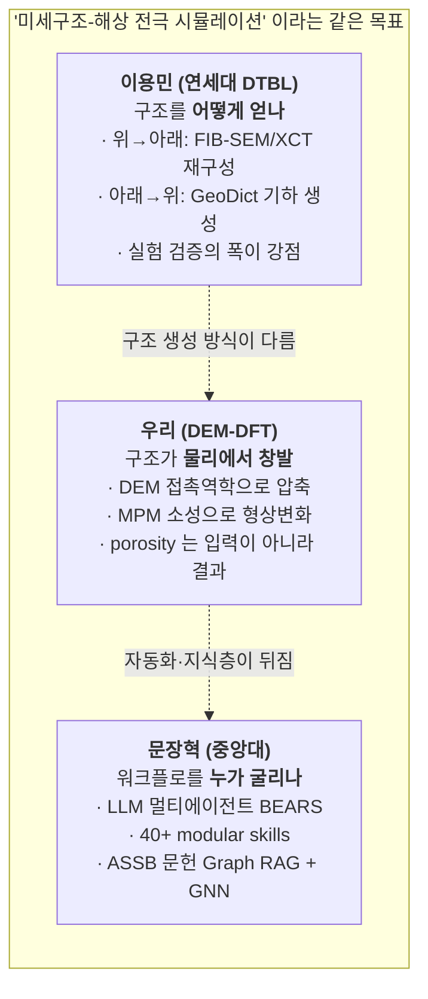
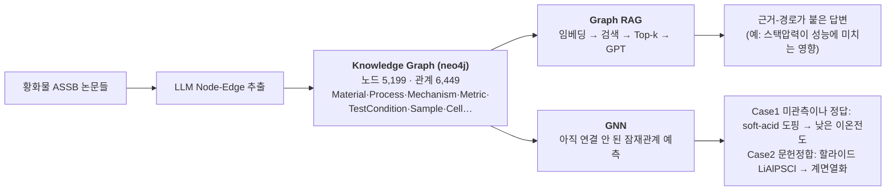
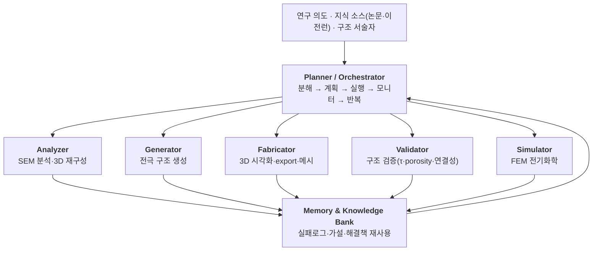

# 2026 전지기술 심포지엄 digest — 이용민(연세대) · 문장혁(중앙대)

**기계-판독 정본**: `docs/data/symposium_2026_kbs_db.json` (talks[] 에 append, `raw_notes[]` = 발표
내용 txt 수신 슬롯 — **둘 다 `open: true`, 닫지 않음**)
**작성 2026-07-28** · 자료 = 심포지엄 내지 PDF 2건 (이용민 44슬라이드 / 문장혁 39슬라이드)

> **한 줄 요약.** 두 발표는 우리 프로젝트의 **좌우 이웃**이다. 이용민 = *구조를 어떻게 얻고
> 검증하나*(디지털 트윈 전극, GeoDict 생성 + FIB-SEM/XCT 재구성, ASSE 조성까지 우리와 동일).
> 문장혁 = *그 워크플로를 누가 자동으로 굴리나*(LLM 멀티에이전트 BEARS + ASSB 문헌 Graph RAG).
> **우리 고유 위치는 그 사이** — 구조를 *기하 배치가 아니라 압축 물리(DEM+MPM)의 결과로* 만들고,
> 자동화는 이미 에이전트로 하고 있으나, **지식층(litdb)이 죽어 있다**(§4).

---

## 1. 왜 이 두 발표가 중요한가 (좌표 설정)

**세 진영이 같은 병목을 말한다**: 균질화(P2D)로는 국소 불균일을 못 본다 → 미세구조가 필요하다 →
그런데 미세구조를 얻는 게 비싸다(재구성 $5k+/스캔, 수 주) 또는 임의적이다(생성 시 형상 가정).
**우리 답이 바로 여기 있다**: 미세구조를 *찍지도 배치하지도 않고, 압축 시뮬레이션으로 만든다.*

---

## 2. 이용민 교수님 — AI를 활용한 전극 미세구조 디지털화 기술과 물리 기반 배터리 시뮬레이션

### 2-1. 발표 뼈대

디지털 트윈 = **Parameter(물성) + Governing Equation(물리) + Geometry(미세구조)** 삼각형. 이 중
**Geometry**가 가장 안 채워진 조각이고, 그 결과 두 개의 "가려진 것"이 생긴다:

| 가려진 것 | 무엇 | 예시 |
|---|---|---|
| **Blinded Scale** | 원자 스케일과 셀 스케일 사이의 meso/micro(전극) | — |
| **Blinded Parameters** | D_s, 활성표면적 a, 굴곡도 τ, 유효 전달계수 X_eff | 이온전도도: **소재 5.4×10⁻³ vs 셀 안 7.9×10⁻⁴ S/cm** (7배 손실이 어디서?) |

스케일 사슬을 논문으로 깔아둠: 입자(AEM 2023) → 전극/분리막(Small 2025, Nat. Commun. 2024) →
셀(J. Energy Chem. 2025) → 모듈/팩(eTransportation 2024). 리뷰는 ACS Energy Lett. 9 (2024)
5225-5239 (Supplementary Cover).

### 2-2. 구조를 얻는 두 길

**(a) Top-down 재구성** — FIB-SEM(고해상·소도메인·열손상) vs XCT(비파괴·대도메인·저해상).
FIB-SEM은 100회 반복 적층, voxel 100 nm. 문제는 **세그멘테이션**: BSE/SE/watershed 모두 오분할이
남고 ground truth는 수동(오라벨 가능) → 시간·인력 다대.

**(b) Bottom-up 생성 (GeoDict)** — ★**여기가 우리와 직접 겹치는 부분**:

| 항목 | 그들 값 |
|---|---|
| AM | NCM711, 4.44 g/cm³ |
| SE | LPSCl, 2.07 g/cm³ |
| 바인더 | NBR, 1.00 g/cm³ |
| 조성 (AM:SE:BD wt%) | **60:38:2 / 70:28:2 / 80:18:2** |
| 로딩 | 10 mg/cm² |
| **porosity** | **12.0 / 19.3 / 28.2 %** (AM 내부 기공 32.7%) |
| 온도 | 30 °C |
| 형상 규칙 | NCM711 2차입자=구(PSA 기반), 1차입자=볼록다면체 0.5~1.5 µm / LPSCl=구(PSA) / NBR="Add Binder Function"(접촉각 0, 이방성 1) |
| 경계 | periodicity, seed 1~5 |
| 출처 | J. Park, Y. M. Lee et al., **Adv. Energy Mater. 10 (2020) 2001563** |

검증: **용량 vs C-rate (0.1/0.5/1C) 시뮬 ↔ 실측** 근접 + C-rate 증가 시 NCM 비균일 충전상태 가시화.

계산비용: voxel 30~600 nm, 도메인 15~90 µm; **250M voxel = 약 50 GB / 2일**(Math2Market 제공).
프로덕션 예시는 50×50×50 µm / voxel 0.5 µm / 1M voxel.

### 2-3. 그들이 스스로 말한 한계 (우리에게 기회)

1. **이미징 왜곡** — 황화물은 대기 부반응, 고분자는 열손상. 무산소/저온 조건이 필요해 비싸고
   얻는 정보는 제한적. *(→ 우리는 애초에 이미징이 필요 없다)*
2. **미시 파라미터 획득의 어려움** — 개방형 전해질계(용매 증발→염농도 변화), 단일입자/마이크로
   전극 측정(Au ⌀10 µm 필라멘트, 펨토초 레이저 가공), 접촉 불안정(부피변화→이탈).
   *(→ 이건 그들이 우리보다 앞선 자산이기도 하다, §2-5)*
3. **양방향 피드백 루프** — 계산부하 때문에 물리↔디지털 실시간 통신이 느림.

### 2-4. 제조공정 디지털 트윈 + 캘린더링 검증 (그들의 최강 카드)

`mixing → coating → drying → calendering → infiltration → formation` 전 사슬. 대부분은 Franco
(ARTISTIC) 인용이지만, **캘린더링만은 그들의 자체 검증**이고 이게 강하다:

> J. Lim, J. Song, J. Park, Y. M. Lee et al., **Small 21 (2025) 2410485** — *가상 캘린더링 vs 실제
> 캘린더링*을 **5축**(porosity · 유효 전자전도도 · 이온 굴곡도 · NCM|pore 비표면적 · NCM|CBD 접촉
> 면적)으로, 전극 밀도 2.3~4.0 g/cm³ 전 구간에서 대조. 추가로 **PNM**(pore 등가반경·배위수)과
> **von Mises 응력분포 + 100/150 MPa 초과 부피분율 = 균열가능 부피%**.

또 하나: **CBD 이동** — 건조 중 용매 증발이 바인더·도전재를 위로 끌고 감(비균일). 해법으로 **2차
용매**(bulk 용매와 비혼화)가 입자 사이 모세관 구조를 만들어 이동을 억제(ACS Energy Lett. 10
(2025) 6223-6235), OWRK 식으로 부착일·계면에너지 정량 + DEM 슬러리 혼합 시뮬로 확인.

### 2-5. ★ 우리 vs 이용민 — 냉정한 대차대조표

| 축 | 우리 | 이용민 | 판정 |
|---|---|---|---|
| **구조 생성 원리** | DEM 접촉역학으로 실제 압축 → **porosity가 결과로 창발** | GeoDict 기하 배치, **porosity를 입력으로 지정** | ✅ **우리 우위** — 우리는 "이 압력이면 몇 %"를 예측, 그들은 "이 %를 만드는 배치"를 찾음 |
| **소성 변형** | MPM J2로 SE 형상변화·빈틈메움 (SEM 모폴로지 정합) | 구/다면체 강체 배치 — 냉간압축 변형 미표현 | ✅ **우리 우위** (그들 ASSE는 압축 물리가 없음) |
| **계산 비용** | 접촉망 Kirchhoff (FEM 대비 32-98×, Bazzoun 독립 입증) + GPU STEP4 | 250M voxel = 50 GB / 2일 | ✅ **우리 우위** |
| **전도 삼중** | σ_ion + σ_e + **σ_thermal** | 이온·전자 (열 미언급) | ✅ 우리 우위 |
| **첨가제 해상** | 9상 (VGCF/SuperP/SWCNT/SDCP/PTFE 개별) | ASSE는 AM/SE/NBR 3상 | ✅ 우리 우위 |
| **사이클 열화** | STEP5 R_int(N) 기전 분해(접촉~2% + 화학 CEI~98% + OTHER) | 발표에 없음 | ✅ 우리 우위 |
| **정직성 규약** | provenance 라벨 + 매스텝 보존 감사 + ASSUMED 구분 | 명시 없음 | ✅ 우리 우위(방법론 문화) |
| **실험 3D 재구성** | **전무** — 구조 100% 생성 | FIB-SEM 100적층 + XCT + AI 세그멘테이션 | ❌ **그들 우위** |
| **검증의 폭** | porosity·두께·coverage | 캘린더링 5축 + PNM + 응력 + 균열% | ❌ **그들 우위** |
| **제조공정 사슬** | 압축 한 스텝 | mixing~infiltration 전 사슬 | ❌ 그들 우위 |
| **미시 파라미터 실측** | 문헌 앵커 의존 (i0·D_s 부재가 우리 최대 미결) | 단일입자·마이크로전극 직접 측정 | ❌ **그들 우위 — 우리 급소** |
| **스케일업** | 전극 한 층 | 셀→모듈→팩 | ❌ 그들 우위(설계상 범위 밖) |

**요약**: *구조를 만드는 물리*는 우리가 앞서고, *구조를 찍고 재는 실험*은 그들이 앞선다.
정확히 상보적이라 **협업 시 서로의 급소를 메운다**(§5).

---

## 3. 문장혁 교수님 — AI 기반 배터리 연구 자동화: LLM 기반 연구 분석에서 AI-Agent 전극 모델링까지

### 3-1. 발표 뼈대

01 AI for Battery R&D (모니터링·상태추정·산업사례) → 02 **LLM & Knowledge Intelligence**
(Ontology→KG→Graph RAG) → 03 **Agentic AI** (오케스트레이터·MCP·모델피팅 에이전트) →
04 **BEARS** (전극 모델링 멀티에이전트 프레임워크).

### 3-2. ★ §02 — ASSB 문헌 Graph RAG (우리 litdb의 다음 단계 청사진)

**Graph RAG의 이점 3가지**(그들 정리): ① 구조적 검색(고립 텍스트 청크가 아니라 그래프 연결 근거)
② 다중홉 추론(숨은 링크) ③ 추적 가능한 답변(근거 경로 표시).

문헌 분석도: Li-air 5,680편 → 상위 1,000편 → PDF → GPT 추출로 **에너지밀도 질량기준 자동 정규화**;
ASSB는 임베딩·클러스터링으로 전해질 계열별 운전조건 분포 + T·P에 따른 I_c 예측면.

### 3-3. ★ §04 — BEARS: 전극 모델링 멀티에이전트

- **40+ Modular Skills**, **3단계 계층**: L1 메타데이터(YAML, 항상 로드 ~100토큰) / L2 본문
  (Markdown, 트리거 시 <5k) / L3 번들 파일(스크립트·데이터, 필요 시). ← **이건 Claude Skills 규격
  그 자체다. 우리가 이미 쓰는 도구의 학술적 정식화.**
- **단일 SEM 이미지 → 3D 입자 라이브러리**: U-Net + SAM 2 분할 → multi-view diffusion + LRM →
  FEM-ready 메시 → 클러스터링. (graphite, NMC811 시연)
- **시연 캠페인**: graphite, 30×38 µm, 8 mg/cm², 95:3:2 → **80개 가상 전극 자동 생성**(single/
  binary/gradient) → 대표 5개 전기화학 시뮬 → **3C에서 binary가 single 대비 약 3배 용량 유지**.
- **Battery-Sim-Agent**(ICLR 2026 심사중): 모델 파라미터 자동 피팅, 총 8,965.8 s, 최종 RMSE
  0.5513 / MAPE 2.4258.

### 3-4. ★ 우리 vs 문장혁 — 냉정한 대차대조표

| 축 | 우리 | 문장혁 (BEARS) | 판정 |
|---|---|---|---|
| **물리 솔버 소유권** | STEP3 Kirchhoff·STEP4 voxel-DFN을 **직접 구현·검증**(selftest·보존감사) | 상용/외부 FEM을 **오케스트레이션** | ✅ **우리 우위** — 솔버가 블랙박스가 아님 |
| **구조의 물리성** | DEM 접촉역학 + MPM 소성 | packing algorithm(기하) | ✅ 우리 우위 |
| **감사 규약** | 매 스텝 KCL·에너지·쿨롱 4중 + 하드페일 | Validator가 구조 지표 검증 | ✅ 우리 우위 |
| **ASSB 전용 깊이** | 황화물 ASSB 양극 전용 + 자체 실험 앵커 | 시연은 graphite 음극(액체계) | ✅ 우리 우위 |
| **에이전트 자동화 체계** | 킷 수동, 스킬 미정의 | 40+ skills·3계층·메모리뱅크·DOE 80구조 | ❌ **그들 우위** |
| **지식층(문헌)** | litdb 118장 **md 파일뿐** — 검색·그래프·webapp 연결 **전무** | KG 5,199노드 + Graph RAG + GNN | ❌ **그들 우위 — 우리 최대 격차** |
| **입자 형상 라이브러리** | 입자를 **구로 가정** | 단일 SEM → 3D 형상 복원 라이브러리 | ❌ 그들 우위 |
| **도구 연결(MCP)** | 수동 스크립트 | FreeCAD·시뮬레이터 직접 호출 | ❌ 그들 우위 |
| **모델 피팅 자동화** | 수동 파라미터 스윕 | Battery-Sim-Agent | ❌ 그들 우위 |

---

## 4. ★ litdb 실태 점검 (사용자 질문에 대한 직접 답)

### 4-1. 이용민 교수님 논문이 litdb에 들어가 있나 → **거의 없다**

- litdb 정본(`origin/claude/friendly-meitner-lldvar`): **128 파일 / 논문 카드 118장**
- **Yong Min Lee 언급 카드 = 3장뿐**, 그것도 전부 **실험·공정** 논문에 공저자로 등장:
  `kim2025_conductive_agent_se_coating_cathode` · `kim2026_iccf_molten_salt_sei_lpscl_sheet` ·
  `son2025_fivevolt_assb`
- **디지털 트윈 계보는 0장**: Park 2020 AEM 2001563(ASSE 생성) · Kim 2024 ACS EL 리뷰 ·
  Lim 2025 Small 2410485(캘린더링 검증) · Song 2023 AEM 2204328(FIB-SEM) · EES 2025
  3129-3147(단일입자) — **전부 미적재**
- 대신 경쟁 진영은 알고 있음: Ngandjong/Franco 10파일 언급, GeoDict 16파일 언급

> **판정**: 이용민 그룹은 "실험 논문 저자"로만 litdb에 있고, **우리와 가장 직접 경쟁하는 그들의
> DT 방법론 라인은 통째로 비어 있다.** 이번 심포지엄이 그 공백을 드러냈다.

### 4-2. 논문 에이전트 산출물이 webapp과 연결돼 있나 → **연결 안 돼 있다**

| 확인 항목 | 결과 |
|---|---|
| `webapp/app.py` 의 litdb 라우트 | **0개** |
| `webapp/app.py` 의 litdb 언급 | **0회** |
| scripts 에서의 참조 | `coating_presets.py`·`ml_design_loop.py` **주석에만** |
| 유일한 다리 | `docs/litdb_application_table.md` — 사람이 쓴 **정적 분석 문서** |

즉 litdb는 **다른 브랜치의 마크다운 더미**로 존재하며, webapp에서 조회·검색·인용이 **불가능**하다.
논문 에이전트가 만든 118장의 지식이 파이프라인과 **단절**돼 있고, 활용은 전적으로 "사람이 읽고
docs에 옮겨 적기"에 의존한다. 문장혁 교수님의 KG(5,199노드 + Graph RAG)와 비교하면 이게 우리
**가장 큰 구조적 격차**다.

---

## 5. ★ 우리가 가져올 것 (구체 훅, 우선순위 순)

| # | 훅 | 출처 | 왜 | 난이도 |
|---|---|---|---|---|
| **A1** | **litdb → 검색 가능한 지식층** (최소: webapp `/litdb` 라우트 + 전문검색; 목표: 노드-관계 추출 → Graph RAG) | 문장혁 §02 | 118장이 죽어 있음. 파이프라인이 문헌을 못 봄 | **중** (라우트 S, KG M) |
| **A2** | **Park 2020 ASSE 벤치마크 재현** — NCM711:LPSCl:NBR 60:38:2 / 70:28:2 / 80:18:2, 10 mg/cm², 30 °C 로 우리 DEM+MPM 을 돌려 porosity(12.0/19.3/28.2%)·용량-C rate 대조 | 이용민 §3 | **직접 대조 가능한 유일한 정량 벤치마크**. 그들 porosity는 *입력*, 우리 것은 *출력* → 맞으면 강력한 frame[4] 교차검증 | **중** (조성 세팅 + 런) |
| **A3** | **다축 검증 프로토콜 도입** — 압축 전후를 porosity·σ_e·τ·비표면적·접촉면적 5축으로 보고 | 이용민 §4 (Small 2025) | 우리 검증은 3축(porosity·두께·coverage). 지표는 **이미 다 계산 중**이라 보고 형식만 바꾸면 됨 | **S** |
| **A4** | **응력 + 균열가능 부피% 그림** — von Mises 분포 + 100/150 MPa 초과 부피분율 | 이용민 §4 | 우리 MPM 응력장 + Auerbach 취성이 **이미 있음**. 같은 그림을 그리면 직접 비교 가능 | **S** |
| **A5** | **PNM 지표 대조** — pore 등가반경 분포 + 배위수 | 이용민 §4 | 우리 A13 pore-PNM이 **이미 구현됨**. 축만 맞추면 됨 | **S** |
| **A6** | **프로젝트 전용 Skills 정의** (3계층: L1 YAML / L2 MD / L3 스크립트) — 킷 생성·런 회수·리뷰·digest | 문장혁 §04 | 우리는 Claude Code를 쓰면서 **프로젝트 스킬을 안 만들었다**. 토큰↓·신뢰도↑ | **중** |
| **A7** | **DOE 기반 구조 일괄 생성** — Sobol/DOE로 N개 설계 자동 생성 → 대표 선별 → 시뮬 | 문장혁 §04 (80구조) | 우리 `ml_design_loop.py`에 Sobol DOE가 **이미 있음**. 킷 생성과 배선하면 됨 | **중** |
| **A8** | **물리-임베디드 AI 프레이밍** — 우리 step6 surrogate를 그 용어로 정리 | 이용민 §4 / 문장혁 §01 | 우리 step6(쿨롱 정확 부기 + 잔차만 학습)이 **정확히 그 구조**. 서술만 정렬 | **S** |
| **A9** | **모델 피팅 에이전트** — 파라미터 추정 자동화(현재 수동 스윕) | 문장혁 §03 | i0·D_s·R_int 스윕이 수동. 앵커 확보 후 유용 | **중·후순위** |
| **A10** | **단일 SEM → 입자 형상** — 구 가정 대신 실제 형상 | 문장혁 §04 | 우리 DEM은 구 전용이라 **구조적 제약**. 장기 과제 | **대·연구트랙** |

### 5-1. 협업 시 서로 메우는 급소 (나중에 계획)

- **우리 급소 → 이용민이 가진 것**: i0·D_s 실측(단일입자/마이크로전극), FIB-SEM 실구조,
  다축 실험 검증. 우리 §14 TODO의 "앵커 대기" 상당수가 여기서 풀린다.
- **그들 한계 → 우리가 가진 것**: 압축 물리(그들 ASSE 생성엔 소성이 없음), 계산 속도(50GB/2일 vs
  접촉망), 사이클 열화 기전 분해, 첨가제 9상 해상.

---

## 6. 정직 메모 (§F1)

- 본 digest의 수치는 **슬라이드에서 직접 읽은 것만** 기록했다. 그래프만 있고 축 수치가 없는 것
  (예: Park 2020 용량-C rate 곡선의 정확한 값)은 **미디지타이즈**로 남겼다 — 필요하면 원논문에서
  추출한다.
- "우위/열위" 판정은 **발표 자료에 드러난 범위**에 대한 것이다. 미발표 자산이 있을 수 있다.
- BEARS의 정식 명칭 풀이(Battery Electrode Agent Research System)는 슬라이드에 명시되지 않아
  **추정**이다. 로고·문맥 기반.
- litdb 통계(118장·3장 언급·0 라우트)는 **2026-07-28 실측**이다.

---

## 7. 후속 수신 슬롯 (열어둠)

- `symposium_2026_kbs_db.json` → `talks[].raw_notes[]` : 발표 **내용 txt/녹취** 들어올 자리
- 추가 발표자는 `talks[]` 에 append (id 규칙 `<성씨><연도>_<주제>`)
- 이번에 드러난 litdb 공백(이용민 DT 5편)은 **논문 에이전트로 digest** 하면 정본 브랜치에 적재됨
  — CLAUDE.md litdb 정본 규칙(단일 서랍) 준수
