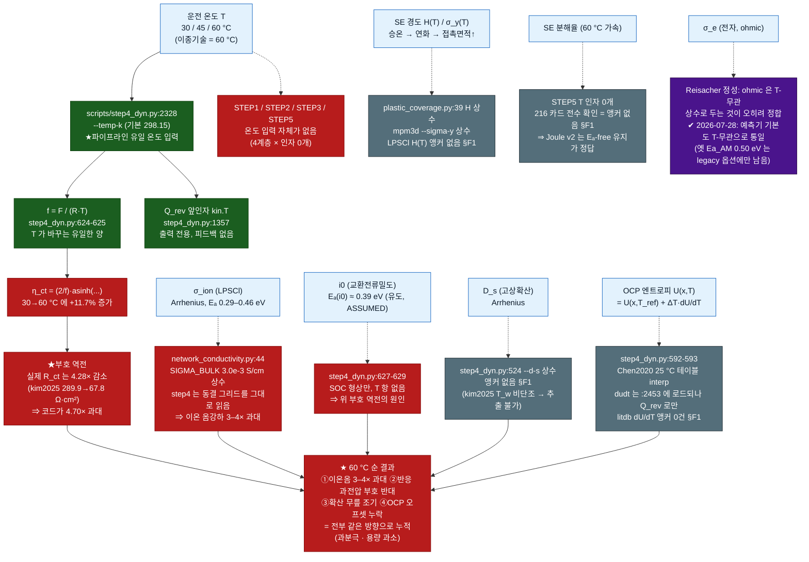

# 온도·압력 대응 능력 감사 (Temperature / Pressure Capability Audit)

작성 2026-07-28 · 근거 = STEP1~5 5계층 코드 전수 감사 + litdb 앵커 조사
대상 독자 = 이 파이프라인을 처음 만지는 대학원생 포함

---

## 1. 질문

사용자가 실제로 돌리는 셀의 운전조건은 다음과 같다.

| 축 | 실제 운전조건 |
|---|---|
| **압력** | 압밀(제조) 후 **구동 스택압 90 MPa 를 유지**한 채 사이클 |
| **온도** | **30 / 45 / 60 °C** 3점 (이종기술 셀은 **60 °C**) |

질문은 하나다 — **"우리 파이프라인이 이 조건을 표현할 수 있는가? 못 하면 어디까지, 어떻게 틀리는가?"**

여기서 반드시 구분해야 할 것: 우리 코드에 있는 유일한 압력은 **압밀압(제조압, 300 MPa)** 이고,
사용자가 말하는 90 MPa 는 **구동압(작동 스택압)** 이다. 둘은 물리가 다르다.
(리포 자체 문서가 이미 이렇게 적어 놓았다 — `docs/literature_review_dem_mpm_assb.md:70`
"압력 3종 구분 필수: 제조(300–490 MPa) ≠ 측정(40 MPa) ≠ 작동(5–70 MPa)")

---

## 2. 한 줄 답

> ⚠ **읽는 순서 (2026-07-28 개정).** §1–§8 은 **감사 시점(구현 전)의 진단**이며 원문을 보존한다.
> 그중 일부는 커밋 `d66fd144` 로 **이미 구현됐고**, 적대검증이 그 구현에서 다시 결함을 찾았다.
> **지금 코드가 무엇을 하는지 알고 싶으면 §9 "구현 상태" 부터 보라.** 아래 진단문 중 이미
> 바뀐 항목에는 `[→ §9 구현됨]` 표시를 달았다.

> **온도 — 입력구가 둘인데 서로 어긋난다(둘 다 위험).**
> ① **솔버 경로** `scripts/step4_dyn.py:2328 --temp-k` — 바꾸는 물리량은 `self.f = F/(R·T)`
>   (`:624-625`) **단 하나**. σ_ion·σ_e·κ·D_s·i0·OCP·열화율은 전부 상온 상수 → **거의 축퇴**되고
>   60 °C 에서는 반응 과전압의 **부호가 반대로** 나온다(§3).
> ② ★ **예측기 경로** `webapp/predictor_engine.py:587 temperature` — **UI 슬라이더로 노출돼 있다**
>   (`webapp/templates/predictor.html`, 233–373 K → `app.py /predictor/predict`).
>   **[감사 시점 = 2026-07-28 이전, 지금은 아님 → §9]** 여기서는 반대로 **미앵커 Arrhenius 가 과잉
>   적용**됐다: `Ea_SE=0.30 eV` / **legacy** `Ea_AM=0.50 eV`(**코드 주석에 'rough'**) → σ_ion 에 곱,
>   **σ_e 에도 곱**.
>   문제 셋 — (ㄱ) Ea_SE 0.30 은 본 문서 권고 밴드(0.29–0.46, 중앙 0.41) 안이지만 **규약(σ 형/σT 형)이
>   미정의**, (ㄴ) **σ_e 에 Arrhenius 를 거는 것 자체가 문헌 정성과 어긋난다**(Reisacher: ohmic 영역
>   T-무관 — 단 이 근거도 소재 불일치가 있어 §6-A T3-d 참조), (ㄷ) **솔버는 σ 를 안 바꾸는데 예측기는
>   크게 바꾼다** → 같은 온도에서 두 경로가 **다른 답**을 낸다.
>   **[→ §9 구현됨]** 셋 다 처리됐다: σ_ion 은 se_material 의 σ·T(Kraft) 규약·Eₐ 0.41 밴드로
>   솔버와 통일, **σ_e 는 기본 T-무관**(옛 동작은 `sigma_e_t_model='legacy_arrhenius'` 로만 재현),
>   그리고 **UI 가 무엇이 스케일되고 무엇이 안 되는지 화면에 적는다**(2026-07-28 적대검증 C-3 —
>   그 전까지 슬라이더는 그대로인데 σ_e 기본 동작만 바뀌어 사용자가 알 길이 없었다).
> ⇒ 30/45/60 스윕은 **솔버에서는 (STEP4 kinetics 가) 여전히 축퇴**, 예측기·STEP3·Stage-E 에서는
>   **σ_ion 만 정상 스케일**. 여전히 **전-물리 온도 스윕이 아니다**(§9-3).

> **압력 — 압밀압만 PARTIAL, 구동압은 NONE.** 압밀 목표압은 바꿀 수 있다
> (`dem_scripts/thin9_seed.liggghts:18 target_press`, `scripts/mpm3d_compaction.py:171 --target-gpa`).
> 그러나 **제하(unload) 단계가 코드 어디에도 없고**, 두 번째 압력 set-point 도 없다.
> ⇒ **"300 MPa 압밀 → 제하 → 90 MPa 유지" 는 현재 표현 불가능**하다.
> `--target-gpa 0.09` 는 "90 MPa 로만 압밀한 훨씬 성긴 처녀(virgin) 전극"이지 우리 셀이 아니다.

**전체 판정**: STEP1/2/3/4 = PARTIAL, STEP5 = NONE.

---

## 3. ★ 조용히 틀리는 지점 (SILENT WRONGNESS) — 이 문서에서 가장 중요한 절

### 3-1. 무엇이 "조용한가"

`python scripts/step4_dyn.py --temp-k 333.15 ...` 는 **정상 종료한다.** 로그에 `T=333.15 K` 를 찍고
(`step4_dyn.py:1245`), 내부 감사(에너지 보존·KCL·질량 보존)를 **전부 통과**하며
(이 감사들은 자기정합성 검사라 물성의 온도를 볼 수 없다), 경고를 **하나도 내지 않는다**
(`step4_dyn.py` 전체에 `T != T_ref` 가드가 없다). 그리고 **물리적으로 틀린 곡선**을 낸다.

게다가 STEP4 docstring `:15` 는 "✓ 온도 파라미터 T (등온; f=F/RT 전체 일관)" 이라 광고하고,
out-of-scope 목록 `:23` 은 열-전기 커플만 제외한다고 적는다 — **"σ/D_s/i0/OCP 에 Arrhenius 가 없다"는
말이 어디에도 없다.** 이 누락이 "알려진 한계"를 "조용한 오류"로 바꾼다.

### 3-2. 30 → 60 °C 에서 각 항이 어떻게 되는가

규약: 리포 채택 권고 = **σ·T = σ₀·exp(−Eₐ/k_B·T)** (Kraft 2017 eq 5).
Eₐ(이온) 밴드 = **0.29–0.46 eV** (중앙 0.41 eV, Reisacher 2023 STATED, 375 MPa 냉간압밀 = 우리 압력체제).

| # | 물리량 | 코드가 실제로 하는 것 | 코드의 30→60 °C 배수 | 물리/앵커가 요구하는 배수 | 오차 방향 | 순 영향 |
|---|---|---|---|---|---|---|
| ① | **f = F/RT** (BV Tafel 기울기) | `step4_dyn.py:624-625` — 솔버에서 **유일하게 T 를 따름** | **f ×0.9099** (38.280→34.828 V⁻¹, **30→60 °C**) | 맞음 (그 자체는 정확) | — | RT/F **26.12→28.71 mV** |
| ② | **η_ct (반응 과전압)** | ①만 움직임 → η_ct ∝ 1/f | **×1.099 (+9.9 % 증가)** | R_ct 289.9→67.8 Ω·cm² = **×0.234 (4.28배 감소)** | ★**부호 반대** | 코드가 **4.7× 과대**. 45 °C 에선 ~2.2× 과대 |
| ③ | **σ_ion (LPSCl)** | ~~`network_conductivity.py:44` 3.0e-3 S/cm **상수**~~ **[→ §9 구현됨]** `se_material.sigma_grain_S_cm(T)` 경유, `--temp-c` 로 스케일 (미지정 시 여전히 ×1.00 = 현행 전 코퍼스) | 기본 **×1.00** / `--temp-c` 시 밴드 배수 | ×2.47 (Eₐ 0.29) ~ **×3.74 (0.41)** ~ ×4.44 (0.46). kim2025 실측 R_ion 34.9→9.1 = ×3.84 | 기본값에서는 σ_ion **과소** (그대로) | 온도를 **주면** 해소, 안 주면 이온 옴강하 ~3–4× 과대 유지. **기본값을 바꾸는 것은 별도 결정** |
| ④ | **i0 (교환전류밀도)** | `step4_dyn.py:627-629` — SOC 형상만, T 항 **없음** | ×1.00 | Eₐ(i0) ≈ 0.39 eV (R_ct 에서 유도, **ASSUMED/TREND-only**) | i0 과소 | ② 의 원인. 단독 앵커 없음(§F1) |
| ⑤ | **D_s (고상확산)** | `step4_dyn.py:524` `--d-s` 상수 | ×1.00 | **앵커 없음(§F1)** — kim2025 T_w 가 비단조(2929→1208→2350 s)라 추출 불가 | η_diff 과대 | 확산 무릎이 실제보다 **일찍** 나타남 → 용량 과소 |
| ⑥ | **OCP U(x)** | `step4_dyn.py:592-593` — Chen2020 25 °C 테이블 `np.interp`, dU/dT 미적용 | 0 mV | U(x,T)=U(x,T_ref)+(T−T_ref)·dU/dT | x-의존 오프셋 | **litdb dU/dT 앵커 0건(§F1)**. 감사 언급 order(0.05–0.4 mV/K)×35 K = 2–14 mV, 미앵커 |
| ⑦ | **σ_e (전자)** | `network_conductivity.py:47` 0.05 S/cm 상수 | ×1.00 | Reisacher 정성: **ohmic 영역은 T-무관** (CM-4 33.50 Ω @25 °C vs 43.89 @65 °C, 무상관) | 사실상 **무해** | 2C 전자 옴 0.01–0.03 mV. ⚠ 서로게이트 불일치(**이전** `Ea_AM=0.50 eV`, 'rough')는 **[→ §9 구현됨]** — 예측기 기본이 T-무관으로 바뀌어 솔버와 일치. 옛 값은 `legacy_arrhenius` 로만 재현 |
| ⑧ | **κ (열)** | `network_conductivity.py:84-85` 상수 | ×1.00 | 포논 = 약한 T 의존 | 최하위 | Joule hot-spot 맵 색만 약간 틀림 |
| ⑨ | **SE 소성상수 H/σ_y** | `plastic_coverage.py:39 H_REAL_SE=0.85 GPa` 상수, `:280 A_tabor=F/H` | ×1.00 | 승온 → 연화 → H↓ → A↑ → porosity↓ | porosity **과대**, coverage **과소** | LPSCl H(T) **앵커 없음(§F1)**. 코드 자체 감도로 상한: MPM σ_y −17 % → porosity −1.0 %p, −33 % → −3.3 %p |
| ⑩ | **크리프 / 시간축** | hooke/hysteresis 및 MPM J2 모두 **rate-independent** (`step2` return map `:1332-1337`) | 없음 | 60 °C × 90 MPa × 수백 시간 = 크리프 지배 구간 | 치밀화 **과소** | 구조적 부재 — 파라미터 문제가 아님 |
| ⑪ | **SE 분해율 (STEP5)** | Arrhenius 없음, 끝점 앵커만 | ×1.00 | **앵커 없음(§F1)** — 216 카드 전수 재확인 | — | Joule v2 를 **Eₐ-free 재분배기**로 설계한 결정이 재확인됨 |

### 3-3. 가장 위험한 3개 (요약)

1. **② 부호 역전.** `--temp-k 333.15` 를 넣으면 코드는 반응 과전압을 **더 크게** 낸다.
   실제 R_ct 는 30→60 °C 에 **4.28× 감소**(kim2025, 우리 랩·우리 소재계 실측)해야 한다.
   ⇒ 사용자가 30/45/60 스윕을 돌리면 `eta_kin_mean` 이 **온도에 따라 단조 증가**하는 것을 보게 되는데,
   이는 실험과 정확히 반대다. **"온도를 반영했다"는 인상을 주면서 반대 답을 내는 것**이 가장 나쁘다.

2. **③ σ_ion 상온 고정 → 이온 옴강하 3–4× 과대.**
   우리 헤드라인 신호는 SBE↔DBE **9.3 mV** 인데, 이 오차는 **55–65 mV** — 신호의 **6–7배**다.
   더 나쁜 것은 ②③⑤⑥ 이 **전부 같은 방향(과분극·용량 과소)** 이라 상쇄되지 않고 누적된다는 점이다.

3. **압력 축의 축 혼동 + 계층 간 무라벨 전달.**
   ㄱ) STEP4 가 푸는 형상은 `--protocol hold` 로 만든 **"프레스 최고점의, 한 번도 제하되지 않은" 베드**다.
   90 MPa 운전 셀 대비 접촉면적·coverage·σ 를 **과대**한다.
   ㄴ) `build_metrics_db.py:146,156` 이 **압밀압**을 `stack_pressure_MPa` 라는 이름으로 저장한다.
   'stack pressure' 는 통상 구동압을 뜻하므로 하류에서 300 MPa 를 90 MPa 로 오독할 소지가 있다
   (ML 피처 `press_MPa` 경로 `ml_cycle_surrogate.py:26` 이 같은 이름을 쓴다).
   ㄷ) **A-1 사이클 앵커가 300 MPa 로 재압된다** (`mpm_input_from_case.py:951-964`, `__PRESS__`=press_gpa).
   실제 셀은 90 MPa 로 사이클하는데 모델은 **3.3× 응력**으로 debond 를 다시 눌러 붙인다
   → 접촉 손실과 R_ct 성장을 **과소예측**(= 접촉 유지에 대해 너무 낙관적).

### 3-4. 완화 요인 — 정직하게

> ⚠ **§3-3 의 "오차가 신호의 6–7배" 와 아래 "완전히 상쇄되어 무해" 는 모순이 아니다 — 서로 다른
> 양을 말한다.** 정확히는:
> - **같은 온도 안에서의 상대비교**(SBE vs DBE, AM% 스윕, 조성 트렌드) → σ_grain 이 **양쪽에 같은
>   배수로 곱해지므로 상쇄** = 무해. 우리 헤드라인 9.3 mV 는 이 범주이며 **영향받지 않는다.**
> - **절대 과전압·용량**, 그리고 **온도 자체를 축으로 한 비교(30 vs 45 vs 60)** → 상쇄 안 됨.
>   55–65 mV 오차는 **여기에** 해당한다.
> - **탄소(Eₐ≈0)와 SE/AM(Eₐ>0)이 섞인 조성 간 비교** → 배수가 상마다 달라 **부분 상쇄만** = 위험.

- **σ_grain 은 순수 곱셈 prefactor**다 (`network_conductivity.py:1003` 이 σ_bulk 에 완전 선형).
  ⇒ 위 첫 번째 범주에서 **완전 상쇄**. 망 위상(무차원 `sigma_full`)은 T 와 무관하게 옳다.
- ⚠ **단 "원-라인 수정"은 사실이 아니다.** σ_grain=3.0 은 리포 전역에 **중복 하드코딩**돼 있고, 그중
  하나는 CLAUDE.md 가 PRODUCTION σ_ionic 형(LOOCV 0.975)이라고 못박은 스케일링-법칙 경로다
  (`generate_comparison_plots.py:4249 SE_SG` → `:4302 _sat_baselog` → 호출부 4개). 이 경로는
  `network_conductivity.SIGMA_BULK_DEFAULT` 를 **참조하지 않으므로 `:44` 를 고쳐도 안 바뀐다.**
  그 밖에 `voxel_conductivity.py:99,289` · `mpm_webapp_payload.py:309-310` · `step3_sigma.py` ·
  `physics_surface_contact_fit.py:41` · `triage_cases.py:35` · `verify_case.py:32` ·
  `build_tau_regime_db.py:28` · `export_comsol_2d.py:48` · `fit_constrained.py:45` ·
  `screening_ionic_thin_focus.py:23` · `analyze_network_results.py:150,166` 등 다수.
  ⇒ 올바른 구현은 **단일 공유 모듈**(예 `scripts/se_material.py` 에 `SIGMA_GRAIN_MS_25C=3.0` +
  `sigma_grain(T)`)을 두고 위 사이트를 import 로 치환하는 것이다. 그래야 "기본값 미지정 시
  bitwise 불변" 규약을 **전 경로에서** 보장할 수 있다.
  **[→ §9-2 부분 구현]** `se_material.py` 가 만들어졌고 **프로덕션 경로는 전부 치환됐다**
  (network_conductivity · step3_sigma · voxel_conductivity · mpm_webapp_payload ·
  generate_comparison_plots `SE_SG` · predictor_engine · **webapp/app.py 7곳**).
  ⚠ 그러나 **오프라인 분석 스크립트에는 아직 bare 3.0 이 남아 있다** — 정확한 잔존 목록은
  **§9-2 표**에 있다. `se_material.py` 헤더의 "SINGLE SOURCE OF TRUTH" 문구는 그 잔존분까지
  포함해 읽으면 **아직 리포 전체에 대해서는 참이 아니다**(프로덕션 경로에 대해서는 참).
- 무너지는 것은 (a) **절대 과전압/용량**, (b) **온도 자체를 축으로 한 비교(30 vs 45 vs 60)**,
  (c) 탄소(Eₐ≈0)와 SE/AM(Eₐ>0)이 **섞인 조성 간 비교** 세 가지다.
- 압력도 마찬가지로 **Doux 2020 §8** 이 방어해준다: "펠릿은 이미 370 MPa 로 cold-press 되어 있으므로
  5–75 MPa 스택압은 펠릿 자체를 더 압밀하지 않는다." 우리 **300 ≫ 90** 도 같은 논리 → **porosity·두께를
  300 MPa 값으로 쓰는 것은 (그 조건 하에서) 정당**하다. 문제는 **접촉면적·coverage·σ** 쪽이다.

---

## 4. 계층별 현황 표

| 계층 | 온도 | 압력 | 근거 (파일:라인) |
|---|---|---|---|
| **STEP1 DEM** | **NONE→PARTIAL [→ §9]** — DEM 자체(LIGGGHTS)는 여전히 온도 인자 0개. 다만 그 위의 σ 솔버는 `network_conductivity.py --temp-c`, 프로덕션 Stage-E 는 `run_network_full_corrections.py --temp-c` 로 σ_ion 만 스케일된다(미지정 = 현행). 감사 시점 원문: NONE — 온도 인자 0개. LIGGGHTS 입력 9개 전수 grep 에 thermostat/heat/temperature fix **없음**; 파이썬 DEM 13파일 `temperature\|kelvin\|arrhenius\|298.15` **0 hit** | **PARTIAL** (압밀만) — `target_press` 가 유일 노브, 배선은 온전 | `dem_scripts/thin9_seed.liggghts:18,59-60,147-160` · `network_conductivity.py:44,47,84-85,1003,1113-1123` · `plastic_coverage.py:34-39,280` |
| **STEP2 MPM** | **NONE** — parse_args ~60 플래그 중 T 0개; metrics JSON 에 온도 필드 **없음**(⇒ 하류가 몇 °C 형상인지 알 수 없음) | **PARTIAL** (압밀만) — `--target-gpa` 1개 set-point. 제하·이력·restart **전부 없음** (`F[p]=I` 리셋) | `mpm3d_compaction.py:113-424,171,225,1260-1261,1332-1337,1458-1474,1556-1577` · `mpm_input_from_case.py:313-322,883,951-964` |
| **STEP3 transport** | **PARTIAL [→ §9]** — `step3_sigma` / `voxel_conductivity` / `mpm_webapp_payload` 가 se_material 경유 + `--temp-c`, 출력에 `temperature_provenance`(T_ref/Eₐ/배수/규약) 기록. **σ_ion 만** — σ_e/κ 는 여전히 상수. 감사 시점 원문: NONE — 3파일 T 인자 0개 | **NONE** — 압력 인자 0개. 압력은 **동결된 형상(δ·contact_area)** 으로만 상속 | `network_conductivity.py:1112-1125,195-211,238-260,341-358` · `step3_sigma.py:44-45,155,354-357,448,704,1058-1068` · `voxel_conductivity.py:98-102` · `mpm_webapp_payload.py:309-310,891` |
| **STEP4 echem** | **PARTIAL (거의 장식)** — `--temp-k` 존재하나 `f=F/RT` 와 Q_rev 앞인자에만. kit/webapp 노출 **안 됨** → 코퍼스 전체에서 temp_k 는 **비트-상수** | **NONE** — press/stack/MPa grep 전부 false positive. 구조 입력은 동결 복셀 | `step4_dyn.py:2328,621-636,592-593,524,1357,1463,2412-2419,2306,2318,2327` · `step6_surrogate.py:391` · `build_metrics_db.py:77,146,156` |
| **STEP5 degradation** | **NONE** — 4파일 T 인자 0개, 출력에 T 필드 0개(구별 불가). ★리포가 `rint_eis_anchors.csv` 에 **temp_C 컬럼을 이미 갖고 있는데** scripts/webapp 전체 `temp_C` grep **0 hit** | **NONE** — MPa 입력 0개. `--recontact/--rewet-frac` 은 무차원 프록시이며, **실측상 partial ≡ forbid** (아래 참조) | `cycle_contact_ledger.py:204,232,292-307,339-350,599-668,624-632` · `b1_chem_fade.py:24-37,71,74,278-298,313-315` · `rint_cycle_traj.py:38-54,123-132` · `joule_redistribute.py:5-20` |
| ★ **STEP6 predictor / 서로게이트** | **PARTIAL — 규약 통일됨 [→ §9]**. σ_ion = se_material σ·T(Kraft) · T_ref 25 °C · Eₐ 0.41 밴드(솔버와 동일). **σ_e 는 기본 T-무관**(솔버·Reisacher 정합); **이전** 동작인 `Ea_AM=0.50 eV`('rough' 주석)는 `sigma_e_t_model='legacy_arrhenius'` 로만 재현된다. UI 가 스코프를 고지(2026-07-28 C-3). ⚠ **잔존**: `sweep_optimal`(Find Optimal Design)은 predict() 에 temperature 를 넘기지 않아 **항상 298 K** — UI 에 명시함 | **NONE** — 압력은 설계 피처로만(`ml_cycle_surrogate.py:26 press_MPa`), 물리 경로 없음. ⚠ 그 피처가 받는 값은 **압밀압**인데 이름이 `stack_pressure_MPa`(`build_metrics_db.py:146,156`) | `webapp/templates/predictor.html:88-91,529` · `webapp/app.py:9746` · `webapp/predictor_engine.py:587,599,705-714,734,897` · `webapp/pybamm_predictor.py:20` · `scripts/ml_cycle_surrogate.py:26` |

### 4-1. STEP5 압력 프록시가 실제로 작동하지 않는다 (실런 확인됨)

같은 베드 N=100 측정: `forbid` f_broken = 0.0419 / `partial frac=0.5` → **0.0419** /
`frac=0.9` → **0.0419** / `elastic` → 0.0000.
즉 (0,1) 구간 **전체가 forbid 로 수렴**한다. 원인 3줄:

1. `gap_um` 이 루프 **밖**에서 1회만 계산되어 N 에 대해 정적 (`cycle_contact_ledger.py:232`)
2. `brk_now` 가 매 사이클 같은 정적 조건을 재평가 (`:292`)
3. 재습윤이 `brk_now` 만 지우고 `dmg` 를 리셋하지 않음 (`:300-305` vs `:295`) → `dmg≥1` 이 다음 사이클 즉시 재발화

⇒ 재습윤은 "치유"가 아니라 **1사이클 집행유예**다. 스택압 프록시가 사실상 **이진**
(forbid=완전열화 / elastic=무열화)이며, **90 MPa 를 튜닝된 분율로도 표현할 수 없다.**

부수 발견: `--fatigue miner` 기본에서 큰 N 의 결과가 **δ_cr 과 무관**해진다(δ_cr 100→59→48 nm 에서
N=100 f_broken 동일). 점근 열화는 `sign(gap)=sign(r·ε−ov0)` 즉 **오직 압밀 겹침 ov0** 가 지배
→ **운전압 누락이 점근값의 단일 지배 인자**가 된다.

### 4-2. 90 MPa 제하가 왜 레짐을 바꾸는가 (리포 자체 수치)

⟨δ⟩ = 73.9 nm @ 300 MPa (`docs/esse_calibration_2mAh_real_9.md`, E_SE=1.35).

> ⚠ **방법론 경고 (적대검증 HIGH 반영).** 아래 41–52 nm 수치는 **하중(loading) 법칙**
> (Hertz δ∝P^{2/3} · 선형 δ∝P)을 제하(unloading)에 그대로 적용한 **1차 어림**이다. 우리 접촉모델은
> **hooke/hysteresis** 라 제하 경로가 **다른 강성 k₂** 를 따르고(회수율: AM-AM 67 % / AM-SE 33 % /
> SE-SE 20 %, `docs/dem_perturbation_layer.md`), 소성-깊이 미달 접촉은 **전탄성 분기**로 빠진다
> (`dem_perturbation.py:198-199`). ⇒ **실제 재개구량은 이 어림과 다르며, 방향(재개구가 일어난다)만
> 신뢰**해야 한다. 정량값은 `dem_perturbation.py --driver springback` 을 **부분 제하로 확장해 실제로
> 한 번 돌려야** 나온다(§6-B P2-a). 아래 숫자는 그때까지 **ASSUMED 브래킷**으로 읽을 것.

(어림) 90 MPa 로 탄성회복 시 **41 nm**(Hertz) ~ **52 nm**(선형) 다시 열린다
= δ_cr(=100 nm, Bucci) 판정기준의 41–52 %, 평균 겹침의 55–70 %.

★ **레짐 전환 가설**: AM_S(r=2 µm) 접촉은 300 MPa 에서 gap = **−39.9 nm (CLOSED = 영구 면역, 손상 0)**
인데, 위 어림대로면 90 MPa 에서 **+0.9 ~ +11.8 nm (OPEN → 매 사이클 Miner 누적 → 결국 파단)** 이 된다.
즉 **소립 AM 집단 전체가 '불멸'에서 '열화'로 바뀔 수 있고, 코드엔 그 상태를 표현할 수단이 없다.**
⚠ 이 전환은 **재개구량이 gap 문턱을 넘느냐**에 달려 있으므로, 위 방법론 경고가 그대로 적용된다 —
**실제 springback 런 전까지는 "가능성" 이지 "확정" 이 아니다.** (그러나 확정되면 STEP5 결론이 바뀐다.)

---

## 5. 온도가 물리적으로 영향을 주는 경로 — 잇힌 선 / 끊긴 선



**범례** — 초록 = 실제로 잇혀 있고 그 자체는 옳음 · 빨강 = 끊겨 있고 **앵커가 있어 지금 고칠 수 있음** ·
회색 = 끊겨 있고 **앵커가 없음(§F1, 훅만)** · 보라 = 상수로 두는 것이 오히려 정합 · 파랑 = 물리 소스.

압력 쪽도 같은 그림이 그려지는데, 훨씬 단순하다 — **압력이 물리에 들어가는 통로는 오직 하나**,
`δ(overlap) → A_physics → R_Holm → σ` 이며(`network_conductivity.py:238-260,341-358`),
그 δ 는 **300 MPa 프레스 최고점에서 동결**되고 제하 경로가 없다.

---

## 6. 구현 설계

### 6-A. 온도

#### T1 — 앵커 있음, 바로 가능 (기본값은 현행 유지 = bitwise 불변)

| ID | 내용 | 앵커 | 난이도 |
|---|---|---|---|
| **T1-a** ✔**구현(부분)** | **T_ref 규약 명문화 + provenance 필드.** 모든 σ 테이블/metrics JSON 에 `T_ref_C: 25`, `T_C: <운전T 또는 null>`, `T_dependence: NOT_MODELLED\|ARRHENIUS`, `Ea_ion_eV` 를 찍는다. STEP2 metrics(`:1556-1577`), STEP3 σ 테이블(`mpm_webapp_payload.py:891`), STEP5 anchors dict(`cycle_contact_ledger.py:339-350`), b1_chem_fade(현재 JSON 자체를 안 씀) 전부. | 불필요 (정직화) | 낮음 |
| **T1-b** ✔**구현** | **σ_ion Arrhenius 배선.** 단일 CLI `--temp-c <℃>` (기본 `None` = 현행 그대로). 규약 = **σ·T = σ₀·exp(−Eₐ/k_BT)** (Kraft 2017 eq 5 — σ 형과 30→60 배수가 ~10 % 다르므로 규약 고정이 필수). ⚠ **적용점은 한 곳이 아니다** — σ_grain=3.0 이 리포 전역에 중복 하드코딩(§3-4 목록). 특히 PRODUCTION σ_ionic 스케일링 법칙 경로(`generate_comparison_plots.py:4249 SE_SG`)는 `network_conductivity` 를 참조조차 안 한다. **올바른 구현 = 단일 공유 모듈**(`scripts/se_material.py` 에 `SIGMA_GRAIN_MS_25C` + `sigma_grain(T)`) 도입 후 전 사이트 import 치환. | **Reisacher 2023 Eₐ=0.41 eV (STATED)**, 375 MPa 냉간압밀 = 우리 300 MPa 체제 → 전이 정당 | **중** (사이트 수 때문) |
| **T1-c** ✔**구현** | **Eₐ 밴드 스윕 인자** `--ea-ion-ev` (기본 0.41, 권장 스윕 0.29 / 0.46). **단일값 사용 금지 규약**을 help 에 명시. | Reisacher 0.41 / Ma 2024 0.29 / Kraft 0.44–0.46 | 낮음 |
| **T1-d** | ★ **부호-역전 가드.** `--temp-k` 가 T_ref 에서 벗어났는데 i0/D_s Arrhenius 가 꺼져 있으면 **hard warning + meta 플래그**(`kinetics_T_scaling: NONE`), 옵션으로 실행 차단(`--allow-unscaled-T`). 이것만으로도 §3-3 ①번 위험이 사라진다. | 불필요 (정직화) | 낮음 |
| **T1-e** ✔**구현** | **서로게이트↔솔버 규약 통일.** `predictor_engine.py` 의 **이전** Ea_SE 0.30 / Ea_AM 0.50('rough')를 솔버 규약(σ_ion 0.41 밴드, σ_e = T-무관)으로 교체 — **완료**. 옛 동작은 `sigma_e_t_model='legacy_arrhenius'` 로 재현 가능하고 응답 JSON 이 어느 모델을 썼는지 항상 기록한다. UI 고지는 2026-07-28 C-3 에서 추가. | 위와 동일 | 낮음 |

**T1-b 의 σ 배수 (T_ref 를 어디에 두느냐에 따라 — 그대로 쓸 수 있는 숫자)**

| 규약 | Eₐ | 45 °C | 60 °C |
|---|---|---|---|
| σT 형, T_ref = **30 °C** | 0.29 | ×1.61 | ×2.47 |
| σT 형, T_ref = **30 °C** | **0.41 (권장 기본)** | **×2.00** | **×3.74** |
| σT 형, T_ref = **30 °C** | 0.46 | ×2.19 | ×4.44 |
| σ 형(앞인자 없음), T_ref = 30 °C | 0.41 | ×2.10 | ×4.11 |
| σT 형, T_ref = **25 °C** (Minnmann 1.6 mS/cm 앵커용) | 0.41 | ×2.56 | ×4.79 (30 °C 는 ×1.28) |

> ⚠ **T_ref 는 우리가 내려야 할 규약 결정이지 앵커가 아니다.** 우리 σ_grain=3.0 mS/cm 의 출처
> (Cronau 2021)는 **전 데이터 RT 단일·Arrhenius 없음** → "3.0 이 몇 °C 값인가"가 미정의다.
> **권고 = T_ref 를 25 °C 로 명시 고정**하고(Minnmann 2021 LPSCl bulk 1.6 mS/cm @25 °C, 380 MPa 제조,
> 온도·압력이 동시 명시된 드문 케이스), 3.0 은 그 25 °C 규약 하의 단결정-라벨 prefactor 로 재기술한다.

> ★ **적용 위치에 관한 물리 노트.** kim2025 는 σ_ion 의 온도의존이 **대부분 GB 몫**임을 보인다
> (R_i,gb 25.6→3.1 Ω·cm² vs R_i,bulk 9.3→6.0). 물리적으로 옳은 자리는 `Cronau(r_SE)` GB 인자다.
> 그러나 `σ_grain × Cronau(r_SE)` 는 곱이므로 **전역 스칼라 하나를 어디에 곱하든 결과가 동일**하다
> → T1 에서는 prefactor 에 곱하고(간단), **r_SE-의존 Eₐ 는 T2 로 미룬다.**

#### T2 — 앵커 조건부 (값은 있으나 조건이 달라 **스윕 전용**)

| ID | 내용 | 앵커 상태 | 라벨 |
|---|---|---|---|
| **T2-a** | **i0(T)** — `--ea-i0-ev` 도입. 후보값 = Eₐ(R_ct) **0.42 eV**(uncoated NCM811/LPSCl 72 wt%) 또는 **0.31 eV**(LNO-coated 62 wt%). i0 = RT/(nF·R_ct·a_s) 관계로 Eₐ(i0) ≈ Eₐ(R_ct) − k·T̄ ≈ **0.39 eV**. | kim2025 **3점 회귀 유도값 = TREND-only, 절대 인용 금지**. R_ct 는 계면 화학상태도 반영 → 순수 kinetics Eₐ 로 읽으면 과대. LNO-coated 는 45→60 이 거의 평탄 = **Arrhenius 가정이 코팅계에서 이미 깨짐** | ASSUMED, 스윕 전용 |
| **T2-b** | **Eₐ 의 r_SE 의존 (GB 몫).** bulk Eₐ 0.22–0.26 eV(MLIP-MD) ≪ 실험 GB포함 0.29–0.46 → 초과분 = GB. sub-µm SE 는 GB 밀도가 높아 Eₐ 가 커야 한다. | kim2025 분리 실측(bulk 0.13 / gb 0.61 eV)은 **bulk 값이 이상치**(MD 0.22–0.26 대비 비정상 낮음, 3점 TLM 피팅 노이즈 의심) | 방향만, 값 스윕 |
| **T2-c** | **SE σ_y(T)/H(T)** — MPM `--sigma-y` 스윕으로 온도-연화 브래킷. 방향은 확정: 온도↑ → σ_y↓ → 압밀↑ → porosity↓ / coverage↑ / 두께↓. | lee2025 카드 "온도↑→σ_y↓→압밀↑(Bouvard 2000과 같은 결)" = **방향만**. **크기 앵커 없음**. 코드 자체 감도(σ_y 0.30→10.0 %, 0.25→9.0 %, 0.20→6.7 %, 0.15→5.6 %)로 상한만: 10–20 % 연화 → porosity **0.6–2 %p** ⇒ **DEM↔MPM 1.2 %p 신뢰한계를 통째로 잡아먹는다** | 스윕 전용 |
| **T2-d** | **PTFE 모듈러스(T)** — PTFE 함유 레시피에서만. 저장탄성률 30→120 °C **−67 %**(~150→50 MPa, DMA), triclinic→hexagonal 전이 **19/30 °C**. 현재 `mpm3d_compaction.py:910` 은 0.30 GPa / σ_y 0.05 **단일 상수**. 사용자 30/45/60 °C 창이 이 전이 바로 위에 있다. | lee2025 / mun2025 STATED (단 DMA 창이 30–120 °C) | 조성-조건부 |
| **T2-e** | **κ(T)** — 최하위. 포논 = 약한 T 의존, 부호도 반대일 수 있음. | 없음 | 보류 |

#### T3 — 앵커 없음 (§F1) : **훅만 만들고 값 미지정**

| ID | 내용 | 조사 결과 |
|---|---|---|
| **T3-a** | **D_s(T)** — `--ea-ds-ev` 훅만, 기본 `None`(미적용). | kim2025 R_w 는 온도 추세가 있으나 **T_w(=L²/D)가 비단조(2929.3→1207.5→2350.0 s)** → D_s Eₐ 추출 **불가**. Trevisanello / Kang2025 / Song2025 전부 **단일 온도 고정**. |
| **T3-b** | **OCP dU/dT** — `--dudt-csv` 훅은 **이미 있다**. 값이 없으므로 `dudt=None → Q_rev=NaN` 이 **현재 동작이 정직한 상태 → 그대로 유지**. | litdb 216 카드 전수 grep: `dU/dT`·`dUdT`·`∂U/∂T`·`dOCV/dT`·`엔트로피 계수` **값 0건**. 유일 언급은 발열 항목 *목록*뿐. ⇒ NMC811 dU/dT 실측 논문 **신규 digest 필요**. |
| **T3-c** | **60 °C 황화물 SE 분해 가속** — Joule hot-spot v2 의 **Eₐ-free 재분배기** 설계를 **유지**. | 프로젝트 기존 판정(2026-07-23)이 **독립 재확인**됨. 존재하나 **틀린 양**: wang2022 DSC 250–800 °C(운전창의 5–6배), kim2025 Eₐ 0.42 eV(=전하이동 kinetics, 분해율 아님), ma2024 0.29→0.57 eV(=수분 가수분해), yang2025(도핑체 단독 30 cyc), koo2025(액체계). 불가피하면 라벨된 ASSUMED 스윕(Eₐ 0.4–0.9 eV)만. |
| **T3-d** | **σ_e(T) / σ_thermal(T)** — 훅만. **σ_e 는 T-무관으로 두는 것이 문헌 정성과 일치**(Reisacher: ohmic 영역 T-무관, 오히려 CM-3 는 T↓→R↓ 로 부호 반대). | 정량 앵커 없음, 정성만. |
| **T3-e** | **C_dl(T)** — v3-1 EIS/DRT 의 C_dl 을 온도함수로 만들 근거 없음. 온도별 개별 피팅값으로만. | kim2025 CPE: 대칭셀 4.8→5.2→5.7 µF vs 풀셀 84.2→64.2→45.3 µF — **부호가 반대**, η(CPE 지수)도 함께 변함 → 단일 온도법칙 불가. |
| **T3-f** | **σ(P,T) 교차항** — 온도곱 × 압력곱을 단순 곱셈으로 결합하는 것은 **미검증 가정**. | 온도 앵커는 전부 단일 압력(Reisacher 375 / Kim2025 250–433 / Minnmann 380 MPa), 압력 앵커는 전부 단일 온도(Bazzoun, Cronau) → **교차면이 litdb 에 0건**. 결합 시 ASSUMED 라벨 필수. |

### 6-B. 압력 — "압밀 300 → 제하 → 90 유지" 를 표현하려면

#### P1 — 앵커 있음, 바로 가능

| ID | 내용 | 앵커 |
|---|---|---|
| **P1-a** | **압력 provenance + 명명 정리.** 모든 산출물에 `P_fab_MPa` 와 `P_operating_MPa`(또는 `NOT_MODELLED`)를 분리 기록. `build_metrics_db.py:146,156` 의 `stack_pressure_MPa` → `fab_pressure_MPa` 로 개명(하위호환 alias + deprecation 경고). ML 피처 `press_MPa` 경로도 동일. | 불필요 (정직화). 근거 = `docs/literature_review_dem_mpm_assb.md:70` 3종 구분 |
| **P1-b** | ★ **"구동압에서 porosity 재계산 불필요" 를 조건부로 명문화.** Doux 2020 §8: "370 MPa cold-press 된 펠릿의 기계적 성질은 5–75 MPa 스택압에 영향받지 않는다." **조건 = P_fab ≫ P_op** (우리 300 ≫ 90 만족). ⇒ porosity·두께는 300 MPa 값 사용이 정당. | **Doux 2020 (LPSCl, 동일 소재) STATED** — §F1 상 최강 근거 |
| **P1-c** | **90 MPa 에서 격자항(활성화부피) 보정 불필요 명문화.** Schneider 2023 저자 명시: "stack 0.1 GPa 에서는 ΔV 효과 무시 가능". 우리 90 MPa ≈ 0.09 GPa. | Schneider 2023 STATED (단 SE 가 t-Li₇SiPS₈) |
| **P1-d** | **지속 가압 σ 감쇠항 불필요 명문화.** LPSCl 250 MPa 를 240 h 유지해도 σ 1.6 mS/cm **무변화**(할라이드 LIC 는 1.2→0.6 반감). 90 MPa 는 여유 있게 안전. ⇒ A10 에 "압력-유발 SE σ 감쇠" 항 불필요. | **yun2023 STATED, LPSCl 직접 실측** |
| **P1-e** | **300 MPa 하드코딩 3곳 제거.** ① `dem_am_load_fraction.py:122,264` `'SE_target_GPa_at_300'` (압력 인자 없이 무조건 300 기준) ② `mpm_input_from_case.py:322` `press_gpa = 0.30` 무언 폴백 ③ 벽응력 제수(`thin9:156` 0.0025 / `case09:152` 0.0009 — 현 파일들은 상자와 일치해 버그는 아니나, 상자만 바꾸면 압력이 통째로 배수 틀리는 무방비 구조) → 상자에서 자동 계산. | 불필요 |
| **P1-f** | **σ 브래킷 산출 (도구는 이미 있음, 숫자가 없음).** `dem_perturbation.py --driver springback --write-csv` → `network_conductivity` 재솔브로 **완전제하 σ 하한**을 실제로 한 번 뽑는다. 90 MPa 진값은 **[완전제하 σ, 300 MPa σ]** 사이. 코드가 함의하는 방향은 명확: 회수율 AM-AM 67 % / AM-SE 33 % / SE-SE 20 % → **σ_e 가 σ_ion 보다 훨씬 크게 떨어진다.** | `docs/dem_perturbation_layer.md` (실측 예: ε_zz 1.4 %, porosity 15.6→16.8 %, 접촉면적 ×0.73) |
| **P1-g** | **A-1 사이클 앵커의 300 MPa 재압을 최소한 라벨링.** `mpm_input_from_case.py:951-964` 가 `__PRESS__`=press_gpa 로 N0/charged/charged_deep 를 전부 재압한다 → 실제 90 MPa 대비 **3.3× 응력**으로 debond 를 과잉치유 → R_ct 성장 과소예측. 즉시 조치 = m_*.json 에 `cycle_repress_MPa` 기록 + 문서 경고. | 방향 확정, 크기 미정량(90 MPa 런이 없어서) |

#### ★ P1.5 — 진짜 요구사항: "사이클 부피변화가 90 MPa 에 **제약**된다" (사용자 지적, 2026-07-28)

이 문서 초판은 압력 문제를 **정적**으로 봤다 — "300 으로 압밀한 뒤 90 에서 구조가 어떻게 생겼나".
그런데 실제 요구는 **동적 제약**이다:

> **사이클 중 AM 이 팽창·수축할 때, 그 부피변화는 90 MPa 경계에 맞서 일어나야 한다.**
> 자유 팽창도 아니고, 300 MPa 로 다시 눌리는 것도 아니다.

이게 왜 다른 문제인가 — 실제 셀 지그는 두 극한 사이에 있다:

| 지그 | 물리 | 사이클 중 무슨 일 | 우리 코드 |
|---|---|---|---|
| **부드러운 스프링 / 압력제어** | **정응력(constant stress)** — P 는 90 유지, 두께가 변함 | 전극이 팽창하면 **두께가 늘고** 압력은 유지 | `--protocol servo` ✅ |
| **강체 지그 / 고정 갭** | **정적변위(constant volume)** — 두께 고정, P 가 오르내림 | 팽창하면 **압력이 치솟고** 두께는 그대로 | `--protocol hold` ✅ |

★ **두 원시함수가 이미 다 있다.** `mpm3d_compaction.py:223 --protocol {servo, hold}` 이고, servo 는
`:1466-1474` 에서 **양방향 트림**(p > target 이면 벽이 **올라간다**)이라 정확히 정응력 BC 다.
⇒ 실제 지그 강성을 모르더라도 **servo(하한) ~ hold(상한) 브래킷**으로 정직하게 보고할 수 있다.

**그런데 지금 A-1 사이클 앵커는 둘 다 안 쓴다** — `mpm_input_from_case.py:951-964` 가
`--protocol hold --target-gpa __PRESS__`(=**0.30 GPa**)로 N0/charged/charged_deep 를 **전부 재압축**한다.
즉 사이클 부피변화를 **300 MPa 로 다시 눌러** 벌어진 틈을 도로 닫는다 → **접촉 손실·R_ct 성장을
과소예측**(접촉 유지에 대해 지나치게 낙관적).

**막힌 조각은 딱 하나 — 소성이력 restart.**
`--target-gpa 0.09` 로 그냥 돌리면 "90 MPa 로만 압밀한 처녀 전극"이 나온다(§6-B 서두). 우리가 원하는
것은 "300 으로 압밀된 **기억을 가진** 전극을 90 에서 재평형" 이다. 현재는 매 런이 pristine SE 를
재시딩하고 `F[p]=I` 로 소성이력을 리셋한다(`:1260-1261`).

★ **좋은 소식: 상태는 이미 디스크에 쓰이고 있다.** `--save-se`(위치) · **`--save-dg`(누적 소성변형)** ·
`--save-eps`(총 변형) 세 배열이 저장된다(`:125-129`). **빠진 것은 읽어들이는 쪽뿐**이다.

| 단계 | 필요한 것 | 상태 |
|---|---|---|
| ① 300 MPa 압밀 | 현행 그대로 + `--save-se/-dg/-eps` | ✅ 있음 |
| ② 그 상태를 **로드** | **`--load-se` (위치+F+ε 복원)** | ⛔ **없음 — 유일한 결손** |
| ③ 90 MPa 정응력에서 재평형 | `--protocol servo --target-gpa 0.09` | ✅ 있음 |
| ④ 그 위에서 사이클 부피변화 | `--cycle-deform --cycle-dv-*` | ✅ 있음 |
| ⑤ 상한 브래킷(강체 지그) | 같은 순서에 `--protocol hold` | ✅ 있음 |

⇒ **`--load-se` 하나를 만들면** "300 제작 → 90 구동 → 사이클 부피변화가 90 에 제약" 이 그대로 돌아간다.
그 다음 A-1 앵커 스크립트의 `__PRESS__` 를 **구동압**으로 바꾸고 protocol 을 servo/hold 두 팔로 내면 된다.

**⚠ 이것이 바꾸는 하류 결론**: A-3 ledger 의 접촉 파단은 지금 300 MPa 겹침(`ov0`)을 기준으로 판정한다.
90 MPa 제약으로 바꾸면 §4-2 의 "소립 AM 이 CLOSED→OPEN 으로 레짐 전환" 가설이 **실제로 검증되거나
기각**된다. 즉 이 한 조각이 **STEP5 접촉-기계 몫(~2%)의 신뢰도를 직접 좌우**한다.

#### P2 — 앵커 조건부 (스윕/브래킷 전용)

| ID | 내용 | 앵커 상태 |
|---|---|---|
| **P2-a** | ★ **부분 제하 `--unload-to-mpa` (가장 싼 90 MPa 경로).** `dem_perturbation.py:174-202 driver_springback` 은 현재 `sep[i] = δ/(k₂/k₁)` 로 **F=0 완전 제하**만 한다. "F_max → 0.3·F_max 까지만 회수" **한 줄 추가**로 부분 제하가 된다. 엔진은 이미 ε_zz best-fit·porosity/두께 갱신·접촉 손실 집계·perturbed CSV 출력 → σ 재솔브까지 갖춰져 있다(`:479-500`). | 복원력 계수 k₂/k₁ 는 **모델 내재(hooke/hysteresis)** 라 모델-정합적. 그러나 **LPSCl 실측 스프링백 없음** → 브래킷/스윕 전용 |
| **P2-b** | **생산 파이프라인 배선.** `dem_perturbation` 은 현재 webapp/payload 어디서도 호출되지 않는다 → 웹앱 σ 는 전부 무조건 300 MPa 상태다. 또한 springback 은 DEM atoms/contacts 만 갱신 → **STEP3 복셀 경로(MPM se_dump 기반 σ_e/σ_ion/τ/반응전류)는 여전히 300 MPa 형상을 본다.** 두 경로 모두 필요. | — |
| **P2-c** | **LIGGGHTS 정압 servo BC (PHASE 3.5).** 전 입력 `servo` grep **0 hit**. LIGGGHTS 에 `fix mesh/surface/stress/servo` 라는 정확히 필요한 프리미티브가 있는데 한 번도 안 썼다. PHASE3(가압) → **PHASE3.5(제하 → 90 MPa 정압 유지)** → PHASE4(완화). 현재 PHASE4 는 변위-고정 hold 이지 정압이 아니다. | LIGGGHTS 기능 존재 = 구현 가능. 검증 앵커는 P3-a 참조 |
| **P2-d** | **MPM 2단 프로토콜.** `--stack-gpa` 두 번째 set-point + **소성이력 restart**(현재 `F[p]=I` 리셋, `:1260-1261` → 두 번 호출로도 에뮬레이션 불가). | — |
| **P2-e** | **virgin-90 하한값.** Bazzoun 2026 RNM (**LPSCl+NMC811, 우리와 동일 소재계·동일 Holm/Kirchhoff 솔버**) 100 MPa 점: f_CAM 70 wt% **0.068 mS/cm**. 300→100 MPa 비 = 70 wt% ×0.56 / 75 wt% ×0.49 / 80 wt% ×0.31. 우리 production AM≈82 wt% → 80 wt% 행. | ⚠ **축이 다르다** — Bazzoun 각 점은 그 압력으로 *새로 압밀*한 베드. 우리는 고압 압밀 후 낮춘 것이라 **소성 메모리**가 남는다. Cronau 가 이 방향을 실증: **stack 50 MPa 고정**에서도 fab 98→392 MPa 로 올리면 σ 0.30→0.85 mS/cm. ⇒ 정직한 보고는 **"1배~3배 사이, 방향은 항상 σ 과대"** |
| **P2-f** | **P → f_rewet 매핑** — `--rewet-frac` 을 MPa 로 매핑하기 전에 **§4-1 의 메커니즘 버그부터 고쳐야 한다**(현재 partial ≡ forbid). 순서: (1) `gap_um` 을 루프 안으로 (2) 재습윤이 `dmg` 도 리셋 (3) 그 다음에야 P 매핑 논의. | 매핑 자체는 앵커 없음 → P3-c |

#### P3 — 앵커 없음 (§F1)

| ID | 내용 |
|---|---|
| **P3-a** | **90 MPa LPSCl 복합 양극 실측이 없다.** 가장 가까운 3점 = Minnmann 2024 측정 stack **100 MPa**(단 SE 가 Li₃PS₄–LiI), Schneider 2023 stack **0.1 GPa**(단 SE 가 t-Li₇SiPS₈), Bazzoun RNM **100 MPa**(단 *압밀압* 축). ⇒ 90 MPa 구동압의 LPSCl 복합 σ/porosity/R_int **절대값은 정할 수 없다.** 모든 90 MPa 진술은 브래킷/외삽 + ASSUMED 태그. |
| **P3-b** | **"300 → 제하 → 90" 의 정량 스프링백(LPSCl)이 없다.** 있는 것: Schneider t-Li₇SiPS₈ ρ_rel **−4 %**(단 GPa 압력대), So 2021 DEM 정성적 부분회복(수치 없음), Doux 임피던스 이력(Ω, 계면 한정). |
| **P3-c** | **구동압 → 접촉면적/coverage 관계식이 없다.** Stage-E `A_physics`(Tabor/volume cap)를 90 MPa 로 재계산할 f(P) 가 문헌에 없다. 가장 가까운 것은 Varkey 2026 halide separator **8→13 %** (100→350 MPa) 뿐이며 E 가 **8× 뻣뻣**해 전사 불가. |
| **P3-d** | ★ **우리 LPSCl 이 Cronau 의 어느 결정도 클래스인지 미확정** — 이게 **90 MPa 앵커의 최대 미결점**이다. AM/GC 처럼 거동하면 90 MPa 는 **green**(σ 포화, 신뢰 가능). µC 면 90 MPa 는 **yellow 한복판**(σ 미포화, 실제 운전 σ 는 더 낮음, plateau 는 200–250 MPa 또는 550 °C 어닐 필요). 현재 σ_grain=3.0 plateau 가정은 **"잘 소결된 AM/GC 처럼 거동"을 암묵 가정** 중 — 검증 안 됨. |
| **P3-e** | **σ_ionic(구동압) LPSCl 계수가 없다.** 유일한 명시 함수형 Lee 2024 eq 36 `σ = σ_max − (σ_max−σ₀)exp(−k₃·P)`, k₃=70 /GPa 는 (a) SE 가 LGPS/LLZO 이고 (b) 본문에 σ₀=0.002 > σ_max=0.0002 S/cm 로 인쇄되어 **절대값 오기 의심**. **함수형/스케일만** 빌릴 수 있다 → 90 MPa 에서 1−exp(−70×0.090) ≈ **99.8 % 포화** = "우리 90 MPa 는 압력-σ 포화의 완전 포화측"이라는 **정성 결론만**. |
| **P3-f** | **복합 양극 R_int vs 구동압 실측이 없다.** → `--step4-r-int` 를 90 MPa 함수로 만들 앵커 부재. |
| **P3-g** | **시간의존(점탄성) 스프링백 앵커가 없고, MPM 이 구조적으로 재현 불가.** Hong 2026(RT +4 µm / 80 °C +1 µm)은 액체계 LIB. 우리 MPM 은 rate-independent von Mises J2 → Maxwell/Kelvin 요소 추가 없이는 불가. 이것이 CLAUDE.md 'springback validation pending' 의 정체다. |
| **P3-h** | ★ **음극 종류를 §F1 에 못박아야 한다.** 명시 없으면 90 MPa 주장이 Doux(최적 5 MPa, ≥25 MPa 단락)와 **표면상 모순**된다. Li-metal 음극이면 90 MPa 는 **즉시-단락 영역**(75 MPa → 0 h). Li-In/합금이면 **5–150 MPa 창 안**이고 Kang&Shin 100 MPa 300 cyc 안정 선례가 있다. **구동압 창은 음극이 결정한다.** |

---

## 7. 우선순위 + 작업량

### 7-1. 왜 지금 당장 해야 하나 — "실험이 60 °C 인데 25 °C 로 비교하면 안 되는 이유"

1. **오차가 신호보다 크다.** 우리 헤드라인은 SBE↔DBE **9.3 mV**(2C CC ΔV = 옴 4.5 + kin 4.8).
   25 °C↔60 °C 미보정 이온 옴 오차만 **55–65 mV** = **신호의 6–7배**. 곱해서 지워지지 않는다.
2. **오차가 누적된다.** ②③⑤⑥ 이 **전부 같은 방향**(과분극·용량 과소). 부호가 섞였으면 부분 상쇄를
   기대할 수 있으나 그렇지 않다.
3. **부호가 반대다.** 반응 과전양은 온도를 올릴수록 **커지는** 답이 나온다. 이건 "정밀도 부족"이 아니라
   **정성적으로 틀린 결론**이다.
4. **30/45/60 스윕이 축퇴한다.** 현행 코드에서 온도에 반응하는 유일한 것이 f (35 K 전 구간 −10.5 %,
   그마저 반대 방향) → 세 곡선이 거의 겹친다. 사용자가 실제 30/45/60 데이터와 비교하면
   **"모델은 온도가 별 영향 없다고 한다"** 로 읽는데, 이건 물리 결과가 아니라 **누락된 Arrhenius** 다.
   이 오독이 가장 비싸다.
5. **압력 쪽은 무라벨 전달이 문제다.** STEP2 metrics 에 온도 필드가 없고 압력 semantic 태그도 없어,
   "60 °C 런"이 실제로는 **25 °C 미세구조 위의 60 °C 전기화학**이 된다. 하류가 감지할 방법이 없다.

### 7-2. 순서 (권장)

| 순위 | 항목 | 왜 먼저 | 예상 작업량 |
|---|---|---|---|
| **P0** | **T1-d 부호-역전 가드** + **T1-a provenance 필드** + **P1-a 명명 정리** | 물리 앵커가 **하나도 필요 없고**, §3-3 ①·③ㄴ 위험을 즉시 제거한다. 코드를 고치기 전에 **틀린 결과가 나가는 것부터 막는다.** | 0.5–1일 |
| **P1** | **T1-b/c σ_ion Arrhenius 배선 + Eₐ 밴드 스윕** | 오차 기여 1위(55–65 mV). ⚠ 원-라인 아님 — 공유 모듈 도입 + 다수 사이트 치환(§3-4). T_ref=25 °C 규약 확정 포함. | 1–2일 (+ 코퍼스 재-run 범위 결정) |
| **P2** | **T1-e 서로게이트 통일** + **T2-a i0 스윕** | ②의 부호 역전을 **실제로** 없애려면 i0 스케일이 필요. 단 TREND-only 라 기본 OFF + 스윕 라벨. | 1일 |
| **P3** | **P1-b/c/d 문서 명문화 3건** + **P1-e 하드코딩 제거** | 앵커가 STATED 로 이미 있어 **비용 대비 방어력이 가장 크다**(90 MPa 에서 porosity/격자항/σ감쇠 보정이 왜 불필요한지). | 1일 |
| **P4** | **P1-f σ 브래킷 실산출** (springback 완전제하 → σ 재솔브) | 도구는 다 있는데 **숫자가 없다.** 90 MPa 를 "브래킷"으로라도 보고하려면 하한이 필요. | 1–2일 (런 포함) |
| **P5** | **P2-a 부분 제하 한 줄 + P2-b 배선** | 90 MPa 에 가장 싸게 접근하는 경로. 단 P4 브래킷이 먼저 있어야 결과를 해석할 수 있다. | 2–3일 |
| **P6** | **§4-1 STEP5 재습윤 메커니즘 버그 수정** (gap 루프-안 / dmg 리셋) | 이걸 고치기 전에는 스택압 프록시가 **작동조차 안 한다**(partial ≡ forbid). P → f_rewet 매핑의 전제. | 1–2일 |
| **P7** | **P2-c LIGGGHTS servo PHASE 3.5** / **P2-d MPM 2단 프로토콜** | 정면 모사. 비용이 크고 검증 앵커(P3-a/b)가 없어 후순위. | 1–2주 |
| **P8** | **T3-b NMC811 dU/dT 신규 digest** / **P3-d 결정도 클래스 판정** | 앵커 확보 작업. 실험/문헌 의존. | 별도 트랙 |

**T1 즉시 가능 항목만 다시 (앵커 확보됨)**: T1-a provenance · T1-b σ_ion Arrhenius(Eₐ 0.41, σT 규약,
T_ref 25 °C) · T1-c Eₐ 밴드 스윕(0.29/0.46) · T1-d 부호가드 · T1-e 서로게이트 통일 ·
P1-a 명명 · P1-b/c/d 문서 명문화 · P1-e 하드코딩 제거 · P1-f σ 브래킷 산출.

**공통 규약 (필수)**: 모든 신규 인자는 **기본값 = 현행 유지**여야 하며, 인자를 주지 않은 런은
**bitwise 동일**해야 한다(§F1 관례, `--d-s-poly` 등 기존 선례와 동일). 기본값을 새 물리로 바꾸는 것은
별도 결정 사안이다.

---

## 8. 이 문서의 한계

1. **감사는 코드 정적 판독(전수 grep + 라인 추적) 기반이며, 대부분 실런으로 검증되지 않았다.**
   특히 "σ_ion 이 60 °C 에서 3–4× 과소" 는 kim2025 3점 회귀 및 litdb Eₐ 밴드에 기반한 **산술**이며,
   **우리 코퍼스에서 재현한 적이 없다.**
2. **실런으로 확인된 것은 두 가지뿐이다.** ① STEP5 `partial ≡ forbid`(N=100 f_broken 0.0419 동일,
   elastic 0.0000) ② δ_cr 무관성(δ_cr 100→59→48 nm 에서 N=100 동일). 나머지는 코드 판독이다.
3. **압력 레짐 전환(§4-2) 산술에 한계가 있다.** 감사자의 합성 베드 런은 겹침 중앙값 1543 nm 로
   실제 베드(⟨δ⟩=73.9 nm)보다 **20× 깊어** 효과를 과소표시했다. 방어 가능한 숫자는 **실제 73.9 nm
   기준의 단일접촉 산술**(41–52 nm 재개구)뿐이다.
4. **Eₐ 밴드 자체가 1.8× 불확실하다.** 0.29 vs 0.46 eV → 30→60 °C 에서 **×2.47 vs ×4.44**.
   단일값 채택은 금지이며, 모든 결론은 밴드로 보고해야 한다.
5. **kim2025 유도 Eₐ 는 전부 3점 회귀 = TREND-only** 이며 논문이 Eₐ 표를 주지 않는다.
   특히 **R_i,bulk 의 0.13 eV 는 이상치**(bulk MD 0.22–0.26 및 전체 0.29–0.46 대비 비정상 낮음,
   3점 TLM 피팅 노이즈 의심) → 그대로 쓰면 안 된다. 쓸 수 있는 결론은
   **"σ_ion 의 온도의존은 대부분 GB 몫"** 이라는 **서열**뿐이다.
6. **Doux §8 논거(P1-b)는 조건부다** — P_fab ≫ P_op 일 때만 성립. 우리 300 ≫ 90 은 만족하지만,
   이 조건을 §F1 에 명시적으로 적어야 한다.
7. **MPM 온도-연화 크기(0.6–2 %p porosity)는 미앵커 추정**이다. LPSCl σ_y(T)/H(T) 실측이 없어,
   코드 **자체의 σ_y 감도**에서 "10–20 % 연화라면" 이라는 **가정된 연화율**로 역산한 것이다.
   연화율 자체가 앵커되면 이 숫자는 바뀐다.
8. **A-1 사이클 앵커 300 MPa 재압(P1-g)의 오차 크기는 미정량**이다. 방향(접촉 유지에 대해 낙관)만
   확정이고, 크기는 **90 MPa 런이 존재하지 않아** 비교할 대상이 없다.
9. **90 MPa 자체의 LPSCl 복합 실측이 없다(P3-a).** 이 문서의 모든 90 MPa 진술은 브래킷이거나
   축이 다른 데이터(압밀압 스윕)로부터의 방향 추론이다.
10. **온도×압력 교차항은 이 문서 전체에서 미검증 가정이다(T3-f).** 60 °C × 90 MPa × 장시간 = 크리프
    지배 구간인데, rate-independent 접촉모델·J2 에는 **시간축 자체가 없다**. 이것은 파라미터 문제가
    아니라 **구조적 부재**이므로, 스윕으로도 접근할 수 없다.

---

---

## 9. ★ 구현 상태 (커밋 `d66fd144` + 2026-07-28 적대검증 후속) — **코드가 지금 실제로 하는 것**

§1–§8 은 **구현 전 진단**이다. 이 절만이 **출하된 코드의 현재 상태**를 말한다.
두 문서가 어긋나면 **이 절이 정본**이다.

> **절대 규약 (전 항목 공통, 실제로 검증됨)**: 새 인자를 **주지 않으면 기존 동작과 bitwise 동일**.
> `--temp-c` 미지정 → σ_grain 은 정확히 `3.0` mS/cm(= 옛 리터럴의 IEEE-754 비트 그대로),
> Arrhenius 배수는 정확히 `1.0`, 서브프로세스 명령줄은 문자 단위로 동일, 산출 JSON 은 키 집합까지 동일.

### 9-1. 구현 / 미구현 표

| 항목 | 상태 | 켜는 법 | 미지정 시 동작 | 회귀시험 |
|---|---|---|---|---|
| σ_ion 온도 규약 단일 모듈 (`scripts/se_material.py`) — σ·T (Kraft 2017 eq 5), T_ref = **25 °C 규약**, Eₐ 기본 0.41 eV + 밴드 0.29/0.46 | ✅ **구현** | 라이브러리 | — | `se_material.py --selftest` |
| DEM 솔버 σ_ion(T) (`network_conductivity.py`) | ✅ **구현** | `--temp-c` (+`--ea-ion-ev`) | σ 상수 3.0e-3 S/cm | `network_conductivity.py --selftest-temp` |
| ★ **프로덕션 Stage-E** (`run_network_full_corrections.py`) | ✅ **구현 (2026-07-28 C-2)** | `--temp-c` (+`--ea-ion-ev`) | 플래그 자체가 안 붙음 → 명령줄 동일 | `run_network_full_corrections.py --selftest-temp` |
| STEP3 복셀 σ (`step3_sigma` / `voxel_conductivity` / `mpm_webapp_payload`) | ✅ **구현** | `--temp-c` | 25 °C 상수 | `step3_sigma.py --selftest` |
| 웹앱 킷(zip) 온도 굽기 | ✅ **구현** | `/results/<id>/mpm-input?tempc=…&eaion=…` | 킷 방출물 바이트 동일 | `webapp/test_temp_pressure_wiring.py` |
| 예측기 σ_ion — 솔버와 **같은** 규약(σ·T, T_ref 25 °C, Eₐ 밴드) | ✅ **구현** | 슬라이더 + Eₐ 셀렉터 | 298 K 에서 배수 = 정확히 1.0 | `predictor_engine.py --selftest-temp` |
| 예측기 σ_e — **기본 T-무관** (Reisacher ohmic + 솔버 정합). **이전**의 미앵커 `Ea_AM=0.50 eV`('rough')는 `sigma_e_t_model='legacy_arrhenius'` 로만 재현 | ✅ **구현** | UI 셀렉터 / API `sigma_e_t_model` | `none` (T-무관) | `predictor_engine.py --selftest-temp` |
| ★ **예측기 UI 고지** — 무엇이 스케일되고 무엇이 안 되는지 + legacy 선택지 + Eₐ 밴드 선택지 + 결과 provenance 박스 | ✅ **구현 (2026-07-28 C-3)** | 화면에 상시 표시 | 요청 payload 는 기본과 동일 | `webapp/test_predictor_ui_and_sigma_grain.py` |
| ★ **webapp σ_grain 단일출처** — `σ_Bruggeman`·`τ_Lap_eff`·`τ_Lap_geom`·MD 리포트가 런의 온도 provenance 를 따른다 | ✅ **구현 (2026-07-28 C-1)** | 자동(런의 provenance) | bitwise 3.0 | 위와 동일 |
| provenance 필드 (T1-a) | 🔶 **부분** — STEP3 payload · 킷 `mpm_input.json` · Stage-E `stage_e_temperature_provenance` · 예측기 응답에는 있음. **STEP2 MPM metrics · STEP5 원장에는 아직 없음** | — | — | — |
| **T1-d 부호-역전 가드** (`step4_dyn --temp-k` 를 T_ref 밖으로 주면서 i0/D_s Arrhenius 가 꺼져 있으면 hard warning) | ⛔ **미구현** | — | 경고 없음 (§3-3 ① 위험 그대로) | — |
| i0(T) / R_ct(T) · D_s(T) · OCP dU/dT | ⛔ **미구현** | — | 25 °C 상수 | — (앵커 문제, §6-A T2-a·T3-a·T3-b) |
| κ(T) · SE 경도 H(T)/σ_y(T) · STEP5 분해율 Eₐ | ⛔ **미구현** | — | 상수 | — (§F1 앵커 0건) |
| **Find Optimal Design(예측기 스윕)의 온도** | ⛔ **미구현 — 대신 명시적으로 차단 (2026-07-28 C-3)** — `predictor_engine.sweep_optimal` 이 `predict()` 에 `temperature` 를 넘기지 않아 **항상 298 K**, 게다가 스윕 레인지 표에 `temperature` 가 없어 **1점으로 축퇴**한다(= 돌아가는 척하는 no-op). → 온도 체크를 풀면 **실행을 거부**하고 이유를 말하며, 스윕 결과 화면 상단에 **"298 K 고정" 배너**를 붙인다 | — | 298 K 고정 (+ 화면 고지) | `test_predictor_ui_and_sigma_grain.py` |
| 구동 스택압(제작 300 → 운전 90 MPa) 2단 프로토콜 | 🔶 **부분** — MPM `--save-state/--load-state` + servo/hold 브래킷이 들어왔으나, **적대검증이 브래킷 한 팔의 결함을 지적**했다 → §9-4 | — | — | 담당 A/B |
| 온도 적용 후 **코퍼스 재-run** | ⛔ **미실시** — 현존 전 케이스는 25 °C 산출물이다 | — | — | — |

### 9-2. σ_grain "SINGLE SOURCE OF TRUTH" 의 **실제** 범위 (정직한 인벤토리)

`se_material.py` 헤더는 자신을 단일 출처라고 선언한다. **프로덕션 경로에 대해서는 참이고,
리포 전체에 대해서는 아직 아니다.**

**se_material 경유 (프로덕션 σ 경로 — 전부 치환 완료)**
`network_conductivity.py` · `step3_sigma.py` · `voxel_conductivity.py` ·
`mpm_webapp_payload.py` · `generate_comparison_plots.py` `SE_SG`(= LOOCV 0.975 스케일링 법칙) ·
`webapp/predictor_engine.py` · **`webapp/app.py` (7곳, 2026-07-28 C-1 에서 치환)**

**아직 bare `3.0` 이 남아 있는 곳 (오프라인 분석·일회성 피팅 스크립트 — 프로덕션 σ 산출 경로 아님)**

| 파일 | 위치 | 성격 |
|---|---|---|
| `scripts/physics_surface_contact_fit.py` | `:41 SIGMA_GRAIN` | 형상 탐색 피팅 |
| `scripts/triage_cases.py` | `:35 SIGMA_GRAIN_MS` | 케이스 선별 CLI |
| `scripts/verify_case.py` | `:32 SIGMA_GRAIN_MS` | 단건 점검 CLI |
| `scripts/build_tau_regime_db.py` | `:28 SIGMA_GRAIN_MS` | τ 레짐 DB 빌더 |
| `scripts/export_comsol_2d.py` | `:48 SIGMA_GRAIN_MS` | COMSOL export |
| `scripts/fit_constrained.py` | `:45 SIGMA_GRAIN` | 제약 피팅 |
| `scripts/screening_ionic_thin_focus.py` | `:23 SG` | 스크리닝 |
| `scripts/analyze_network_results.py` | `:166,185` | τ_eff2 계산 |
| `scripts/generate_comparison_plots.py` | `:1128,1178,1792,1875` 지역 `SIGMA_BULK` | 플롯 내부 상수 (모듈 `SE_SG` 는 치환됨) |
| `scripts/physics_fit_v59_tau_3way.py` 외 v-계열 | 각 파일 상단 | 과거 실험용 피팅 스크립트 |

⇒ **읽는 법**: 온도를 켠 런의 결과를 위 스크립트에 통과시키면 σ_grain 이 25 °C 로 되돌아가
**τ/σ_brug 가 조용히 틀린다.** 온도 스윕 결과는 프로덕션 경로(webapp/Stage-E/STEP3)에서만 읽을 것.

✅ **2026-07-28 재검증 라운드에서 닫힘**: `se_material.py` 헤더가 리포 전체에 대해 "SINGLE SOURCE
OF TRUTH" 라고 **평서문으로 주장하던 것**을 위 사실에 맞게 낮췄다 (프로덕션 경로에 한정 + 미치환
스크립트 목록 + 결과적으로 무엇이 틀리는지).  헤더의 과잉주장 자체가 이 모듈이 막으려는
**"조용히 틀림"** 과 같은 종류였다.  또한 §9-5 의 e 항으로 **webapp 템플릿**(Jinja 전역
`sigma_grain()`)이 프로덕션 경유 목록에 새로 들어왔다.

회귀 가드: `webapp/test_predictor_ui_and_sigma_grain.py` 가 `app.py`(`[C-1]`) **와 템플릿
소스**(`[C-1t]`) 양쪽에서 bare 리터럴이 되살아나면 실패한다.

### 9-3. 온도를 켜도 **여전히 아닌 것** (오독 방지 — 가장 중요)

1. **σ_ion 하나만 움직인다.** i0/R_ct · D_s · OCP dU/dT · σ_e · κ · SE 경도 · 분해율은 25 °C 그대로다.
   ⇒ `--temp-c 60` 은 **"60 °C 전극"이 아니라 "σ_ion 만 60 °C 인 25 °C 전극"** 이다.
2. **STEP4 kinetics 의 부호 역전(§3-3 ①)은 그대로다.** `step4_dyn --temp-k` 는 여전히 `f=F/RT` 만
   움직여 반응 과전압을 **실험과 반대 방향**으로 낸다. `--temp-c`(σ) 와 `--temp-k`(kinetics) 를 함께
   쓰면 **일부만 맞은 온도**가 되어 오히려 해석이 어려워진다 — 킷은 그래서 `--temp-k` 를 굽지 않는다.
3. **Eₐ 는 밴드다.** 0.29 / 0.41 / 0.46 eV (30→60 °C 에서 ×2.47 ~ ×4.44). **단일값 보고 금지** —
   세 값을 모두 돌려 밴드로 제시할 것. UI/CLI help/ provenance 모두 이 문구를 달고 있다.
4. **같은 온도 안에서의 상대비교는 원래 안전하다** (σ_grain 이 양쪽에 같은 배수로 곱해져 상쇄).
   SBE↔DBE 헤드라인은 온도 배선 전후로 **바뀌지 않는다.** 온도가 필요한 것은 **절대값**과
   **온도축 비교**다 (§3-4 3분류 그대로).
5. **Stage-E 를 `--temp-c` 로 돌리면 한 파일 안에 두 온도가 공존한다** — `*_stage_e` 는 운전 T,
   베이스라인 `sigma_full_mScm` 은 25 °C. 그래서 `stage_e_temperature_provenance` 를 반드시 확인해야
   한다(그 필드가 `NOT_applied_to` 로 이 사실을 적는다). 손실률 `sigma_ionic_loss_pct_stage_e` 는
   분자·분모가 같은 온도라 **T 불변**이며, 이것이 깨지면 버그다(회귀시험이 그 반사실까지 검사한다).
6. **현존 코퍼스는 전부 25 °C 산출물이다.** 온도 축 비교를 하려면 재-run 범위를 먼저 정해야 한다.

### 9-4. 2026-07-28 적대검증이 찾은 잔존 결함 (사용자가 알아야 할 것)

이 커밋은 "리뷰 진행 중" 상태로 먼저 들어갔고, 3렌즈 적대검증이 결함을 찾았다. 담당별로 수정 중이며
**아래 두 건은 이 문서 작성 시점에 결과를 확인하지 못했으므로 수치는 적지 않는다.**

| # | 결함 | 상태 |
|---|---|---|
| A | **제하(unload) 브래킷의 한 팔이 실제로는 no-op** — "servo(정응력) ~ hold(정변위)" 두 팔로 지그 강성을 브래킷한다고 했는데, 그중 한 팔이 실제로는 아무 일도 하지 않는다는 지적. 브래킷이 한 팔뿐이면 그것은 브래킷이 아니다 | **검증에서 발견됨 / 별도 수정 중** (담당 A/B). 작동시키거나 **명시적으로 차단**하는 방향 |
| B | **온도 누출(temperature leak)** — 온도를 켠 산출물과 25 °C 산출물이 한 파이프라인 안에서 라벨 없이 섞일 수 있는 경로가 남아 있다는 지적 | **검증에서 발견됨 / 별도 수정 중** (담당 A/B) |
| C-1 | webapp `app.py` 에 bare σ_grain `3.0` 7곳 (σ_brug ×3 · `SIGMA_GRAIN_MS` ×2 · MD 리포트 ×2) — 온도를 켠 런에서 τ_Lap 이 √배수만큼 틀린다 | ✅ **수정 완료** (§9-2) + 회귀시험 |
| C-2 | 프로덕션 Stage-E 가 솔버를 **서브프로세스**로 부르면서 `--temp-c` 를 안 넘겨 **DEM 프로덕션 σ 경로에 온도 루트가 없었다**. 게다가 단순 배선만 하면 (ㄱ) 손실률이 −379 % 가 되고 (ㄴ) `v > 1.1·base` fallback 가드가 오발해 정답을 25 °C 값으로 **덮어쓴다** | ✅ **수정 완료** — 배선 + 재사용 분기 T 정합 + provenance. 반사실까지 회귀시험에 넣음 |
| C-3 | 예측기 UI 미고지 — 슬라이더는 그대로인데 σ_e 기본이 T-무관으로 바뀌어 사용자가 알 길이 없었음. 추가로 **Find Optimal Design 이 온도를 아예 무시**(+ 온도 스윕은 1점 축퇴 no-op)한다는 사실도 미고지였음 | ✅ **고지 + 차단 완료** — 스코프 박스 · legacy σ_e 셀렉터 · Eₐ 밴드 셀렉터 · 결과 provenance 박스 · **온도 스윕 실행 거부** · 스윕 결과 "298 K 고정" 배너. 스윕 엔진 자체의 온도 반영은 여전히 **미구현**(§9-1) |
| C-4 | 이 문서가 출하 코드와 5곳에서 모순 | ✅ **수정 완료** — 본 §9 및 §2·§3-2·§3-4·§4·§5·§6-A 에 `[→ §9]` 표시 |

**남은 TODO (다음 라운드)**: `se_material.py` 헤더 문구 정정 · 오프라인 스크립트 σ_grain 치환 ·
STEP2/STEP5 provenance · `sweep_optimal` 온도 전달 · 코퍼스 재-run 범위 결정.
(T1-d 부호역전 가드는 커밋 `607933c9` 에서 완료.)

---

### 9-5. 2026-07-28 **재검증** 라운드 — A/B 후속 4건 (전부 수정 완료)

§9-4 의 A(제하)·B(온도누출)를 고친 커밋 `607933c9` 를 다시 적대검증한 결과, **"돌아가는 것처럼
보이는데 틀린 값"** 이 네 건 더 나왔다.  공통 성격이 중요하다 — 넷 다 크래시가 아니라 **그럴듯한
숫자를 산출하고 통과**하는 종류다.

| # | 결함 | 근본 원인 | 수정 |
|---|---|---|---|
| **a** | 제하가 **수렴하지 않고 과제하**.  no-op 은 없어졌지만 이번엔 반대로 폭주 — 플래튼이 베드에서 떨어져 p≈0 인데 "제하 완료" | 수용조건이 **한쪽**(`p ≤ 1.02·target`)뿐 → p=0 도 통과.  + 상승 스텝이 `p > 1.5·target` 인 동안 계속 `vmax` 라, **탄성 제하 가지가 급격**해서 1.2 GPa→0 을 한 스텝에 건너뜀.  + 루프가 **상승만** 가능 → 한 번 지나치면 복구 불가 | `unload_verdict()` **양쪽 밴드**(±10 %, `--unload-band`) · `unload_next_z()` **브래킷 후 이분법**(지나치면 되돌아옴; `floor_z`=재시작 높이라 새 소성압밀 없음) · 작은 기하급수 상승 스텝 · **프로브 예산**(`--unload-max-probes`) 소진 시 `not_converged` |
| **a-gate** | 위 실패가 그대로 파이프라인으로 흘러감 (porosity·두께·coverage 가 "구동압 형상" 으로 소비됨) | 게이트 부재 | **기본 하드 실패** — `not_converged`/`out_of_travel`/`p < 0.75·target` 이면 산출 없이 `SystemExit`.  의도적 실험은 `--allow-unconverged-unload` 로만, 그 사실이 provenance 에 박힘 |
| **a-prov** | 감사추적이 **자기가 잡으라고 만든 폭주를 못 잡음** — 과제하 상태에 `operating_stack_pressure` 도장을 찍어줌 | `stage_pressure_role()` 이 `p > 1.25·target`(과압) **한쪽만** 검사.  폭주는 **반대 방향**(p→0)으로 실패한다 | `tol_lo=0.75` 추가 → `_OVER_UNLOADED` 접미사.  ⚠ 이 자리의 셀프테스트 단언 "0.054 vs 0.09(=60 %)도 정상" 이 **바로 그 사각지대를 고정하고 있었다** → 정정 |
| **e** | `webapp/app.py` 는 깨끗한데 **`single.html` 이 Jinja 로 bare 3.0 을 직접 계산** (두 케이스 라우트 모두 서버렌더) | C-1 이 `app.py` 만 봤음.  템플릿은 검사 범위 밖 | `sigma_grain()`/`sigma_grain_note()` 를 **context_processor 전역 함수**로 주입 (값을 route 마다 넘기면 새 route 가 조용히 빠짐).  템플릿 소스 자체를 보는 회귀시험 `[C-1t]` 추가 |
| **e-후속** | C-1 중앙화가 **고치려던 바로 그 런에서 새 오류**를 만듦 | 두 provenance 키를 같게 취급했는데 **스케일한 σ 가 다르다**: `temperature_provenance` 는 `sigma_full_mScm` 자체가 스케일됨 / `stage_e_temperature_provenance` 는 Stage-E 만 스케일하고 **베이스라인은 25 °C 로 남긴다**.  그런데 소비자는 전부 σ_grain 을 그 **베이스라인**과 나눔 → 분자만 ×4.79, τ_Lap ×2.19 로 조용히 틀림 | **짝이 맞는 키만** 배수 적용.  Stage-E-only 런은 25 °C 상수(=베이스라인과 정확히 짝) + `sigma_grain_note()` 로 **혼합 온도 경고 노출** |

**검증**: `mpm3d_compaction --selftest` 60/60 PASS (제하 강성 스윕 포함 — 아래),
`webapp/test_predictor_ui_and_sigma_grain.py` ALL PASS(`[C-1t]` 7건 신규),
`webapp/test_temp_pressure_wiring.py` ALL PASS, `scripts/test_cli_help.py` 119 스크립트 PASS.

**강성 스윕이 왜 셀프테스트에 들어갔나** — 이 결함은 탄성 제하 가지가 **플래튼 스텝 대비 급격할 때만**
드러난다(=프로덕션 형상: 제작 1.2 GPa → 구동 0.09 GPa).  `p(z)=p_fab·exp(−k·Δz)` 의 k 를 쓸면서
두 알고리즘을 나란히 돌린다:

| k (강성) | 옛 상승-전용 루프가 착지한 곳 | 새 브래킷 탐색 |
|---|---|---|
| 260 | 0.99× target (우연히 맞음) | 밴드 내 |
| 800 | 0.54× | 밴드 내 |
| 2000 | **0.24×** | 밴드 내 |
| 4000 | **0.004×** (플래튼이 베드에서 떨어짐) | 밴드 내 |

즉 옛 루프는 **부드러운 곡선에서만 우연히 맞았고**, 실제 형상에 가까울수록 무너진다.  셀프테스트는
"새 탐색은 전 구간 밴드 유지" 와 "옛 루프는 <5 % 로 붕괴" 를 **둘 다** 고정한다(설명이 아니라 핀).

#### 9-5-b. 실런이 드러낸 더 깊은 원인 — **프로브 값이 애초에 압력이 아니었다**

위 수정을 넣고 실제 재시작(n_grid 64, fab 0.30 GPa → 제하 0.09 GPa)을 돌리자 게이트가 의도대로
`not_converged_bracket_collapsed` 로 **막았다**(숫자 미산출).  그런데 프로브 로그가 알고리즘보다
훨씬 나쁜 사실을 보여줬다:

```
probe 4 @ z=0.37705 → 0.1463 GPa        frame 20  wallP = -0.0541   ← 음(-)의 반력
probe 5 @ z=0.37836 → 0.1371            frame 40  wallP = -0.0000
probe 6 @ z=0.38046 → 0.1785   ┐ 플래튼이 올라가는데 p 가 **커진다**
probe 7 @ z=0.38381 → 0.2642   │ = 준정적 접촉응력이 아니라 탄성파 과도응답
probe 8 @ z=0.38918 → 0.3028   ┘
```

`p(z)` 가 **단조롭지 않다.**  `--load-state` 는 v·C 를 0 으로 두므로 응력이 F 로부터 재구축돼야
하는데, 기본값 `--restart-settle 3` 은 그 재구축이 끝나기 전에 값을 읽는다.  즉 **이분법이든 무엇이든
어떤 탐색도 수렴할 수 없다** — 탐색이 노이즈 위에서 돌고 있었다.  옛 코드가 이걸 몰랐던 이유도
같다: 한쪽 수용조건이라 아무 값에서나 멈춰버려서 비단조성이 드러날 일이 없었다.

여기서 나온 추가 수정 2건:

| # | 결함 | 수정 |
|---|---|---|
| **a-trigger** | 제하 **발동 조건**이 밴드가 아니라 bare `> target` 이었다.  실제 트레이스에서 정착값 0.0947 GPa 는 목표 0.0900 의 **+5 % = 이미 밴드 안**인데도 제하가 발동 → 0.022 box 상승 → 0.0607 GPa 로 **더 나빠지고** porosity 를 3.6 %p 벌었다.  가만 두는 것보다 못한 결과 | `restart_unload_needed(..., band)` — 수용 테스트와 **같은 밴드**로 발동.  이미 밴드 안이면 건드리지 않는다 |
| **a-settle** | 창이 흔들리는데도 탐색을 시작 → 15 프로브 뒤에 "bracket collapsed" 라는 **엉뚱한 이름**으로 실패 | `settle_is_quasistatic()` — 창 꼬리 3점의 상대 스프레드가 15 % 를 넘으면 **탐색 전에** 중단하고 진짜 원인(`--restart-settle` 이 짧다)을 말한다 |

#### 9-5-c. `--restart-settle 30` 대조 실험 — 진단 확정, 그리고 **적응형**으로 해결

같은 상태파일·같은 목표로 창만 3 → 30 프레임으로 바꿔 다시 돌렸다.  결과가 진단을 그대로 확인한다:

| | `--restart-settle 3` | `--restart-settle 30` |
|---|---|---|
| 정착 창 꼬리 스프레드 | ~100 % (울림) | **4 %** (정지) |
| 정착 p 판독 | 0.0947 GPa | **0.1781 GPa** ← 3 프레임은 **2× 과소독** |
| p(z) 단조성 | **깨짐** (0.1371→0.1785→0.2642→0.3028, 플래튼은 상승 중) | **단조** 0.1364→0.1319→0.1274→0.1215→0.1127→0.1000→0.0830 |
| 탐색 | 브래킷 붕괴 (노이즈 위) | 정상: probe 7 밴드 진입 → probe 8 하향 초과 → 브래킷 [0.38046, 0.38918] → 이분법 수렴 |
| 최종 | — | `wallP` **0.0909 vs 0.0900 = 1.01×** |

즉 **알고리즘이 아니라 판독이 문제였다** — 그리고 30 프레임에서는 새 탐색이 목표를 1 % 안에서 맞춘다.
(30 프레임 런은 `--frames 400` 을 다 써서 40 프로브 중 11 개만 사고 `not_converged_frame_budget` 으로
멈췄다.  이 케이스를 잡는 분기는 마침 이 런이 도는 동안 추가한 것이다 — 없었으면 `unload_status`
가 `'unloading'` 인 채로 게이트를 **통과**했을 것이다.)

**해결 = 고정 프레임 수가 아니라 조건 대기 (적응형)**.  정착시간은 파동 통과시간(∝ `n_grid`)에
비례하므로 **어떤 고정 기본값도 해상도가 바뀌면 틀린다** — 64 에서 맞춘 30 은 384 에서 근거가 없다.
그래서 `--restart-settle` 을 **최소값**으로 바꾸고, 창이 닫힐 때 `settle_is_quasistatic()` 로 실제
정지 여부를 재서 아직 울리면 `--restart-settle-max`(기본 200) 까지 **더 기다린다**.  끝까지 안
정지하면 `not_converged_probe_not_at_rest` 로 중단한다.  ⇒ 기본값을 임의로 올리는 대신 **조건을
기다리게** 했다 (근거 없는 숫자를 새로 만들지 않는다는 §F1 과 같은 태도).

추가로 **프레임 예산 사전 경고**: 프로브 1개 = 정착창 + 이동 1프레임 이므로 탐색은 대략
`settle × probes` 프레임이 필요하다.  `--frames` 가 그보다 작으면 런을 시작하기 전에 필요량을
계산해 경고한다 (위 400-프레임 실패를 사후가 아니라 **사전에** 알린다).

**남은 한계 (정직)**: 위 수치는 전부 **토이 해상도**(n_grid 64) 또는 해석적 곡선이다.
프로덕션 해상도(n_grid 384 GPU)에서 제하 후 porosity·두께가 **얼마인지**는 아직 측정하지 않았다 —
지금 보장하는 것은 "수렴하거나, 아니면 멈춘다" 이지 "이 값이 옳다" 가 아니다.  그리고 9-5-b 때문에
**제하된 구동압 형상은 아직 하나도 생산되지 않았다** (게이트가 전부 막고 있다) — 이것은 후퇴가 아니라
의도된 상태다: 이전에는 같은 조건에서 틀린 형상이 조용히 나오고 있었다.

---

### 부록: 이 문서가 인용한 핵심 앵커 파일

| 앵커 | 파일 | 신뢰도 |
|---|---|---|
| Eₐ(이온) 0.41 eV, 375 MPa 냉간압밀 | reisacher2023 (litdb) | **STATED**, 압력체제 일치 |
| σT = σ₀exp(−Eₐ/kT) 규약, −10~60 °C | kraft2017 (litdb) | STATED (Eₐ 절대값은 figure-read) |
| R_ct 30/45/60 °C = 289.9/139.6/67.8 Ω·cm², Eₐ 0.42 eV | `docs/data/kim2025_tlm_kinetics_anchors.csv` | R 값 **stated**, Eₐ **estimated / TREND-only** |
| R_i,bulk 9.3/8.0/6.0 · R_i,gb 25.6/12.4/3.1 Ω·cm² | 동상 (Table S3/S5) | stated (Eₐ 는 유도) |
| Eₐ(이온, pristine SE) 0.33 eV | `docs/data/interfacial_impedance_formulation.csv:13` | stated_text |
| σ_ion vs 압밀압 100–400 MPa (LPSCl+NMC811, 동일 솔버) | `docs/data/bazzoun2026_sigma_ionic.csv` | text_derived + digitized |
| stack 50 MPa 고정, fab 98→392 → σ 0.30→0.85 | `docs/data/cronau2021_stack_pressure_ionic.csv` | stated |
| LPSCl 250 MPa 240 h σ 무변화 | yun2023 (litdb) | **stated, LPSCl 직접** |
| 370 MPa 펠릿은 5–75 MPa 스택압에 무반응 | doux2020 §8 (litdb) | **stated, LPSCl 동일 소재** |
| 380 MPa fab / ~40 MPa cycling / 25 °C, LPSCl bulk 1.6 mS/cm | minnmann2021 (litdb) | stated (T_ref 앵커 최적) |
| dU/dT (엔트로피 계수) | — | **litdb 216 카드 0건 (§F1)** |
| D_s Eₐ | — | **추출 불가 (T_w 비단조) (§F1)** |
| 60 °C 황화물 분해율 Eₐ | — | **0건, 독립 재확인 (§F1)** |
| 90 MPa LPSCl 복합 실측 | — | **0건 (§F1)** |
| LPSCl 300→90 스프링백 정량 | — | **0건 (§F1)** |


---

## 12. ★ i0(T) 앵커 배선 — 부호역전 해소 (2026-07-29, A)

§3-3① 이 "가장 나쁜 실패" 로 규정한 **부호역전**을 닫았다.  근거는 새로 만든 값이 아니라
**이미 리포에 있던, 쓰지 않고 있던 앵커**다.

### 12-1. 앵커

kim2025 (Electrochim. Acta 542 (2025) 147413, Table S6) 이 **우리와 같은 소재계**
(NCM811 + LPSCl, 72:27:1 uncoated) 를 **세 온도에서** 측정했다:

| T | R_ct [Ω·cm²] | provenance |
|---|---|---|
| 30 °C | 289.9 | stated (pdf_verified) |
| 45 °C | 139.6 | stated |
| 60 °C | 67.8 | stated |

3점 Arrhenius 적합 → **Eₐ(R_ct) = 0.4212 eV, R² = 0.99943**
(구간별 0.4049 / 0.4398 eV = 8 % 스프레드 = 불확실성 척도)

`R_ct ∝ 1/i0` 이므로 이것이 곧 **i0 의 온도 앵커**다:
`25 °C ×1.000 · 30 °C ×1.311 · 45 °C ×2.803 · 60 °C ×5.598`

⚠ Eₐ 는 논문이 인쇄한 값이 아니라 **stated R 값들에서 우리가 유도**했다 →
provenance `derived_from_stated_anchors`.  `scripts/cam_kinetics.py` selftest 가 정본
`docs/data/rint_eis_anchors.csv` 를 다시 읽어 이 상수를 재유도해 대조한다(매직넘버 금지).

### 12-2. 무엇이 고쳐졌나 (측정값)

`--i0-temp-scale` (기본 OFF).  같은 면전류에 필요한 η_ct:

| | 25 °C | 60 °C | 판정 |
|---|---|---|---|
| **옛 동작** (i0 고정) | 93.44 mV | **104.41 mV** | T↑ 에 η_ct **증가** = 실측(R_ct 4.28× 감소)과 **반대** |
| **A 배선** (i0(T)) | 93.44 mV | **29.46 mV** | T↑ 에 η_ct **감소** = 실측 방향 ✓ |

⇒ `--temp-k` 가 비로소 쓸 수 있는 노브가 됐다.  상태 라벨도 한 칸 올라간다:
`PARTIAL_sigma_ion_only@60C` → **`PARTIAL_sigma_ion+i0@60C`**,
`kinetics_T_scaling: NONE` → **`I0_ARRHENIUS_kim2025`**.

### 12-3. 여전히 미앵커 (그래서 "부분")

`D_s(T)` · `OCP dU/dT` · `σ_e(T)`(Reisacher 정성: ohmic 은 T-무관) · `κ(T)` ·
SE 경도 `H(T)/σ_y(T)` · **분해율**.  ⇒ 전-물리 온도 스윕이 **아니다**.
다만 **부호가 맞는 것**과 안 맞는 것의 차이가 이 절의 요점이다.

### 12-4. 전이 가정 (라벨 필수)

앵커는 **72 wt% · uncoated · post-formation** 한 조성이다.  Eₐ 가 조성·코팅·사이클 상태에
무관하다고 **가정**한다.  같은 논문의 LNO 코팅 셀은 R_ct 가 ~20× 낮지만(22.4 vs 453.4 @62 wt%)
T-스윕이 uncoated 만 있어서 코팅계 Eₐ 는 미지다.

---

## 13. ⛔ 온도에 따른 **열화 가속** — 넣지 않는다 (2026-07-29, C)

> 이 절은 "안 한 이유" 와 "하려면 무엇이 필요한가" 를 남기려고 존재한다.
> 요청은 있었고(2026-07-29), 검토 결과 **앵커가 없어서 거절**했다.

### 13-1. 왜 못 하나 — 문헌 gap

`docs/joule_hotspot.md` §TARGET 1 (2026-07-23 조사) 이 이미 확정해뒀다:

> **분해-율 Eₐ: 문헌 침묵 — 존재하지 않음.**  LPSCl 분해/CEI-성장 *율* 의 Arrhenius Eₐ 는
> 출판된 값이 없다(우리 digitize gap 이 아니라 **문헌 자체의 gap**).  존재하는 T-분해 Eₐ 는
> 전부 **틀린 양**이다:
> - 이온 전도 Eₐ 0.16–0.36 eV (Boulineau/Yu) — σ_ion 이지 분해 아님
> - kim2025 R_ct(T) → 0.40 eV — **R_ct 는 T↑ 에 감소**(부호 반대), 상태량이지 열화율 아님
>
> 분해는 **열역학**(안정창·DFT ΔG) 이나 **압력-의존 √t Wagner 율상수** 로만 특성화된다 —
> T/Arrhenius 가 아니다.

★ **§12 의 i0(T) 를 열화 가속에 재사용하면 안 된다.**  같은 0.42 eV 지만 그건 *반응 속도* 의
온도 의존이고, 열화는 *다른 물리* 다.  `cam_kinetics.provenance()` 가
`NOT_a_degradation_rate` 키로 이걸 산출물에 박는다.

### 13-2. 우리 실험 데이터로도 못 구한다

사용자 랩 프로토콜(2026-07-28 확인): **60 °C 에서 사이클, 상온에서 EIS**.
즉 모든 `R_int(N)` 앵커가 **단일 노화온도(60 °C)** 다.

노화 Arrhenius `dR/dN ∝ exp(−Eₐ_deg/k_BT)` 의 기울기를 구하려면 **최소 두 개의 노화온도**가
필요하다.  한 점으로는 기울기가 정의되지 않는다 — 어떤 값을 넣어도 그것은 가정이지 측정이 아니다.

### 13-3. 그래서 무엇이 필요한가 (실험 계획에 직접 쓰는 정보)

**최소 요건: 같은 셀 설계를 45 °C 에서 추가로 사이클한 1개 조건.**

| 필요 | 왜 |
|---|---|
| 45 °C 노화 셀 ≥1개 (60 °C 와 같은 설계·같은 rate·같은 N) | 2점이면 `Eₐ_deg` 기울기가 정의된다 |
| 각 노화온도에서 **동일 상온 EIS** 체크포인트 (N = 0/10/50/100) | 측정온도를 고정해야 노화 효과만 분리된다 |
| 가능하면 30 °C 까지 3점 | 2점은 기울기만, 3점은 Arrhenius 선형성 **검증**까지 |

그때까지 이 축은 코드에 **없다**.  불가피하게 감도를 봐야 하면 라벨된 스윕
(`Eₐ_deg ∈ 0.4–0.9 eV`)만 허용하고, 그 결과는 "결과" 가 아니라 **감도 분석** 으로 보고한다.

### 13-4. 대신 지금 할 수 있는 것 (B)

사이클 열화의 **N 축**은 부분적으로 앵커가 있다 — A10 접촉원장의 기계 몫 `g_mech(N)` +
Yun 2023 (R_ct 2.87× @100 cyc) · Park 2023 (√t vs 파라볼릭 shape) 의 화학 몫 `g_chem(N)`.
로그-가법 `ln R(N) = ln g_chem(N) + ln g_mech(N)` 으로 합성해 STEP4 `--i0-cycle-mult` 에 주입한다.
**T 와 무관하게** 넣을 수 있고, 그게 §13 의 제약을 우회하는 것이 아니라 **다른 축** 이다.
