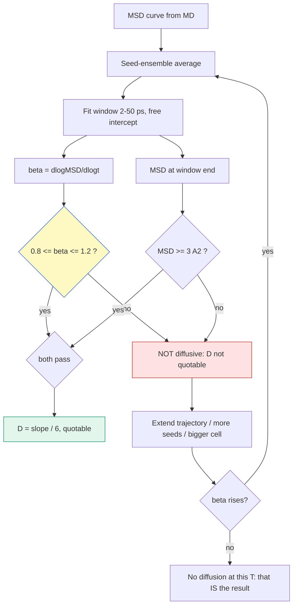

# β 게이트 — 확산영역 판정 (diffusive-regime gate)

> MSD 기울기를 $D$ 라고 부르기 전에 "이게 진짜 확산인가"를 먼저 판정하는 게이트. log–log 기울기 $\beta = d\log\text{MSD}/d\log t$ 가 0.8–1.2 여야 $\text{MSD}=6Dt$ 가 성립한다. $R^2$ 로는 잡히지 않는 실패를 잡는다.

## 목차
1. 정의와 구간
2. 왜 $R^2$ 로는 안 되나
3. β 는 시간이 아니라 **홉 수**를 잰다
4. 저온 β 저하 — 표집 인공물 vs 진짜 아확산
5. 우리 캠페인 판정 현황
6. 적합 규율 3건

---
## 1. 정의와 구간

$$\text{MSD}(t) \propto t^{\beta}, \qquad \beta = \frac{d(\log \text{MSD})}{d(\log t)}$$

| β | 이름 | 물리 그림 | 판정 |
|---|---|---|---|
| ≈ 2 | ballistic | 첫 충돌 전 직선 비행 (< ~1 ps) | 제외 |
| **0.8–1.2** | **diffusive (Fickian)** | 홉이 충분히 많아 랜덤워크 | **✅ 인용 가능** |
| < 0.8 | caged | 자리 안 진동 + 드문 홉. 평균이 희귀 점프에 지배됨 | ⛔ |
| → 0 | trapped | MSD 평탄 — 자리를 못 벗어남 | ⛔ |
| > 1.2 | drift / 초확산 | 질량중심 표류 또는 단일 대형 사건 | ⛔ |

**병행 조건**: 창 끝 MSD ≥ **3 Ų** (이웃 Li–Li 거리² 정도). β 가 1 이어도 크기가 작으면
이온이 자기 자리를 못 벗어난 것이라 통계가 없다.

도구: `tools/ionic/msd_diffusive_check.py` (`--scan` 창 스캔 · `--average` 시드 앙상블)

---
## 2. 왜 $R^2$ 로는 안 되나

$\text{MSD} = a + b\,t^{0.6}$ 같은 곡선도 직선 적합하면 $R^2$ 가 높게 나온다.
**"직선처럼 보임"과 "확산임"은 다른 명제다.**

> [!warning] 실측 (2026-08-04)
> **LPSOCl 600 K: $R^2$ = 0.975 인데 β = 0.61.**
> 4시드 앙상블 평균, 200 ps, MSD 97 Ų — 크기도 충분하고 직선처럼도 보이는데 확산이 아니다.
> 기울기/6 을 $D$ 라고 부르려면 그 기울기가 **랜덤워크의** 기울기여야 한다.

$R^2$ 는 "내가 가정한 모델(직선)에 얼마나 잘 맞나"를 재고, β 는 "그 모델이 옳은 모델인가"를
잰다. 전자는 후자를 대신할 수 없다.

---
## 3. β 는 시간이 아니라 **홉 수**를 잰다

이온당 홉 수로 환산하면 게이트 결과가 **미리 계산된다**:

$$n_{\text{hop}} = \frac{\text{MSD}}{d_{\text{hop}}^2} = \frac{6 D t}{d_{\text{hop}}^2}
\qquad (d_{\text{hop}} \approx 3\,\text{Å} = \text{이웃 Li 자리 간격})$$

| $n_{\text{hop}}$ | 뜻 |
|---|---|
| ≥ 10 | 확산 통계 충분 (β ≈ 1 기대) |
| 3–10 | 경계 — 시드마다 β 가 흔들린다 |
| < 3 | 홉 부족 — **β 가 낮게 나오는 게 정상** (측정 실패이지 물리가 아니다) |

### ★ 예측이 실측을 맞춘다 (600 K · 200 ps, 2026-08-04)

| 계 | 예측 $n_{\text{hop}}$ | 실측 β | |
|---|---|---|---|
| LPSCl1.6 | 13.9 | 0.87 | ✅ |
| **LPSOCl1.6** | **8.4** (경계) | **0.61** | **⛔** |
| B₂O₃@LPSCl1.6 | 13.9 | 0.81 | ✅ |

**LPSOCl 만 탈락한 이유가 여기서 닫힌다** — $E_a$ 가 90 meV 높아 같은 온도·시간에서
$D$ 가 0.60배이고, 따라서 **홉이 40% 적다**. 사고가 아니라 예측 가능했던 통계 부족.

도구 `tools/ionic/hops_per_ion.py` · 표 `db/properties/hops_per_ion.csv` (전 온도)

> [!note] $n_{\text{hop}}$ 은 **상한**이다
> 되돌아오는 홉(back-correlated)을 안 세는데, 실제 SE 는 Haven 비 $H_R$ 0.3–0.7 < 1 =
> 상관 운동이라(litdb `dyre2004`) 같은 MSD 를 내는 데 더 많은 홉이 든다.
> 경계선은 보수적으로 읽어야 한다.

**저온 선제 경고**: 200 ps 기준 500 K 는 세 계 모두 경계 이하(6.5 / 2.8 / 6.4).
400 ps 로 늘려도 LPSOCl 은 5.6 — 여전히 경계다.

---
## 4. 저온 β 저하 — 표집 인공물 vs 진짜 아확산

|  | **표집 인공물** | **진짜 아확산 (sub-diffusion)** |
|---|---|---|
| 원인 | 궤적이 짧아 홉이 몇 번 없음 → 희귀 사건이 평균 지배, 자기평균 미완 | 케이지 진동·되돌아오는 홉·상관 운동이 만드는 **실재하는** 중간시간 거동 |
| 물리인가 | **아니다** — 측정 실패 | **그렇다** — 실제 물질에서 관측됨 |
| 시간을 늘리면 | 홉이 쌓이며 β → 1 **수렴** | 상관 시간을 넘기면 β → 1 **crossover** |

> [!important] 핵심
> **진짜 아확산도 점근적으로는 β = 1 이다** — 아니면 $D$ 자체가 정의되지 않는다.
> 그래서 저온에서 β 가 낮게 나오는 것 **자체는 현실적**이지만(저온일수록 케이지 시간이
> 길어져 아확산 구간이 늘어난다), **그 기울기를 $D$ 라고 쓰면 안 된다.**
> 두 원인이 같은 숫자로 보이기 때문이다.

**판별 실험**: 궤적을 늘렸을 때 β 가 오르는가.
comp1 600 K 를 200 → **1600 ps** 로 늘리는 게 정확히 이 검사다 (진행 중).
- β 가 오른다 → 표집 문제였다. 연장·시드·셀 확대로 해결
- 안 오른다 → 그 온도·그 셀에서 확산이 실재하지 않는다. **"$D$ 인용 불가"가 결론**

---
## 5. 우리 캠페인 판정 현황 (2026-08-04, 200 ps · 창 2–50 ps)

| 계 | 600 K | 800 K | 1000 K | 시드 근거 |
|---|---|---|---|---|
| LPSCl (comp1) | ⛔ 0.17–0.79 | ⛔ | (0.52) | s2·s3 — **전 판 탈락**, 1600 ps 연장 중 |
| LPSCl1.6 | 0.87 ✓ | 0.93 ✓ | 0.92 ✓ | 3시드 평균 |
| **LPSOCl1.6** | **0.61 ⛔** | 0.86 ✓ | 1.02 ✓ | 4시드 평균 (최초 게이트 검사) |
| B₂O₃@LPSCl1.6 | 0.81 ✓ | 0.83 ✓ | 0.97 ✓ | 3시드 평균 |

- **9판 중 유일한 탈락 = LPSOCl 600 K.** modelc·b2o3 의 단일시드 '아슬' 판정(0.82/0.81)은
  3시드 평균으로 해소됐다.
- 검증: b2o3 600 K 3시드 $D$ 1.039e-5 = 등록 아레니우스 $D_{600}$ 평균 1.041e-5 **재현**.
- 함의: **$E_a$(LPSOCl) 0.287 ± 0.024 는 이 600 K 점을 포함한 적합**이라 재검토 대상.
  처방 = 30런(신규 27 + lpsocl 600 재실행 3)에서 게이트 통과 점만으로 재적합.

**게이트가 실제로 값을 막은 사례**
- comp2 disorder d=0.5 — 600 K $D$ 가 comp1 의 1000 K 값과 동급으로 나왔다 (β 탈락)
- comp1 seed3 — $D(600)$ 1.36e-6 ≈ $D(800)$ 1.37e-6 (비 1.007). 물리적으로 불가능

---
## 6. 적합 규율 3건 (2026-08-04 확립)

1. **절편 자유**: $\text{MSD} = 6Dt + c$ 로 맞춘다. 원점 강제는 케이지 진동 오프셋을
   기울기에 밀어넣어 $D$ 를 부풀린다 (실측: 절편 최대 9.1 Ų).
2. **시드 앙상블 평균이 기본**: 같은 계·같은 T 에서 시드에 따라 β 0.98 ↔ 0.52 로 갈렸다.
   "대표 시드 1개"는 그 갈림을 **숨긴다**. 독립 시드는 같은 계의 다른 초기속도라 평균이 정당.
3. **같은 시드의 재실행은 평균 금지**: 밀도 cube 용 재실행(licube) 등을 섞으면 이중계상 +
   격자 절단. 독립성이 없는 궤적은 시드가 아니다.

**한 문장 요약**: MSD 기울기를 $D$ 로 쓰기 전에 log–log 기울기 β 가 0.8–1.2 이고 창 끝
MSD ≥ 3 Ų 인지 확인한다 — β 는 시간이 아니라 홉 수를 재므로, 탈락은 궤적·시드·셀을
키워 풀거나 "그 온도에선 확산이 안 보인다"가 결론이 된다.

---
## 우리 캠페인 적용
게이트 0.8–1.2 + MSD ≥ 3 Ų, 창 2–50 ps, 시드 앙상블 평균 기본.
관련 문서: **[MD (MLIP)](/concept/md)** §4 (창 피팅·Arrhenius 맥락) ·
그림 `docs/figures/msd_3sys_200ps.png`(SI) · `msd_3sys_50ps.png`(메인) ·
데이터 `db/properties/msd_3sys_200ps_origin.csv` · `hops_per_ion.csv` ·
상세 답변 `kb/reports/paper_first_author_requests_2026_08.md` §4·§6

*tags: beta gate · diffusive regime · Fickian · sub-diffusion · MSD · hop count · Haven ratio · caged · sampling artifact · multiseed*
