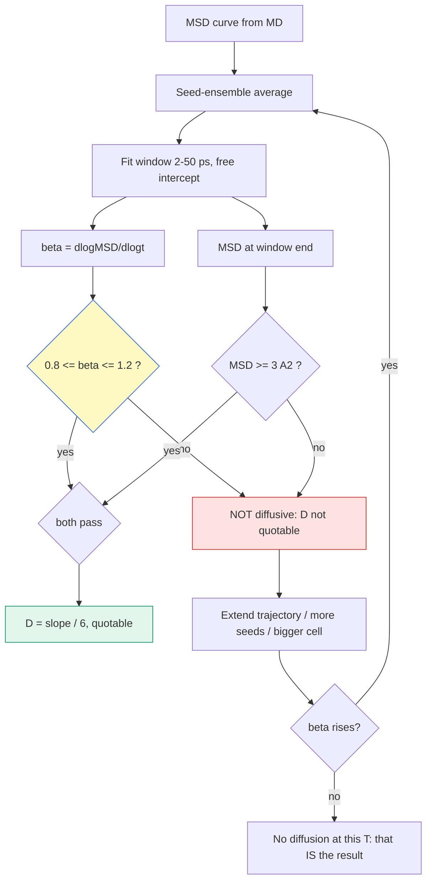

# β 게이트 — 확산영역 판정 (diffusive-regime gate)

> MSD 기울기를 $D$ 라고 부르기 전에 "이게 진짜 확산인가"를 먼저 판정하는 게이트. log–log 기울기 $\beta = d\log\text{MSD}/d\log t$ 가 0.8–1.2 여야 $\text{MSD}=6Dt$ 가 성립한다. $R^2$ 로는 잡히지 않는 실패를 잡는다.

## 목차
1. 정의와 구간
2. 왜 $R^2$ 로는 안 되나
3. β 는 시간이 아니라 **홉 수**를 잰다
4. 저온 β 저하 — 표집 인공물 vs 진짜 아확산
5. 우리 캠페인 판정 현황
6. 적합 규율 3건
7. **왜 하필 0.8 인가** — 물리와 관례를 가른다 *(2026-08-26 신설)*
8. **β 만으로 판정하지 않는다 — `c` 행** *(2026-08-26 신설)*
9. **MTO vs STO — 어느 곡선으로 재나** *(2026-08-26 신설)*
10. **β 레지스트리** — 같은 이름에 여섯 값이 있었다 *(2026-08-26 신설)*
11. **셀 크기가 β 를 만든다** *(2026-08-26 신설)*

---
## 1. 정의와 구간

$$\text{MSD}(t) \propto t^{\beta}, \qquad \beta = \frac{d(\log \text{MSD})}{d(\log t)}$$

| β | 이름 | 물리 그림 | 판정 |
|---|---|---|---|
| ≈ 2 | ballistic | 첫 충돌 전 직선 비행 (< ~1 ps) | 제외 |
| **0.8–1.2** | **diffusive (Fickian)** | 홉이 충분히 많아 랜덤워크 | **✅ 인용 가능** |
| < 0.8 | caged | 자리 안 진동 + 드문 홉. 평균이 희귀 점프에 지배됨 | ⛔ |
| → 0 | trapped | MSD 평탄 — 자리를 못 벗어남 | ⛔ |
| > 1.2 | drift / 초확산 | 질량중심 표류 또는 단일 대형 사건 | ⛔ |

**병행 조건**: 창 끝 MSD ≥ **3 Ų** (이웃 Li–Li 거리² 정도). β 가 1 이어도 크기가 작으면
이온이 자기 자리를 못 벗어난 것이라 통계가 없다.

도구: `tools/ionic/msd_diffusive_check.py` (`--scan` 창 스캔 · `--average` 시드 앙상블)

---
## 2. 왜 $R^2$ 로는 안 되나

$\text{MSD} = a + b\,t^{0.6}$ 같은 곡선도 직선 적합하면 $R^2$ 가 높게 나온다.
**"직선처럼 보임"과 "확산임"은 다른 명제다.**

> [!warning] 실측 (2026-08-04)
> **LPSOCl 600 K: $R^2$ = 0.975 인데 β = 0.61.**
> 4시드 앙상블 평균, 200 ps, MSD 97 Ų — 크기도 충분하고 직선처럼도 보이는데 확산이 아니다.
> 기울기/6 을 $D$ 라고 부르려면 그 기울기가 **랜덤워크의** 기울기여야 한다.

$R^2$ 는 "내가 가정한 모델(직선)에 얼마나 잘 맞나"를 재고, β 는 "그 모델이 옳은 모델인가"를
잰다. 전자는 후자를 대신할 수 없다.

---
## 3. β 는 시간이 아니라 **홉 수**를 잰다

이온당 홉 수로 환산하면 게이트 결과가 **미리 계산된다**:

$$n_{\text{hop}} = \frac{\text{MSD}}{d_{\text{hop}}^2} = \frac{6 D t}{d_{\text{hop}}^2}
\qquad (d_{\text{hop}} \approx 3\,\text{Å} = \text{이웃 Li 자리 간격})$$

| $n_{\text{hop}}$ | 뜻 |
|---|---|
| ≥ 10 | 확산 통계 충분 (β ≈ 1 기대) |
| 3–10 | 경계 — 시드마다 β 가 흔들린다 |
| < 3 | 홉 부족 — **β 가 낮게 나오는 게 정상** (측정 실패이지 물리가 아니다) |

### ★ 예측이 실측을 맞춘다 (600 K · 200 ps, 2026-08-04)

| 계 | 예측 $n_{\text{hop}}$ | 실측 β | |
|---|---|---|---|
| LPSCl1.6 | 13.9 | 0.87 | ✅ |
| **LPSOCl1.6** | **8.4** (경계) | **0.61** | **⛔** |
| B₂O₃@LPSCl1.6 | 13.9 | 0.81 | ✅ |

**LPSOCl 만 탈락한 이유가 여기서 닫힌다** — $E_a$ 가 90 meV 높아 같은 온도·시간에서
$D$ 가 0.60배이고, 따라서 **홉이 40% 적다**. 사고가 아니라 예측 가능했던 통계 부족.

도구 `tools/ionic/hops_per_ion.py` · 표 `db/properties/hops_per_ion.csv` (전 온도)

> [!note] $n_{\text{hop}}$ 은 **상한**이다
> 되돌아오는 홉(back-correlated)을 안 세는데, 실제 SE 는 Haven 비 $H_R$ 0.3–0.7 < 1 =
> 상관 운동이라(litdb `dyre2004`) 같은 MSD 를 내는 데 더 많은 홉이 든다.
> 경계선은 보수적으로 읽어야 한다.

**저온 선제 경고**: 200 ps 기준 500 K 는 세 계 모두 경계 이하(6.5 / 2.8 / 6.4).
400 ps 로 늘려도 LPSOCl 은 5.6 — 여전히 경계다.

---
## 4. 저온 β 저하 — 표집 인공물 vs 진짜 아확산

|  | **표집 인공물** | **진짜 아확산 (sub-diffusion)** |
|---|---|---|
| 원인 | 궤적이 짧아 홉이 몇 번 없음 → 희귀 사건이 평균 지배, 자기평균 미완 | 케이지 진동·되돌아오는 홉·상관 운동이 만드는 **실재하는** 중간시간 거동 |
| 물리인가 | **아니다** — 측정 실패 | **그렇다** — 실제 물질에서 관측됨 |
| 시간을 늘리면 | 홉이 쌓이며 β → 1 **수렴** | 상관 시간을 넘기면 β → 1 **crossover** |

> [!important] 핵심
> **진짜 아확산도 점근적으로는 β = 1 이다** — 아니면 $D$ 자체가 정의되지 않는다.
> 그래서 저온에서 β 가 낮게 나오는 것 **자체는 현실적**이지만(저온일수록 케이지 시간이
> 길어져 아확산 구간이 늘어난다), **그 기울기를 $D$ 라고 쓰면 안 된다.**
> 두 원인이 같은 숫자로 보이기 때문이다.

**판별 실험**: 궤적을 늘렸을 때 β 가 오르는가.
comp1 600 K 를 200 → **1600 ps** 로 늘리는 게 정확히 이 검사다 (진행 중).
- β 가 오른다 → 표집 문제였다. 연장·시드·셀 확대로 해결
- 안 오른다 → 그 온도·그 셀에서 확산이 실재하지 않는다. **"$D$ 인용 불가"가 결론**

---
## 5. 우리 캠페인 판정 현황 (2026-08-04, 200 ps · 창 2–50 ps)

| 계 | 600 K | 800 K | 1000 K | 시드 근거 |
|---|---|---|---|---|
| LPSCl (comp1) | ⛔ 0.17–0.79 | ⛔ | (0.52) | s2·s3 — **전 판 탈락**, 1600 ps 연장 중 |
| LPSCl1.6 | 0.87 ✓ | 0.93 ✓ | 0.92 ✓ | 3시드 평균 |
| **LPSOCl1.6** | **0.61 ⛔** | 0.86 ✓ | 1.02 ✓ | 4시드 평균 (최초 게이트 검사) |
| B₂O₃@LPSCl1.6 | 0.81 ✓ | 0.83 ✓ | 0.97 ✓ | 3시드 평균 |

- **9판 중 유일한 탈락 = LPSOCl 600 K.** modelc·b2o3 의 단일시드 '아슬' 판정(0.82/0.81)은
  3시드 평균으로 해소됐다.
- 검증: b2o3 600 K 3시드 $D$ 1.039e-5 = 등록 아레니우스 $D_{600}$ 평균 1.041e-5 **재현**.
- 함의: **$E_a$(LPSOCl) 0.287 ± 0.024 는 이 600 K 점을 포함한 적합**이라 재검토 대상.
  처방 = 30런(신규 27 + lpsocl 600 재실행 3)에서 게이트 통과 점만으로 재적합.

**게이트가 실제로 값을 막은 사례**
- comp2 disorder d=0.5 — 600 K $D$ 가 comp1 의 1000 K 값과 동급으로 나왔다 (β 탈락)
- comp1 seed3 — $D(600)$ 1.36e-6 ≈ $D(800)$ 1.37e-6 (비 1.007). 물리적으로 불가능

---
## 6. 적합 규율 3건 (2026-08-04 확립)

1. **절편 자유**: $\text{MSD} = 6Dt + c$ 로 맞춘다. 원점 강제는 케이지 진동 오프셋을
   기울기에 밀어넣어 $D$ 를 부풀린다 (실측: 절편 최대 9.1 Ų).
2. **시드 앙상블 평균이 기본**: 같은 계·같은 T 에서 시드에 따라 β 0.98 ↔ 0.52 로 갈렸다.
   "대표 시드 1개"는 그 갈림을 **숨긴다**. 독립 시드는 같은 계의 다른 초기속도라 평균이 정당.
3. **같은 시드의 재실행은 평균 금지**: 밀도 cube 용 재실행(licube) 등을 섞으면 이중계상 +
   격자 절단. 독립성이 없는 궤적은 시드가 아니다.



**한 문장 요약**: MSD 기울기를 $D$ 로 쓰기 전에 log–log 기울기 β 가 0.8–1.2 이고 창 끝
MSD ≥ 3 Ų 인지 확인한다 — β 는 시간이 아니라 홉 수를 재므로, 탈락은 궤적·시드·셀을
키워 풀거나 "그 온도에선 확산이 안 보인다"가 결론이 된다.

---
## 우리 캠페인 적용
게이트 0.8–1.2 + MSD ≥ 3 Ų, 창 2–50 ps, 시드 앙상블 평균 기본.
관련 문서: **[MD (MLIP)](/concept/md)** §4 (창 피팅·Arrhenius 맥락) ·
그림 `docs/figures/msd_3sys_200ps.png`(SI) · `msd_3sys_50ps.png`(메인) ·
데이터 `db/properties/msd_3sys_200ps_origin.csv` · `hops_per_ion.csv` ·
상세 답변 `kb/reports/paper_first_author_requests_2026_08.md` §4·§6

*tags: beta gate · diffusive regime · Fickian · sub-diffusion · MSD · hop count · Haven ratio · caged · sampling artifact · multiseed*

---

## 7. 왜 하필 0.8 인가 — **문헌에는 대응물이 없다** (2026-08-26)

> 사용자 질문: *"베타가 꼭 0.8 이상이어야 되는 이유"* · *"0.8 의 근거가 없잖아 지금"*.
> **맞는 지적이다.** 조사한 결과를 아래에 정직하게 적는다.

### 7-1. **β = 1 은 물리다 — $D$ 의 정의 자체**

$$\text{MSD} = 6Dt$$

**이 식이 이미 β = 1 을 전제한다.** MSD 가 $t^{0.77}$ 로 가는데 억지로 직선을 맞추면
나오는 "$D$" 는 **어느 창을 맞췄냐에 따라 달라진다** — 즉 $D$ 가 **정의되지 않은 상태**다.
그리고 그게 그대로 전파된다:

$$E_a = -k_B\,\frac{d\ln D}{d(1/T)}$$

600 K 는 창 의존적인 가짜 $D$, 800·1000 K 는 진짜 $D$ 라면 **서로 다른 두 양의 기울기**를 재게 된다.
`lpsocl` 의 `Ea 0.287` 이 보류된 이유가 이것이다. **여기까지는 근거가 단단하다.**

### 7-2. 🔴 **자기정정 — 내가 근거 없이 "문헌은 0.9·0.95 도 쓴다" 고 썼다**

이 문서 초판(2026-08-26 오전)에 *"문헌은 0.9 나 0.95 를 쓰기도 한다"* 라고 적었는데,
**그 문장에 출처가 없다.** 그럴듯해서 쓴 것이고 **철회한다.**

### 7-3. 문헌이 실제로 쓰는 것 — **β 문턱이 아니다**

우리 서베이(`litdb/surveys/md_structure_setup_halogen_rich_2026-07.md`, 2026-07-27,
litdb digest 전수 + 웹 보강)가 이미 조사해 놓았다. 요지는 **"β 문턱을 쓰는 문헌을 못 찾았다"** 이다.

| 문헌 | 확산영역을 어떻게 판정하나 |
|---|---|
| **He / Zhu / Epstein / Mo 2018** (npj Comput. Mater. **4**, 18) — *AIMD 오차 정량화 원전* | **① MSD 선형(확산) 구간만 피팅** — ballistic 제외. **원칙만 말하고 창을 고정하지 않는다.** ② 분산을 **관측 확산 이벤트 수**로 정량 ③ 빠른 전도체에만 AIMD 적용 가능 |
| **Kahle / Marcolongo / Marzari 2020** (EES) — *HT-FPMD 최상급* | ① **창 자체를 데이터로 검증** — t′ = 5/10/20/30 vs 40 ps 스캔 (5 ps = ballistic 과대 → 10 ps 최적) ② $D$ 를 총MSD/6t 가 아니라 **기울기**로 ③ **자동 수렴** — err($D$) < 1×10⁻⁸ cm²/s 또는 평균의 5 % 까지 연장 ④ **비전도 판정 = $D$ < 1×10⁻⁸ cm²/s 수렴불가 floor** |
| 그 밖의 argyrodite MD 다수 | **명시 고정 창 자체가 드물다.** rao2025 평형 10 ps + MSD 100 ps · liang2025 궤적 20 ps |
| Lee 2024 (ACS AMI 16, 46442) · Jang 2025 (JMCA 13, 16547) | 판정 기준이 **셀 크기 수렴** 쪽이다 — 5×5×5 6500원자 25 ns 에서 σ 오차 10 % · 4×4×4 3328원자에서 300 K MSD 수렴 |

⇒ **문헌의 표준은 세 갈래다: ① 확산 이벤트 수 ② 창 스캔 검증 ③ $D$ 수렴 floor.**
**β 를 문턱으로 쓰는 관행은 우리가 조사한 범위에 없다.**

### 7-4. ⇒ **β 게이트는 우리 것이다. 0.8 도 우리가 정한 것이다.**

정직한 진술:

| 주장 | 근거 |
|---|---|
| *"β = 1 이어야 $D$ 가 정의된다"* | ✅ **물리** — Einstein 관계 자체 |
| *"β 로 확산영역을 판정한다"* | 🔶 **우리 방법** — 문헌 대응물 미발견. 서베이가 *"우리 확산영역 게이트가 여기에 판정 하나를 더한다"* 라고 이미 적어 놓았다 |
| *"문턱은 0.8"* | ⛔ **근거 없음** — 임의로 고른 값이다 |

**그래도 게이트를 쓰는 이유** — 문헌 세 갈래 중 우리가 못 쓰는 것이 있다:
- **He 2018 의 이벤트 수** — 우리 도구에 hop 계수기가 있지만(`hops_per_ion.py`) 게이트에 안 물려 있다
- **Kahle 의 자동 수렴** — 우리는 `prod 200 ps` 고정이라 "수렴할 때까지 연장" 을 안 한다
- **$D$ floor** — 우리는 저온을 아예 안 돌린다(600 K 하한)

⇒ β 는 **그 셋의 대용품**이고, `--scan` 의 `c` 행(§8)이 Kahle 의 창 스캔에 해당한다.

### 7-5. 할 일 → **1·3 은 2026-08-26 당일 계산으로 닫았다** (2 만 남음)

1. ✅ **0.8 을 데이터로 정하거나 버린다** → **판정: 버린다(고정문턱으로는).** 두 계산:

   **(a) 귀무 스윕** (`beta_null_test.py --hop_sweep`, 결과
   `db/properties/beta_gate_null_vs_hops_c2_origin.csv`): 절편 2 Ų(modelc·b2o3 실측)를 가진
   **완벽한 Fickian 계**에서 홉 수별 β 귀무분포를 재면 —

   | n_hop@200ps | 귀무 β 중앙값 | P(β<0.8) | 5% 거짓탈락 문턱 β_crit |
   |---|---|---|---|
   | 8.4 (=lpsocl 600 K) | 0.72 | **85 %** | 0.58 |
   | **13.9 (=modelc·b2o3 600 K)** | **0.80** | **50 %** | 0.68 |
   | 30 | 0.89 | 14 % | 0.75 |

   **우리 운영점(홉 13.9)에서 귀무 β 중앙값이 정확히 0.80 — 고정문턱 0.8 은 동전던지기다.**
   어떤 홉 수에서도 β≥0.8 이 5% 기준을 못 넘는다.

   절편 4 Ų(lpsocl 실측) 스윕(`…_c4_origin.csv`)은 더 세다: **홉 8.4 의 귀무 중앙값이
   0.58 인데 lpsocl 600 K 관측 β 는 0.615 — 귀무 중앙값보다 위다.** 즉 lpsocl 600 K 는
   "게이트 탈락"이 아니라 **건강한 Fickian 계가 그 절편·그 홉 수에서 보여야 할 β 를
   정확히 보이고 있는 것**이다. modelc(0.868 vs 귀무 0.80)·b2o3(0.806 vs 0.80)도 각자의
   귀무 곡선 위에 앉아 있다 — 세 계 모두 600 K 에서 sub-diffusion 신호가 없다.

   **(b) 시드 산포 대조** (`db/properties/beta_vs_seed_spread_origin.csv`, 9조건):
   시드 간 D 산포(CV)를 예측하는 건 **β(Spearman −0.50)가 아니라 홉 수(−0.78)** 다.
   ⇒ He 2018 의 "분산은 이벤트 수가 정한다"가 **우리 데이터에서 재현**된다.
   (⚠ 시드 3–4개의 CV 는 그 자체가 시끄럽다 — 순위가 신호지 절대값이 아니다.)

2. ⏳ **He 2018 원문 확보** — 여전히 `db/external/PENDING.md` P3 (프록시 403).
   단, (b) 덕에 "이벤트 수 기준" 자체는 이제 우리 실측으로도 선다.

3. ✅ **hop 수를 게이트에 병기한다** → `msd_diffusive_check.py` 에 **잔차 게이트**로 구현
   (2026-08-26). β<0.8 이면 그 창의 자유절편 직선 (c,m) 이 함의하는 **귀무 β** 와 비교해
   `β≈귀무(절편+홉N 설명가능)` / `β≪귀무(직선 근사 불가)` 로 갈라 찍는다. '케이지'라는
   단정 문구는 제거했다 — 케이지 vs 멱함수 확정은 여전히 `--scan` 의 다중 창 c-추세 몫이다.
   잡음 반폭 0.12 는 (a) 의 귀무 5% 분위 실측이다 (Li 27개 기준, 큰 셀에선 보수적).

**요약: β=1 은 물리, 0.8 은 폐기 수순.** 판정은 ① 자유절편 (c,m) ② 홉 수 ③ 다중 창
c-추세의 3종으로 간다. β 는 이제 **경보**지 판정이 아니다.

### 7-6. ⚠ "0.8 을 버리면 다 통과인가" — **아니다** (2026-08-26 질문)

문턱을 폐기한다니까 바로 나온 질문이다: *"그럼 지금까지 우리 문제가 별게 아니었던 거 아니야?"*
**아니다. 셋 다 확인했다.**

**(1) 게이트는 양방향으로 틀렸다** — 내리면 "다 통과"가 아니라 **통과했던 것도 무효**다.
`db/properties/msd_trend_verdict_arrhenius6pt.json` 의 `⚠_headline` 이 이미 그렇게 적혀 있다:

| 런 | β̄ | 게이트 | c-행 진단 |
|---|---|---|---|
| modelc/700 K | 0.76 | ⛔ 탈락 | **케이지 절편** (β 0.76→0.96 단조↑, m −7.1%) ⇒ D 인용 가능 — **거짓 탈락** |
| b2o3/700 K | 0.85 | ✅ 통과 | 여섯 창 전부 β 0.83–0.86 평평 · m −22.8% · c 단조↑ — **거짓 통과 의심** |

⚠ 단, b2o3/700 의 `TRUE_SUBDIFFUSION` 은 2026-08-11 MC 재검토에서 **자동판정 → 진단 제안으로
격하**됐다(오분류율 8–13%, `verdict_SUPERSEDED` 키). 그래서 이 행은 "확정된 거짓 통과"가 아니라
**"게이트 통과가 진단 통과를 뜻하지 않는다"** 는 사례로만 쓴다. 그리고 그 격하가 논지를 **더 세게**
만든다 — 단일 창 판정자가 β 든 c 든 **아직 없다**는 뜻이니까.

**(2) β 때문에 막혀 있던 건 18건 중 2건뿐이다** (`db/properties/citation_hazards.json` 전수):

- **β 사유**: `lpsocl_md_arrhenius` Ea · `li_transport` Ea — **2건**
- **β 무관**: sei_neb 전량 철회(전하 부호 오류) · sdcp E_ads(자세 불일치) · vgcf_hbn(CI-NEB 가 뒤집음) ·
  b2o3 Ea(헤드라인 3회 교체) · 7 meV(수치 분해능 아래) · ICOHP drift · MP 스냅샷 미기록 … — **16건**

**(3) 그 2건조차 안 풀린다 — 더 나쁜 사유가 옆에 있다.**
LPSOCl 600 K 의 β 0.615 는 무효한 사유가 맞지만, **같은 런의 MTO 곡선**이 따로 말한다
(`lpsocl_beta_registry.json` → `mto_pilot_s2_MTO`): **c 단조증가 3.05→7.02(2.3배) · m −24.5% ·
홉 7.3/이온**. 절편이 커지고 기울기가 떨어지는 것 — **§8-2 표의 아확산 서명**이다.
β 문턱과 무관하게 남는다. 시드 산포도 그대로다 (lpsocl 600 K **CV 33.4%** · modelc 800 K 32.3% ·
b2o3 σ(300 K) 시드별 11.3/64.8/27.1 mS/cm = **5.7배 스윙**).

### 7-7. 그래서 **뭐가 바뀌었나** — 진단명과 처방이 바뀌었다

바뀐 건 "통과/탈락 목록"이 아니라 **원인 지목**이다.

| | 옛 판 | 새 판 |
|---|---|---|
| 진단 | "β 가 낮다" (원인 불명) | **표본이 부족하다** (홉 수) |
| 처방 | prod 를 늘려라 | **셀을 키워라** |

- 시간 8배(200→1600 ps) → 600 K β **0.64 → 0.37 로 악화**. 시간은 처방이 아니다.

### 7-8. ⛔ 자기정정 — **"그럼 셀을 키우면 되나"에 "그렇다"고 답하면 안 된다**

2026-08-26 대화에서 내가 *"셀이 답이다"* 라고 답했다. **과했다.** 근거로 삼은 것은
`lpsocl_beta_registry.json` 의 메모 한 줄이었는데, 본 분석
(`kb/results/lpsocl_box_size_600K_2026_08_18.md`)은 **두 진단이 엇갈린다**고 적고 있다.

| 잣대 | 작은 셀 5.67 Å | 3×3×1 17.02 Å | 읽기 |
|---|---|---|---|
| MTO β̄ (창 2–50) | 0.76 | **0.81** | 상자 효과 **시사** — 단 Δ 0.043±0.018, **p ≈ 0.13** |
| **창 스캔** | β 0.76→**0.98** 회복 · c **−64 %** · m +4.6 % | β 0.87 **정체** · c **+128 %** · m −12.1 % | **반대를 가리킨다** |

**큰 셀이 창 스캔에서 오히려 나쁘다.** 작은 셀은 늦은 창에서 β 가 0.98 까지 돌아오고
m 이 안 변한다 — 도구 규칙대로면 **케이지 절편이고 D 인용 가능**이다. 큰 셀은 0.87 에서
멈추고 c 가 2.3 배로 커진다 — **아확산 쪽 무늬**다.

후보 읽기(미검증): 5.67 Å 주기가 홉을 자기 이미지와 동조시켜 **인위적으로 Fickian 처럼**
보이게 하고, 큰 셀은 그 구속이 풀려 느린 모드가 드러난 것. 그렇다면 **β 가 낮은 쪽이 아니라
높은 쪽이 가짜**다. ⇒ `β 탈락의 원인 = 상자` 도 `아니다` 도 **둘 다 미확정**이고,
가르는 것은 **800 ps 런**(`lpsocl_long`)이다.

**셀이 실제로 고치는 것은 β 가 아니라 `D` 자체다** (§3 판정 ②, 살아남은 쪽):
같은 창·같은 잣대에서 **D 가 1.64–1.70 배** 움직인다 (Welch p ≈ 0.004, 무질서·평형화·
요행 전부 배제됨). 2점 1/L 외삽은 **작은 셀 −49 % · 3×3×1 도 −16 %** — 큰 셀조차 안 수렴했다
(⚠ 점 2개짜리 참고값, 기전 미확정. Yeh–Hummer 설명은 철회됨 — Langevin 은 운동량 비보존).

⇒ **β 폐기는 면죄부가 아니라 조준 교정이다.** 다만 조준이 가리키는 곳은 "셀을 키워라"라는
단일 처방이 아니라, **레버가 여러 개고 각각 다른 병을 고친다**는 사실이다 (§7-9).

### 7-8b. ✅ **Codex 회신 F 접수 (2026-08-27)** — 게이트 폐기는 승인, 근거는 절반만

| 항목 | 판정 |
|---|---|
| **R1** 귀무모형 B | **고정 β 문턱의 반례로는 유효, 개별 궤적 판정에는 무효** → β=0.8 하드게이트 **폐기** |
| **R2** 홉↔산포 상관 | **근거 부족 — 탐색적 상관으로 강등** |
| **R2b** 오늘 데이터 | **P0: 시간창 모순** → 고치기 전 물리 해석 금지 |
| **R3** 유한크기 | 민감성은 확인, **수렴값·기전 미확정** → 1/L 외삽 **인용 금지** |
| **R4** NEB | 미수렴 profile 비교 **반대** → 체크포인트 후 일시중지 권고 |

**① 순환논증 여부 — "조건부로만 순환이 아니다".**
`MSD=c+mt` 면 `β(t)=mt/(c+mt)` 라 β 는 정상확산 여부만이 아니라 `c/(mt)` 에 **구조적으로**
좌우된다. 잡음 없는 곡선을 2–50 에서 회귀하면 β≈**0.794** 로 우리 시뮬 중앙값 0.800 과 같다 —
표의 반전은 산술 오류가 아니다. **그러나** 관측 `c` 를 귀무에 넣고 "이 자료는 정상이다" 라고
판정하면 순환이다. ⇒ **B 는 LPSOCl 600 K 가 정상임을 증명하지 못한다.** 입증한 것은
그 β=0.615 가 *정상확산+케이지 모형과도 양립한다* 는 것뿐이다.

⛔ 문구 교정 두 개:
- `MSD=c+6Dt` 를 **"완벽히 Fickian"** 이라 부른 것은 과했다 → *"포화된 빠른 운동이 더해진
  장시간 정상확산 모형"*. 실제 케이지는 `A(1−e^(−t/τ))+6Dt` 로 **MSD(0)=0** 을 만족하는데,
  우리 B 는 상수를 대수적으로 더한 것이라 **OU 시간상관을 재현하지 않는다** —
  중앙값 편향은 맞지만 5–95 % 구간과 거짓탈락률은 궤적 수준 귀무로 **다시 보정해야 한다.**
- **"동전던지기"** → *"현 운영점에서 β=0.8 문턱이 50 % 거짓탈락률을 보여 **보정되지 않은
  게이트**다"*.

**② 판본 A(절편 0)는 후한가 — "그렇다."** 원자 원좌표 고체 MSD 에는 진동·사이트 내 운동이
있어 `c=0` 은 너무 깨끗하다. 단 **사이트 중심으로 coarse-grain 한 점프 궤적**이나
**케이지를 독립 제거한 좌표**에서는 A 가 정당하다. ⇒ A 의 1 % 는 원자 MSD 게이트의
보정값으로 **쓸 수 없다.**

**③ `c` 를 가정하지 않는 판정 — 단일 결정통계량은 없다.** 대신 **상수 절편을 소거하는
구간 기울기**를 주 판정축으로:
```
D_inc(t1,t2) = [MSD(t2) − MSD(t1)] / [6(t2 − t1)]
```
상수 케이지면 소거되고, `t^α` 면 `D_eff ∝ t^(α−1)` 로 계속 움직인다.
**c 의 창 추세는 t=0 외삽이고 `c`–`m` 오차가 얽혀 보조 진단이지 결정적 판정기가 아니다.**
→ **`tools/ionic/msd_diffusive_check.py --scan` 에 `D_inc` 행을 넣었다**(2026-08-27,
selftest 52). 합성 검증: `MSD=3+0.6t`(D=0.1 정확)에서 **β 는 0.72 인데 D_inc 는 모든 창에서
0.100** — 낮은 β 가 D 가 틀렸다는 증거가 아님을 그대로 보여준다.

**④ β 를 버릴 것인가 — "하드게이트에서는 버리는 것이 맞다."** 권고 게이트:
좌표 unwrap·drift·무결성 → 실제 점프(유효 독립 사건) 수 → `D_inc/D_eff` plateau →
block/seed CI 와 창별 안정성 → **미충족은 `FAIL` 이 아니라 `unresolved/HOLD`**.

### 7-8c. ⛔ **R2 철회 — 내 의심보다 Codex 지적이 정확했다**

내가 R2 에서 걱정한 것은 *"n=9"* 와 *"β 와 n_hop 이 얽혔다"* 였는데, **진짜 문제는 분모였다.**

> `n_hop = MSD@50/d_hop²` 는 실제 사이트 전이 수가 아니라 **평균 D 와 거의 같은 정보**다.
> 그런데 `CV(D) = sd(D)/mean(D)` 는 **같은 평균 D 를 분모**에 쓴다. 절대 `sd(D)` 가 일정하기만
> 해도 `n_hop↑ → CV↓` 가 **기계적으로** 생긴다.

우리 숫자로 확인했다 (`tools/` 재계산):

| 상관 | 값 |
|---|---|
| **ρ(n_hop, 평균 D)** | **+0.95** ← 사실상 같은 양이다 |
| ρ(평균 D, CV) | **−0.73** ← n_hop 대신 평균 D 를 넣어도 나온다 |
| ρ(n_hop, CV) | −0.78 ← 우리가 주장한 값 |
| ρ(sd D, CV) | −0.47 ← 분자만 쓰면 약해진다 |

Codex 재계산: `ρ(β,CV)=−0.5000` (exact perm **p=0.1777**, 유의하지 않음) ·
`ρ(n_hop,CV)=−0.77825` (p=0.0180) · `Δρ=−0.278` · Williams/Steiger **t=2.026, df=6, p≈0.089** ·
bootstrap 95 % CI **−0.82~+0.14 (0 포함)**. leave-one-system-out 도 뒤집힌다 —
**modelc 제외 시 둘 다 −0.943 으로 우위 소멸.**

**⇒ 허용 문구** (`predicts`·`He 재현`·`홉 수가 원인` 은 삭제):
> 9개 조건의 **탐색적 요약**에서 MSD 유래 **유효변위 지표**가 β 보다 seed CV 와 더 강한
> 음의 순위상관을 보였다. 그러나 **상관 차이는 확립되지 않았고**, 공유분모와 재료 군집 때문에
> **사건수 법칙의 재현으로 해석할 수 없다.**

He 법칙을 진짜로 재현하려면 **D 와 독립적으로 실제 사이트 전이를 세고**, 되튐·집단홉을 보정한
`N_eff` 가 **held-out 조건**의 시드 분산을 예측하는지 봐야 한다. 아직 안 했다.

### 7-8d. 🔒 **증거 범위를 못 박는다 — `within-argyrodite compositional transfer`**

교차리뷰 H Q15 판정: **comp1·comp2 는 새 조성이지 새 구조군이 아니다.**

| 후보 | 지위 |
|---|---|
| **comp1** Li₆PS₅Cl | 같은 argyrodite 안의 parent/baseline |
| **comp2** Br 치환판 | 같은 골격 안의 조성·음이온 치환 transfer |
| **b2o3** | ⛔ **이 검증에서 제외** — Li 수송 endpoint 가 2026-08-25 철회됨 |

**허용 문구**
> 동결된 분석법을 **보지 않은 argyrodite 조성**에 전향 적용했다.

**불허 문구**
> 구조가 다른 고체전해질에도 성립하는 **재료 공통 법칙**이다.

⚠ comp1 결과를 **본 뒤** detector·임계값·제외 규칙을 고치면 comp1 은 개발/validation 자료가
되고 **untouched comp2 만 final holdout** 으로 남는다. 둘 다 final test 로 쓰려면
**결과 공개 전에 전 규칙을 동결**해야 한다.

⇒ 산화물까지 캠페인을 넓힐 필요는 없다. **evidence scope 를 좁히면 된다.**
한두 held-out 조성은 **전향적 falsification** 이지 재료 간 일반화 오차의 추정이 아니다.

### 7-9. 레버는 넷이고 **셀은 그 중 하나**다

문헌 표준 ①②③ 은 서로 다른 처방으로 이어진다 — 하나로 뭉치면 안 된다.

| 레버 | 무엇을 고치나 | 비용 | 우리 실측 |
|---|---|---|---|
| **MTO** (다중 시간원점) | 추정기 **잡음** | **0** (궤적 재분석) | 시드 산포 0.52→0.06, **8.7×** |
| **창 스캔** (문헌 ②) | 창 선택 **오류** | **0** (분석) | 작은 셀 β 0.76→0.98 |
| **시드 추가** | 잡음 (1/√n) | 선형 | CV 25–33 % 라 효과 큼 |
| **셀 확대** | **편향** — `D` 자체 | 원자 ×9 에 벽시계 **×1.2** | D **1.64–1.70×**, β 는 미확정 |
| ~~시간 연장~~ | — | 비쌈 | **역효과** (β 0.64→0.37) |

핵심 구분: **잡음은 표본으로 줄지만 편향은 안 준다.** MTO·시드는 잡음을 줄이고,
셀은 편향을 건드린다. 우리 문제에 둘 다 있어서 **하나만으로는 안 닫힌다.**

⚠ 그리고 셀 확대는 **한 계에만 적용하면 안 된다** — modelc·b2o3·lpsocl 이 같은 5.67 Å
상자를 쓰고 있어서, 비대칭으로 키우면 Ea 비교가 통째로 깨진다(캠페인 규약).
싼 스팟체크는 **modelc 3×3×1 @600 K 3시드** — 유한크기 인자가 계 간 비슷한지 재는 것.

## 8. β 만으로 판정하지 않는다 — **`c` 행** (2026-08-26)

### 8-1. 절편이 β 를 끌어내린다

**자유 절편**을 두고 맞추면:

$$\text{MSD}(t) = c + m\,t$$

이온이 **먼저 케이지에서 흔들리다가 그 다음 확산**하면 MSD 는 `(케이지 진폭) + 6Dt` 가 된다.
케이지 몫은 **상수 $c$** 로 빠지고, **기울기 $m$ 은 여전히 옳은 $D$** 를 준다.

그런데 log–log 로 β 를 재면 그 상수 때문에 **기울기가 1보다 작게 보인다.**
⇒ **β < 0.8 이 진짜 아확산이 아니라 절편의 착시**일 수 있다.

### 8-2. 가르는 법 — 창을 옮겨가며 `c` 를 본다

| `c` 의 거동 | `m` | 뜻 | D 는? |
|---|---|---|---|
| 창 따라 **거의 상수** | 상수 | **케이지 절편** | ✅ **무사하다** |
| 창 따라 **커진다** | **떨어진다** | **진짜 아확산** | ⛔ **인용 금지** |

도구: `msd_diffusive_check.py --mto --average --scan` 의 **`c` 행**.

⚠ **$R^2$ 로는 둘을 못 가른다** — 두 모형 다 0.99 를 넘는다.

### 8-3. ⛔ 그런데 `c` 진단도 만능이 아니다 — **실측으로 재현 실패**

`lpsocl` 600 K 작은 셀을 **두 독립 3시드 런셋**으로 스캔했더니 **반대 결과**가 나왔다:

| 런셋 | β (2-50 → 50-200) | `m` 변화 | `c` |
|---|---|---|---|
| `lpsocl_new` (2026-08-19) | 0.76 → 0.98 | **+4.7 %** | **미증가** ⇒ *"D 인용 가능"* |
| `lpsocl` traj (2026-08-26) | 0.77 → 0.84 | **−14.4 %** | **2.19 → 5.67 (+159 %)** |

**같은 셀·같은 시드 구성인데 `c` 진단의 방향이 뒤집힌다.**

⇒ **작은 셀에서는 `c` 로도 D 를 구제할 수 없다.** 진단 자체가 재현되지 않는다.
그리고 도구의 자동 "제안" 행(*"케이지 절편 시사"*)은 **잔차 검정만** 본 것이고,
도구 스스로 *"판정 아님 · 오분류 8~13 % · 동전"* 이라고 표시한다 — **`c` 행을 이길 근거가 아니다.**

---

## 9. MTO vs STO — 어느 곡선으로 재나 (2026-08-26)

| | 무엇 | 시간원점 |
|---|---|---|
| **STO** (single time origin) | 궤적 시작 한 점에서만 변위를 잰다 | 1개 |
| **MTO** (multi time origin) | 여러 시각을 원점으로 삼아 평균한다 | 많음 |

**규칙: 확정 판정은 MTO 로만 한다.** 근거는 실측이다 —
같은 런을 두 곡선으로 읽었을 때 **시드 산포가 STO 0.52 vs MTO 0.06, 8.7배**이고,
STO 쪽에는 **β = 1.14**(초확산, 물리적으로 불가능)까지 들어 있었다.

⚠ **상자 크기 비교는 양쪽 같은 곡선으로만** — 잣대에 따라 **부호가 뒤집힌다**
(2026-08-19 실측: STO 로는 Δ −0.02, MTO 로는 Δ **+0.05**).

---

## 10. β 레지스트리 — **같은 이름에 여섯 값이 있었다** (2026-08-26)

`lpsocl 600 K β` 라는 **하나의 이름**으로 **0.615 / 0.70 / 0.76 / 0.77 / 0.80 / 0.81 / 0.82** 가
CSV 헤더·JSON·watch 하드코딩·kb 카드 네 곳에 흩어져 있었다. 그 흩어짐이 *"0.77 확정"* 오인용의 원인이었다.

⇒ **`db/properties/lpsocl_beta_registry.json` 이 원본이다.** β 를 인용할 때는 **entry id 로 부른다.**

**레지스트리 규칙 4:**
1. 판정량은 **시드 평균곡선의 β̄** (시드별 β 의 산술평균이 **아니다**)
2. 확정 판정은 **MTO 곡선으로만**
3. 창은 캠페인 규약 **2–50 ps 고정**
4. `quote: none` 인 항목은 **어디에도 인용하지 않는다**

⚠ 실제로 `orphan_0p77` 은 `watch_kgy.py` 에 *"2026-08-16 확정"* 으로 **하드코딩**돼 있었는데
**출처가 재구성되지 않아** `quote: none` 으로 격리됐다.

---

## 11. 셀 크기가 β 를 만든다 (2026-08-26) ★★

### 11-1. 시간을 늘려도 안 된다 — **오히려 나빠진다**

`comp1` 600 K 를 **200 → 1600 ps (8배)** 로 늘렸더니:

| T | 200 ps β | **1600 ps β** | D 변화 |
|---|---|---|---|
| 600 K | 0.64 | **0.37** | −31 % |
| 800 K | 0.31 | 0.61 | +100 % |
| 1000 K | 0.69 | **0.97** | +79 % |

**600 K 가 더 나빠졌다.** 원인은 시간이 아니라 **이온이 상자를 가로지르는 것**이고,
시간을 늘리면 **wrap 이 더 쌓인다.**

### 11-2. 한계는 `|a|` 가 아니라 **수직 폭**

$$d = \frac{V}{|\mathbf{b}\times\mathbf{c}|}, \qquad \text{무상관 한계} = (d/2)^2$$

⚠ 삼방정계 `lpsocl` 은 `|a| = 6.95 Å` 인데 **$d_a$ = 5.69 Å** 다. `|a|` 로 재면 여유를 **과대평가**한다.

### 11-3. 실측 — 같은 잣대(MTO 시드평균 2–50)

| 셀 | $d_\min$ | β̄ | 시드별 | 판정 |
|---|---|---|---|---|
| 작은 셀 | **5.67 Å** | **0.76 · 0.77** (두 런셋) | [0.79,0.77,0.73] · [0.75,0.78,0.77] | ⛔ **재현되게 실패** |
| **3×3×1** | **17.0 Å** | **0.81** | **[0.81, 0.80, 0.81]** | ✅ **PASS** |

**큰 셀의 시드 산포가 0.006 이다.** 셋이 거의 같은 값을 냈다.

### 11-4. 🔑 그리고 비용이 거의 안 든다 (2026-08-26 실측)

`md_temperature_feasibility.py --scaling` 실측 (UMA · A6000):

| 배수 | 원자 | ps/day | 원자 배수 | **벽시계 배수** |
|---|---|---|---|---|
| 1×1×1 | 62 | 314.1 | ×1 | ×1.0 |
| 2×2×1 | 248 | 312.6 | ×4 | **×1.0** |
| 3×3×1 | 558 | 252.1 | ×9 | **×1.2** |

**62원자에서 GPU 가 거의 놀고 있었다.** 병목이 계산이 아니라 **커널 실행 오버헤드**다.
(`park2024_sevennet_parallel_gnn_md` `Fig. S1` 의 저이용 구간이 우리 장비에서 확인됐다.)

⇒ **"셀 확대는 비싸다" 는 근거 없는 가정이었다.** 200 ps 한 런이 **15시간 → 19시간**일 뿐이다.

⚠ 그리고 `run_comp1_supercell.sh` 는 `$SEED` unbound 버그로 **2026-08-11 이래 한 번도 돈 적이 없었다**
(2026-08-26 수정). 즉 **비싸서 미룬 게 아니라 스크립트가 죽고 있었다.**

### 11-5. ⛔ 셀을 키워도 안 풀리는 것 — **수용영역**

UMA 유효 수용영역 = `cutoff 6 Å × 메시지패싱 4층` = **24 Å**.
3×3×1 의 $d_\min$ 은 **17.0 Å** 로 여전히 그보다 좁다 — 원자가 자기 주기이미지를 이웃으로 본다.

⚠ **이걸 "틀렸다"로 읽으면 안 된다.** 완전 주기결정에서 이미지를 보는 것은 물리적으로 옳을 수도 있다.
말할 수 있는 것은 **"이 셀에서 그 가정이 검사된 적이 없다"** 까지다.
`make_md_supercell.py` 가 **MSD wrap 과 수용영역을 두 개의 독립 기준으로** 찍는다 — 섞지 말 것.

---

## 12. 실무 순서 (2026-08-26 정리)

```
① β̄ 를 MTO 시드평균 곡선으로, 창 2–50 ps 에서 잰다
      ↓ β̄ ≥ 0.80 →  ✅ D 인용
      ↓ β̄ < 0.80
② --scan 으로 c 행을 본다
      ↓ c 상수 · m 상수 → 케이지 절편 → D 인용 가능 (⚠ 재현 확인 필요, §8-3)
      ↓ c 증가 · m 감소 → 진짜 아확산
③ 셀을 키운다 (3×3×1) — **벽시계 1.2배**
      ↓ 통과 → 큰 셀 안에서 **전 온도를 다시** 돌려 자기일관 아레니우스
④ 그래도 안 되면 그 온도를 아레니우스에서 뺀다
      ⚠ 캠페인 규약(600/800/1000 3점)의 예외 — 근거를 db 에 남긴다
      ⚠⚠ **비대칭 가감은 계 간 Ea 비교를 통째로 깨뜨린다.** 세 계 같은 온도 집합 유지가 우선이다
```

⛔ **③ 을 할 때 한 온도만 큰 셀로 하면 안 된다.** 600 K 만 큰 셀이고 800·1000 이 작은 셀이면
**아레니우스가 두 잣대를 섞는다** — 우리가 계속 피해온 바로 그 오류다.
