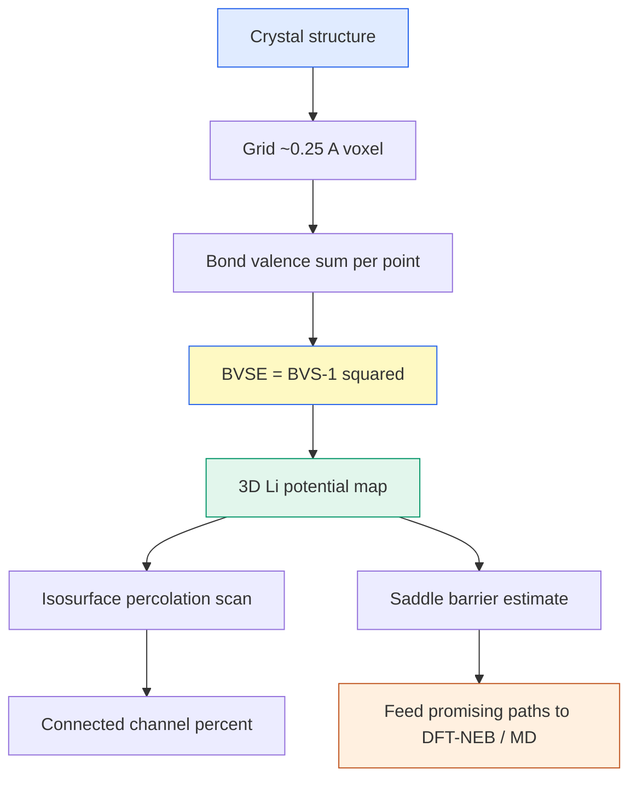

# BVSE — Bond Valence Site Energy (결합가 자리 에너지)

> 결합가(bond valence) 경험식으로 결정 공간 격자점마다 Li⁺가 느끼는 에너지를 계산해, 이온이 지나갈 수 있는 저에너지 통로를 지도로 그리는 빠른 스크리닝 기법. DFT-NEB보다 수백 배 빠르게 확산 경로를 예측한다.

## 목차
1. Bond valence 경험식
2. Bond valence sum (BVS)
3. BVSE = (BVS−1)² 맵
4. Li⁺ 이동 퍼텐셜 지도
5. Percolation 채널 분석
6. DFT-NEB 대비 스크리닝

---
## 1. Bond valence 경험식
결합가(bond valence) $s_{ij}$는 두 이온 간 거리 $R_{ij}$가 짧을수록 커지는 경험 함수다. Brown–Altermatt 형식:

$$s_{ij} = \exp\!\left(\frac{R_0 - R_{ij}}{b}\right)$$

- $R_0$: 결합가 1에 해당하는 기준 거리 (이온쌍마다 정해진 파라미터)
- $b$: 감쇠 길이 (softBV 관례로 **$b = 0.37$ Å**)
- $R_{ij}$: 실제 Li–음이온 거리

거리가 $R_0$면 $s=1$, 가까우면 $s>1$, 멀면 $s<1$로 지수 감쇠한다.

> [!note] 왜 "경험식"인가
> $R_0, b$는 수많은 결정구조의 통계에서 fit된 값이라 QM 계산이 필요 없다. 그래서 격자 전체를 훑어도 순식간 — 스크리닝의 힘이 여기서 나온다.

---
## 2. Bond valence sum (BVS)
한 Li 위치가 주변 모든 음이온과 맺는 결합가를 합한 것이 **BVS**다. 이상적으로는 Li의 형식 전하 $V_{\text{ideal}} = 1$과 같아야 한다.

$$\text{BVS}(\mathbf{r}) = \sum_{j}\, s_{ij}(\mathbf{r}) = \sum_{j}\exp\!\left(\frac{R_0^{(j)} - R_{ij}(\mathbf{r})}{b}\right)$$

- BVS ≈ 1: Li가 "딱 맞게" 배위된 편안한 자리
- BVS ≫ 1: 너무 눌린(음이온에 너무 가까운) 자리 → 에너지 높음
- BVS ≪ 1: 배위 부족(음이온에서 먼) 자리 → 역시 불안정

---
## 3. BVSE = (BVS−1)² 맵
BVSE는 BVS가 이상값 1에서 벗어난 정도를 제곱해 **에너지 유사 척도**로 만든다.

$$\boxed{\text{BVSE}(\mathbf{r}) = \big(\text{BVS}(\mathbf{r}) - V_{\text{ideal}}\big)^2 = \big(\text{BVS}(\mathbf{r}) - 1\big)^2}$$

- BVSE = 0: 완벽 배위 (에너지 우물 바닥)
- BVSE ↑: 부적합한 자리 (에너지 장벽)

이 값을 결정 공간의 조밀한 격자(**약 0.25 Å voxel**)마다 계산하면 3D 에너지 지형이 나온다. Li⁺는 BVSE가 낮은 골짜기를 따라 흐른다.

### softBV은 인력+반발을 함께 본다
순수 bond-valence는 인력 경향만 담아 Li가 음이온에 무한정 가까워지려 한다. 문헌 **softBV** 파라미터화는 여기에 Coulomb 반발과 Morse형 척력을 더해 우물이 **유한 깊이(eV)** 를 갖게 만든다.

> ⚠️ **우리 구현은 그 softBV가 아니다 (2026-07-27 정정).** `tools/comp1_v3/bvse_faithful_cubic.py`는
> Brown–Altermatt BVS 합(`bvs += exp((R0−d)/b)`, b=0.37)을 구해 **불일치 제곱 `(BVS−1)²`** 만 낸다 —
> Coulomb·Morse 항이 코드에 없다. 그래서 **단위가 valence²(무차원)이지 eV가 아니고**(cube 헤더도
> `BVSE aboveMin (valence^2)` 로 직접 그렇게 적는다), 최소점↔Li 자리·안장점↔병목 대응은
> 이론적 귀결이 아니라 **경험적 관찰**이다. rao2011처럼 eV 단위 BVSE(Morse형)를 쓰는 문헌값과
> 같은 축에 놓고 비교하면 안 된다. 절대 장벽은 반드시 DFT로 검증한다.

---
## 4. Li⁺ 이동 퍼텐셜 지도
격자 전체 BVSE 필드는 곧 **Li⁺가 느끼는 퍼텐셜 지도**다. 등에너지면(isosurface)을 iso 값으로 잘라 보면 저에너지 통로가 드러난다.

$$E_{\text{barrier}} \approx \text{BVSE}_{\text{saddle}} - \text{BVSE}_{\text{min}}$$

우물 사이를 잇는 **안장점(saddle)**의 BVSE가 곧 이동 장벽의 대용치 — **단위는 valence²(무차원), eV 아님. 계 간 상대 병목 지표로만 쓴다.** softBV 파라미터로 계산하면 argyrodite의 Li cage 간 도약 경로가 시각적으로 나온다.

> [!tip] aboveMin 관례
> 지도를 배포할 때 맵 최솟값을 빼서(aboveMin) "우물 바닥=0"으로 맞춘다. VESTA용 .cube는 이 관례로 내보내고 .vesta와 쌍으로 배포 (ASCII+CRLF 규칙 준수).

---
## 5. Percolation 채널 분석
저에너지 통로가 결정을 **관통**해야 실제 장거리 확산이 된다. iso 에너지를 올려가며 "연결된 통로가 셀 경계를 가로지르는가"를 보는 게 percolation 분석이다.

- 채널% = **above-min 값이 iso 이하인 voxel 비율** (연결 통로의 부피 지표)
- iso를 낮추면 통로가 끊기고(1D), 올리면 3D로 연결된다 → 임계 iso가 유효 장벽

$$\text{channel\%}(iso) = \frac{\#\{\mathbf{r} : \text{BVSE}_{\text{aboveMin}}(\mathbf{r}) \le iso\}}{\#\{\text{all voxels}\}} \times 100$$

> [!warning] 정량·순위는 원본 주기셀만
> percolation 정량값과 조성 간 순위는 **원본 주기셀(primitive/conventional periodic cell) 값만** 인용한다. 큐빅 박스로 리샘플한 맵은 **표시(시각화)용**일 뿐 — 표본 편차가 **±1.3%p** 있어 순위 판정에 쓰면 안 된다.

---
## 6. DFT-NEB 대비 스크리닝
BVSE는 QM 없이 경험식만으로 도니 **DFT-NEB보다 압도적으로 빠르다**. 대신 절대 장벽 정확도는 NEB에 못 미친다. 역할 분담이 핵심이다.

| 항목 | BVSE | DFT-NEB |
|------|------|---------|
| 속도 | 초~분 (격자 스캔) | 시간~일 (다중 이미지 SCF) |
| 입력 | 구조 + $R_0, b$ | 구조 + 초기/최종 + pseudo |
| 산출 | 3D 통로 지도, 상대 장벽 | 특정 경로의 정량 MEP |
| 용도 | **후보·경로 스크리닝** | 확정 장벽 검증 |

워크플로: BVSE로 저에너지 경로를 먼저 찾고 → 유망 경로만 DFT-NEB(또는 MLIP-MD)로 정밀 검증.

**한 문장 요약**: 결합가 경험식으로 격자 전체 BVSE=(BVS−1)² 지도를 그려 Li⁺ 저에너지 통로와 percolation을 빠르게 스크리닝하고, 확정 장벽은 NEB/MD로 넘긴다.

---
## 우리 캠페인 적용
softBV 파라미터, ~0.25 Å voxel, BVSE=(BVS−1)². 정량·순위는 **원본 주기셀** 값만 (tools/comp1_v3/).

| Li–음이온 | $R_0$ (Å) | $b$ (Å) | 비고 |
|-----------|-----------|---------|------|
| Li–S | **2.105** | 0.37 | 황화물 골격 |
| Li–Cl | **2.249** | 0.37 | 할로겐 사이트 |
| Li–O | **1.466** | 0.37 | O 도핑 계열 |

- 맵 해상도 **~0.25 Å voxel**, BVSE = (BVS−1)²로 계산.
- 채널% = above-min ≤ iso voxel 비율. **정량·순위는 원본 주기셀 값만 인용** — 큐빅 박스 맵은 표시용(±1.3%p 표본 편차).
- .cube는 aboveMin 관례로 내보내 .vesta와 쌍으로 배포 (ASCII+CRLF).
- BVSE는 1차 스크리닝 — 확정 장벽은 MLIP-MD/NEB로 넘긴다.

*tags: BVSE · bond valence · BVS · softBV · percolation · Li migration · ion transport · screening · voxel map · NEB alternative*
