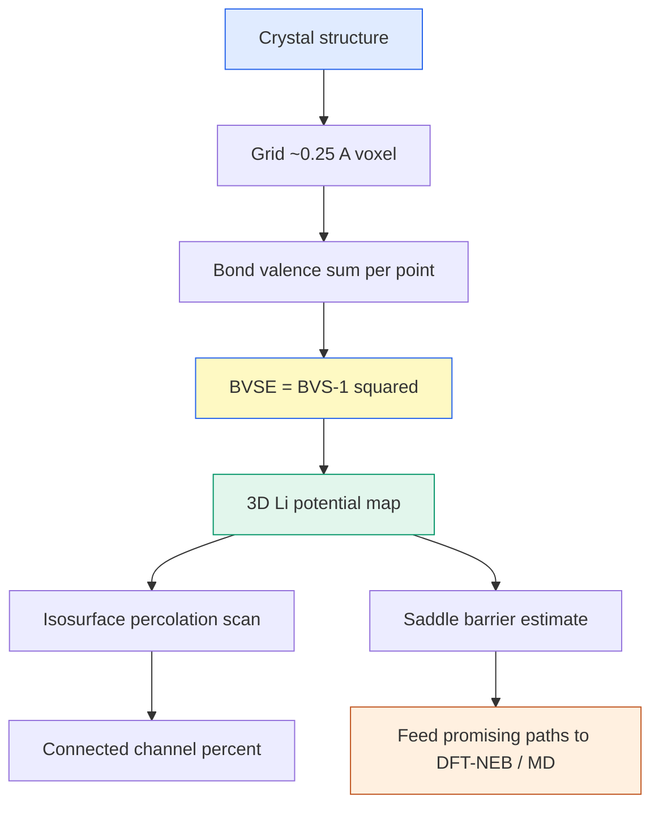

# BVSE — Bond Valence Site Energy (결합가 자리 에너지)

> 결합가(bond valence) 경험식으로 결정 공간 격자점마다 Li⁺가 느끼는 에너지를 계산해, 이온이 지나갈 수 있는 저에너지 통로를 지도로 그리는 빠른 스크리닝 기법. DFT-NEB보다 수백 배 빠르게 확산 경로를 예측한다.

## 목차
1. Bond valence 경험식
2. Bond valence sum (BVS)
3. BVSE = (BVS−1)² 맵
4. Li⁺ 이동 퍼텐셜 지도
5. Percolation 채널 분석
6. DFT-NEB 대비 스크리닝
7. **두 지표는 다른 것을 잰다** — 채널부피 % vs percolation energy
8. **문헌은 왜 BVSE를 σ 비교군으로 쓰나** — 그리고 우리가 안 쓰는 이유
9. **실측 사례 3건** — 부피 ≠ 병목의 세 가지 실패 모드 (+ σ 예측표 검산)

---
## 1. Bond valence 경험식
결합가(bond valence) $s_{ij}$는 두 이온 간 거리 $R_{ij}$가 짧을수록 커지는 경험 함수다. Brown–Altermatt 형식:

$$s_{ij} = \exp\!\left(\frac{R_0 - R_{ij}}{b}\right)$$

- $R_0$: 결합가 1에 해당하는 기준 거리 (이온쌍마다 정해진 파라미터)
- $b$: 감쇠 길이 (softBV 관례로 **$b = 0.37$ Å**)
- $R_{ij}$: 실제 Li–음이온 거리

거리가 $R_0$면 $s=1$, 가까우면 $s>1$, 멀면 $s<1$로 지수 감쇠한다.

> [!note] 왜 "경험식"인가
> $R_0, b$는 수많은 결정구조의 통계에서 fit된 값이라 QM 계산이 필요 없다. 그래서 격자 전체를 훑어도 순식간 — 스크리닝의 힘이 여기서 나온다.

---
## 2. Bond valence sum (BVS)
한 Li 위치가 주변 모든 음이온과 맺는 결합가를 합한 것이 **BVS**다. 이상적으로는 Li의 형식 전하 $V_{\text{ideal}} = 1$과 같아야 한다.

$$\text{BVS}(\mathbf{r}) = \sum_{j}\, s_{ij}(\mathbf{r}) = \sum_{j}\exp\!\left(\frac{R_0^{(j)} - R_{ij}(\mathbf{r})}{b}\right)$$

- BVS ≈ 1: Li가 "딱 맞게" 배위된 편안한 자리
- BVS ≫ 1: 너무 눌린(음이온에 너무 가까운) 자리 → 에너지 높음
- BVS ≪ 1: 배위 부족(음이온에서 먼) 자리 → 역시 불안정

---
## 3. BVSE = (BVS−1)² 맵
BVSE는 BVS가 이상값 1에서 벗어난 정도를 제곱해 **에너지 유사 척도**로 만든다.

$$\boxed{\text{BVSE}(\mathbf{r}) = \big(\text{BVS}(\mathbf{r}) - V_{\text{ideal}}\big)^2 = \big(\text{BVS}(\mathbf{r}) - 1\big)^2}$$

- BVSE = 0: 완벽 배위 (에너지 우물 바닥)
- BVSE ↑: 부적합한 자리 (에너지 장벽)

이 값을 결정 공간의 조밀한 격자(**약 0.25 Å voxel**)마다 계산하면 3D 에너지 지형이 나온다. Li⁺는 BVSE가 낮은 골짜기를 따라 흐른다.

### softBV은 인력+반발을 함께 본다
순수 bond-valence는 인력 경향만 담아 Li가 음이온에 무한정 가까워지려 한다. 문헌 **softBV** 파라미터화는 여기에 Coulomb 반발과 Morse형 척력을 더해 우물이 **유한 깊이(eV)** 를 갖게 만든다.

> ⚠️ **우리 구현은 그 softBV가 아니다 (2026-07-27 정정).** `tools/comp1_v3/bvse_faithful_cubic.py`는
> Brown–Altermatt BVS 합(`bvs += exp((R0−d)/b)`, b=0.37)을 구해 **불일치 제곱 `(BVS−1)²`** 만 낸다 —
> Coulomb·Morse 항이 코드에 없다. 그래서 **단위가 valence²(무차원)이지 eV가 아니고**(cube 헤더도
> `BVSE aboveMin (valence^2)` 로 직접 그렇게 적는다), 최소점↔Li 자리·안장점↔병목 대응은
> 이론적 귀결이 아니라 **경험적 관찰**이다. rao2011처럼 eV 단위 BVSE(Morse형)를 쓰는 문헌값과
> 같은 축에 놓고 비교하면 안 된다. 절대 장벽은 반드시 DFT로 검증한다.

---
## 4. Li⁺ 이동 퍼텐셜 지도
격자 전체 BVSE 필드는 곧 **Li⁺가 느끼는 퍼텐셜 지도**다. 등에너지면(isosurface)을 iso 값으로 잘라 보면 저에너지 통로가 드러난다.

$$E_{\text{barrier}} \approx \text{BVSE}_{\text{saddle}} - \text{BVSE}_{\text{min}}$$

우물 사이를 잇는 **안장점(saddle)**의 BVSE가 곧 이동 장벽의 대용치 — **단위는 valence²(무차원), eV 아님. 계 간 상대 병목 지표로만 쓴다.** softBV 파라미터로 계산하면 argyrodite의 Li cage 간 도약 경로가 시각적으로 나온다.

> [!tip] aboveMin 관례
> 지도를 배포할 때 맵 최솟값을 빼서(aboveMin) "우물 바닥=0"으로 맞춘다. VESTA용 .cube는 이 관례로 내보내고 .vesta와 쌍으로 배포 (ASCII+CRLF 규칙 준수).

---
## 5. Percolation 채널 분석
저에너지 통로가 결정을 **관통**해야 실제 장거리 확산이 된다. iso 에너지를 올려가며 "연결된 통로가 셀 경계를 가로지르는가"를 보는 게 percolation 분석이다.

- 채널% = **above-min 값이 iso 이하인 voxel 비율** (연결 통로의 부피 지표)
- iso를 낮추면 통로가 끊기고(1D), 올리면 3D로 연결된다 → 임계 iso가 유효 장벽

$$\text{channel\%}(iso) = \frac{\#\{\mathbf{r} : \text{BVSE}_{\text{aboveMin}}(\mathbf{r}) \le iso\}}{\#\{\text{all voxels}\}} \times 100$$

> [!warning] 정량·순위는 원본 주기셀만
> percolation 정량값과 조성 간 순위는 **원본 주기셀(primitive/conventional periodic cell) 값만** 인용한다. 큐빅 박스로 리샘플한 맵은 **표시(시각화)용**일 뿐 — 표본 편차가 **±1.3%p** 있어 순위 판정에 쓰면 안 된다.

---
## 6. DFT-NEB 대비 스크리닝
BVSE는 QM 없이 경험식만으로 도니 **DFT-NEB보다 압도적으로 빠르다**. 대신 절대 장벽 정확도는 NEB에 못 미친다. 역할 분담이 핵심이다.

| 항목 | BVSE | DFT-NEB |
|------|------|---------|
| 속도 | 초~분 (격자 스캔) | 시간~일 (다중 이미지 SCF) |
| 입력 | 구조 + $R_0, b$ | 구조 + 초기/최종 + pseudo |
| 산출 | 3D 통로 지도, 상대 장벽 | 특정 경로의 정량 MEP |
| 용도 | **후보·경로 스크리닝** | 확정 장벽 검증 |

워크플로: BVSE로 저에너지 경로를 먼저 찾고 → 유망 경로만 DFT-NEB(또는 MLIP-MD)로 정밀 검증.


**한 문장 요약**: 결합가 경험식으로 격자 전체 BVSE=(BVS−1)² 지도를 그려 Li⁺ 저에너지 통로와 percolation을 빠르게 스크리닝하고, 확정 장벽은 NEB/MD로 넘긴다.

---
## 7. 두 지표는 다른 것을 잰다 — 채널부피 % vs percolation energy

같은 BVSE 맵에서 두 가지 정량 지표가 나오는데, **수송에서 대응하는 물리량이 다르다.**

| BVSE 지표 | 재는 것 | 수송 대응 | 우리 실증 |
|---|---|---|---|
| **채널부피 %** (above-min ≤ iso voxel 비율) | 접근 가능한 **부피** — "방이 넓은가" | **D₀ (프리팩터)** — 자리·경로 수, 엔트로피 | LPSOCl 채널 +43% → D₀ ~3.4× ↑ |
| **percolation energy** (통로가 처음 관통하는 문턱) | 경로 위 **병목** — "고개가 높은가" | **Eₐ 방향** | LPSOCl onset a +3칸·c +13칸 → MD Eₐ +90 meV |

> [!note] 용어 정리 — 우리 "onset" = 문헌의 표준 지표
> 우리가 "percolation onset"이라 불러온 값의 문헌 표준어는 **percolation energy** 또는
> **BVSE migration barrier** (ΔE_1D/2D/3D, softBV/Adams & Rao 계열)다. 오히려 **문헌에서 BVSE의
> 표준 정량 출력은 이쪽**이고 채널부피 %가 덜 표준적이다. 논문에는 표준어로 쓴다.
> ⚠ 단위 주의(§3): 문헌 값은 Morse형 BVEL의 **eV**, 우리 값은 (BVS−1)²의 **valence²** —
> 같은 축에 놓고 비교 금지.

LPSOCl 사례를 아레니우스로 분해하면 두 지표의 역할이 그대로 보인다 (600 K, 멀티시드):

```
D(LPSOCl)/D(modelc) = 0.60  =  0.18 (Eₐ +90 meV 의 Boltzmann 항)  ×  3.4 (D₀ 항)
```

넓은 채널은 사라진 게 아니라 **프리팩터에 들어가 있고**, 지수함수(Eₐ)가 이긴다.
300 K 외삽에서는 격차가 ~9배로 벌어진다.

---
## 8. 문헌은 왜 BVSE를 σ 비교군으로 쓰나 — 그리고 우리가 안 쓰는 이유

**문헌이 쓰는 이유 셋** — ① 비용: CIF 한 장에서 초~분, AIMD는 구조당 수일~수주. 후보 수백~수천의
1차 깔때기로는 유일한 선택지. ② 통계 상관: percolation energy가 실험 Eₐ와 **넓은 재료 스펙트럼에
걸쳐** 순위 상관을 보인다(softBV 실증). ③ 역할이 **필터**: 저에너지 percolation이 없으면 확실히
탈락(거절은 정확), 있으면 후보일 뿐(보증 아님) — 필요조건 검사기.

**정당한 조건**: 스크리닝 풀은 σ가 수십~수만 배, Eₐ가 수백 meV 갈린다. 프록시 산포(Eₐ ~0.1–0.2 eV,
σ 1–2자릿수)보다 **신호가 훨씬 클 때**만 성립한다.

**우리가 σ 랭킹에 안 쓰는 이유 넷**:

| # | 이유 | 구체 |
|---|---|---|
| 1 | **신호 < 프록시 산포** | 형제 계 비교 — ΔEₐ 90 meV, D 비 0.6×는 산포 안쪽 |
| 2 | **비교축이 음이온 치환** | softBV R₀ 자체가 바뀐다 (Li–O 1.466 / Li–S 2.105 / Li–Cl 2.249 Å) — 교차 화학 절대 비교는 방법의 최약점 |
| 3 | **빈 격자 정적 프로브** | Li–Li 상관·협동 점프(농축 초이온전도체의 지배 기구)·vacancy 농도·격자 분극·프리팩터 전부 없음 |
| 4 | **실측 반례 보유** | §9의 3건 — 가족 안 랭킹에 썼다면 전패 |

> 한 줄: 문헌 용법은 "천 개 중 백 개 고르기"(계 간, 큰 차이)라 정당하고, 우리 질문은
> "형제 셋 순위 매기기"(계 내, 작은 차이)라 부당하다. **도구가 아니라 문제 스케일이 다르다.**

---
## 9. 실측 사례 3건 — 부피 ≠ 병목의 세 가지 실패 모드

우리 캠페인에서 채널부피 %와 실측 σ/D가 갈린 사례가 세 번 있었고, **실패 모드가 전부 다르다**:

| 쌍 | 채널부피 | 실측 | 부피 지표가 놓친 것 | 해소한 도구 |
|---|---|---|---|---|
| comp1 → modelc | **−15%** | σ **×4 ↑** | **vacancy/무질서** — 점유-무관(occupancy-blind) 지도의 원리적 사각 | AIMD Li-밀도 PMF percolation 0.20→0.17 **eV** (Eₐ 0.253→0.224와 정합) |
| modelc → LPSOCl | **+43%** | D **0.60× ↓** | **O 트랩이 올린 문턱** (Li–O R₀ 1.466 강결합 — 넓은 웅덩이 + 높은 고개) | MD 멀티시드 Eₐ +90 meV + §7의 D₀/Eₐ 분해 |
| modelc → B₂O₃ | **+45%** | σ **보존** | **국소성** — 열린 부피가 도펀트 주변에 집중 (dopant-box 23.8 vs bulk 6.2%) | 국소성 분해 + 멀티시드 σ비 1.08/0.82/1.15 |

comp1 건은 master 문서(2026-06-21)에 **"vacancy paradox"** 로 기록돼 있다 — "vacancy가 BVSE 못 보는
곳에서 작동". comp1의 600 K 케이징(β 0.27–0.79 게이트 탈락)이 동역학 지문: 케이지 **안** 부피는
넓은데(BVSE가 세는 것) 케이지 **사이** 점프가 드물다(σ를 정하는 것).

### BV 기반 σ(T) 표의 정체 — 검산 사례 (2026-08-04)

외부 발표자료에서 BV 경로 분석(1D=2D=3D 장벽 0.334 eV)과 함께 σ(T) 표(250–404 K,
0.044→9.35 mS/cm)가 나란히 실린 것을 검산했다:

- 표의 온도들이 **1000/T 등간격**(0.21–0.23) — 실험 설정 온도가 아니라 생성 격자
- **ln(σT) vs 1/T 기울기 = 0.3314 eV (R² 0.99992)** — 그 자료의 BV 장벽 0.334 eV를 그대로 재생성

즉 그 표는 측정이 아니라 **σ(T) = (A/T)·exp(−Eₐ_BV/kT)** 로 만든 모델값이다 (softBV의 σ 예측
모드가 정확히 이걸 출력한다 — BV 장벽 + 경험적 프리팩터). 판별법 그대로 재사용 가능:
**① 1000/T 간격 균일한가 ② R²가 비현실적으로 1인가 ③ ln(σT) 기울기가 BV 장벽과 일치하는가.**

> [!warning] 우리 규율과의 접점
> 우리가 MD σ **절대값 인용을 금지**(Haven=1 가정)하는 것과 같은 이유로, BV σ(T) 표는
> 반드시 "예측치(BV 장벽 + 경험 프리팩터)" 라벨이 필요하다. 라벨 없는 σ 표를 만나면
> 위 3단계 검산부터.

### Rietveld 구조 의존성 — 오배정 1쌍 실험 (2026-08-04)

"Rietveld 정련 구조로 만든 BV 지도가 정련 모델의 산물 아닌가"를 직접 쟀다
(`db/properties/bvse_bvlain_ev_4sys.json` 의 `rietveld_sensitivity_test`):

comp1 52원자 셀에서 **free-S(4d) ↔ Cl(4a) 라벨 한 쌍만 교환** — S²⁻(16e)/Cl⁻(17e)는
XRD 가 가장 구분 못 하는 쌍이고, argyrodite 4a/4d 점유率이 정확히 그 지점이다:

| | E_1D | E_2D | E_3D (eV) |
|---|---|---|---|
| 정본 배정 | 0.195 | 0.264 | 0.273 |
| **2/24 음이온 오배정** | 0.440 | 0.440 | 0.498 |
| 이동폭 | **+0.244** | +0.176 | +0.225 |

- 문헌이 "도핑 효과"로 인용하는 **0.3–0.5 eV 급 장벽 차이가, 자리배정 오차만으로
  재현 가능한 크기**라는 뜻이다 (softBV R₀: Li–S 2.105 vs Li–Cl 2.249 Å — 라벨 하나가
  그 자리 주변 지형을 통째로 바꾼다).
- 부분 점유의 **정렬 스냅샷 선택**도 같은 급: comp1 vs modelc(같은 족, 배치만 다름)가
  E_3D 를 0.205 eV 움직인다.
- 판별 질문 셋: ① 중성자(또는 NPD 병행)로 점유率을 고정했는가 ② DFT 이완 구조로
  교차검증했는가 ③ 비교하는 두 조성의 정련 모델(제약·점유)이 동일한가.
  셋 다 아니면 BV 장벽 **차이** 인용은 구조모델 민감도가 신호를 덮을 수 있다.

---
## 우리 캠페인 적용
softBV 파라미터, ~0.25 Å voxel, BVSE=(BVS−1)². 정량·순위는 **원본 주기셀** 값만 (tools/comp1_v3/).

| Li–음이온 | $R_0$ (Å) | $b$ (Å) | 비고 |
|-----------|-----------|---------|------|
| Li–S | **2.105** | 0.37 | 황화물 골격 |
| Li–Cl | **2.249** | 0.37 | 할로겐 사이트 |
| Li–O | **1.466** | 0.37 | O 도핑 계열 |

- 맵 해상도 **~0.25 Å voxel**, BVSE = (BVS−1)²로 계산.
- 채널% = above-min ≤ iso voxel 비율. **정량·순위는 원본 주기셀 값만 인용** — 큐빅 박스 맵은 표시용(±1.3%p 표본 편차).
- .cube는 aboveMin 관례로 내보내 .vesta와 쌍으로 배포 (ASCII+CRLF).
- BVSE는 1차 스크리닝 — 확정 장벽은 MLIP-MD/NEB로 넘긴다.
- percolation energy 차이는 **격자 칸 규칙**으로 판정: 1칸 = ±0.05 val², ≤1칸 동등(인용 금지) / ≥3칸 인용 가능.

**데이터 출처** (webapp `/compare` BVSE 카드에서 차트로 열람):
`db/properties/bvse_3system_channel_origin.csv` (3계 채널%, canonical) ·
`bvse_onset_canonical_modelc.json` (percolation energy, 고정 레벨격자) ·
`bvse_cubic_approx/bvse_orig_vs_cubic.json` (원본 vs 큐빅 대조 + lpsocl 첫 BVSE) ·
`bvse_b2o3/b2o3_bvse_percolation.json` (b2o3 국소성) ·
MD 대응: `*_md_arrhenius.json` (멀티시드 Eₐ/D — σ/Eₐ 정량의 유일한 출처)

**eV 보정판 — 했다 (2026-08-04, bvlain 0.25.1)**: Morse형 BVEL을 우리 4계 relaxed V0 셀에
실행 (`db/properties/bvse_bvlain_ev_4sys.{json,csv}`, 계당 8–59초 CPU):

| 계 | E_1D | E_2D | **E_3D (eV)** | MD Eₐ (eV) |
|---|---|---|---|---|
| comp1 | 0.195 | 0.264 | **0.273** | 0.253 |
| modelc | 0.234 | 0.244 | **0.478** | 0.197±0.032 |
| LPSOCl | 0.225 | 0.244 | **0.566** | 0.287±0.024 |
| B₂O₃ | 0.283 | 0.322 | **0.908** | 0.199±0.034 |

- **절대 스케일은 그럴듯하다**: comp1 E_3D 0.273 ≈ MD 0.253, 외부 발표자료 LPSCl 0.334와 동급.
- **가족 내 랭킹은 MD와 역전**: comp1 < modelc (BV) vs modelc < comp1 (MD) — §9의
  vacancy paradox가 **eV 단위에서도 그대로 재현**됐다. 점유-무관 프록시의 한계는 단위
  보정으로 사라지지 않는다.
- E_3D는 셀 모양에 민감(적층셀 c=35 Å, b2o3는 128원자 셀에 도펀트 1개) — b2o3의 0.908은
  유한크기 산물. **σ/Eₐ 순위 인용 금지**는 이 값들에도 그대로 적용.

*tags: BVSE · bond valence · BVS · softBV · percolation energy · migration barrier · Li migration · ion transport · screening · channel volume · prefactor · vacancy paradox*
