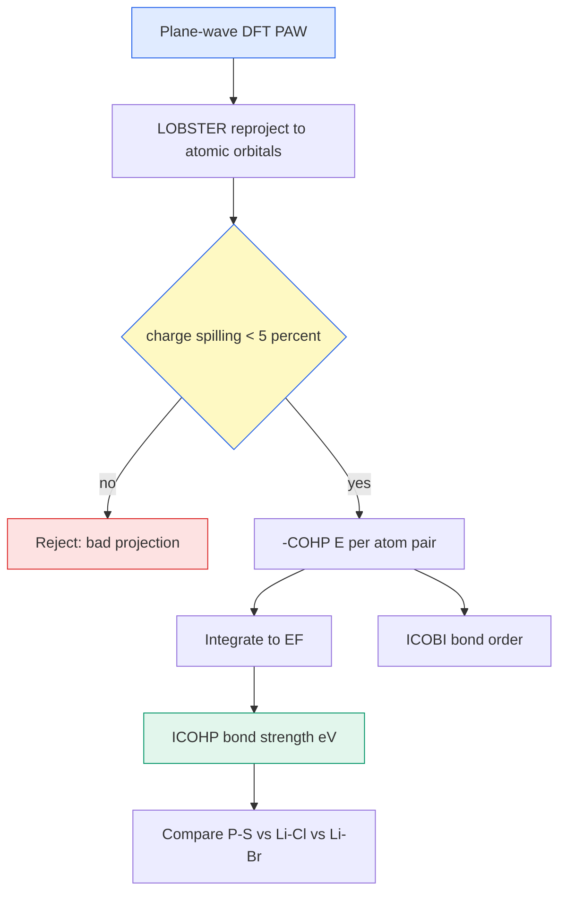

# COHP / ICOHP / ICOBI — 결합 분석 (Crystal Orbital 재투영)

> DFT 파동함수를 원자궤도 기저에 되쏘아, 두 원자 사이 상태가 결합(bonding)이냐 반결합(antibonding)이냐를 에너지별로 분해하고(-COHP), 이를 적분해 결합 세기(ICOHP)와 결합 차수(ICOBI)를 정량화하는 방법. LOBSTER로 계산한다.

## 목차
1. COHP의 개념 (bonding / antibonding)
2. -COHP(E) 부호 규약
3. ICOHP — 결합 세기 적분
4. ICOBI — 결합 차수
5. LOBSTER 재투영과 charge spilling
6. all-PAW 필요성과 basis artifact

---
## 1. COHP의 개념 (bonding / antibonding)
Crystal Orbital Hamilton Population(COHP)은 상태밀도를 **원자쌍 $A$–$B$의 결합 기여로 가중**한 것이다. 밀도행렬 $P$와 Hamiltonian 행렬 $H$의 off-diagonal 곱을 에너지별로 편다.

$$\text{COHP}_{AB}(E) = \sum_{\mu \in A}\sum_{\nu \in B} H_{\mu\nu}\, P_{\mu\nu}(E)$$

여기서 $\mu, \nu$는 각각 원자 $A, B$에 속한 원자궤도. 특정 에너지의 상태가 결합에 기여하면 이 곱이 음(에너지를 낮춤), 반결합이면 양이 된다.

> [!note] DOS와의 차이
> 일반 DOS는 "그 에너지에 상태가 몇 개냐"만 센다. COHP는 "그 상태가 $A$–$B$ 결합을 **강화하냐 약화하냐**"까지 알려준다 — 결합의 화학을 보는 창.

---
## 2. -COHP(E) 부호 규약
관례상 부호를 뒤집어 **$-\text{COHP}(E)$**를 그린다. 그러면 직관이 편해진다.

$$-\text{COHP}(E) \;\begin{cases} > 0 & \text{bonding (오른쪽으로)} \\ < 0 & \text{antibonding (왼쪽으로)} \end{cases}$$

좋은 결합이라면 Fermi 준위 $E_F$ **아래**(점유 영역)가 전부 bonding, 반결합 상태는 $E_F$ 위로 비어 있어야 한다. 만약 $E_F$ 아래에 반결합이 채워져 있으면 그 결합은 불안정하다는 신호.

### 플롯 읽는 법
관례상 가로축에 $-\text{COHP}$, 세로축에 에너지 $E - E_F$를 놓는다.
- $E_F$를 0으로 정렬 → 점유 영역이 아래쪽.
- 오른쪽(양)으로 뻗은 봉우리 = bonding, 왼쪽(음) = antibonding.
- pCOHP(projected COHP)는 특정 궤도쌍(예: P $3p$–S $3p$)만 골라 어느 궤도가 결합을 만드는지 분해한다.

---
## 3. ICOHP — 결합 세기 적분
$-\text{COHP}$를 점유 영역($E_F$까지)에서 적분한 값이 **ICOHP**다. 결합 하나의 세기를 한 숫자로 준다.

$$\text{ICOHP}_{AB} = \int_{-\infty}^{E_F} \text{COHP}_{AB}(E)\, dE \quad [\text{eV / bond}]$$

부호 규약 정리 (여기서 헷갈리기 쉽다):
- ICOHP는 보통 **음수**로 보고한다.
- **더 음수일수록(절댓값 클수록) 더 강한 결합.**

$$|\text{ICOHP}|\;\uparrow \;\Longrightarrow\; \text{결합 세기}\;\uparrow$$

예: P–S ≈ −6.0 eV는 강한 공유결합, Li–할로겐 −2 eV대는 약한 이온결합. 같은 자리를 놓고 Li–Cl(−2.11)이 Li–Br(−1.93)보다 더 음수 → **Cl 결합이 Br보다 강하다.**

---
## 4. ICOBI — 결합 차수
Crystal Orbital Bond Index(COBI)를 적분한 **ICOBI**는 대략 **결합 차수(bond order)**에 대응한다. 겹침(overlap population) 기반이라 단위가 없고, 공유성 정도를 본다.

$$\text{ICOBI}_{AB} = \int_{-\infty}^{E_F}\text{COBI}_{AB}(E)\, dE$$

- ICOBI ≈ 1 → 단일 공유결합급
- ICOBI ≪ 1 → 이온성/약한 상호작용

ICOHP(에너지 세기)와 ICOBI(차수)를 같이 보면 "강하고 공유적"인지 "강하지만 이온적"인지 구분된다.

| 원자쌍 | ICOHP (eV) | ICOBI | 해석 |
|--------|-----------|-------|------|
| P–S | ≈ −6.0 | 0.925 | 강한 공유결합 |
| Li–Cl | −2.11 | — | 이온결합 (Br보다 강함) |
| Li–Br | −1.93 | 0.280 | 약한 이온결합 |

### 결합별 합산으로 골격 비교
같은 종류 결합의 ICOHP를 셀 전체에서 합하면(bond-type sum) 조성 간 **골격 세기**를 한눈에 비교할 수 있다. P–S 합이 크면 PS₄ 골격이 견고하다는 뜻 → 탄성·열역학 안정성과 같은 방향. 그래서 ICOHP는 elastic $C_{ij}$ 경향을 화학적으로 뒷받침하는 근거로 함께 인용한다.

---
## 5. LOBSTER 재투영과 charge spilling
평면파 DFT 파동함수는 원자궤도 개념이 없다. LOBSTER가 이를 **국소 원자궤도 기저로 되쏜다(projection)**. 이 재투영이 얼마나 손실 없이 됐는지가 **charge spilling**이다.

$$\text{spilling} = \frac{1}{N}\sum_{n\mathbf{k}} \left(1 - \sum_{\mu}|\langle \phi_\mu | \psi_{n\mathbf{k}}\rangle|^2 \right)$$

- spilling은 "원자궤도로 못 담아낸 파동함수 비율".
- **판정 기준: charge spilling < 5%** — 이걸 넘으면 COHP 해석을 신뢰하지 않는다.

우리 comp2 계산은 spilling **1.37%** 로 안전 구간. 재투영이 충실했다는 뜻.

> [!important] Basis 선택이 결과를 바꾼다
> 재투영 기저가 부실하면 결합 세기가 통째로 틀린다. P–S를 **minimal basis**로 뽑으면 **−5.12 eV**가 나오는데 이건 **artifact(폐기)** — 충분한 basis의 −6.0(comp1)·−5.913(comp2)과 다르다. 반드시 검증된 basis로.

---
## 6. all-PAW 필요성과 basis artifact
LOBSTER 재투영은 원자 근처 파동함수 마디(node)를 제대로 담아야 해서 **all-electron 정보를 담은 PAW** pseudopotential이 필요하다. Norm-conserving/ultrasoft만으로는 core 영역 재구성이 부족해 spilling이 커진다.

체크리스트:
- PAW 데이터셋 사용 (all-PAW)
- charge spilling < 5% 확인
- basis 충분성 검증 (minimal basis 회피)

**한 문장 요약**: LOBSTER로 파동함수를 원자궤도에 재투영(spilling < 5%)해 −COHP로 bonding/antibonding을 보고, 점유 영역까지 적분해 ICOHP(세기)·ICOBI(차수)로 결합을 정량화한다.

---
## 우리 캠페인 적용
LOBSTER all-PAW 재투영, charge spilling < 5% 확인 후 인용. 더 음수 = 더 강한 결합.

| 원자쌍 | 조성 | ICOHP (eV) | ICOBI | 해석 |
|--------|------|-----------|-------|------|
| P–S | comp1 | ≈ **−6.0** | 0.925 | 강한 공유결합 (골격) |
| P–S | comp2 | **−5.913** | — | spilling 1.37% (검증됨) |
| Li–Cl | comp1 | **−2.11** | — | 이온결합 |
| Li–Br | comp2 | **−1.93** | 0.280 | 약한 이온결합 |

- **Li–Cl (−2.11) > Li–Br (−1.93)**: Br이 Li 결합을 약화 → comp2의 낮은 탄성계수·빠른 Li hop 예상과 정합.
- **ICOBI**: P–S 0.925(공유) vs Li–Br 0.280(이온) — 골격은 공유, Li는 이온성이라는 그림을 정량 확인.
- **폐기값**: minimal-basis P–S **−5.12 eV**는 basis artifact라 인용 금지.
- comp2 P–S −5.913은 charge spilling **1.37%** 로 신뢰 구간(< 5%).

*tags: COHP · ICOHP · ICOBI · bonding antibonding · LOBSTER · charge spilling · all-PAW · bond order · P-S · Li-halide*
