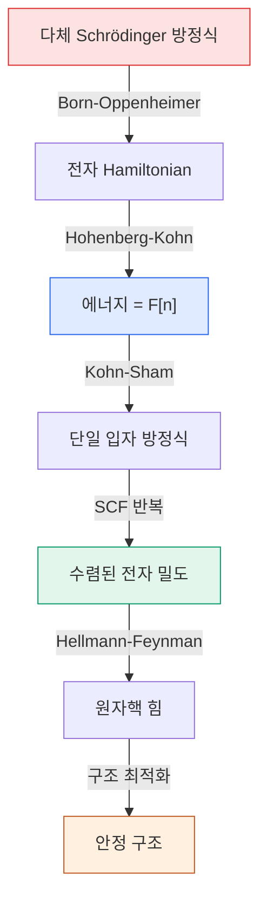

# DFT — Density Functional Theory (밀도범함수이론)

> 다체 Schrödinger 문제를 전자 밀도 n(r)의 범함수로 축소하고, Kohn–Sham 방정식을 SCF로 self-consistent하게 풀어 구조의 전자적 성질·에너지를 얻는 제1원리 계산법.

## 목차
1. 다체계 Hamiltonian
2. Hartree 단위계
3. Born-Oppenheimer 근사
4. 독립 전자 근사 (Independent Electron Approximation)
5. Slater Determinant와 전자 밀도
6. Hartree-Fock 방법
7. Hohenberg-Kohn 정리
8. Kohn-Sham 방정식과 SCF
9. 원자핵 위치 업데이트 (구조 최적화)
10. Energy Cutoff와 K-point
11. Smearing

---
## 1. 다체계 Hamiltonian
### 출발점: 슈뢰딩거 방정식
DFT의 근본적인 목표는 **다체계(many-body system)의 Hamiltonian을 풀어** 전자의 에너지와 분포를 구하는 것이다.
$$\hat{H}\Psi = E\Psi$$
여기서 파동함수 $\Psi$는 **모든 전자와 원자핵의 좌표**에 의존한다:
$$\Psi = \Psi(\mathbf{r}_1, \mathbf{r}_2, \dots, \mathbf{r}_N, \mathbf{R}_1, \mathbf{R}_2, \dots, \mathbf{R}_M)$$
- $\mathbf{r}_i$: 전자 $i$의 위치
- $\mathbf{R}_I$: 원자핵 $I$의 위치

### 확률 밀도 해석
$$P(\mathbf{r}_i) = \int |\Psi(\mathbf{r}_1, \dots, \mathbf{r}_N, \mathbf{R}_1, \dots, \mathbf{R}_M)|^2 \, d\mathbf{r}_1 \cdots d\mathbf{r}_N \, d\mathbf{R}_1 \cdots d\mathbf{R}_M$$
- **전자 $i$가 위치 $\mathbf{r}$에 있을 확률**: $P(\mathbf{r}=\mathbf{r}_i)$
- **전자 밀도**: $n(\mathbf{r}) = P(\mathbf{r}=\mathbf{r}_1) + P(\mathbf{r}=\mathbf{r}_2) + \cdots$

> [!note] 핵심 문제점
> Many-body 파동함수 $\Psi(\mathbf{r}_1, \mathbf{r}_2, \dots)$는 $3N$개의 변수를 가지므로 **직접 풀기가 사실상 불가능**하다. 전자 간의 **Coulomb repulsion** 때문에 분리가 안 되며, **double counting issue**도 발생한다.

### 완전한 Hamiltonian 구성 요소
$$\hat{H} = \underbrace{-\sum_i \frac{1}{2}\nabla_i^2}_{\text{전자 운동에너지}} + \underbrace{\sum_i V_n(\mathbf{r}_i)}_{\text{전자-핵 인력}} + \underbrace{\sum_{i<j} \frac{1}{|\mathbf{r}_i - \mathbf{r}_j|}}_{\text{전자-전자 반발}} + \underbrace{\sum_{I<J} \frac{Z_I Z_J}{|\mathbf{R}_I - \mathbf{R}_J|}}_{\text{핵-핵 반발}}$$
**부가 설명**: 전자-전자 간 repulsion 항이 가장 문제가 되는 부분이다. 이 항 때문에 Hamiltonian을 단순히 각 전자에 대해 분리할 수 없다. DFT의 핵심적인 기여는 이 다체 문제를 **전자 밀도 $n(\mathbf{r})$** 라는 3개 변수의 함수로 재구성하는 것이다.

---
## 2. Hartree 단위계
계산의 편의를 위해 **Hartree 원자 단위(atomic units)**를 사용한다:

| 물리량 | Hartree 단위에서의 값 |
|--------|----------------------|
| 전자 질량 $m_e$ | 1 |
| 전하 $e$ | 1 |
| $\hbar$ | 1 |
| Bohr 반지름 $a_0$ | 1 |
| 에너지 단위 (1 Hartree) | $\approx 27.2$ eV |

- **거리**: Bohr 반지름의 배수로 표현
- **에너지**: Hartree 또는 Rydberg ($1\,\text{Ry} = 0.5\,\text{Ha} \approx 13.6\,\text{eV}$) 단위

> [!tip] 실용적 의미
> VASP에서는 에너지를 eV로, Quantum ESPRESSO에서는 Rydberg로 출력한다. 단위 변환에 주의해야 한다.

---
## 3. Born-Oppenheimer 근사
$$\hat{H}\Psi = E\Psi$$
**핵심 아이디어**: 원자핵의 질량이 전자보다 훨씬 크므로 ($M_{\text{핵}} \gg m_e$), **원자핵은 고정되어 있고 전자만 움직이는 것**으로 가정한다.
$$\Psi(\mathbf{r}_i, \mathbf{R}_I) \approx \psi(\mathbf{r}_i; \mathbf{R}_I) \cdot \chi(\mathbf{R}_I)$$
- $\psi$: 전자에 대한 파동함수 (원자핵 위치는 매개변수)
- $\chi$: 원자핵의 파동함수

이 근사를 적용하면 **전자의 Hamiltonian**만 풀면 된다:
$$\hat{H}_{\text{el}} = \underbrace{-\sum_i \frac{1}{2}\nabla_i^2}_{\text{Kinetic energy}} + \underbrace{\sum_i V_n(\mathbf{r}_i)}_{\text{전자-핵 Potential}} + \underbrace{\sum_{i<j} \frac{1}{|\mathbf{r}_i - \mathbf{r}_j|}}_{\text{전자-전자 Repulsion}}$$
$$\hat{H}_{\text{el}}\psi = E_{\text{el}}\psi$$
**부가 설명**: 전자는 매우 빠르게 움직이므로 원자핵 위치가 살짝 변해도 전자는 즉시 새로운 ground state에 도달한다고 본다. 이 근사로 $3(N_e + N_n)$차원 문제를 $3N_e$차원으로 줄인다.

---
## 4. 독립 전자 근사 (Independent Electron Approximation)
### Hamiltonian 분리
전자-전자 상호작용을 일단 무시하면:
$$\hat{H} \approx \sum_i \hat{H}^{(1)}(\mathbf{r}_i) \quad \Rightarrow \quad \sum_i \hat{H}^{(1)}(\mathbf{r}_i)\psi = E\psi$$
단일 전자 Hamiltonian:
$$\hat{H}^{(1)}(\mathbf{r}_i) = -\frac{1}{2}\nabla_i^2 + V_n(\mathbf{r}_i)$$
### 파동함수의 곱
$$\Psi(\mathbf{r}_1, \dots, \mathbf{r}_N) = \phi_1(\mathbf{r}_1)\phi_2(\mathbf{r}_2)\cdots\phi_N(\mathbf{r}_N)$$
$$E = \varepsilon_1 + \varepsilon_2 + \cdots + \varepsilon_N$$
> [!important] 한계
> 독립 전자 근사는 전자-전자 상호작용을 완전히 무시하므로 부정확. 이를 개선하려고 **Hartree → Hartree-Fock → DFT**로 발전한다.

---
## 5. Slater Determinant와 전자 밀도
### 전자의 반대칭성 (Antisymmetry)
전자는 **페르미온**이므로 파동함수는 두 전자 교환에 대해 **반대칭**이어야 한다. 단순 곱은 이 조건을 못 만족.
### Slater Determinant
$$\Psi(\mathbf{r}_1, \mathbf{r}_2) = \frac{1}{\sqrt{2}} \begin{vmatrix} \phi_1(\mathbf{r}_1) & \phi_2(\mathbf{r}_1) \\ \phi_1(\mathbf{r}_2) & \phi_2(\mathbf{r}_2) \end{vmatrix} = \frac{1}{\sqrt{2}}\left[\phi_1(\mathbf{r}_1)\phi_2(\mathbf{r}_2) - \phi_2(\mathbf{r}_1)\phi_1(\mathbf{r}_2)\right]$$
**부가 설명**: Slater determinant는 자동으로 Pauli 배타원리를 만족(두 전자가 같은 상태면 determinant=0).
### 전자 밀도의 유도
$$n(\mathbf{r}) = |\phi_1(\mathbf{r})|^2 + |\phi_2(\mathbf{r})|^2 + \cdots = \sum_i |\phi_i(\mathbf{r})|^2$$
교차항은 직교성 $\langle\phi_i|\phi_j\rangle = \delta_{ij}$로 사라진다.
### 밀도 → Potential
Poisson 방정식으로 Hartree potential:
$$\nabla^2 V_H(\mathbf{r}) = -4\pi n(\mathbf{r}), \qquad V_H(\mathbf{r}) = \int \frac{n(\mathbf{r}')}{|\mathbf{r}-\mathbf{r}'|}d\mathbf{r}'$$
> [!note] Charge density → Potential
> 전자 밀도를 알면 Poisson으로 potential을 구한다. 이것이 SCF 반복의 핵심.

---
## 6. Hartree-Fock 방법
### Mean Field 접근
전자 하나에 나머지 전자들의 효과를 **평균 potential(Mean Field)**로 대체:
$$\left[-\frac{1}{2}\nabla^2 + V_n(\mathbf{r}) + V_H(\mathbf{r})\right]\phi_i(\mathbf{r}) = \varepsilon_i\phi_i(\mathbf{r})$$
### 에너지 (Coulomb + Exchange)
$$E = \sum_i \langle\phi_i|\hat{H}^{(1)}|\phi_i\rangle + \underbrace{\int \frac{|\phi_i(\mathbf{r})|^2|\phi_j(\mathbf{r}')|^2}{|\mathbf{r}-\mathbf{r}'|}d\mathbf{r}\,d\mathbf{r}'}_{\text{Hartree(Coulomb)}} - \underbrace{\int \frac{\phi_i^*(\mathbf{r})\phi_j(\mathbf{r})\phi_j^*(\mathbf{r}')\phi_i(\mathbf{r}')}{|\mathbf{r}-\mathbf{r}'|}d\mathbf{r}\,d\mathbf{r}'}_{\text{Exchange}}$$
Exchange는 반대칭성에서 나온다:
$$\left[-\frac{1}{2}\nabla^2 + V_n + V_H + V_x\right]\phi_i = \varepsilon_i\phi_i$$
> [!warning] Hartree-Fock의 한계
> Exchange는 포함하지만 **correlation은 빠져있다.** 동적 상관효과 부재로 결합/반응 에너지에 오차.

---
## 7. Hohenberg-Kohn 정리
### 정리 1: 밀도-Potential 일대일 대응
$$E = F[n(\mathbf{r})]$$
$$n(\mathbf{r}) \xrightarrow{\text{uniquely}} V(\mathbf{r}) \to \hat{H} \to \Psi \to E$$
→ **밀도가 주어지면 에너지가 결정된다.**
### 정리 2: 변분 원리
$$E[n_0] \leq E[n]$$
에너지를 최소화하는 밀도가 ground state 밀도.
**부가 설명**: $3N$변수 variation을 **3변수 함수** $n(\mathbf{r})$의 variation으로 축소 — DFT의 혁명.

---
## 8. Kohn-Sham 방정식과 SCF
### Kohn-Sham 방정식
$$\left[-\frac{1}{2}\nabla^2 + V_n(\mathbf{r}) + V_H(\mathbf{r}) + V_{xc}(\mathbf{r})\right]\phi_i(\mathbf{r}) = \varepsilon_i\phi_i(\mathbf{r})$$

| 항 | 의미 |
|---|------|
| $-\frac{1}{2}\nabla^2$ | 운동에너지 |
| $V_n$ | 핵-전자 정전기 |
| $V_H$ | Hartree (전자-전자 정전기) |
| $V_{xc}$ | **Exchange-Correlation (핵심)** |

> [!important] Exchange-Correlation
> $V_{xc}$는 exchange+correlation을 **모두 포함**. HF에서 빠진 correlation이 여기 들어감. 정확한 $V_{xc}$를 모르니 **근사 범함수(LDA/GGA/hybrid)** 사용.

### Energy Functional
$$E[n] = T_s[n] + \int V_n n\,d\mathbf{r} + \frac{1}{2}\iint \frac{n(\mathbf{r})n(\mathbf{r}')}{|\mathbf{r}-\mathbf{r}'|}d\mathbf{r}\,d\mathbf{r}' + E_{xc}[n]$$

### SCF 반복
```
① 초기 밀도 n(r) 추정
② Hamiltonian 구성: V_H(Poisson), V_n, V_xc[n]
③ Kohn-Sham 방정식 → 새 φ_i(r)
④ 새 밀도 n(r) = Σ|φ_i(r)|²
⑤ 수렴 확인 → 종료 / 미수렴 → ②
```
**부가 설명**: VASP `EDIFF`(에너지 수렴 1e-4 eV), `NELM`(SCF 최대 60). QE는 `conv_thr`(예 1e-8 Ry). → **self-consistent하게 푼 것.**

---
## 9. 원자핵 위치 업데이트 (구조 최적화)
### Hellmann-Feynman 힘
$$\mathbf{F}_I = -\frac{\partial E}{\partial \mathbf{R}_I} = -\int n(\mathbf{r})\frac{\partial V_n}{\partial \mathbf{R}_I}d\mathbf{r} + \sum_{J\neq I}\frac{Z_I Z_J(\mathbf{R}_I-\mathbf{R}_J)}{|\mathbf{R}_I-\mathbf{R}_J|^3}$$
→ 이 힘으로 원자 위치를 업데이트(ionic step) → 구조 최적화.
```
초기 구조 → SCF → 힘 → 원자 이동 → SCF → ...
```
- 수렴: VASP `EDIFFG=-0.01`(|F|<0.01 eV/Å), QE `forc_conv_thr`(예 1e-4).

---
## 10. Energy Cutoff와 K-point
### 평면파 기저 (Bloch)
$$\psi_k(\mathbf{r}) = e^{i\mathbf{k}\cdot\mathbf{r}}u_k(\mathbf{r}), \qquad u_k(\mathbf{r}) = \sum_{\mathbf{G}} C_{\mathbf{G}}e^{i\mathbf{G}\cdot\mathbf{r}}$$
### Energy Cutoff
$$\frac{1}{2}|\mathbf{k}+\mathbf{G}|^2 \leq E_{\text{cut}}$$
VASP `ENCUT=400`(eV) / QE `ecutwfc`,`ecutrho`(Ry). 높이면 정확↑·비용↑ → **수렴 테스트 필수.**
### K-point Grid
Brillouin zone을 **Monkhorst-Pack**으로 샘플링. 대칭 활용해 계산량 절감. **셀이 크면 적은 k로 충분**(k×L 밀도).
> [!tip] 실무 팁
> ① cutoff과 k-point를 **각각 독립** 수렴. ② cutoff 먼저 → k-point. ③ POTCAR에 권장 ENCUT.

---
## 11. Smearing
### 필요성
Fermi 분포처럼 **smooth한 occupancy**를 줘서 numerical 문제를 피한다.
### 문제 원인
- Brillouin zone **finite sampling** 특성. metal은 Fermi 근처 flat band라 smearing 없이는 band가 완전 채움/빔으로 튄다.
### 해결
SCF에서 iteration마다 Fermi/밴드가 달라져 charge density가 크게 변하면 수렴 문제 → **temperature smearing**으로 occupancy를 smooth하게 + mixing으로 안정화.
> [!note]
> DFT는 기본 0 K이라 smearing은 **수렴 파라미터**. 높은 온도로 시작해 수렴시킨 뒤 낮춰가며 결과 불변 확인.

**부가 설명**: VASP `ISMEAR`(0 Gaussian / 1 MP / -5 tetrahedron), `SIGMA`(0.05~0.2). Metal `ISMEAR=1,SIGMA=0.2` / Insulator `ISMEAR=0,SIGMA=0.05` 또는 `-5`(DOS).

---
## 전체 요약

한 문장 요약: **다체 문제를 전자 밀도라는 3차원 함수로 축소하고, Kohn-Sham 방정식을 SCF로 self-consistent하게 풀어, 주어진 구조의 전자적 성질과 에너지를 계산하는 이론.**

---
**우리 캠페인 적용**: Quantum ESPRESSO(평면파+pseudopotential)로 gap·EOS·elastic·ε∞를, LOBSTER로 ICOHP를 계산. canonical 레시피(pseudo/ecut/k)는 조성·물성마다 다르니 Methods 페이지 참조 — comp1은 USPP·k444·ecut 52/520, 비교 전 반드시 확인.

*tags: DFT · Kohn-Sham · SCF · Hamiltonian · Born-Oppenheimer · Hartree-Fock · 전자밀도 · Exchange-Correlation · 평면파기저*
