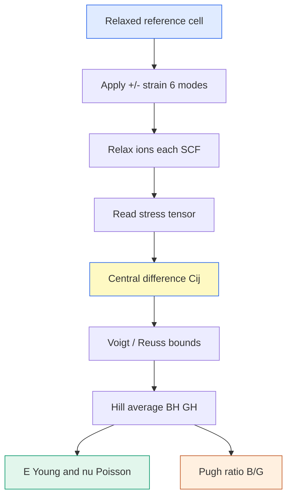

# Elastic constants — 탄성상수 $C_{ij}$ 와 VRH 평균

> 결정에 미소 변형을 주고 되돌아오는 응력을 재서 6×6 강성 텐서 $C_{ij}$를 얻고, 이를 Voigt–Reuss–Hill로 평균해 다결정 물성 $B, G, E, \nu$를 뽑는 방법. SE의 기계적 견고함·연성/취성을 판정한다.

## 목차
1. 응력–변형 관계와 $C_{ij}$ 텐서
2. Voigt / Reuss / Hill 평균
3. $B, G, E, \nu$ 계산
4. Pugh ratio $B/G$ — 연성 vs 취성
5. Relaxed-ion vs Clamped-ion
6. Strain 방법 (±변형 SCF)

---
## 1. 응력–변형 관계와 $C_{ij}$ 텐서
선형 탄성에서 응력 $\sigma$와 변형 $\varepsilon$은 Hooke 법칙으로 연결된다. Voigt 표기(6-성분)로 쓰면:

$$\sigma_i = \sum_{j=1}^{6} C_{ij}\,\varepsilon_j, \qquad i,j \in \{1,\dots,6\}$$

$C_{ij}$는 대칭 6×6 행렬이라 독립 성분은 최대 21개. 입방정(cubic)이면 대칭으로 **$C_{11}, C_{12}, C_{44}$ 3개**만 독립이다.

$$C^{\text{cubic}} = \begin{pmatrix} C_{11} & C_{12} & C_{12} & 0 & 0 & 0 \\ C_{12} & C_{11} & C_{12} & 0 & 0 & 0 \\ C_{12} & C_{12} & C_{11} & 0 & 0 & 0 \\ 0 & 0 & 0 & C_{44} & 0 & 0 \\ 0 & 0 & 0 & 0 & C_{44} & 0 \\ 0 & 0 & 0 & 0 & 0 & C_{44} \end{pmatrix}$$

> [!note] 물리적 감각
> $C_{11}$은 한 축을 늘릴 때의 뻣뻣함, $C_{12}$는 옆으로 새는 응답(Poisson성), $C_{44}$는 전단(shear) 뻣뻣함이다. 세 개면 입방 결정의 탄성을 완전히 기술한다.

### 역학적 안정성 (Born 조건)
탄성값을 인용하기 전에 그 구조가 **역학적으로 안정**한지부터 확인한다. 강성 행렬이 양의 정부호(positive-definite)여야 하며, 입방정의 Born 안정 조건은:

$$C_{11} > 0, \quad C_{44} > 0, \quad C_{11} > |C_{12}|, \quad C_{11} + 2C_{12} > 0$$

하나라도 어기면 그 변형 모드에 대해 결정이 불안정 → 탄성값이 무의미하다. (동등하게 $C_{ij}$의 모든 고유값이 양수여야 한다.)

---
## 2. Voigt / Reuss / Hill 평균
단결정 $C_{ij}$를 실제 다결정(무작위 배향)의 등방 물성으로 바꾸려면 평균이 필요하다.

- **Voigt**: 변형이 균일하다고 가정 → 상한(upper bound)
- **Reuss**: 응력이 균일하다고 가정 → 하한(lower bound)
- **Hill (VRH)**: 두 값의 산술 평균 → 실측에 가장 근접

입방정 기준 bulk / shear modulus:

$$B_V = B_R = \frac{C_{11} + 2C_{12}}{3}$$

$$G_V = \frac{C_{11} - C_{12} + 3C_{44}}{5}, \qquad G_R = \frac{5(C_{11}-C_{12})C_{44}}{4C_{44} + 3(C_{11}-C_{12})}$$

Hill 평균:

$$B_H = \frac{B_V + B_R}{2}, \qquad G_H = \frac{G_V + G_R}{2}$$

| 평균 | 가정 | 역할 |
|------|------|------|
| Voigt | uniform strain | 상한 |
| Reuss | uniform stress | 하한 |
| Hill | 산술 평균 | 실측 근사 (우리가 인용) |

---
## 3. $B, G, E, \nu$ 계산
Hill의 $B_H, G_H$에서 Young 계수 $E$와 Poisson 비 $\nu$가 나온다.

$$E = \frac{9 B_H G_H}{3 B_H + G_H}, \qquad \nu = \frac{3 B_H - 2 G_H}{2(3 B_H + G_H)}$$

- $B$ (bulk): 등방 압축에 대한 저항
- $G$ (shear): 전단 변형에 대한 저항
- $E$ (Young): 단축 인장 뻣뻣함 — 우리가 조성 비교에 주로 인용하는 스칼라
- $\nu$ (Poisson): 늘릴 때 옆으로 수축하는 비율

우리는 조성 간 기계적 강성을 한 숫자로 비교하려 **$E_{\text{VRH}}$** (Hill 기반 Young)를 대표값으로 쓴다.

---
## 4. Pugh ratio $B/G$ — 연성 vs 취성
Pugh 비 $B/G$는 재료가 연성(ductile)인지 취성(brittle)인지 가르는 경험 지표다.

$$\text{Pugh ratio} = \frac{B}{G} \quad\begin{cases} > 1.75 & \text{연성 (ductile)} \\ < 1.75 & \text{취성 (brittle)} \end{cases}$$

SE는 셀 조립·사이클 중 갈라지지 않아야 하니 **적당한 연성**이 유리하다. Poisson 비 $\nu$도 같은 방향($\nu \gtrsim 0.26$이면 연성 경향)을 가리킨다.

> [!tip] 왜 SE에서 중요한가
> 너무 뻣뻣하고 취성이면 충·방전 부피 변화에서 crack이 생겨 접촉이 끊긴다. 반대로 너무 물러도 dendrite를 못 막는다. $B/G$와 $E$를 같이 보며 균형점을 찾는다.

---
## 5. Relaxed-ion vs Clamped-ion
변형을 준 뒤 셀 안 원자 위치를 **다시 이완시키느냐**가 갈림길이다.

- **Clamped-ion (frozen)**: 변형된 셀에서 원자를 격자와 함께 고정. 내부 이완이 빠져 강성이 **과대평가**된다.
- **Relaxed-ion**: 변형된 셀에서 원자 위치를 힘=0까지 재이완. 실제 물성.

우리 데이터에서 clamped-ion은 relaxed-ion 대비 **약 2.3배 과대**하게 나온 사례가 있다. 그래서 인용값은 **반드시 relaxed-ion**이다.

$$C_{ij}^{\text{relaxed}} = C_{ij}^{\text{clamped}} - C_{ij}^{\text{internal}}$$

$C_{ij}^{\text{internal}}$이 내부 원자 이완 기여(항상 강성을 낮춤).

> [!warning] Clamped 과대평가
> Clamped-ion 값을 실물성으로 인용 금지 — 우리 셋업에서 최대 **~2.3배** 부풀려진 사례가 있다. 조성 비교표에는 relaxed-ion만 올린다.

---
## 6. Strain 방법 (±변형 SCF)
$C_{ij}$는 에너지의 변형 2차 미분, 또는 응력의 변형 1차 미분으로 얻는다.

$$C_{ij} = \frac{1}{V}\frac{\partial \sigma_i}{\partial \varepsilon_j} = \frac{1}{V}\frac{\partial^2 E}{\partial \varepsilon_i \partial \varepsilon_j}$$

실무는 **유한 변형 stress–strain**: 독립 변형 모드마다 $+\delta$와 $-\delta$ 두 변형을 주고 응력을 재서 중앙차분으로 기울기를 뽑는다. 대칭을 고려해 대략 **12개 변형 SCF**(±6 모드)면 텐서가 채워진다.

$$C_{ij} \approx \frac{\sigma_i(+\delta_j) - \sigma_i(-\delta_j)}{2\delta_j}$$

각 변형점마다 **relaxed-ion** 이완을 돌린다. 변형 크기 $\delta$는 선형 영역(보통 0.5~1%)에 있어야 하며, 너무 작으면 노이즈·너무 크면 비선형이 섞인다.

**한 문장 요약**: ±변형 SCF로 relaxed-ion $C_{ij}$를 채우고 Voigt–Reuss–Hill로 평균해 $B, G, E, \nu$와 Pugh 비를 얻어 SE의 강성·연성을 판정한다.

---
## 우리 캠페인 적용
인용값은 **relaxed-ion Hill(VRH) Young 계수** $E_{\text{VRH}}$. Setup: USPP, k444, ecut 52/520 Ry (comp1).

| 조성 | 약칭 | $E_{\text{VRH}}$ relaxed-ion (GPa) | 비고 |
|------|------|-----------------------------------|------|
| Li₆PS₅Cl | comp1 | **22.06** | 문헌 ~23 GPa와 일치 |
| Li₅.₄PS₄.₄Cl₁.₆ | modelc | **27.66** | Cl-rich, 더 뻣뻣 |
| LPSOCl (+O) | lpsocl | **35.04** | O 도핑, 최고 강성 |

- comp1 22.06 GPa가 문헌 ~23 GPa와 정합 → 셋업(USPP·k444·cubic-52) 검증됨.
- **comp1 ↔ comp2만** 같은 cubic-52 조건의 완전 비교쌍 (comp2는 현재 USPP·k444로 재측정 중).
- **Br 치환은 결합을 약화**시켜 **comp2 < comp1** 예상 — 이는 ICOHP(Li–Br −1.93 < Li–Cl −2.11)와 정합하는 방향.
- Clamped-ion 값(~2.3× 과대)은 표에 올리지 않는다.

*tags: elastic constants · Cij · Voigt Reuss Hill · bulk modulus · shear modulus · Young · Poisson · Pugh ratio · relaxed-ion · stress-strain*
