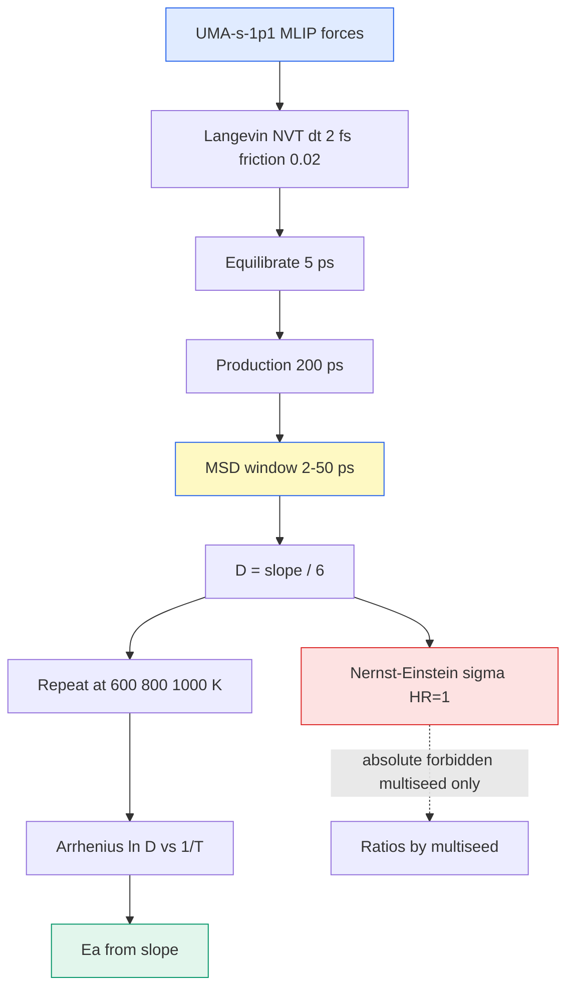

# MD (MLIP) / MSD / Arrhenius — 분자동역학 이온수송

> 기계학습 퍼텐셜(MLIP)로 DFT 힘을 대체해 큰 셀을 긴 시간 돌리고, Li 이온의 평균제곱변위(MSD)에서 확산계수 $D$를, 온도별 $D$의 Arrhenius 기울기에서 활성화에너지 $E_a$를, Nernst–Einstein으로 전도도 $\sigma$를 뽑는 방법.

## 목차
1. Langevin NVT 동역학
2. MLIP가 DFT 힘을 대체
3. MSD와 Einstein 관계
4. 시간창 피팅
5. Arrhenius — 활성화에너지
6. Nernst–Einstein 전도도

---
## 1. Langevin NVT 동역학
일정 온도(NVT) 앙상블을 만들려고 Langevin thermostat을 쓴다. 뉴턴 운동방정식에 마찰항과 랜덤힘을 더해 원자가 열욕과 에너지를 주고받게 한다.

$$m_i \ddot{\mathbf{r}}_i = \mathbf{F}_i - m_i \gamma \dot{\mathbf{r}}_i + \sqrt{2 m_i \gamma k_B T}\,\boldsymbol{\xi}_i(t)$$

- $\mathbf{F}_i$: 퍼텐셜에서 온 힘 (MLIP가 제공)
- $\gamma$: 마찰계수 (friction) — 우리는 **0.02**
- $\boldsymbol{\xi}_i$: 백색잡음, $\langle\xi(t)\xi(t')\rangle = \delta(t-t')$
- 시간 간격 $dt$ = **2 fs**

> [!note] 왜 Langevin인가
> 마찰+잡음이 fluctuation–dissipation 정리를 만족해 정확한 온도 $T$의 정준 분포를 샘플링한다. friction이 크면 열평형은 빠르나 동역학이 흐려지고, 작으면 반대 — 0.02는 그 절충값.

---
## 2. MLIP가 DFT 힘을 대체
매 step DFT를 부르면 200 ps(10만 step)는 불가능하다. **MLIP**가 DFT 데이터로 학습된 퍼텐셜 에너지면 $E(\{\mathbf{r}_i\})$을 주고, 그 그래디언트로 힘을 즉석에서 준다.

$$\mathbf{F}_i = -\nabla_{\mathbf{r}_i} E_{\text{MLIP}}(\{\mathbf{r}_j\}) \;\approx\; \mathbf{F}_i^{\text{DFT}}$$

우리는 **UMA-s-1p1 (omat)** 파운데이션 모델을 쓴다. DFT급 정확도를 유지하며 수천 배 빠르다 → 통계적으로 의미 있는 확산 통계를 얻는다.

> [!warning] UMA는 Li₃N에 사용 금지
> UMA는 LPSCl 계열 MD에서 검증된 표준이지만, **Li₃N에는 결정론적 편향**이 확인돼(2026-06 판정) 사용 금지. 모델의 적용 범위를 벗어나면 힘이 계통적으로 틀린다.

---
## 3. MSD와 Einstein 관계
확산은 평균제곱변위(MSD)로 측정한다. 시간 $t$ 동안 각 Li가 얼마나 멀어졌나의 앙상블 평균이다.

$$\text{MSD}(t) = \big\langle |\mathbf{r}_i(t) - \mathbf{r}_i(0)|^2 \big\rangle$$

3차원 확산에서 MSD는 시간에 선형이고, 기울기가 확산계수 $D$를 준다 (Einstein 관계):

$$\text{MSD}(t) = 6 D t \;\Longrightarrow\; D = \frac{1}{6}\frac{d\,\text{MSD}(t)}{dt}$$

계수 6은 3차원(각 축 $2Dt$ × 3). 2D 확산이면 4, 1D면 2로 바뀐다.

---
## 4. 시간창 피팅
MSD 곡선 전체를 다 쓰면 안 된다. 구간마다 성격이 다르다.

- **초기(ballistic, < ~1 ps)**: $\text{MSD}\propto t^2$ — 아직 확산 아님, 진동
- **중간(diffusive)**: $\text{MSD}\propto t$ — 여기 기울기가 진짜 $D$
- **후기(long-time)**: 통계 부족으로 노이즈 급증

그래서 **MSD 피팅 창을 2–50 ps로 고정**한다. 이 창을 조성마다 똑같이 써야 비교가 공정하다.

$$D = \frac{1}{6}\cdot\frac{\text{MSD}(50\,\text{ps}) - \text{MSD}(2\,\text{ps})}{50 - 2\,[\text{ps}]}$$

| 구간 | 거동 | 사용 |
|------|------|------|
| 0–1 ps | ballistic $t^2$ | 제외 |
| **2–50 ps** | diffusive $t^1$ | **피팅** |
| > 50 ps | noisy | 제외 |

Setup: equilibration **5 ps** 버린 뒤 production **200 ps** 생성.

### 피팅 품질 체크
- **선형성**: 2–50 ps 창에서 MSD가 직선인지($R^2$) 확인 — 굽으면 아직 diffusive 아님.
- **평형 확인**: equilibration 뒤 온도·에너지가 평탄한지 본다 (앞 5 ps는 버림).
- **등방성**: $x, y, z$ 성분 MSD가 비슷한지 — 한 축만 크면 통계 부족 또는 1D 채널.
- **시드 평균**: 서로 다른 초기속도 시드로 반복해 블록 평균 — 단일시드는 못 믿는다.

---
## 5. Arrhenius — 활성화에너지
확산은 열활성 과정이라 온도에 Arrhenius 의존한다.

$$D(T) = D_0 \exp\!\left(-\frac{E_a}{k_B T}\right) \;\Longrightarrow\; \ln D = \ln D_0 - \frac{E_a}{k_B}\cdot\frac{1}{T}$$

$\ln D$ vs $1/T$가 직선이고, **기울기 $= -E_a/k_B$**. 우리는 **600 / 800 / 1000 K 3점**으로 피팅한다.

$$E_a = -k_B \cdot \frac{d(\ln D)}{d(1/T)}$$

> [!important] 400/500 K를 제외하는 이유
> 저온에선 200 ps 안에 hop이 몇 번 안 일어나 MSD 통계가 diffusive 영역에 못 든다 → $D$가 과소·노이즈. 그래서 **400/500 K는 판정에서 제외**하고 600/800/1000 K 3점만 쓴다. $E_a$ 오차막대는 600 K 3-시드로 낸다.

---
## 6. Nernst–Einstein 전도도
확산계수에서 이온 전도도 $\sigma$를 추정한다 (Haven ratio = 1 가정).

$$\sigma = \frac{N q^2}{V k_B T}\, D \qquad (H_R = 1)$$

- $N/V$: Li 수밀도, $q$: Li 전하
- $H_R=1$은 이온 운동 상관을 무시한 상한 근사

> [!warning] 절대값 인용 금지 · 멀티시드 판정만
> UMA-MD의 **$D$·$\sigma$ 절대값은 citeable truth가 아니다.** 조성 간 **비율조차 멀티시드로 판정**해야 하며 단일시드 값은 못 믿는다 — 실제로 단일시드 1.33× 우세 주장이 멀티시드에서 철회된 사례(SEMIFINAL 2026-07-09)가 있다. 인용 가능한 건 다중시드로 재현된 순위/비율과 $E_a$(오차막대 포함)뿐.

**한 문장 요약**: UMA MLIP로 긴 NVT 궤적을 만들어 2–50 ps MSD 기울기에서 $D$를, 600/800/1000 K Arrhenius에서 $E_a$를 뽑되, $D$·$\sigma$ 절대값은 멀티시드로만 판정한다.

---
## 우리 캠페인 적용
UMA-s-1p1(omat), Langevin NVT, dt 2 fs, friction 0.02, equilib 5 ps / prod 200 ps, MSD 창 2–50 ps 고정, Arrhenius 600/800/1000 K 3점 (tools/modelc_v3/, tools/ionic/).

| 조성 | 약칭 | $E_a$ (eV) | 비고 |
|------|------|-----------|------|
| Li₆PS₅Cl | comp1 | **0.253** | 기준 |
| Li₅.₄PS₄.₄Cl₁.₆ | modelc | **0.224** | 가장 낮은 장벽 |
| LPSOCl (+O) | lpsocl | **0.279** | O 도핑, 장벽 상승 |

- $E_a$ 순서: **modelc(0.224) < comp1(0.253) < +O(0.279)**. Cl-rich가 Li 이동에 유리, O 도핑은 장벽을 올린다.
- $E_a$ 오차막대는 **600 K 3-시드**로 산출. Arrhenius는 600/800/1000 K 3점(400/500 K 제외).
- **$D$·$\sigma$ 절대값 인용 금지.** 비율·순위도 **멀티시드 판정만** (단일시드 1.33× 철회 사례).
- **UMA는 Li₃N 금지** — LPSCl 계열에는 검증된 표준.

*tags: MLIP-MD · UMA · Langevin NVT · MSD · Einstein relation · Arrhenius · activation energy · Nernst-Einstein · Li diffusion · multiseed*
