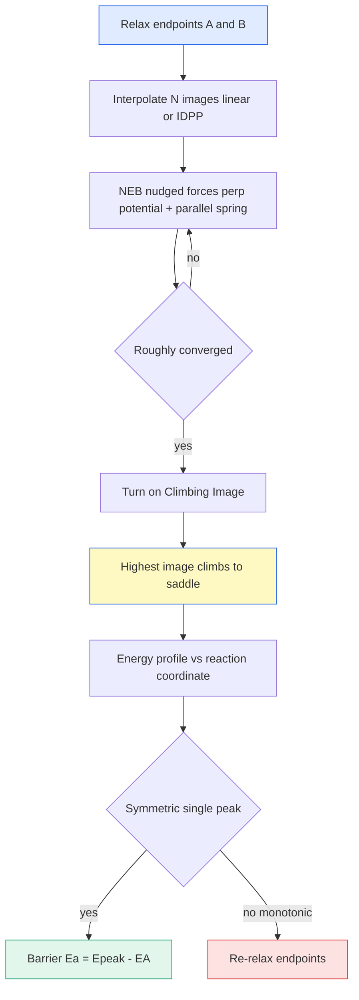

# NEB / CI-NEB — 최소에너지경로 (Nudged Elastic Band)

> 두 안정 상태 사이를 잇는 여러 중간 이미지를 스프링으로 묶어 최소에너지경로(MEP)를 찾고, climbing image로 안장점(전이상태) 에너지를 정확히 집어내는 방법. 확산 장벽을 정량화한다.

## 목차
1. MEP와 안장점
2. 이미지 + 스프링 (elastic band)
3. Nudging — 힘 투영
4. Climbing Image (CI-NEB)
5. 프로파일 피크 해석
6. 수렴과 실무 팁

---
## 1. MEP와 안장점
반응/확산은 초기 상태 $A$에서 최종 상태 $B$로 가는데, 에너지 지형에서 **가장 낮은 능선길**을 따라간다. 이게 최소에너지경로(MEP)다.

$$E_a = E(\text{saddle}) - E(A)$$

MEP 위의 최고점이 **안장점(saddle point)**: 경로 방향으론 극대, 수직 방향으론 극소인 1차 안장점. 이 점의 에너지가 곧 확산 장벽 $E_a$다.

> [!note] 안장점의 수학적 조건
> 안장점에서 $\nabla E = 0$이고 Hessian의 고유값이 **정확히 하나만 음수**다. 그 음의 방향이 반응 좌표(경로 접선). NEB는 이 점을 직접 최적화하진 않고 band로 에워싸 찾는다.

---
## 2. 이미지 + 스프링 (elastic band)
$A$와 $B$ 사이를 $N$개의 중간 구조(**이미지**)로 이산화하고, 이웃 이미지를 **스프링**으로 연결해 경로를 따라 고르게 퍼지도록 한다.

$$\mathbf{R}_0 = A,\quad \mathbf{R}_1,\ \mathbf{R}_2,\ \dots,\ \mathbf{R}_{N-1},\quad \mathbf{R}_N = B$$

스프링 힘이 이미지들이 한 골짜기로 미끄러져 뭉치는 걸 막는다:

$$\mathbf{F}_i^{\text{spring}} = k\left(|\mathbf{R}_{i+1}-\mathbf{R}_i| - |\mathbf{R}_i - \mathbf{R}_{i-1}|\right)\hat{\boldsymbol{\tau}}_i$$

$\hat{\boldsymbol{\tau}}_i$는 이미지 $i$에서의 경로 접선(tangent).

---
## 3. Nudging — 힘 투영
그냥 두면 두 힘이 충돌한다: 퍼텐셜 힘은 이미지를 골짜기로 당기고(경로를 자르며), 스프링 힘은 경로 모양을 왜곡한다. **Nudging**은 각 힘을 성분 분해해 필요한 성분만 남긴다.

- 퍼텐셜 힘은 **경로에 수직** 성분만 사용 (경로를 골로 끌어내림)
- 스프링 힘은 **경로에 평행** 성분만 사용 (간격만 조절)

$$\mathbf{F}_i = \underbrace{-\nabla E(\mathbf{R}_i)\big|_{\perp}}_{\text{perp. potential}} + \underbrace{\mathbf{F}_i^{\text{spring}}\big|_{\parallel}}_{\text{parallel spring}}$$

$$-\nabla E\big|_{\perp} = -\nabla E + (\nabla E \cdot \hat{\boldsymbol{\tau}})\hat{\boldsymbol{\tau}}$$

이렇게 "넛지"하면 band가 실제 MEP로 수렴한다.

---
## 4. Climbing Image (CI-NEB)
일반 NEB는 안장점이 두 이미지 사이에 끼면 정확한 봉우리 값을 놓친다. **CI-NEB**는 에너지가 가장 높은 이미지 하나를 골라 스프링을 떼고, 경로 방향 힘을 **뒤집어** 봉우리로 기어오르게 한다.

$$\mathbf{F}_{\text{climb}} = -\nabla E(\mathbf{R}_{\max}) + 2\big(\nabla E(\mathbf{R}_{\max})\cdot\hat{\boldsymbol{\tau}}\big)\hat{\boldsymbol{\tau}}$$

이 이미지는 수직으론 골로 내려가고 평행으론 봉우리로 올라가 **정확히 안장점에 안착**한다 → $E_a$를 이미지 개수와 무관하게 정밀하게 얻는다.

> [!tip] 언제 CI를 켜나
> 보통 일반 NEB로 대략 수렴시킨 뒤 CI를 켠다. 처음부터 CI를 켜면 climbing image가 엉뚱한 이미지로 튈 수 있다. 이미지는 보통 5~9개면 충분.

---
## 5. 프로파일 피크 해석
수렴한 에너지 프로파일($E$ vs 반응 좌표)의 **모양**이 결과의 건강을 말해준다.

| 프로파일 모양 | 해석 | 조치 |
|--------------|------|------|
| 대칭 단봉 (한 봉우리) | 진짜 안장점 = 신뢰 | $E_a$ 채택 |
| 비대칭/이중봉 | 중간 준안정상 존재 | 이미지 추가·경로 분할 |
| 단조 증가/감소 | 끝점이 안정상태 아님 | 끝점 재이완 |

$$E_a^{\text{forward}} = E_{\text{peak}} - E_A, \qquad E_a^{\text{reverse}} = E_{\text{peak}} - E_B$$

> [!important] 단조 프로파일은 경고
> 봉우리 없이 한쪽으로 계속 오르내리면 끝점 $A$ 또는 $B$가 진짜 local minimum이 아니라는 뜻. 장벽을 읽지 말고 **끝점을 다시 이완**시켜 재출발한다.

---
## 6. 수렴과 실무 팁
- **끝점 먼저**: $A, B$를 각각 힘 수렴까지 이완한 뒤 band를 건다.
- **초기 경로**: 두 끝점의 선형 보간(또는 IDPP)으로 이미지 생성.
- **수렴 기준**: 각 이미지의 수직 힘 norm이 임계값(예 0.03~0.05 eV/Å) 이하.
- **이미지 수**: 경로가 길거나 굽으면 늘린다. 부족하면 봉우리를 건너뛴다.

### 이미지 보간: linear vs IDPP
선형 보간은 두 끝점 좌표를 일직선으로 잇는데, 경로가 굽으면 중간 이미지에서 원자끼리 너무 가까워져(overlap) SCF가 터진다. **IDPP**(Image-Dependent Pair Potential)는 원자간 거리를 부드럽게 유지하도록 초기 경로를 미리 다듬어 이 충돌을 피한다 — 굽은 경로엔 IDPP가 기본.

### NEB vs MD로 본 $E_a$
NEB는 **0 K 정적 MEP**에서 단일 도약 장벽을 준다. MLIP-MD의 Arrhenius $E_a$는 **유한 온도**에서 모든 경로·상관을 평균한 유효 장벽이다. 보통 가깝지만 같진 않다 — MD는 엔트로피·다중경로·격자 진동을 품고, NEB는 특정 경로 하나를 깨끗이 분리한다. 조화 전이상태이론(hTST)에서 시도 진동수 $\nu_0$까지 더하면 hop rate가 나온다:

$$\Gamma = \nu_0 \exp\!\left(-\frac{E_a}{k_B T}\right)$$

NEB로 경로·장벽을 특정하고 MD로 온도 의존 수송을 교차검증하는 식으로 상보적으로 쓴다.

**한 문장 요약**: 끝점 두 개를 이미지+스프링으로 잇고 nudging+climbing image로 안장점을 집어 확산 장벽 $E_a$를 얻으며, 대칭 단봉 프로파일만 신뢰한다.

---
## 우리 캠페인 적용
VGCF/hBN 호스트에서의 Li 확산 장벽 (CI-NEB 프로파일 피크 = $E_a$).

| 시스템 | Li 확산 장벽 (eV) | 해석 |
|--------|-------------------|------|
| hBN 표면 | **~0.007** | near-flat, 거의 무장벽 표면 확산 |
| Graphene | **0.273** | 문헌과 일치 (셋업 검증) |
| Gallery (2L confinement) | **0.357** | 양면 confinement trap, 장벽 최대 |

- **hBN 표면 ~0.007 eV**: 사실상 평탄 → Li가 표면을 자유롭게 미끄러짐.
- **graphene 0.273 eV**가 문헌과 일치 → NEB 셋업·끝점 이완이 검증됐다는 신호.
- **gallery 0.357 eV**: 2층 사이 양면 confinement가 Li를 가둬 장벽을 올림.
- **2L2L**(이중 갤러리) 구성은 현재 진행 중.
- 프로파일은 대칭 단봉을 확인한 값만 채택 — 단조 프로파일은 끝점 재이완.

> [!note] 방법 간 비교
> "BV·NEB·MD 가 주는 $E_a$ 는 서로 다른 양"의 정리는 **[DFT](/concept/dft) §12** 에 있다
> (정의 차이 · BV 결손 물리 4가지 · 부호 뒤섞임 실측 · 신뢰도 순서).

*tags: NEB · CI-NEB · MEP · saddle point · climbing image · nudged elastic band · migration barrier · hBN · graphene · confinement*
