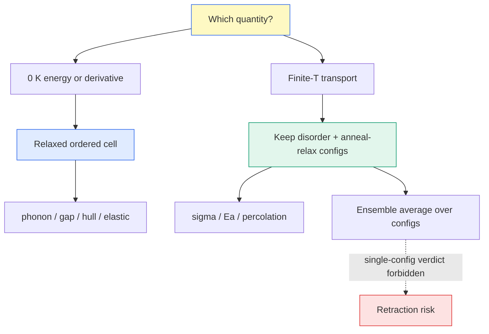

# Ordered vs Disordered — 어떤 LPSCl 구조로 계산할 것인가

> 질서(ordered) 셀과 무질서(disordered) 셀 중 "누가 맞냐"는 잘못된 질문이다. 진짜 질문은 **어떤 양을 계산하느냐** — 0 K DFT는 에너지 $E$를 재고, 합성온도의 실험 무질서 구조는 자유에너지 $F = E - TS_{\text{config}}$ 위에서 산다. 양마다 맞는 구조가 다르다.

## 목차
1. 잘못된 질문 — 누가 맞느냐가 아니다
2. 무질서는 metastable이 아니다
3. Ordered가 정답인 양 — 0 K 에너지·미분
4. Disordered가 정답인 양 — σ와 Ea
5. Rietveld 구조는 '구조'가 아니다
6. 문헌 지형 — 실험은 재고, 계산 다수파는 ordered
7. 무질서는 물질 상수가 아니라 공정 변수
8. 우리 캠페인의 위치 — 빈 다리 놓기
9. 한계 고백 — Li 부격자는 사실상 액체
10. 실전 규칙

---
## 1. 잘못된 질문 — 누가 맞느냐가 아니다
"실험 구조(무질서)가 진짜냐, 계산 구조(질서)가 진짜냐"로 싸우면 답이 없다. 두 구조는 **서로 다른 물리량의 대표자**이기 때문이다.

- 0 K DFT가 최소화하는 것: 퍼텐셜 에너지 $E$
- 합성온도의 결정이 최소화하는 것: 자유에너지 $F = E - TS_{\text{config}}$

$$F = E - T S_{\text{config}}, \qquad S_{\text{config}} = k_B \ln \Omega$$

$\Omega$는 부분점유 사이트에 원자를 배열하는 경우의 수. 0 K에선 $TS$항이 0이라 질서상이 이기고, 합성 $T$에선 $TS$항이 커져 무질서상이 이긴다. **한 줄 답: 0 K 미분·에너지는 ordered로, 유한온도 수송은 disordered로.**

---
## 2. 무질서는 metastable이 아니다
무질서 argyrodite를 "준안정 상태를 억지로 얼린 것"으로 취급하면 틀린다. 합성온도(500–550 °C)에선 배치 엔트로피 덕에 **무질서가 진짜 자유에너지 최소**다. 급랭(quench)은 그 고온 평형 배치를 실온으로 얼려 가져온 것이지, 실패한 결정화가 아니다.

> [!note] 두 세계, 두 정답
> 0 K 세계(DFT)에선 질서상이 바닥이고, 합성 $T$ 세계(실험)에선 무질서상이 바닥이다. 각자 자기 앙상블에서 옳다. 그래서 "DFT relax가 무질서를 지워버렸다"는 버그가 아니라, $E$만 보는 계산이 $TS$가 만든 상태를 못 붙잡는 **정의상의 귀결**이다.

---
## 3. Ordered가 정답인 양 — 0 K 에너지·미분
바닥상태 에너지와 그 미분으로 정의되는 양은 **relaxed ordered 셀**이 맞다. 부분점유 평균 구조에는 아예 정의가 안 되는 것도 있다.

| 물성 | 왜 ordered인가 |
|------|----------------|
| Phonon | 진동은 **에너지 최소점에서만 정의** — 부분점유 평균 구조엔 phonon 자체가 없다 |
| Band gap | VBM/CBM 고유값은 **배치가 확정된** 단일 해밀토니안이 필요 |
| Formation E / hull | convex hull은 0 K 에너지 비교 — 배치별 $E$가 입력 |
| Elastic $C_{ij}$ | 최소점 주변 2차 미분 (단, 6절의 이방성 함정 참조) |

우리 canonical gap 4개가 정확히 이 부류다 (db/properties/electronic.json, fixed-occupations nscf 고유값):

| 조성 | Canonical gap (eV) |
|------|--------------------|
| comp1 (Li₆PS₅Cl) | **2.066** |
| modelc (LPSCl1.6) | **2.099** |
| +B₂O₃ | **1.9671** |
| LPSOCl (+O) | **2.2309** |

문헌에서도 hull·자리선호 같은 0 K 에너지 물성은 ordered 배치들의 열거로 푼다 — Rao의 E_hull Li₆PS₅Cl = 24 meV/atom, Br 자리선호 4a > 4d ΔE 0.14 eV/atom 모두 **DFT rigorous enumeration** (rao2025).

---
## 4. Disordered가 정답인 양 — σ와 Ea
이온 수송은 반대다. **무질서가 전도의 원인 그 자체**라서, 완전 질서화 = 원인 삭제 = $E_a$ 과대평가다.

- 48h 부분점유(occ 0.50, kraft2017)는 곧 **빈자리** — Li가 hop할 목적지
- 4d S²⁻/Cl⁻ anti-site 섞임이 cage 사이 병목을 평탄화
- de Klerk 인용(liu2022): 4d 무질서 ↔ σ 양의 관계, **75 % 무질서에서 σ 최고**

우리 자체 증거가 li_percolation.py에 있다. Li site free-energy 지형의 퍼콜레이션 문턱 $F^*$:

| 조성 | $F^*$ (eV) | 해석 |
|------|-----------|------|
| comp1 (LPSCl) | ~0.191 | isolated cages, must climb high to connect |
| modelc (LPSCl1.6) | ~0.078 | **anti-site disorder flattens inter-cage route** |

이 $F^*$ 차이가 BVSE와 **독립적으로** MD $E_a$ 0.253 → 0.224 eV(comp1 → modelc, UMA-MD) 하락을 재현하고, static-channel paradox(BVSE 채널 −15 %인데 σ는 상승)를 해소했다. 이득은 bond-valence가 놓치는 **inter-cage 병목**에 있었다.

> [!warning] 질서화의 대가
> 무질서 구조를 "깨끗하게" 질서화해 MD를 돌리면, 실험이 재는 전도 메커니즘의 원인을 손으로 지운 셈이다. 낮은 $E_a$를 만드는 지형 평탄화가 사라져 $E_a$가 계통적으로 커진다.

---
## 5. Rietveld 구조는 '구조'가 아니다
CIF에 적힌 "occ 0.50"을 스냅샷으로 읽으면 안 된다. Rietveld 정련이 주는 것은 **시공간 평균 산란밀도**다.

- 점유 0.5 = "이 사이트에 Li가 있을 **확률** 1/2" — 어느 순간의 배치가 아님
- 거기서 사이트를 골라 만든 단일 셀 = 천문학적 $\Omega$ 중 **실현 하나** = ordered 셀만큼 인위적 (방향만 반대)
- 진짜 대응물은 단일 셀이 아니라 **배열 앙상블**

> [!important] X-ray는 Li를 거의 못 본다
> Li는 전자가 3개뿐이라 X-ray 산란이 미약 — X-ray Rietveld의 Li 점유율은 불확실하다. Kraft가 **중성자** 회절을 쓴 이유가 바로 이것 (kraft2017). 중성자 데이터라야 48h occ 0.50→0.39, 24g occ 0→0.22 같은 Li 재배치(Cl→I 계열)를 믿고 읽을 수 있다.

---
## 6. 문헌 지형 — 실험은 재고, 계산 다수파는 ordered
litdb 전수 조사 결과. 실험은 무질서를 '재기만' 하고, 계산은 대부분 무질서를 배열 하나로 뭉갠다.

| 문헌 | 진영 | 무질서 처리 | 핵심 수치 |
|------|------|-------------|-----------|
| kraft2017 | 실험 (중성자 Rietveld) | SQS·enumeration 없음 — 4a/4d 점유율 정련 | 4d 무질서 Cl 62 % → Br 22 % → I 0 % |
| liu2022 | 실험 (Rietveld) | 점유율 정련 | 13.3 % (LPSCl-550) vs 61.7 % (LPSCl₁.₅-450) |
| torii2025 | 계산 (DFT) | **single-config ordered** (명시적 SQS/enumerate 없음) | Zener A = 1.09 |
| Deng 2016 (torii2025 digest ref10) | 계산 (DFT) | **SQS** (소수파) | Zener A = 0.92 |
| rao2025 | 계산 (DFT) | rigorous **enumeration** | E_hull LPSCl 24 meV/atom |
| ishikawa2025 | 계산 (격자 모델) | **단일 무작위** 배열 — N = 24³ = 13824로 정당화 | — |
| li2025 | 계산 (DFT) | **n/a** — 미공개 ("여러 도핑 모델 비교" 서술뿐) | — |
| ma2024 | 계산 (DFT) | **n/a** — decorate 방식 미공개 | — |

> [!warning] 결정적 사례 — 부호가 뒤집힌다
> 같은 물질, 같은 물성인데 Deng SQS **A = 0.92 < 1** vs Torii ordered **A = 1.09 > 1** (torii2025 digest). **무질서 처리 방식만으로 탄성 이방성의 결론 부호가 반전**됐다. 자기비판: 우리 relaxed-ion comp1 A = 1.14가 Torii와 가까운 건 독립 검증이 아니라 **둘 다 ordered라는 같은 편향을 공유**한 탓일 수 있다.

---
## 7. 무질서는 물질 상수가 아니라 공정 변수
같은 argyrodite 계열에서 4d 무질서가 **13.3 % ↔ 61.7 %**로 갈린다 (liu2022) — annealing 온도와 조성(Cl-rich)에 따라. 무질서 정도가 합성 이력을 타는 이상, **"LPSCl의 $E_a$"라는 단일 숫자 질문은 성립하지 않는다.** "어떤 공정으로 만든, 어느 무질서 수준의 LPSCl"까지 붙여야 물음이 완성된다.

> [!note] 절대값 비교 금지의 또 다른 이유
> Kraft의 $E_A$(Cl) = 0.46 eV는 **total(bulk+GB) 임피던스** 값 (kraft2017). 우리 comp1 0.253 eV는 **bulk MLIP-MD** (li_transport.json). 차이의 대부분은 방법차(GB 포함 여부, impedance vs MD)지 실물리가 아니다 — 방법 병기 없이 절대값을 나란히 놓지 말 것.

---
## 8. 우리 캠페인의 위치 — 빈 다리 놓기
실험(점유율 확률)과 계산 다수파(단일 배열) 사이에는 **다중 배열 앙상블**이라는 다리가 비어 있다. 우리 설계가 그 다리다.

- **Ordered 축**: 52-atom 정형셀 (F-43m; Li 24g/48h, P 4b, S 4a/16e, Cl 4c) — canonical gap 4개, elastic, phonon 등 0 K 물성 담당
- **Disordered 축**: disorder ensemble — d = 0.5 / 1.0 두 레벨 × cfg0/1/2 (tools/ionic/run_comp2_disorder.sh → tools/modelc_v3/disorder_ensemble_diffusion.py)
- config마다 **UMA anneal(700 K, 20 ps) + relax(fmax 0.03)** 후 MD — v1(un-relaxed 라벨 스왑)은 σ₃₀₀ ~70 mS/cm artifact로 폐기(2026-07-27), 진짜 국소 최소에서 출발해야 한다
- MD 프로토콜은 ordered baseline과 동일 미러 (UMA-s-1p1 omat, Langevin NVT, dt 2 fs, friction 0.02, equilib 5 ps / prod 200 ps, MSD 창 2–50 ps, 600/800/1000 K)
- 비교 기준선(ordered): comp2 $E_a$ 0.276±0.033 / comp1 0.253 eV (comp2_md_arrhenius.json, li_transport.json)

> [!warning] 단일 config 판정 금지
> 앙상블에서 config 하나의 결과로 결론 내리는 건 단일시드 판정과 같은 오류다 — 단일시드 1.33× 우세 주장이 멀티시드에서 철회된 사례(SEMIFINAL 2026-07-09)를 기억할 것. **cfg 전체의 평균·산포로만 판정**한다. 진행 중인 앙상블 수치는 완주 전까지 인용하지 않는다.

---
## 9. 한계 고백 — Li 부격자는 사실상 액체
작동온도의 superionic 상에서 Li 부격자는 정의된 평형 위치 없이 흐르는 **준액체**다. 그래서 우리 disorder ensemble도 만능이 아니다.

- 조화(harmonic) phonon으로 **Li 모드를 읽지 말 것** — 최소점 주변 작은 진동이라는 전제가 Li엔 깨져 있다
- 유의미한 건 **골격 PS₄ phonon**뿐 (P–S 공유 골격은 단단한 최소점에 앉아 있다)
- Li의 열역학은 phonon이 아니라 MD 통계(MSD, hop)로 다룬다

---
## 10. 실전 규칙

> [!important] 구조 선택 규칙
> **0 K 미분·에너지 (phonon · gap · formation/hull · elastic) → relaxed ordered 셀.**
> **유한온도 수송 (σ · $E_a$ · 퍼콜레이션) → 무질서 유지 + 앙상블 평균.**
> 어느 쪽이든 배열 하나로 결론 내리지 않는다.

**한 문장 요약**: 0 K DFT는 $E$를, 실험 무질서 결정은 $F = E - TS_{\text{config}}$를 산다 — 에너지·미분 물성은 relaxed ordered로, 수송은 무질서 유지 + 다중 배열 앙상블로 계산하고, 배열 하나로는 절대 판정하지 않는다.

---
## 우리 캠페인 적용
- Ordered 52-atom 정형셀: canonical gap comp1 2.066 / modelc 2.099 / +B₂O₃ 1.9671 / LPSOCl 2.2309 eV (db/properties/electronic.json, fixed-occ nscf 고유값)
- Disordered ensemble: d = 0.5/1.0 × cfg0/1/2, UMA anneal+relax 후 MD — v1 un-relaxed swap은 artifact로 폐기 (tools/ionic/run_comp2_disorder.sh)
- 무질서 → 수송 인과의 자체 증거: $F^*$ 0.191 → 0.078 eV가 $E_a$ 0.253 → 0.224 eV를 BVSE와 독립 재현 (tools/ionic/li_percolation.py)
- 자기비판 유지: 우리 A = 1.14 ≈ Torii 1.09는 공유 편향(둘 다 ordered)일 수 있음 — Deng SQS 0.92 부호반전 사례를 항상 옆에 둔다

**litdb 출처** (수치는 모두 digest 소환값 — 우리 db 절대값과 방법 병기 없이 섞지 말 것):
kraft2017_lattice_polarizability_argyrodite_Li6PS5X.md · liu2022_cl_crystallization_interface_argyrodite.md · torii2025_lpscl_mechanical_anisotropy_dft.md · ishikawa2025_site_percolation_cooperative_ion_conduction.md · rao2025_iodide_argyrodite.md · li2025_cubr2_dualdoping_argyrodite.md · ma2024_sb_doping_lpsc_conductivity.md

*tags: ordered · disordered · configurational entropy · free energy · Rietveld occupancy · SQS · enumeration · ensemble average · argyrodite · site percolation*
