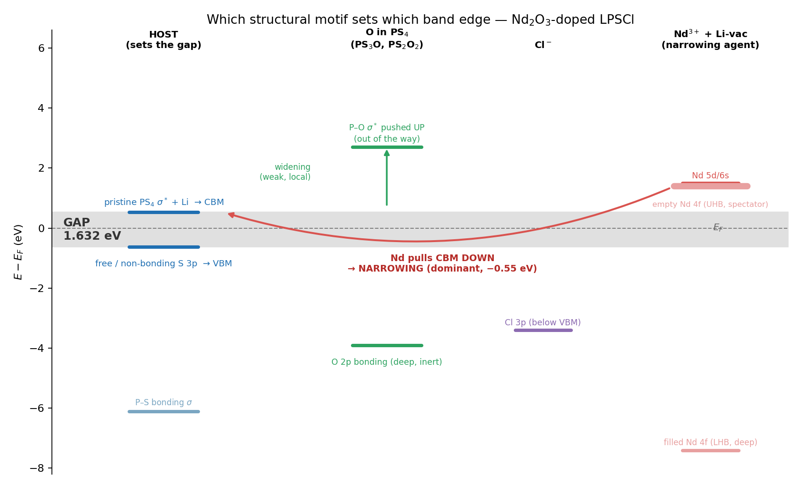
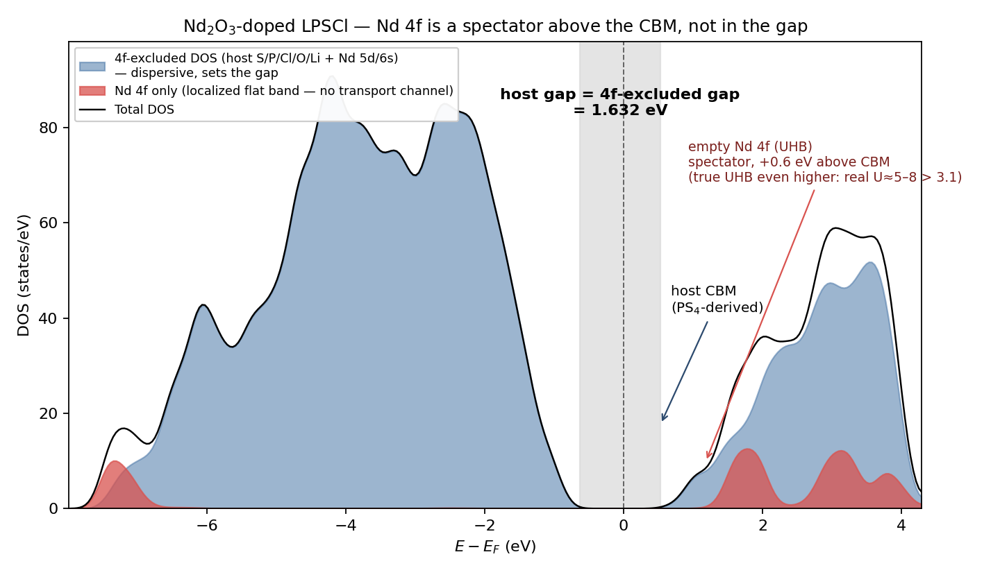

> 작성일: 2026-06-17  주제: Nd₂O₃ 도핑 LPSCl의 band gap이 "넓어지지 않고 좁아지는" 이유 (host-band narrowing)
> 관련: [[260318_PBE+U가_Nd_band_gap을_재현못하는_이유]], [[260316_SEI_Convex_Hull_Band_Gap_종합분석_v2]], [[vacancy_mechanism_corrected_2026_05_08]]

---

# Nd₂O₃ 도핑 LPSCl 밴드갭: 왜 O 도핑인데 갭이 좁아지나

## 목차
1. [한 줄 결론](#1-한-줄-결론)
2. [문제 현상 — 모순처럼 보이는 것](#2-문제-현상--모순처럼-보이는-것)
3. [쉬운 설명 — 비유로 이해하기](#3-쉬운-설명--비유로-이해하기)
4. [host 갭은 누가 만드나 (VBM=S, CBM=PS₄)](#4-host-갭은-누가-만드나)
5. [각 구조 motif가 갭 어디를 건드리나](#5-각-구조-motif가-갭-어디를-건드리나)
6. [narrowing 주범 = Nd³⁺ (두 경로)](#6-narrowing-주범--nd³⁺)
7. [같은 Nd인데 5d는 작용하고 4f는 구경만 하는 이유](#7-5d는-작용-4f는-구경)
8. [실제 구조 팩트체크 (O speciation, Nd 자리)](#8-실제-구조-팩트체크)
9. ["NdS₄였으면?" — 가능성과 결과](#9-nds₄였으면)
10. [4f를 빼고 본 갭 (host gap)](#10-4f를-빼고-본-갭)
11. [신뢰도 — U=8 eV를 쓴 이유](#11-신뢰도--u8-eV)
12. [문헌 결론 — 내 모델은 맞나?](#12-문헌-결론--내-모델은-맞나)
13. [논문 표현 예시](#13-논문-표현-예시)
14. [데이터/그림 요약](#14-데이터그림-요약)
15. [태그](#15-태그)

---

## 1. 한 줄 결론
> **"O 도핑은 갭을 넓힌다"는 문헌은 맞다. 우리 Nd₂O₃ 셀이 갭이 좁아진 것도 맞다. 둘은 모순이 아니다 — 차이를 만든 건 O가 아니라 Nd³⁺다.**
> 우리 결과: undoped 2.184 eV → Nd₂O₃-doped **1.632 eV (−0.55 eV, narrowing)**. 이건 host 밴드(S 3p / PS₄)가 Nd³⁺ 때문에 이동한 결과이고, O는 오히려 (약하게) 넓히는 쪽으로 작동한다.

---

## 2. 문제 현상 — 모순처럼 보이는 것
| | 기대 (문헌) | 우리 DFT |
|---|---|---|
| O 도핑 효과 | band gap / 산화안정성 창 **증가** | ? |
| Nd₂O₃ 도핑 결과 | — | gap **감소** 2.184 → 1.632 eV |

"O를 넣었는데 왜 갭이 줄지? 계산이 틀렸나?" 가 출발 질문. **결론은 안 틀렸다.** 핵심은 우리가 넣은 게 **순수 O가 아니라 Nd₂O₃(= Nd³⁺ + O²⁻ 동시도핑)**라는 것.

---

## 3. 쉬운 설명 — 비유로 이해하기

### 3-1. 밴드갭 = "전자가 위층으로 올라가는 통행료"
- 1층(가전자대, VBM) = 전자가 꽉 차 있는 층 → **천장 = VBM**
- 2층(전도대, CBM) = 전자가 비어있는 층 → **바닥 = CBM**
- 통행료(갭) = 천장과 바닥 사이 거리. 이 거리가 멀수록 전자가 못 흐름(절연체).

### 3-2. 각 원자단의 "성격"
```
free S²⁻ (자유 황)   : 게으른 세입자. 1층 천장(VBM)에 느슨하게 매달림 → 갭 천장 담당
PS₄ 사면체           : 튼튼한 골조. 그 반결합(σ*)이 2층 바닥(CBM) → 갭 바닥 담당
O (PS₃O/PS₂O₂)       : 극단주의자. 자기 방을 지하(−4 eV)로 내리고, 자기 천장은 더 높이 올림
                       → 갭 가장자리에서 양쪽 다 비켜남 → "넓히려 하지만 약함"
Cl⁻                  : 조용한 세입자. 1층 아래에 묻힘 → 갭에 거의 영향 없음
Nd³⁺ (5d/6s)         : 팔이 긴 사람. 옆방(PS₄)과 손을 섞음 → 2층 바닥(CBM)을 끌어내림 → 갭 좁힘
Nd 4f               : 은둔자. 두꺼운 벽(5s/5p)에 갇혀 아무와도 안 섞임 → 갭과 무관(구경꾼)
```

### 3-3. 줄다리기
```
        O : "갭을 넓히자" (위로 약하게)   ↑ 약함
       Nd : "갭을 좁히자" (아래로 강하게)  ↓ 강함
   ───────────────────────────────────────
   순효과 : 아래로 → 갭 -0.55 eV (Nd 승)
```

---

## 4. host 갭은 누가 만드나
(EF=0 기준, Nd₂O₃ 셀)

| 가장자리 | 위치 | 주성분 | O 비중 |
|---|---|---|---|
| **VBM (천장)** | −0.63 eV | **free/non-bonding S 3p (88%)** + Li 7% | 0.3% |
| **CBM (바닥)** | +0.53 eV | **PS₄ 반결합(σ\*) S/P + Li** (+ Nd가 끌어내림) | 0.2% |

- **갭 = (free-S 3p) → (PS₄ σ\*).** 도펀트가 갭을 바꾸려면 이 둘 중 하나를 밀어야 함.
- **O는 양쪽 가장자리에 거의 없다(0.2–0.3%).** O 2p는 −3.9 eV(깊은 가전자대)에 묻힘 → 갭을 직접 못 정함.

---

## 5. 각 구조 motif가 갭 어디를 건드리나



| motif | frontier 상태 위치 | 갭 영향 | 메커니즘 |
|---|---|---|---|
| free S²⁻ 3p | VBM (−0.6) | **천장 고정** | 느슨한 lone-pair = 최고점 점유 상태 |
| pristine PS₄ σ\* | CBM (+0.5) | **바닥** | P–S 반결합 = 최저 빈 상태 |
| PS₃O / PS₂O₂ | O2p 깊게(−4) + P–O σ\* 위로(+2.7) | **약한 widening** | P–O가 더 강함 → 결합/반결합 분리 큼 → 자기 상태를 가장자리 밖으로 밀어냄 |
| Cl⁻ 3p | VBM 아래(−3.4) | 거의 없음 | S보다 깊음, 구경꾼 |
| **Nd³⁺ 5d/6s** | CBM 근처(+1.4) | **강한 narrowing** | 퍼진 궤도 → host PS₄ σ\*와 혼성 → CBM ↓ |
| Nd 4f | LHB −7.4 / UHB +1.4 | 없음 (갭 밖) | 차폐된 평탄밴드 = spectator |

**왜 O는 widening인데 약한가?** 단순 oxysulfide는 O가 VBM의 S를 직접 치환해 VBM을 내림 → 크게 widening. 하지만 argyrodite는 **VBM이 free-S²⁻**이고 O는 **PS₄ 안의 결합-S**를 치환한다 → VBM을 거의 안 건드림 → widening이 원래 약하다.

---

## 6. narrowing 주범 = Nd³⁺
Nd³⁺가 **두 경로**로 CBM을 끌어내린다:

**(a) 궤도 혼성 (5d/6s)**
- Nd 5d/6s는 공간적으로 퍼져 있어 host PS₄ σ\*와 **겹침 → 혼성**.
- 혼성 = level repulsion: 위의 Nd 5d/6s는 더 위로, 아래의 host CBM은 **더 아래로** 밀림 → CBM ↓.
- (CBM은 여전히 host 성분 — 5d/6s가 "정의"하진 않지만 "끌어내림")

**(b) aliovalent 정전기 + Li 공공**
- Nd³⁺가 Li⁺(+1) 자리에 +3로 앉음 → 국소 양전위 + 전하보상 Li 공공 2개.
- 양전위가 근처 전도 상태(전자)를 안정화 → CBM ↓. Li 공공이 인접 PS₄ 일그러뜨려 σ\* 추가 하강.

→ 합쳐서 host CBM −0.55 eV. **이게 O의 약한 widening을 압도.**

데이터 증거 (CBM 0.7–2.3 eV 적분 성분): **Nd 38.9%** > S 26.1% > P 18.2% > Li 9.7% ≫ **O 0.5%**.

---

## 7. 5d는 작용, 4f는 구경
(점6의 5d와 4f는 같은 Nd 궤도인데 왜 역할이 정반대인가)

| | Nd 5d/6s | Nd 4f |
|---|---|---|
| 공간 크기 | **퍼짐(diffuse)** | **수축(contracted)**, 5s/5p 안쪽에 숨음 |
| 이웃과 overlap | 큼 | ≈0 (5s5p가 차폐) |
| 혼성 | 함 | 안 함 |
| 밴드 모양 | 넓은 분산밴드 | 평탄 국재밴드(flat) |
| 갭 영향 | **CBM 내림** | **없음 (spectator)** |

> **"결합 능력 = 갭 변경 능력"**
> 5d/6s가 이웃과 겹쳐서 Nd–S, Nd–O **화학결합을 만드는 바로 그 능력**이, 밴드에선 host CBM과 혼성해 갭을 바꾸는 능력으로 나타난다. 4f는 차폐돼서 결합도 안 하고 → 밴드 가장자리도 못 건드린다. (이건 [[260318_PBE+U가_Nd_band_gap을_재현못하는_이유]]의 "4f는 spectator, 5d/6s가 결합" 과 완전히 같은 물리)

---

## 8. 실제 구조 팩트체크
(릴랙스된 120원자 셀 `paper_figures/nd2o3_doped_modelc_DFTrelax.cif`)

### 8-1. O speciation — PS₃O만 있는 게 아니다
| 사면체 | 개수 | 상세 |
|---|---|---|
| **PS₂O₂** | 1 | P24 ← O29(P–O 1.55) + O34(1.57) + S39 + S44 |
| **PS₃O** | 1 | P25 ← O40(1.60) + S30/S35/S45 |
| PS₄ | 8 | pristine |
- O 3개 = P24에 2개 + P25에 1개. **한 사면체가 O를 2개 받은 강한 국소 산화(PS₂O₂)** 존재.
- O 2개(O34, O40)는 Nd에도 배위 → **P–O–Nd 다리**.

### 8-2. Nd는 사면체가 아님
| Nd | 배위수 | 환경 |
|---|---|---|
| Nd1 | **CN=7** | O 2 + S 3 + Cl 1 + P 1 (O40 2.48 / O34 2.61 — PS₃O·PS₂O₂의 O를 붙듦) |
| Nd78 | **CN=6** | S 5 + Cl 1 (NdS₅Cl) |
- Nd–S = 2.62 Å vs P–S = 2.07 Å (**+0.55 Å 더 김**). Nd는 6~7배위 큰 다면체 = oxide-rich pocket.

---

## 9. "NdS₄였으면?"
(Nd가 P 자리에 들어가 NdS₄ 사면체가 됐으면 달랐을까?)

**가능한가? → 사실상 불가능**
- Nd³⁺(~0.98 Å) ≈ 5× P⁵⁺(0.17 Å). 작은 PS₄ 사면체에 못 들어감.
- P=4배위 선호, Nd=6~9배위 선호 (위 데이터 CN 6~7이 증거).
- 전하 P⁵⁺→Nd³⁺ = −2 → Li 침입자 +2 필요.
- db Track 2(Nd→P 대조군) 예측: 형성에너지 **+1~3 eV/Nd 불리** → 화학적으로 거부.

**달랐을까? → 달라지지만 narrowing이 더 심해지는 쪽**
- Nd를 프레임워크에 박아 직접 Nd–S 결합↑ → Nd 5d 혼성↑ → CBM 더 내려옴 → **narrowing ↑**.
- 즉 Nd를 어디 넣든 5d+정전기가 CBM을 끌어내려 **항상 narrowing**. widening으로 못 돌림.
- widening을 되찾는 유일한 길 = Nd를 통째로 빼기(O-only). 자리 변경으론 불가.

---

## 10. 4f를 빼고 본 갭
(localized 4f는 전도 채널이 안 되니 "host gap"만 따로 보자는 관점)



- 빈 Nd 4f(UHB)는 **+1.1~1.9 eV** = host CBM(+0.53)보다 **~0.6 eV 위**. 찬 4f(LHB)는 −7.4 깊이.
- **4f는 갭 안도 CBM도 아니다.** → **4f-excluded gap = host gap = 1.632 eV** (빼도 안 변함).
- 즉 narrowing은 4f-in-gap 효과가 아니라 **host 밴드 이동(Nd 5d+정전기)**. 이게 신뢰도에 중요(11번).

---

## 11. 신뢰도 — U=8 eV
- 우리 Nd 갭 계산은 **DFT+U(Nd 4f, U=8 eV) + nspin2 AFM**. U=8은 실제 4f on-site U(5–8 eV) 범위 안.
- 덕분에 4f가 제대로 국재 → **NdOCl/LiNdO₂처럼 metal로 안 무너지고** 깨끗한 절연체 유지(N(EF)=0). ([[260318_PBE+U가_Nd_band_gap을_재현못하는_이유]]의 U=3.1 실패 사례보다 신뢰도 높음)
- 캐비엇: **절대값 1.632는 GGA 과소평가 + 4f U 민감성** → 하한/U-의존. 단 **host-band narrowing 추세는 견고**(가장자리가 S/PS₄라서, [[260318...]] 기준 "PBE 신뢰 영역").

---

## 12. 문헌 결론 — 내 모델은 맞나?
**맞다. 문헌과도 모순 없다.** 문헌은 "순수 O", 우리는 "O+Nd" — 다른 케이스라 충돌 자체가 안 됨.

| 주장 | 근거 문헌 |
|---|---|
| host 갭 S 3p/PS₄, 궤도 혼성 | Ke 2025 ESM(10.1016/j.ensm.2025.104125); Braga 2026 Batteries |
| **O → 갭/ESW 넓힘** | ACS AMI 2022(10.1021/acsami.1c14573); ChemRxiv 2021(10.26434/chemrxiv-2021-3j2sz) |
| **PBE+U가 4f 갭 실패 / Nd₂O₃ O2p→4f UHB** | arXiv:2110.00400(Nd₂O₃/La₂O₃); arXiv:1208.0503; Dudarev 1998 PRB 57,1505 |
| 4f 차폐(spectator), 5d/6s 결합 | lanthanide contraction(교과서); PMC12199375 |
| aliovalent M³⁺ → Li공공 + 밴드이동 | Chem.Mater. 2021(10.1021/acs.chemmater.0c03090); Y³⁺-LPSCl PMC11106650 |

(전체 맵: `db/literature/nd_o_doping_mechanism_refs.md`)

**유일한 "틀리는" 경우 = 귀인 오류.** narrowing을 "O 때문"이라 쓰면 틀림. **"Nd³⁺ 때문"이라 쓰면 맞음** (데이터: CBM 39% Nd, 0.5% O).

**솔직한 빈틈**: La/Nd를 황화물 argyrodite에 직접 도핑한 논문은 없음 → 우리 Nd₂O₃-LPSCl은 **사실상 신규**(셀링포인트). 가장 가까운 실험 선례 = 보유 중인 La₂O₃+O("La+O") σ↓ 데이터.

---

## 13. 논문 표현 예시
**본문:**
> "Unlike isolated oxygen substitution, which widens the oxidative-stability window of Li₆PS₅Cl [refs], Nd₂O₃ co-doping narrows the fundamental gap by 0.55 eV (2.18 → 1.63 eV). The narrowing originates from the aliovalent Nd³⁺ — its diffuse 5d/6s states hybridize with, and its positive potential plus charge-compensating Li vacancies electrostatically pull down, the PS₄-derived conduction-band minimum. Oxygen does not drive the narrowing: its 2p states lie ~4 eV below the valence-band maximum, and the localized Nd 4f manifold (U = 8 eV) remains outside the gap (occupied −7.4 eV, empty +1.4 eV above the CBM), leaving the cell a clean insulator (N(E_F)=0)."

**SI / reviewer 대응:**
> "The absolute gap retains the usual semilocal-DFT underestimation and a residual sensitivity to the Nd 4f U value; however, because both band edges are host-derived (S 3p / PS₄), the host-band narrowing trend is robust. Placing Nd on the P site (NdS₄) is chemically unfavorable (≈5× cation-size mismatch; +1–3 eV/Nd) and would only deepen the narrowing, not reverse it."

---

## 14. 데이터/그림 요약
**수치**
- gap: undoped(U0_matched) 2.184 / Nd₂O₃ 1.632 eV (Δ −0.55). VBM 3.081 / CBM 4.712 / EF 3.879 (QE 절대).
- CBM 성분(0.7–2.3 eV): Nd 38.9 / S 26.1 / P 18.2 / Li 9.7 / O 0.5 / Cl 0.9 %.
- VBM 성분(−2~−0.6): S 87.9 / Li 7.4 / Cl 2.5 / Nd 0.9 / O 0.3 / P 0.3 %.
- O 2p 봉우리 −3.91 eV. 빈 4f +1.1~1.9 / 찬 4f −7.4 eV.
- 방법: 120원자, k661, DFT+U(4f,8eV), nspin2 AFM.

**그림** (`docs/figures/dos_pdos_smooth/`)
- `nd_DOS.png`, `nd_PDOS.png` — Nd₂O₃ DOS/PDOS (가우시안 0.15)
- `modelc_DOS.png`, `modelc_PDOS.png` — undoped 비교
- `nd_4f_excluded_gap.png` — 4f가 갭 밖 spectator임을 시각화
- `motif_level_diagram.png` — 각 motif가 어느 가장자리를 만드는지

**관련 db**
- `db/properties/electronic.json` → `eigenvalue_gaps_v100_2026_06_16` (Nd_narrowing_mechanism)
- `db/compositions/modelc_nd_doped.json` → `relaxed_O_speciation_verified_2026_06_17`
- `db/literature/nd_o_doping_mechanism_refs.md`

---

## 15. 태그
#BandGap #Nd도핑 #Nd2O3 #LPSCl #argyrodite #PBE+U #4f전자 #5d혼성 #host_band_narrowing #aliovalent #PS3O #PS2O2 #oxysulfide #CBM #VBM #SpectatorBand #DFT
