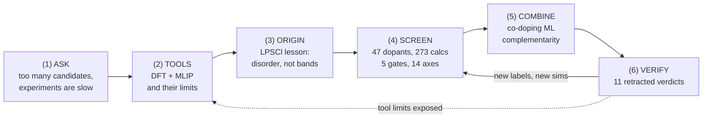

# 🎤 Research Seminar **BUILD SHEET v3** — 사진만 붙이면 끝나는 판

> 이 파일 하나로 덱을 만든다. 슬라이드마다 **레이아웃 / 그대로 타이핑할 텍스트 /
> 붙일 그림 파일 경로(영문 캡션 포함) / 대본 🎙 / 방어 🛡(질문+용어)** 가 다 있다.
> 형식: 이가형 연구세미나 템플릿 승계 — 4:3 · 표지 "Research Seminar" · `Part N` 구분 ·
> 섹션 헤더(navy bold) · `■` 대제목 / `·` 소제목 · **우상단 약어정의 + 참고문헌(이탤릭)** ·
> 하단 HANYANG UNIVERSITY / Battery Materials Lab. / 페이지번호.
> 그림 라벨·캡션은 **영어만** (하우스 룰).
>
> v1/v2 spec 과 v2 script 는 이 파일이 **대체**한다.
> 문헌 그림은 전부 `litdb/figures/<slug>/` 크로핑 PNG — **4장 핵심 그림은 직접 확인했다**(본 그림 ✅ 표시).

---

## 0. 제목 — cascade 를 버리고 전체를 아우른다

발표 내용 = DFT 기초 + LPSCl 착상 + 273계산 스크리닝 + co-doping ML + 철회 11건 + 인프라.
"cascade" 는 이 중 한 조각이다. 후보 3:

| # | 제목 | 왜 |
|---|---|---|
| ★추천 | **Self-Auditing Computational Screening of Sulfide Solid Electrolytes** — *from DFT gates to dopant combinations* | 전 내용 포괄 + 논지(자기 감사)가 제목에 있다. 부제가 범위(DFT→조합)를 잡아준다 |
| 2 | Computational Design of Sulfide Solid Electrolytes: Screening, Combining, and Catching Our Own Errors | 더 직설적. "Catching Our Own Errors" 가 세미나 톤으로 매력 있으나 도발적 |
| 3 | From Atoms to Candidates — and Back: A Verification-First Pipeline for Sulfide Solid Electrolytes | 루프 구조(and Back)를 제목화. 다만 첫인상에 내용이 안 보임 |

표지 하단 한 줄(국문, 작게): *"게이트가 걸러낸 것들의 기록 — 판정 11건을 철회시킨 스크리닝 파이프라인"*

---

## 1. 실효성 감사 (fable, 2026-08-10) — 이 발표가 성립하는가

**판정: 성립한다. 단, 아래 4개를 지켰을 때만.**

| 축 | 진단 | 처방 (빌드에 반영됨) |
|---|---|---|
| **논지 근거** | "게이트가 스크리닝이다"의 증거 = 철회 11건. **전부 repo 에 영수증이 있다**(커밋·open_items·registry). 반박당할 구멍 없음 | S19 표의 모든 행에 근거 위치를 노트로 유지 |
| **최대 위험: "그래서 뭘 했다는 거냐"** | 자기비판 4장(Part 6)이 연속이라, 적대적 청중은 "성과가 없다"로 들을 수 있다 | S23 에 **deliverables 를 표로 먼저** 박는다(6항목). 철회는 "성과의 부록"이 아니라 "게이트 밀도의 증거"로 프레이밍 — Q12 답변 준비됨 |
| **funnel 허수아비 위험** | funnel 을 세워놓고 때리면 "너희가 만든 걸 너희가 반박"으로 보일 수 있다 | S10~S13 에서 **문헌 방식 그대로** 먼저 그린다(Sendek·Xiao 실물 그림). 반박(S14)은 "그들이 틀렸다"가 아니라 "**우리 질문에는** 끝점이 아니다"로 한정 |
| **보류 값 유출** | comp1 Ea 0.253 · LPSOCl 0.287 · SDCP Δ · Nd₂S₃ 1.79 가 본문에 나오면 자기모순 | 이 값들은 **S19 철회 표 안에만** 존재한다. 발표 전 체크리스트 §5 에 재확인 항목 |
| **시간** | 본문 25장 / 40분 = 장당 96초. 빠듯함 | ⏭ 표시 4장(S9 후반·S15·S18 후반·S24 후반)은 시간 밀리면 한 문장으로 건너뛰는 스킵 라인 제공 |
| **정직성의 역이용** | R²=0.089 를 보여주면 "그럼 왜 하나"가 온다 | S17-S18 에서 **원인(라벨 부재)→처방(라벨 계산)** 을 붙여서 끝낸다. 문제만 두고 내려오지 않는다 |

**자산 실사(2026-08-10)**: litdb digest **164편** · db/properties **188파일** · canonical registry **28항목 (배선 28/28 · 대조실패 0 · provenance_open 4)** · webapp 15페이지. → 발표 수치는 전부 이 안에서만 나온다.

---

## 2. ★ 발표 지도 (모식도) — 이걸로 외운다

**P2 에 이 그림이 들어가고, Part 시작마다 우하단에 작게 재등장한다("지금 여기" 점등).**

- **PPT 재현**: 좌→우 6개 라운드 박스 + 굵은 화살표. F→D 실선 회귀 화살표(아래로 둘러서),
  F→B 점선 회귀 화살표(위로 둘러서). 색: 박스 navy 테두리, VERIFY 만 적갈색 채움.
- **외우는 법 — 동사 여섯 개**: **묻고 → 재고 → 배우고 → 거르고 → 엮고 → 의심한다.**
  각 Part 전환 때 이 동사만 떠올리면 다음 슬라이드가 자동으로 나온다.
- 논지와 그림이 같다: **VERIFY 에서 화살표가 되돌아가는 것** 자체가 "self-auditing" 이다.
  닫는 말도 이 그림 앞에서 한다 ("오늘 발표는 이 루프를 한 바퀴 돈 것입니다").

---

## 3. 슬라이드 빌드 (P1–P27 본문 + P28–P34 Appendix)

표기: ⏱ 목표 초 · ⏭ = 시간 밀리면 스킵 가능 · ✅ = 그림을 직접 확인함 ·
🖼 = 붙일 파일 · 🎙 = 대본 · 🛡 = 방어(질문·용어)

─────────────────────────────────────────────────────────────────────

### [P1] 표지 ⏱ 30
- **텍스트**: Research Seminar / **Self-Auditing Computational Screening of Sulfide Solid Electrolytes** — *from DFT gates to dopant combinations* / 안용훈 · Battery Materials Lab. · 2026-08-XX
- 🎙 "재료공학과 안용훈입니다. 오늘은 황화물 고체전해질을 계산으로 스크리닝한 이야기인데,
  '무엇을 찾았나'만큼 '**무엇을 우리 손으로 철회했나**'를 같이 보여드리겠습니다.
  그게 왜 발표할 만한 이야기인지가 오늘의 주제입니다."
- 🛡 용어: **sulfide solid electrolyte(황화물 고체전해질)** — 액체 전해질을 대체하는 이온전도성 고체. 우리 대상은 아지로다이트 Li₆PS₅Cl 계열.

### [P2] S0. 발표 지도 ⏱ 60
- **레이아웃**: 지도 그림 전면 1장 (§2 모식도)
- **텍스트**: `■` One loop, six stops
  `·` ASK → TOOLS → ORIGIN → SCREEN → COMBINE → VERIFY → (back)
  `·` The last stop feeds the first ones — that loop **is** the method
- 🖼 §2 모식도 (PPT 도형으로 그리기 — 파일 불필요)
- 🎙 "발표 전체가 이 한 바퀴입니다. 여섯 정거장 — 묻고, 재고, 배우고, 거르고, 엮고,
  마지막에 의심합니다. 그리고 의심에서 나온 화살표가 **다시 앞으로 돌아갑니다.**
  이 되돌아가는 화살표가 오늘 발표의 핵심 주장입니다. 각 Part 시작마다 이 지도에
  지금 어디인지 표시하겠습니다."
- 🛡 Q: "왜 지도부터?" → A: "여섯 정거장 중 마지막(VERIFY)이 논지라서, 구조를 먼저 보여야 앞 다섯이 왜 필요한지 보입니다."

─────────────────────────────────────────────────────────────────────
## Part 1 — ASK (2장)

### [P3] S1. 후보는 많고 실험은 느리다 ⏱ 90
- **레이아웃**: 좌 55% 그림 / 우 45% 불릿
- **텍스트**:
  `■` The screening problem
  `·` One argyrodite host, four knobs: halogen **species × ratio × dopant × concentration** — multiplicative
  `·` One experiment = synthesis + XRD + EIS + cell ≈ **weeks**; one calculation = **hours–days**
  `·` Computation does **not replace** experiments — it narrows where they go
- 🖼 좌: 조성공간 팬아웃 도식(PPT 도형: host 1개 → 가지 4단). 우하단 미니: funnel 예고 숫자만 `47 → 43 → 25 → 11 → 1`
- **우상단**: *Sendek et al., EES 2017* · 약어 `EIS = electrochemical impedance spectroscopy`
- 🎙 "아지로다이트 하나에도 조절 손잡이가 네 개고 이건 곱으로 늘어납니다. 실험 한 점이 몇 주,
  계산 한 점이 몇 시간이면 — 계산의 일은 대체가 아니라 **실험이 갈 곳을 좁히는 것**입니다."
- 🛡 Q: "계산이 몇 시간이라는 근거는?" → A: "SCF·relax 급 기준. MD·NEB 는 며칠 — 그래서 뒤에 나올 3-tier 로 싼 것부터 겁니다."
  · 용어: **argyrodite(아지로다이트)** — Ag₈GeS₆ 광물형 구조족. Li₆PS₅Cl 이 대표. / **EIS** — 교류 임피던스로 이온전도도를 재는 실험.

### [P4] S2. ★ 논지 — 게이트가 스크리닝이다 ⏱ 110
- **레이아웃**: 상단 문장 크게, 하단 좌우 대비 도식
- **텍스트**:
  `■` Screening is only as good as its gates
  `·` Screening talks end with *"we found X out of N"* — the pass side
  `·` The harder question: **did the wrong ones actually fail?** Nobody reports that
  `·` This talk shows **11 verdicts we retracted ourselves**, and **which gate caught each**
  `·` Without those gates, all 11 numbers would have shipped
- 🖼 PPT 도식: 왼쪽 "usual funnel (pass only)" vs 오른쪽 "ours (fail reasons + self-retractions marked red)"
- 🎙 "스크리닝 발표는 보통 '몇 개에서 몇 개를 찾았다'로 끝납니다. 통과한 쪽 얘기죠.
  더 어려운 질문은 '**떨어져야 할 게 정말 떨어졌나**'입니다. 아무도 보고 안 합니다.
  오늘 저는 저희가 냈다가 **철회한 판정 열한 건**을 보여드리고, 각각 어느 게이트가
  잡았는지 붙이겠습니다. 게이트가 없었으면 이 열한 개 숫자는 그대로 나갔습니다."
- 🛡 Q: "철회가 많다 = 부실한 것 아닌가?" → A(핵심, 외울 것): "철회 건수는 신뢰도의 반대 지표가 아니라 **게이트 밀도의 지표**입니다. 게이트 없는 파이프라인은 철회가 0건입니다 — 틀린 게 없어서가 아니라 **못 찾아서**입니다."
  · Q(EN): "Isn't 11 retractions a red flag?" → "It's the opposite — a pipeline with no gates reports zero retractions, not because nothing is wrong but because nothing is checked."

─────────────────────────────────────────────────────────────────────
## Part 2 — TOOLS (3장) · 지도: 두 번째 정거장

### [P5] S3. DFT — 근사가 들어가는 자리 ⏱ 150
- **레이아웃**: 좌 도식(3N→3 차원 축소), 우 불릿
- **텍스트**:
  `■` Where the approximation enters
  `·` N-electron wavefunction lives in **3N dimensions** — unstorable
  `·` **Hohenberg–Kohn**: ground state ← electron density **n(r), 3-D**
  `·` **Kohn–Sham**: map to a non-interacting system with the same density; all unknowns → **E_xc[n]**
  `·` One place of approximation ⇒ **predictable error character**: semi-local (PBE) **underestimates gaps 30–50%** (missing derivative discontinuity)
  `·` **DFT+U** for localized d/f (our Ni 3d, U = 6.2 eV) — ⚠ U is an **empirical parameter**
  `·` ⇒ **do not trust**: absolute gaps, absolute U-sensitive quantities
- 🖼 PPT 도식: "Ψ(r₁…r_N) 3N-dim" 상자 → 화살표(HK) → "n(r) 3-dim" 상자 → 화살표(KS) → "KS orbitals + E_xc[n]" 상자(빨간 테두리 = 근사 유일 지점)
- **우상단**: *He et al., EEM 2019* · 약어 `XC = exchange–correlation · PBE = Perdew–Burke–Ernzerhof`
- 🎙 "전자 백 개면 파동함수가 삼백 차원입니다. 저장이 안 돼요. 첫 도약이 Hohenberg–Kohn —
  바닥상태는 3차원 밀도만으로 결정된다. 둘째가 Kohn–Sham — 같은 밀도를 주는 가짜
  비상호작용 계로 바꿔 풀고, 모르는 건 전부 교환상관 범함수 한 곳에 몰아넣는다.
  근사가 **한 군데에만** 들어가니 오차의 성격을 압니다: PBE 는 갭을 30~50% 과소평가합니다.
  '부정확해서'가 아니라 **미분 불연속이 없어서**입니다. 그래서 저희는 갭 절대값을 안 씁니다.
  전이금속엔 U 를 겁니다 — Ni 3d 에 6.2 eV. 다만 이건 **경험 파라미터**라서, U 를 고정하고
  같은 U 안의 차이만 인용합니다."
- 🛡 Q: "왜 hybrid(HSE) 안 쓰나?" → A: "273계산 스크리닝에 hybrid 는 비용이 두 자릿수 큽니다. 순위 문제라 같은 방법 안 차이면 충분합니다."
  · Q: "U=6.2 출처?" → A: "MP 의 VASP GGA+U 관례값과 같은 값 — 계보 확립값이며, 원전 확인이 인용 조건이라는 걸 입력 주석에도 박아 뒀습니다."
  · 용어: **derivative discontinuity(미분 불연속)** — 전자 수가 정수를 지날 때 XC 퍼텐셜이 점프해야 하는 성질. semi-local 엔 없어서 갭이 줄어든다. / **E_hull** — 조성 공간 볼록껍질 위 높이(=분해 구동력).

### [P6] S4. 관측량 사다리 — 어떤 게이트에 쓰이나 ⏱ 110
- **레이아웃**: 표 전면 (아래 표 그대로)
- **텍스트**: `■` From total energy to observables — and into which gate

| Quantity | Judges | Used in gate |
|---|---|---|
| E(V) → BM3 EOS | B₀ (stiffness) | G5 mechanical |
| C_ij → VRH | E, G, Pugh ratio | G5 mechanical |
| fixed-occupation nscf eigenvalues | band gap = **e⁻ insulation** | G2 window |
| grand-potential hull | ESW, decomposition products | G3 oxidation |
| MLIP-MD → MSD → Arrhenius | Ea, D | G4 transport |
| BVSE (bond-valence) | channels, bottlenecks (cheap) | G4 pre-screen |
| ICOHP / ELF / Bader | bonding character | not a gate — explanation |

  `·` ⚠ ICOHP **sign convention: negative = bonding** — always printed on the table
  `·` Nothing on this ladder reaches **particle/electrode scale**
- **우상단**: 약어 `EOS = equation of state · VRH = Voigt–Reuss–Hill · ESW = electrochemical stability window · BVSE = bond-valence site energy`
- 🎙 "총에너지 하나에서 사다리처럼 내려옵니다. 부피-에너지에서 강성, 변형에서 탄성상수 —
  역학 게이트. 고정 점유수 고윳값에서 갭 — 전자절연 게이트. 여기 규율이 하나 있습니다.
  **갭을 DOS 문턱으로 읽지 않습니다.** 그렇게 읽으면 0.3 eV 과소평가돼요. 저희가 실제로
  겪었고 뒤 철회 목록에 있습니다. 그랜드 퍼텐셜에서 안정창, MLIP-MD 에서 확산.
  ICOHP·ELF 는 게이트가 아니라 **설명 변수**입니다. 그리고 이 사다리 어디에도 입자
  스케일은 없습니다 — 원자 계산으로 전극 성능을 직접 말할 수 없습니다."
- 🛡 Q: "BVSE 로 왜 Ea 를 안 내나?" → A: "BVSE 는 정적 격자 위 프록시라 순위·병목 판독용입니다. 정량은 MD 로만."
  · 용어: **fixed occupations** — 부분 점유를 금지하고 정수 점유로 고정한 계산. 절연체 갭의 정본 판독법. / **grand potential(그랜드 퍼텐셜)** — Li 화학퍼텐셜을 변수로 둔 열역학 퍼텐셜: 전압 축 안정성 판정용.

### [P7] S5. MLIP — 사는 것과 못 사는 것 ⏱ 120
- **레이아웃**: 좌 불릿, 우 그림 1
- **텍스트**:
  `■` Machine-learned potentials: what they buy, what they cannot
  `·` UMA (omat head): 200 ps MD, hundreds of atoms — impossible with DFT-MD
  `·` **Three measured failures in our systems**:
  `·` ① no explicit **charge states** — bit us in SDCP (Part 6)
  `·` ② cannot select **magnetic states** — Ni oxides AFM/FM
  `·` ③ **no dispersion** in training — fatal for physisorption
  `·` Banned on Li₃N (deterministic-bias verdict, 2026-06); validated standard on LPSCl family
  `·` ⇒ MLIP = **screening-stage surrogate; champions go back to DFT**
- 🖼 `docs/figures/msd_compare/msd_LPSCl_LPSCl16_slide.png` — 캡션: *"MLIP-MD MSD, LPSCl vs LPSCl₁.₆ (200 ps, multi-seed)"*
- **우상단**: *kb/results/mlip_md_diffusive_gate_2026_08_01* · 약어 `MLIP = machine-learned interatomic potential · UMA = universal MLIP (Meta) · MSD = mean-squared displacement`
- 🎙 "DFT 로 200 피코초 MD 는 불가능합니다. 그래서 기계학습 퍼텐셜을 씁니다. 다만 저희
  계에서 실측으로 확인된 한계가 셋 있습니다. 전하 상태를 못 다루고 — 이게 Part 6 에서
  제일 비싼 교훈으로 돌아옵니다 — 자기 상태를 못 고르고, 분산력이 훈련에 없습니다.
  Li₃N 에는 아예 금지시켰습니다. 결정론적 편향이 확인됐거든요. 그래서 원칙은 하나:
  **MLIP 는 스크리닝 대체 모델이고 챔피언은 반드시 DFT 로 재검한다.**"
- 🛡 Q: "MLIP 오차가 얼마나 되나?" → A: "계·물성에 따라 다릅니다. 그래서 오차 '값'보다 **실패 유형**(전하·자기·분산)을 말씀드린 겁니다 — 유형 안에 들어오는 질문은 MLIP 로 안 닫습니다."
  · 용어: **omat** — UMA 의 무기재료 훈련 헤드. / **deterministic bias** — 시드를 바꿔도 같은 방향으로 틀리는 오차(평균으로 안 사라짐).

─────────────────────────────────────────────────────────────────────
## Part 3 — ORIGIN (2장) · 지도: 세 번째 정거장

### [P8] S6. 두 아지로다이트 — 전자구조는 거의 안 움직인다 ⏱ 110
- **레이아웃**: 좌우 ELF 그림 2장 나란히 + 하단 수치 표
- **텍스트**:
  `■` Li₆PS₅Cl vs Li₅.₄PS₄.₄Cl₁.₆ — the electronic structure barely moves
  `·` More Cl → higher σ (literature & experiment). **Why?**
  `·` Gap (fixed-occ eigenvalues): **2.066 vs 2.099 eV** — Δ = 0.033
  `·` ICOHP(PS₄): **−5.938 vs −6.000** — same bonding
  `·` Absolute values not quoted (PBE); **within-method differences only** — and the smallness **is** the result
- 🖼 좌 `docs/figures/deck_extracted/elf_comp1.png` / 우 `docs/figures/deck_extracted/elf_modelc.png` — 공통 캡션: *"ELF, Li₆PS₅Cl (left) vs Li₅.₄PS₄.₄Cl₁.₆ (right) — near-identical bonding topology"*
- **우상단**: 약어 `ELF = electron localization function · ICOHP = integrated crystal orbital Hamilton population (negative = bonding)`
- 🎙 "출발점입니다. Cl 을 늘리면 전도도가 오르는데, 왜? 전자구조 가설부터 봤습니다.
  갭 차이 0.033 eV. 결합도 ICOHP 로 거의 같습니다. 화면의 ELF 두 장도 사실상 같은
  그림이에요. **차이가 작다는 것 자체가 결론**입니다 — 이득은 여기서 오지 않았습니다."
  ⚠ (질문 오면) "이 갭 값 4종은 지금 재현성 감사 중입니다 — P24 에서 정면으로 다룹니다."
- 🛡 Q: "0.033 eV 가 오차보다 큰가?" → A: "같은 프로토콜·같은 수렴 기준 안의 차이라 방법 오차는 공통 모드로 상쇄됩니다. 어느 쪽이든 '작다'는 판정은 안 바뀝니다."
  · 용어: **ELF** — 전자가 국재된 정도(0~1). 결합의 '모양'을 보는 지도.

### [P9] S7. ★ 이득은 무질서에서 → 축 설계가 바뀌었다 ⏱ 110
- **레이아웃**: 좌 그림(BVSE 채널), 우 불릿 + 축 목록
- **텍스트**:
  `■` The gain is structural, not electronic
  `·` More Cl → **Li vacancies** (charge balance) + **4d Cl anti-site** → hop network opens
  `·` Substitution acts through **disorder**, not bands
  `·` ⇒ screening axes = **structural descriptors**: disorder promotion · Li transport · dose robustness · structural stability
  `·` Electronic axis kept **as a gate only**, never as a ranking variable
- 🖼 `docs/figures/deck_extracted/bvse_channels.png` — 캡션: *"BVSE percolation channels — the transport network the substitution opens"*
- 🎙 "바뀐 건 구조입니다. Cl 이 늘면 전하 균형 때문에 Li 공공이 늘고, Cl 이 S 자리로
  들어가는 anti-site 무질서가 커집니다. 이 둘이 홉 네트워크를 엽니다. 그래서 스크리닝
  축을 **전자 기술자가 아니라 구조 기술자**로 세웠습니다. 전자절연은 게이트로만 남기고
  순위 변수에서 뺐습니다. — 이 한 장이 저희 cascade 의 설계 이유입니다."
- 🛡 Q: "무질서가 이득이라는 직접 증거는?" → A: "MD 에서 공공 농도와 D 의 동반 상승 + BVSE 채널 % 증가. 앙상블 판정은 β 게이트 통과분만 씁니다."
  · 용어: **anti-site** — 원소가 남의 자리(여기선 Cl↔S)에 앉는 점결함. / **percolation(퍼콜레이션)** — 국소 경로들이 셀 전체를 관통하게 이어지는 문턱 현상.

─────────────────────────────────────────────────────────────────────
## Part 4 — SCREEN (7장) · 지도: 네 번째 정거장

### [P10] S8. 필드의 실물 ① — Sendek 2017 ⏱ 110
- **레이아웃**: 그림 전면(플로차트) + 하단 3불릿
- **텍스트**:
  `■` How the field screens ① — 12,831 → 21 (Sendek 2017)
  `·` MP snapshot 12,831 Li compounds → **4 prerequisite gates** (E_hull=0 · gap≥1 eV · V_ox≥4 V · no TM) → **317**
  `·` Logistic superionic classifier trained on **40 measured σ** → **21 candidates** (0.16%)
  `·` Their lesson: **prerequisite gates cut harder than the conductivity screen** (model alone leaves 1,408)
- 🖼 ✅ `litdb/figures/sendek2017_ml_screening_12k_conductors/fig_1.png` — 캡션: *"Two-track approach: structure screening (12,831) + model building on 40 measured conductors (Sendek 2017)"*
- **우상단**: *Sendek et al., EES 2017, 10, 306* · 약어 `TM = transition metal`
- 🎙 "실물부터 보시죠. Sendek 은 만이천여 종에서 출발해 전제조건 게이트 네 개로 317까지,
  그리고 실측 전도도 **40종**으로 훈련한 분류기로 **21종**까지 좁혔습니다. 그들 교훈이
  흥미로운데 — **전도도 스크린보다 전제조건 게이트가 더 세게 거릅니다.** 분류기만 쓰면
  1,408종이 남거든요. 이 '40종 훈련셋'을 기억해 두세요. 저희 도펀트가 47종이라 체급이
  같습니다 — 소표본 방어 절차를 이 논문에서 계승합니다."
- 🛡 Q: "40개로 훈련한 모델을 믿나?" → A: "그들이 LOOCV·전수 조합 특징선택·X-randomization 으로 방어했고, 저희도 같은 절차를 씁니다(P19). 핵심은 '맞다'가 아니라 '**방어 절차가 문서화됐다**'입니다."
  · 용어: **LOOCV(leave-one-out CV)** — 표본 1개를 빼고 학습→그 1개 예측을 전 표본 반복. 소표본의 표준 검증.

### [P11] S9. 필드의 실물 ② — Xiao 깔때기 · Richards 창 ⏱ 110 (후반 ⏭)
- **레이아웃**: 좌 Xiao 히스토그램 / 우 Richards 창 그림
- **텍스트**:
  `■` How the field screens ② — thermodynamic gates at scale
  `·` Xiao 2019 (coatings): **104,082 → 62,437 (gap/방사성) → 1,600 (hull) → 302 (window) → 184 (reactivity)**
  `·` Richards 2016: grand-potential **stability windows** by anion — sulfides are the **narrow yellow bars**
  `·` Same skeleton everywhere: **cheap gates first, expensive validation last**
- 🖼 좌 ✅ `litdb/figures/xiao2019_cathode_coating_screening/fig_2.png` — 캡션: *"Survivors per filter, by chemistry class (Xiao 2019)"*
  우 ✅ `litdb/figures/richards2016_interface_stability_pseudobinary/fig_2.png` — 캡션: *"Electrochemical stability windows by anion — note the narrow sulfide windows incl. Li₆PS₅Cl (Richards 2016)"*
- **우상단**: *Xiao et al., Joule 2019 · Richards et al., Chem. Mater. 2016*
- 🎙 "Ceder 계열 실물 둘. Xiao 는 십만 종을 hull, 안정창, 반응성 게이트로 184까지.
  Richards 의 이 그림 — 음이온별 안정창인데, **황화물이 저 좁은 노란 막대들**입니다.
  Li₆PS₅Cl 도 저기 있습니다. 이 좁은 창이 저희가 도펀트를 찾는 이유 그 자체이기도 합니다.
  구조는 어디나 같습니다: **싼 게이트 먼저, 비싼 검증 나중.**"
  ⏭ 스킵 라인: "Xiao·Richards 도 같은 깔때기 구조입니다 — 그림은 부록에 있습니다."
- 🛡 Q: "왜 코팅 논문(Xiao)이 우리와 비교되나?" → A: "대상은 다르지만(코팅 발굴 vs 한 host 도펀트 개질) 게이트 축과 임계값 설계가 1:1 벤치마크 대상입니다. force-fit 은 하지 않습니다."

### [P12] S10. 공통 구조, 두 개의 빈칸 — 그리고 우리의 이점 ⏱ 120
- **레이아웃**: 상단 공통구조 한 줄 + 하단 좌(빈칸 2) / 우(우리 이점 표)
- **텍스트**:
  `■` The common funnel — and the two boxes it never fills
  `·` Missing ①: **failure rates of the gates themselves** (false rejects invisible)
  `·` Missing ②: **single-dopant frame** — combinations never enter
  | Ours | Receipt |
  |---|---|
  | Gate failure record — **11 self-retractions published** | Part 6 |
  | Combinatorial step — **co-doping ML** on top of ranking | Part 5 |
  | Provenance registry — **28/28 wired, drift-checked** | live validator |
  | Everything reproducible from one repo (db 188 files · litdb 164 digests · webapp) | — |
- 🎙 "공통 구조에서 안 채워지는 칸이 둘 있습니다. 하나, 게이트 자체의 실패율 — 잘못
  떨어뜨린 걸 아무도 못 봅니다. 둘, 전부 단일 도펀트 프레임이라 **조합이 아예 못 들어옵니다.**
  저희가 채우려는 게 정확히 이 두 칸입니다. 철회 기록을 공개하는 것, 그리고 랭킹 위에
  co-doping 단계를 얹는 것. 그리고 그걸 받치는 인프라 — 정본 레지스트리 28항목이
  실시간 드리프트 검사를 받습니다."
- 🛡 Q: "남들도 내부적으론 검증할 텐데?" → A: "맞습니다 — 차이는 **공개와 배선**입니다. 우리는 철회를 지표로 발표하고, 검사기가 화면과 같은 경로를 봅니다."

### [P13] S11. 우리 파이프라인 — 47종 · 273계산 · 3-tier ⏱ 120
- **레이아웃**: 상단 파이프라인 띠(PPT 도형) + 하단 정직성 인용 박스
- **텍스트**:
  `■` Our pipeline: 47 dopants → 91 compounds × 3 doses = **273 calculations**
  `·` Tier 1 **UMA relax** (all 273) → Tier 2 **property battery** (EOS·window·transport·…) → Tier 3 **gates & axes**
  `·` Doses x ∈ {0.02, 0.05, 0.10}; every Δ referenced to the **same undoped host cell**
  `·` ⚠ Honesty header (verbatim from the JSON): *"pass counts are **not** discovery metrics — this is a curated 47-dopant pool re-expressed through literature-standard gates, **not** 'we filtered N thousands'"*
- 🖼 webapp `/cascade` 스크린샷 (상단 funnel 카드 영역) — 캡션: *"Live cascade view (web app, synced to db/)"*
- 🎙 "저희 풀은 큐레이션된 47종입니다. 화합물 91개 × 농도 3점 = 273계산. 싼 것부터 —
  UMA 이완 전수, 물성 배터리, 게이트 순서입니다. 그리고 데이터 파일 맨 위에 박아 둔
  문장을 그대로 읽겠습니다: '이 통과 수는 발견 성능 지표가 아니다.' 저희는 만 종을
  거른 게 아니라 **사람이 고른 47종을 문헌 표준 게이트로 재표현**한 겁니다.
  이 구분을 흐리면 앞의 Sendek 랑 부당 비교가 됩니다."
- 🛡 Q: "왜 47종인가/어떻게 골랐나?" → A: "코팅 문헌·전구체·원자가 다양성 기준의 화학적 큐레이션 + 리뷰어 권고 확장. 선정 이력이 JSON `pool_provenance` 에 단계별로 남아 있습니다."
  · 용어: **dose(농도점)** — 치환 분율 x. 우리는 3점을 도펀트마다 강제해 농도 내성 축을 만든다.

### [P14] S12. 게이트 5단 — 무엇이 어떻게 거르나 ⏱ 130
- **레이아웃**: 표 전면
- **텍스트**: `■` Five gates: metric, threshold, and why

| Gate | Metric | Threshold | Physical basis | Lit. analog |
|---|---|---|---|---|
| G1 structural | mean over x of Δe = E(doped)−E(host), UMA | **< 0** | favorability vs **the host itself** (not an arbitrary cut) | Xiao F2 (hull) · Sendek P1 |
| G2 window | e⁻ insulation proxy (gap-based) | keep insulating | electron leak kills self-limiting SEI | Sendek gap ≥ 1 eV |
| G3 oxidation | oxidation-onset axis | axis cut | high-V cathode side survival | Richards windows |
| G4 transport | Li-transport axis (MD/BVSE) | axis cut | the property we exist for | Kahle HT-AIMD |
| G5 mechanical | stiffness/softness axes | axis cut | contact maintenance in SSB | — |

  `·` Δe uses the **mean of 3 dose champions** (verified 47/47) — dose-blind cherry-picking is blocked
- **우상단**: *Kahle et al. 2020 (HT-AIMD)* — G4 계보
- 🎙 "다섯 게이트를 한 표로 보면 — 구조안정은 임계 0 인데 이게 임의 컷이 아니라
  **host 자기 자신**입니다. '도핑한 게 안 한 것보다 안정한가'라는 이분 질문이에요.
  그리고 농도 3점 챔피언의 **평균**을 쓰기 때문에, 제일 좋은 농도 하나만 골라 자랑하는
  체리피킹이 구조적으로 막혀 있습니다. 나머지 넷은 각 축의 컷이고, 각각 문헌 계보가
  오른쪽에 붙어 있습니다."
- 🛡 Q: "임계값 민감도는?" → A: "민감합니다 — 그래서 다음 장 워터폴의 '1'을 결론으로 안 씁니다. 게이트 상태와 값이 교차 못 하게 평탄화했고 동점군 내 순위는 무의미로 명시합니다."

### [P15] S13. 워터폴 — 47 → 43 → 25 → 11 → 1 ⏱ 100
- **레이아웃**: 좌 워터폴 막대(PPT 그래프: 47/47/43/25/11/1) / 우 게이트별 한 줄
- **텍스트**:
  `■` The waterfall, drawn the field's way
  `·` pool 47 → G1 **47** → G2 **43** → G3 **25** → G4 **11** → G5 **1 (WO₃)**
  `·` G1 passing all 47 is **by design** (threshold = the host itself)
  `·` ⚠ Do **not** read the last cell as "the answer" — next slide
- 🖼 PPT 막대 (숫자 위 표기). 색: 생존 navy / 탈락 회색
- 🎙 "문헌 방식 그대로 그리면 이렇게 됩니다. 47에서 시작해 마지막에 WO₃ 하나.
  구조안정에서 전부 통과한 건 방금 말씀드린 설계고요. 그리고 — 저는 이 마지막 칸을
  결론으로 쓰지 않을 겁니다. 다음 장이 이 발표의 방법론적 주장입니다."
- 🛡 Q: "WO₃ 가 뭐가 좋았나?" → A: "다섯 게이트를 모두 통과한 유일 후보라는 사실뿐입니다 — '최적'이라는 뜻이 아니고, 그 구분이 다음 장 주제입니다."

### [P16] S14. ★ 그런데 이걸로 못 닫는다 ⏱ 180 — **본문 최중요 장 ①**
- **레이아웃**: 좌 3논거 불릿 / 우 상단 [Zhu20] 그림 + 하단 B₂O₃ 충돌 박스
- **텍스트**:
  `■` Why the funnel is the wrong endpoint **for our question**
  `·` ① "1 survivor" is a property of the **thresholds**, not of chemistry — nudge a cut, the count moves
  `·` ② Sequential AND **destroys complementarity**: a weak-transport / superb-oxidation dopant dies at G4 — exactly the one most valuable **when paired**
  `·` ③ Axes really do collide — our own data:
  > **+B₂O₃: best transport axis (PMF ΔF_perc 0.1607 eV, 4-seed) — yet worst-group air stability** (B₂S₃ hydrolysis −0.901 eV/H₂O, 46/47th in [Zhu20] SI; our own ICOHP shows B–S bonds forming)
  `·` One composite score **cannot represent** this candidate — high is a lie, low is a lie
  `·` ⇒ ranking stays **multi-objective (14 axes)**; the next step is **combination**, not elimination
- 🖼 ✅ `litdb/figures/zhu2020_air_stable_se_design_principles/fig_3.png` (패널 a만 크롭 권장) — 캡션: *"Hydrolysis vs reduction map (Zhu 2020). Note B³⁺ at the bottom (−0.9 eV/H₂O, moisture-sensitive) — the same B our transport axis ranks first"* — **B³⁺ 위치가 그림 하단에 실제로 보인다(확인함)**
- 🎙 "세 가지 이유입니다. 첫째, 마지막 '1'은 화학이 아니라 임계값의 성질입니다.
  컷을 조금만 흔들면 숫자가 바뀝니다. 둘째가 핵심인데 — **순차 AND 는 상보성을
  구조적으로 파괴합니다.** 수송은 약한데 산화안정이 뛰어난 후보는 수송 게이트에서
  죽습니다. 그런데 그 후보야말로 수송 강한 놈과 **짝지을 때 가장 값진 후보**예요.
  깔때기는 co-doping 가설 공간을 탐색 전에 잘라 버립니다. 셋째, 실제로 충돌합니다.
  화면 오른쪽 — 저희 B₂O₃ 는 수송 축 1등이면서, Zhu 그림 **맨 아래 저 B³⁺** 보이시죠,
  가수분해 −0.9 로 공기안정 최악군입니다. 이 후보를 점수 하나로 표현할 방법이 없습니다.
  그래서 저희는 지우지 않고 **엮는 쪽**으로 갑니다."
- 🛡 Q: "다목적이면 결정을 미루는 것 아닌가?" → A: "용도가 축 가중을 정합니다 — 드라이룸 공정이면 공기축 가중↓. 결정을 미루는 게 아니라 **결정권을 용도에 돌려주는** 겁니다."
  · Q(EN): "Isn't multi-objective just indecision?" → "No — the application picks the weights; a funnel picks them for you, silently."
  · 용어: **PMF ΔF_perc** — 시간평균 Li 밀도에서 만든 자유에너지 지형의 퍼콜레이션 문턱(이 온도의 자유에너지, Ea 아님).

─────────────────────────────────────────────────────────────────────
## Part 5 — COMBINE (4장) · 지도: 다섯 번째 정거장

### [P17] S15. 14축 다목적 랭킹 ⏱ 90 ⏭
- **레이아웃**: webapp 테마 그리드 스크린샷 전면 + 하단 2불릿
- **텍스트**:
  `■` Ranking without a funnel: 14 axes, geometric mean
  `·` oxidative · reduction · e⁻-insulation · transport · disorder · dose-robustness · lightweight · low-cost · soft · ductile · air (qual.) · air (lit. ΔG_hyd) · structural · balanced
  `·` Geometric mean = AND-like: one zero floors the composite; **missing ≠ bad** — excluded & flagged, never zero-filled
- 🖼 webapp `/cascade` 테마 그리드 스크린샷 — 캡션: *"14 design axes; per-axis champions differ (web app)"*
- 🎙 "깔때기 대신 이렇게 둡니다. 축 열넷, 조합은 기하평균 — 한 축이 바닥이면 종합도
  바닥으로 떨어지는 AND 성질입니다. 그리고 데이터 없는 축은 0 이 아니라 **제외 후 명시**
  합니다. 0 으로 깔면 '모름'이 '나쁨'으로 둔갑하니까요. 축마다 챔피언이 다르다는 게
  화면에서 바로 보입니다 — 그게 조합으로 가는 이유입니다."
- 🛡 용어: **geometric mean(기하평균)** — 곱의 n제곱근. 산술평균과 달리 한 축의 0 을 다른 축이 못 가려 준다.

### [P18] S16. Co-doping — 상보성 가설 + 실현성 점검 ⏱ 150
- **레이아웃**: 상단 시너지 표 / 하단 "실현 가능한가" 3칸 박스
- **텍스트**:
  `■` Co-doping: complementarity as the design variable
  `·` synergy = max(joint-window gain, 0) × radius-match × stability-gate

| Pair | joint window (V) | vs best single | radius match | tag |
|---|---|---|---|---|
| **Cr₂O₃ + HfO₂** | 1.114 | **+0.360** | 0.87 | anode↔cathode |
| Al₂O₃ + Cr₂O₃ | 0.984 | +0.216 | 0.90 | anode↔cathode |
| HfO₂ + In₂O₃ | 1.114 | +0.323 | 0.88 | anode↔cathode |
| Ga₂O₃ + HfO₂ | 1.114 | +0.336 | 0.88 | anode↔cathode |

  `·` Top pairs are **all anode↔cathode** — complementarity is doing the work
  `·` **Is it even makeable? Three checks before believing:**
  ① **site competition** — do Cr³⁺ and Hf⁴⁺ target the same host site? ② **charge arithmetic** — Li count must close ③ **co-substituted formation energy** — needs the supercell calculation (next slide)
  `·` File header, verbatim: *"co-doping synergy **HYPOTHESES** (single-dopant proxy, **NOT validated**)"*
- 🎙 "조합의 아이디어는 단순합니다. 양극 쪽을 막는 도펀트와 음극 쪽을 막는 도펀트를
  같이 넣어 **합동 창**을 넓히자. 격자에 들어가야 하니 반경 정합을 곱하고요. 1등이
  Cr₂O₃+HfO₂ — 단일 최고보다 창이 0.36 V 넓고, 상위가 전부 anode↔cathode 태그입니다.
  상보성이 실제로 구동 변수로 잡힌 거죠. 그런데 — **만들 수는 있는 건가?** 세 가지를
  통과해야 믿을 수 있습니다. 두 이온이 같은 자리를 두고 싸우는지, 전하 산술이 닫히는지,
  그리고 공동 치환 형성에너지. 앞의 둘은 지금 데이터로 점검 가능하고 셋째가 계산이
  필요합니다. 파일 첫 줄에 저희가 '가설, 미검증'이라고 박아 둔 이유입니다."
- 🛡 Q: "InF₃/GaF₃ 같은 실험 선례가 있나?" → A: "있습니다 — 아지로다이트 한 염 두 도펀트 계보가 litdb 에 digest 로 있습니다 — 연도순 CuCl(2021)→MgF₂(2023)→**InF₃(2024, 자리배정 원본)**→CuBr₂·La₂O₃(2025)→GaF₃(2026). In³⁺→P 4b, F⁻→Cl 4a 처럼 **서로 다른 자리**로 들어가는 게 성공 패턴입니다."
  · Q: "비율은?" → A: "다음 장에서 — 지금 모델엔 비율 축이 없다는 게 정직한 답입니다."
  · 용어: **joint window(합동 창)** — max(산화한계) − min(환원한계): 두 상이 양쪽을 각각 커버한다는 상보 가정.

### [P19] S17. ML 해부 — 두 개의 R², 하나의 정직 ⏱ 160 — **본문 최중요 장 ②**
- **레이아웃**: 좌 2단 표 / 우 막대 2개(R² 대비) 도식
- **텍스트**:
  `■` What the model actually knows

| Stage | Target | n | λ (1-SE rule) | LOOCV R² | Reading |
|---|---|---|---|---|---|
| 1 ridge | our cascade score (composite) | 47 | 0.079 | **0.9998** | ⚠ **not success** — it dissected **our own formula** |
| 3 interaction | pair synergy | **1,081 pairs** | 39.8 | **0.089** | ★ honest number — interactions are **essentially unlearned** |

  `·` Leakage audited: fold-out re-standardization shifts σ_loo by **+3.4%** — negligible
  `·` v1→v2 method change: **top-10 overlap 2/10** (Spearman 0.672) — pair ranking is **not stable across versions**
  `·` Root cause: **no co-doping labels** (our verified set is single-dopant only); dopant–dopant chemistry (vacancy compensation, phase separation, interphases) **absent from features**
  `·` Small-sample defense inherited from Sendek (40 ≈ 47): LOOCV · exhaustive feature subsets · X-randomization — **procedure only** (they classify cross-material on measured σ; we regress within-host)
- 🎙 "이 모델의 두 단은 성적이 완전히 다릅니다. 1단 — R² 0.9998. **성공이 아닙니다.**
  타깃이 저희가 만든 합성 점수라서, 모델은 저희 공식을 해부한 것뿐이에요. 이것만
  보여드리면 거짓말이 됩니다. 진짜 숫자는 3단입니다. 도펀트 쌍 천여 개의 상호작용
  항 — R² **0.089**. 거의 못 배웁니다. 누수 감사도 했습니다. 폴드 밖 재표준화로
  3.4% 움직임 — 무시 수준이라, 이 낮은 성적은 누수 탓도 아닙니다. 게다가 방법을
  한 판 바꾸니 상위 10쌍 중 2개만 겹칩니다. 원인은 명확합니다. **co-doping 라벨이
  없습니다.** 그리고 도펀트끼리의 화학이 특징에 아예 없습니다. 소표본 방어 절차는
  Sendek 을 계승했고 — 다만 절차만입니다. 그들은 실측 분류, 저희는 계열 내 회귀."
- 🛡 Q: "R² 0.089 면 버려야 하는 것 아닌가?" → A: "예측기로는 그렇습니다. 저희는 **가설 생성기**로 격하해서 쓰고, 상위 가설의 라벨 계산이 다음 단계입니다. 낮은 R² 를 숨기는 것보다 격하가 낫습니다."
  · Q: "왜 ridge 인가, 왜 1-SE λ 인가?" → A: "47 표본에 과적합을 막는 최소 복잡도 + 1-SE 규칙은 CV 최저점보다 한 단계 보수적인 λ 선택 관례입니다."
  · 용어: **ridge(릿지 회귀)** — 계수 크기에 벌점을 줘 과적합을 막는 선형회귀. / **X-randomization** — 라벨을 섞어 재학습했을 때 성능이 무너지는지 보는 우연 적합 검사.

### [P20] S18. 라벨 계획 + ML 로드맵 ⏱ 120 (후반 ⏭)
- **레이아웃**: 좌 라벨 계산 설계(그리드 도식) / 우 로드맵 4줄
- **텍스트**:
  `■` Making the labels the model is missing
  `·` **Co-substituted supercells** for top pairs (start: Cr₂O₃+HfO₂): joint formation energy · site assignment · Li-count closure
  `·` **Dose grid** x_A : x_B ∈ {0.02, 0.05, 0.10}² = **9 compositions/pair** — the ratio axis the current model **does not have**
  `·` Success = interaction R² moves off 0.089 with real labels; failure = complementarity assumption falsified — either way we learn
  `·` ML roadmap (queued): **M1** TabPFN bench vs ridge · **M2** leave-one-dopant-out CV (harder than LOO-row) · **M3** inverse-design loop → first labels · **M4** active-learning disorder surrogate
- 🎙 "라벨을 만드는 계획입니다. 상위 쌍부터 공동 치환 슈퍼셀 — 형성에너지, 자리 배정,
  Li 개수 닫힘. 그리고 **비율 그리드**. 지금 모델엔 비율 축이 아예 없습니다. 단일 도펀트
  농도 3점을 쌍으로 확장하면 쌍당 9개 조성이고, 그게 비율 축의 최소 라벨입니다.
  성공하면 0.089 가 움직이고, 실패하면 상보성 가정이 기각됩니다 — 어느 쪽이든 배웁니다.
  ML 쪽은 TabPFN 벤치, dopant 단위 leave-one-out, 역설계 루프, 능동학습이 줄 서 있습니다."
  ⏭ 스킵 라인: "요지는 하나 — 라벨 없는 축은 계산으로 라벨을 만든다, 비율 축 포함."
- 🛡 Q: "TabPFN 이 왜 후보인가?" → A: "소표본 표형 데이터 전용 사전학습 모델이라 47 체급에 맞습니다. 다만 ridge 대비 이득을 벤치(M1)로 확인한 뒤에 씁니다."
  · 용어: **leave-one-dopant-out** — 행이 아니라 **도펀트 단위**로 빼는 CV. 같은 도펀트의 다른 농도가 훈련에 남는 누수를 차단.

─────────────────────────────────────────────────────────────────────
## Part 6 — VERIFY (4장) · 지도: 여섯 번째 정거장

### [P21] S19. 철회 11건 — 전부 영수증 있음 ⏱ 150
- **레이아웃**: 표 전면 (폰트 작아도 됨 — "꽉차도 됨")
- **텍스트**: `■` Retracted verdicts, and the gates that caught them

| # | Retracted claim | What was wrong | Caught by |
|---|---|---|---|
| 1 | σ ratio **1.33×** | single seed | multi-seed rule |
| 2 | comp1 Ea **0.253 eV** | MSD not in diffusive regime | **β-gate** (0/6 pass) |
| 3 | LPSOCl Ea **0.287 eV** | 600 K β = 0.61 (caged) | β-gate → on hold |
| 4 | gaps read from DOS threshold | ~0.3 eV under | fixed-occ eigenvalue rule |
| 5 | `air_hsab` grades | wrong driver (softness ≠ oxophilicity) | [Zhu20] SI cross-check, 9/35 off |
| 6 | SDCP E_ads **−0.26 eV** | frozen slab blocked relaxation | constraint-variation test → −1.27 (5×) |
| 7 | ★ the "Li-extraction" reading of −1.27 | MLIP has no charge states | **DFT+U** → +0.34 eV |
| 8 | SDCP Δ *"1.77 eV stronger"* | poses not matched (rotation/site/contact) | matched-pose rule → 32 meV, confounded |
| 9 | Nd gaps (3 phases) | quantity **undefined** (metallic SCF) | fixed-occ validity condition |
| 10 | Nd₂S₃ gap **1.79 eV** | metastable *theoretical* polymorph picked | material-id pinning → **0.760** |
| 11 | 4 canonical gaps | values fine, **run files missing** | provenance audit (next-next slide) |

  `·` **6 of 11 landed within the last 3 days** — the gates are running now
- 🎙 "이 표가 오늘의 중심입니다. 몇 개만 — 2번, MSD 기울기로 Ea 를 냈는데 그 구간이
  확산 영역이 아니었습니다. 케이지 진동을 확산으로 착각한 거죠. β 게이트가 여섯 중
  여섯을 다 떨어뜨렸습니다. 10번, Nd₂S₃ 갭 1.79 — 알고 보니 **준안정 이론상 다형체**의
  값이었습니다. material id 를 박으니 0.76. 그림에 이미 들어가 있던 숫자입니다.
  그리고 6·7·8번이 한 덩어리인데, 다음 장에서 풀겠습니다. 마지막으로 — 열한 건 중
  **여섯 건이 지난 사흘** 사이에 나왔습니다. 게이트는 지금도 돌고 있습니다."
- 🛡 Q: "각 철회의 원자료는?" → A: "전부 repo 에 있습니다 — open_items 항목 번호와 커밋으로 추적됩니다. 요청하시면 항목별 위치를 드립니다."

### [P22] S20. ★ 철회의 철회 ⏱ 200 — **본문 최중요 장 ③**
- **레이아웃**: 가로 3단 타임라인 + 각 단 아래 구조 스냅샷
- **텍스트**:
  `■` We retracted a retraction
  `·` ① UMA, frozen slab (ff=1.0): E_ads = **−0.26 eV** → *"weak physisorption"*
  `·` ② unfreeze (0.85/0.6): **−1.27 / −1.465 eV**; structure shows surface Li pulled out → *"not adsorption — **Li extraction**"* (**our previous deck's conclusion**)
  `·` ③ DFT+U single points: **dE_extract = +0.336 eV** (sign holds at σ→0: +0.340) → **extraction is uphill; ② was an MLIP artifact**
  `·` Two lessons: **one constraint flips a conclusion** (①→②) — **and the flipped conclusion can be wrong too** (②→③)
  `·` The pre-registered rule that forced ③: *"UMA cannot judge charge separation — this path is decided by DFT only"* (code comment, before the fact)
- 🖼 VESTA 렌더 2~3장 (사용자 스크린샷): `db/structures/sdcp_poses_qe/complex_doped.vesta`(접촉 3.077 Å 표시) + Li-transfer 구조(O···Li 1.935 Å 표시) — 캡션: *"Physisorbed vs Li-transfer endpoints (DFT+U single points on matched cells)"*
- 🎙 "시간 순서대로 보셔야 합니다. 처음 슬랩을 얼리고 재니 −0.26, 약한 물리흡착.
  얼린 게 걸려서 풀고 다시 재니 −1.27, 다섯 배. 구조를 여니 **표면 리튬이 뽑혀 나와**
  있었습니다. 그래서 '흡착이 아니라 추출이다'로 판정을 바꿨습니다 — **이게 저희 이전
  발표의 결론이었습니다.** 그리고 DFT+U 로 재검하니, 추출 반응에너지가 **+0.34 eV,
  양수.** 추출은 오르막입니다. 두 번째 판정이 MLIP 아티팩트였던 겁니다. 저희는 철회를
  철회했습니다. 교훈 둘 — 제약 하나가 결론을 뒤집는다, 그리고 **뒤집힌 결론도 틀릴 수
  있다.** 이걸 잡은 건 우연이 아니라, 'MLIP 는 전하 분리를 판정할 수 없다, 이 경로는
  DFT 로만 닫는다'를 **미리** 코드에 박아 둔 규칙이었습니다."
- 🛡 Q: "그럼 최종 결합에너지는 얼마인가?" → A: "아직 인용 불가입니다 — 자세 불일치와 전자설정 문제로 v2 프로토콜 재계산이 발주돼 있습니다. 오늘 확정된 건 **추출 불리(+0.34)의 부호**뿐입니다."
  · 용어: **charge separation(전하 분리)** — Li⁺ 가 떠나며 전자가 남는 사건. 퍼텐셜이 정수 전하 상태를 모르면 이 비용을 잘못 계산한다.

### [P23] S21. 문헌 대조 — 체계적 편향의 발견 ⏱ 120
- **레이아웃**: 좌 [Zhu20] fig_3(a) 재사용 or 대조 표 / 우 판정 불릿
- **텍스트**:
  `■` Systematic bias found by cross-checking [Zhu 2020]
  `·` Transcribed their SI in full (**99 rows**), matched **oxidation states**, compared to our qualitative air grades
  `·` **26 agree · 9 disagree · 12 absent**
  `·` ★ All 9 disagreements point **the same way (we under-rated)** — that is bias, not noise
  `·` Root cause: we graded by HSAB **softness**; the operative variable is **oxophilicity**
  `·` Fix queued: replace the qualitative axis with **computed ΔG_hyd** (their recipe + answer key in hand)
- 🖼 (S14 에서 그림을 이미 썼으면 여기는 표만) `db/properties/cascade_air_axis_lit_vs_tier.csv` 를 3열 표로 발췌 — 캡션: *"Our grade vs [Zhu20] ΔE_hydrolysis, matched by oxidation state"*
- 🎙 "공기 축을 문헌과 정면 대조했습니다. SI 를 99행 전부 옮기고 산화수까지 맞춰서요.
  일치 26, 어긋남 9, 문헌 없음 12. 숫자보다 중요한 건 — **어긋난 아홉이 전부 같은
  방향**입니다. 전부 저희가 과소평가했어요. 무작위면 양쪽으로 흩어집니다. 한쪽으로
  몰리면 체계 편향이죠. 원인은 축의 물리를 잘못 잡은 것 — softness 가 아니라
  oxophilicity 였습니다. 처방은 정성 축을 계산 축으로 대체하는 것이고, 레시피와
  정답지가 확보돼 있습니다."
- 🛡 용어: **HSAB** — 굳고 무른 산염기 이론. / **oxophilicity(친산소성)** — 양이온이 O 와 결합하려는 경향. 가수분해 구동의 실제 변수.

### [P24] S22. 우리 정본조차 — provenance 감사 ⏱ 120
- **레이아웃**: 좌 validate 출력 스크린샷 / 우 불릿
- **텍스트**:
  `■` Our own canonical values fail a provenance audit
  `·` Rule: gaps = fixed-occupation nscf eigenvalues **only**
  `·` The 4 canonical gaps (2.066 / 2.099 / 1.9671 / 2.2309 eV): values match the canon files — but the **runs that produced them cannot be located**; surviving inputs are DOS-mode
  `·` Not doubting the values — **doubting our ability to reproduce them**
  `·` Response: keep the values, flag `provenance_open`, and make the **validator print the warning on every run**
  `·` Lesson: notes in documents don't guard anything — **the checked path must be the used path**
- 🖼 터미널 스크린샷: `python3 tools/db/validate_canonical.py` 출력 (⚠ provenance_open 4건 블록) — 캡션: *"Registry validator output — the warning ships with the numbers"*
- 🎙 "제일 불편한 장입니다. 저희 규율은 '갭은 고정 점유수 고윳값만'인데, 정본 네 값을
  만든 실행 파일을 못 찾았습니다. 남은 입력은 전부 DOS 용이라 근거가 안 됩니다.
  값을 의심하는 게 아닙니다 — **재현 능력을 의심하는 겁니다.** 그래서 값은 유지하되
  플래그를 달고, 검증기가 돌 때마다 경고를 찍게 했습니다. 처음엔 문서에만 적었는데
  검사를 돌리면 초록불이 떴습니다. 문서는 검사 경로가 아니거든요. **검사하는 경로가
  곧 쓰이는 경로여야 한다** — 이게 이 감사의 교훈입니다."
- 🛡 Q: "재현 안 되면 어떻게 하나?" → A: "순서대로 — 서버·백업 수색, 실패 시 동일 조건 재계산, 그때까지 플래그 유지. 이미 감사 항목으로 등록돼 절차가 돌고 있습니다."

─────────────────────────────────────────────────────────────────────
## 결론 (3장) · 지도: 루프를 닫는다

### [P25] S23. Conclusions — 내놓은 것, 그리고 한 문장 ⏱ 120
- **레이아웃**: 좌 deliverables 표 / 우 결론 불릿
- **텍스트**:
  `■` What we deliver — then the one sentence

| Deliverable | State |
|---|---|
| LPSCl mechanism: gain = **disorder, not bands** | done, drives axis design |
| 47-dopant / 273-calc screening + **14-axis ranking** | live (web app + registry) |
| Co-doping hypothesis set (**+0.36 V** top pair) + honest model audit | hypotheses, labels queued |
| SEI phases: **6 citable gaps** + Li₂S NEB **0.272 eV** | registered / running |
| Provenance infrastructure (28/28 wired, drift-checked) | live |
| **11 documented retractions** with gate attribution | this talk |

  `·` The funnel view exists (47→1) but is **not the answer** — AND kills complementarity
  `·` **One sentence: screening is only as good as its gates — ours caught 11 of our own verdicts, one of them twice**
- 🎙 "내놓은 걸 먼저 표로 — 기전 하나, 스크리닝과 다목적 랭킹, 조합 가설과 그 모델의
  정직한 감사, SEI 갭 여섯에 NEB 하나, 인프라, 그리고 철회 열한 건의 기록. 그 위에
  오늘의 한 문장입니다. **스크리닝의 값어치는 게이트에 있다. 저희 게이트는 저희 자신의
  판정 열한 건을 잡았고, 그중 하나는 두 번 잡았다.**"
- 🛡 Q: "실험 검증은?" → A: "아직입니다 — DFT 재검이 B₂O₃·Nd₂O₃ 두 계열이고 실험은 다음 단계입니다. 그래서 절대값 표를 만들지 않고 순위·가설로만 말씀드렸습니다."

### [P26] S24. Future — 계획된 시뮬레이션들 ⏱ 110 (후반 ⏭)
- **레이아웃**: 2열 — 좌 "확정 큐(레시피 확보)" / 우 "설계 중"
- **텍스트**:
  `■` Queued simulations (recipes in hand)
  `·` **ΔG_hyd direct** for the air axis — [Zhu20] method + their SI as the answer key
  `·` **Co-doping labels**: co-substituted supercells, dose grid {0.02,0.05,0.10}² (site competition · charge closure · formation E)
  `·` **SEI NEB** finish: Li₃P, Li₃PO₄γ (Li₂S 0.272 eV done)
  `·` **Nd frozen-4f** pseudopotential route → 7 Nd phases become our own numbers
  `·` β-gate rescue: comp1 **2×2×2 cell** (Li 24→192) · 6-point Arrhenius 500–1000 K
  `■` In design
  `·` **ΔV_rxn × C_ij → Griffith K_IC** chemo-mechanical bridge (all three pieces already in repo)
  `·` SDCP Phase-B **v2 protocol** (ISMEAR 0 · dipole corr. · LASPH · 3 magnetic seeds) — outsourced package ready
  `·` MLIP committee: UMA + MACE + SevenNet cross-check
- 🎙 "계획은 레시피가 손에 있는 것부터 — 공기 축 직접 계산은 정답지까지 있고, co-doping
  라벨은 방금 그 그리드, SEI NEB 두 개, Nd 는 frozen-4f 로 일곱 상이 저희 숫자가 됩니다.
  β 게이트에 걸린 계는 셀을 여덟 배로 키워 구조적으로 풉니다. 설계 중인 건 화학-역학
  다리와 SDCP 재계산, 그리고 퍼텐셜 위원회입니다."
  ⏭ 스킵: "확정 큐 다섯 줄만 읽고 넘어감."
- 🛡 Q: "우선순위는?" → A: "협업 마감이 걸린 SEI NEB → co-doping 라벨 → ΔG_hyd 순입니다. 근거는 요청 기한과 재사용 빈도."

### [P27] S25. 스케일 사다리 — 그리고 닫는 말 ⏱ 90
- **레이아웃**: 스케일 사다리 띠(Å→nm→µm→mm, 우리 도구 배치) + 지도 재등장(작게)
- **텍스트**:
  `■` One ladder, our two rungs — and the loop
  `·` Å–nm (**us**: DFT · MLIP · this talk) → µm (**DEM**: particle contacts, tortuosity, effective σ — we hand over E·G·γ·ΔV) → mm (electrode)
  `·` Today = one lap of the loop: ASK → TOOLS → ORIGIN → SCREEN → COMBINE → **VERIFY** → back
- 🖼 PPT 사다리 도식 + P2 지도 축소 재사용. (선택) DEM 문헌 그림 1장 — `litdb/figures/` 의 DEM digest 폴더에서 `figures.json` 캡션 보고 선택 (칼렌더링 디지털트윈 류)
- 🎙 "저희는 이 사다리의 왼쪽 두 칸에 있습니다. 재료 상수를 저희가 대면, 입자 스케일은
  DEM 이 받습니다 — 그건 다른 발표의 주제고요. 오늘 발표는 처음 보여드린 지도를
  한 바퀴 돈 것입니다. 마지막 정거장의 화살표가 앞으로 돌아간다는 것 — 그게 저희
  파이프라인이 자기를 감사하는 방식입니다. 감사합니다."

─────────────────────────────────────────────────────────────────────
## Appendix (P28–P34) — defense 전용, 발표 안 함

### [P28] A1. DFT 용어 — SCF · pseudopotential · k-mesh · XC · U · smearing (각 1줄 정의 + 우리가 쓴 값)
### [P29] A2. 물성 용어 — EOS/BM3 · C_ij/VRH · ICOHP(**부호 규약 박스**) · ELF · Bader · ESW · E_hull
### [P30] A3. 수송 용어 — MSD · **β 게이트 정의식**(β = dlog⟨r²⟩/dlogt ∈ [0.8,1.2], 앙상블 MSD 에 적용) · Arrhenius · NE(Haven=1) — 🖼 `docs/figures/slide09_arrhenius/arrhenius_comp1_modelc.png` + `docs/figures/cascade/b2o3_md_arrhenius.png`
### [P31] A4. 계산 조건 전수표 — 조성별 pseudo/ecut/k/셀/시드 (registry 에서 재생성; 발표 직전 갱신)
### [P32] A5. 예상 질문 12 — §Q 표 전체 (아래)
### [P33] A6. References — **litdb 실물 보유만**: Sendek2017 · Xiao2019 · Richards2016 · Zhu2020 · Kahle2020 · He2019 · Famprikis2019 · InF₃/GaF₃ 계보. ⚠ 원전 미보유(HK1964·KS1965·Pugh·Dronskowski·Dudarev)는 **PDF 확보 전 인용 금지**
### [P34] A7. ML 상세 백업 — 특징 목록, λ 곡선, 누수 감사 수치(+3.4%), X-randomization 결과, v1/v2 Spearman 0.672, 가정·한계 전문 (JSON 에서 그대로)

---

## 4. §Q — 통합 예상 질문 12 (A5 슬라이드용)

| # | Q | A 첫 문장 (외울 것) |
|---|---|---|
| 1 | PBE 갭을 믿나 | 절대값은 안 믿는다 — 같은 방법 안의 차이만 |
| 2 | σ 절대값은 왜 없나 ★ | 그룹 간 1자릿수 재현성. 우리도 단일시드 1.33× 를 철회했다 |
| 3 | MLIP 가 DFT 대체? | 스크리닝 대체 모델. 챔피언은 DFT 재검 — 전하는 실측으로 걸렸다 |
| 4 | 실험 검증? | 아직. DFT 재검 2계열. 그래서 절대값 표가 없다 |
| 5 | WO₃ 가 정답? | 가장 많이 살아남은 것. 그 프레임 자체를 안 쓴다 |
| 6 | U=6.2 왜 | 계보 확립 경험값. 고정하고 차이만 |
| 7 | R² 0.089 면 무용? | 예측기론 그렇다 → 가설 생성기로 격하 + 라벨 계산이 다음 |
| 8 | 철회 11건이면 지금 값은? ★ | 철회 수 = 게이트 밀도. 게이트 없는 파이프라인이 철회 0건이다 |
| 9 | 정본에 실행본이 없는데 왜 쓰나 | 값은 대조 통과. 재현 경로 부재를 **같이 표시**하고 감사 중 |
| 10 | funnel 왜 보여줬나 | 문헌과 같은 방식으로 그려야 갈라지는 지점이 보인다 |
| 11 | co-doping 이 실제로 되나 | 선례 계보(InF₃→GaF₃)가 있고, 자리경쟁·전하산술은 지금 점검, 형성E 는 라벨 계산 |
| 12 | 비율 조합은 예측되나 | 지금 모델엔 비율 축이 없다 — {0.02,0.05,0.10}² 그리드 라벨이 그 축을 만든다 |

---

## 5. 발표 전 체크리스트

1. `python3 tools/db/validate_canonical.py` — provenance_open/blocking_gate 상태 확인, P24 스크린샷 갱신
2. 보류 값 유출 검사 — comp1 0.253 · LPSOCl 0.287 · SDCP Δ · Nd₂S₃ 1.79 는 **S19 표 밖에 없어야 함**
3. 원전 미보유 인용 제거 or PDF 확보 (P33 목록)
4. webapp 스크린샷 2장(P13·P17) + 터미널 1장(P24) + VESTA 2~3장(P22) 촬영
5. 리허설: Part 2 를 **7분 컷** / S14·S19·S20 에 합계 9분 확보 / 한 문장 3회(S2·S19·S23) 확인
6. Codex 판 도착 시: **제목 · S14(WO₃ 처리) · S17(R² 프레이밍)** 3곳부터 대조

---

## 6. 리뷰 로그 (2026-08-10) — 2-리뷰어 사이클 1회전 완료

독립 리뷰어 2: ①적대적 청중(교수 렌즈, 24건) ②수치·규율 감사관(20건). 발견 44건 →
**수용 36 · 부분수용 4 · 반박 4**. 덱은 반영 완료(43장), 아래는 판정 요지.

### 치명(P0)이었던 것과 처리
| 발견 | 처리 |
|---|---|
| 감사 F1·F2 = 교수 F3: A3 부록 그림에 철회값 0.253 + 절대 σ 28 + "AIMD-MLIP" | **그림 2장 하차** → β-게이트 모식도(SCHEMATIC 명기)로 교체 |
| 교수 F2 = 감사 F12: S7 그림이 "연다" 캡션 밑에 −15% 라벨 | 그림을 **정본 BV percolation path**(vacancy 자리 표시, MD Ea 0.197±0.032, proxy 단서 내장)로 교체 + "정적 채널은 −15% 준다, 이득은 동역학" 불릿 명시 |
| 감사 F3: G2 를 전자절연 게이트로 오기술 (실제 = ESW 붕괴 ≥0.05 V; 전자절연은 진단 전용) | S4 사다리·S12 게이트 표 재작성 — G4 엔진 = BVSE, MD = 챔피언 검증으로 정정 |
| 감사 F4: **dE_extract +0.336 의 원자료가 repo 에 없었음** | `runs/sdcp_phaseB_vasp_v1_2026_08_08/`(OUTCAR.gz 전량) + `db/properties/sdcp_phaseB_dftu_v1.json` 등재(fd9592f6) — 철회 표 7·8행의 영수증 실물화 |
| 교수 F5: "사후 명명" 후속타 무방비 | 2단 답변을 S2 노트에 사전 배치(절반 인정 → 사전등록 #7 카드) |
| 교수 F1: ⏱ 합계가 자기 시간예산(40분) 35% 초과 | **정직 재고지**: 풀 대본 ≈ 47분. 40분 제한이면 ⏭ 4장(S9·S10·S15·S24 후반) 스킵라인 + Part 2 압축(90초 컷)으로 ≈41분. 45분+ 세미나면 그대로. 슬라이드 삭제는 반박(아래) |

### 주요 수치 정정 (감사관)
- Nd₂S₃ 1.79 = **mp-32586**(I-42d, 예측만, hull+0.02) ★일치 확정 — open_items §O 등재
- B₂O₃: "best transport axis" → **"best MD free-energy barrier @600 K — 정적 수송 축은 오히려 탈락"** (3중 충돌로 논지 강화). B₂S₃ 는 46종 중 **뒤에서 3번째**(−0.90)
- 0.089 는 낙관치 — **LODO −0.18 / L2DO −0.25 병기 의무**(메타 JSON 명시) → S17·A7 반영
- 273 방향: **273(91×3)이 먼저, 47 = 3축 완비 부분집합** — S11 제목·본문 교체
- "6 of 11 in 3 days" → **"5 of 11 in 4 days"** (커밋 날짜로 입증 가능한 것만)
- 철회 카운트 정직화: **11 감사 = 9 철회 · 1 보류 · 1 재현성 플래그** (헤드라인·지도·결론 문장 통일)
- Li₂S NEB: "registered" → **"수렴(0.27, fwd=bwd) · 등재 동기화 중 · 셀 크기 단서"**
- G1 47/47: "설계" → **"큐레이션된 풀의 반영(JSON 스스로 플래그)"**
- Arrhenius 확장: 500 K 선행 → **700/900 K 선행**(08-06 결정 반영)

### 반박(불수용) 4건과 사유
1. **교수 F1 중 "슬라이드 4장 삭제"** — 사용자가 문헌 실물·꽉 찬 덱을 명시 요구. 스킵라인 방식으로 시간 해결.
2. **교수 F4 "PASTE 5곳이 미완"** — 설계 계약임(사용자가 스크린샷만 붙이는 구조). 우선순위만 반영(VESTA 2 > 터미널 > webapp).
3. **교수 F9 중 "HK/KS 이름 슬라이드에서 제거"** — 이름은 앵커로 유지, 대본만 90초 컷 + 미분 불연속 1분 백업 설명을 노트에 배치.
4. **감사 F5 중 "0.27 숫자 자체 삭제"** — 수치는 실측 수렴값(collector 출력 실물). 등재 미동기 사실과 셀 단서를 병기하는 것으로 충분.

### 남은 액션 (발표 전)
- [ ] gabia: `sei_neb.json`·`nd_gap_reference_mp.json` push (todo #33) → S23 "syncing" 해소
- [ ] `plot_nd_sei_gaps.py` 값 교체 1.79→0.760, 5.55→5.679 + material_id 7종 (todo #32)
- [ ] 빠진 원소 3개 암기 (A5b 마지막 답의 성립 조건 — pool_provenance 에서 확인)
- [ ] PASTE 5곳 촬영 (VESTA 2 → 터미널 → webapp 2)
- [ ] Codex 판 도착 시 3점 대조 (todo #37)

---

## 7. Codex 판 대조 로그 (2026-08-11) — 상호 채택 완료

Codex 덱(24장, `Research_Seminar_2026_08_cascade_codex_revised.pptx` — repo 등재) + 보조자료
20파일을 검산 후 병합. **Codex 주장 4건 전부 우리 CSV/JSON 으로 검증 통과** 후 채택.

### Codex 에서 가져온 것 (v3.2 반영)
| 채택 | 검산 | 들어간 곳 |
|---|---|---|
| ★ **120 게이트 순열 전수** — 최종 집합 순서 불변, waterfall 모양은 서사 | 우리 guide 366행에 정본 등재 확인 | S13 |
| ★ **unique-kill 감사** — G2 탈락 4종(CoO·Fe₂O₃·MnO·NiO, late-TM)이 전부 G3 도 탈락 = unique kill 0 | scorecard CSV 검산 (4종 전부 Vox<2.14) | S13 |
| ★ **산화-수송 트레이드오프의 계통성** — 산화 onset 개선 6종 전부 G4 탈락 | ox-transport CSV 검산 (6/6 G4_pass=0) | **S14b 신설** + 그림 채택 |
| **x002/x005/x010 = campaign label** (canonical CSV 는 concentration=0.25 — 명목 x 미해결) | champions.csv 1행 검산 | S11 ⚠ 정정 + S18 그리드 단서 |
| **G4 blocking<0.6 = 휴리스틱 (앵커 없음) · G5 = 랭킹 전용 → 물리적 끝은 11** | funnel JSON | S12·S13 |
| **deep-DFT coverage 2/47** (B₂O₃·Nd₂O₃) 명시 | scorecard dagger | S23 |
| **scorecard 47종 그림** (percentile + first-stop, no winner) | 그림 육안 | S15 — webapp PASTE 1곳 제거 |
| **protocol matrix (allowed / do-not claim)** 형식 | — | A2b 신설 |
| 보조자료 병합: CSV 4 + 그림 8 + 생성기 + 리뷰 문서 2 + ML 가이드 | — | repo (guide 는 병기: `cascade_pipeline_guide_codex_2026_08_11.md` — 우리 판 463줄 보존) |

### 우리가 앞서는 것 (Codex 판에 줄 피드백)
1. **제목이 cascade 지엽** — 사용자 판정으로 이미 기각된 프레임. 우리 우산 제목 유지.
2. **DFT 기초 부재** — 청중 스펙("처음 보는 사람 다수") 위반. 우리 Part 2 유지.
3. **철회 원장 5행·영수증 없음** — 우리 11행 + 전행 repo 영수증(오늘 SDCP DFT+U 등재 포함).
   특히 **철회의 철회(+0.336 eV)** 서사가 Codex 판에 없다 — 그쪽 S15 는 아직 "UMA Li-transfer
   사건" 서술에 머묾.
4. **암기 장치 없음** — 지도/동사 니모닉은 우리 것.
5. 대본 어체 — Codex 노트는 반말 메모체. 발표는 합니다체(우리 판).

### 흡수 안 한 것
- Codex `cascade_pipeline_guide.md` 재구성판 — 우리 2026-08-06 판을 덮으면 463줄 소실 → 병기.
- `terminology_register.md` Codex 판 — 이중 정본 위험 → 미병합 (diff 270줄, 필요 시 별도 검토).

---

## 8. FINAL 확정 (2026-08-11)

- **정본 덱**: `Research_Seminar_2026_08_final.pptx` (46장). v3.pptx 는 트리에서 제거(이력 보존).
  생성기: `kb/seminars/generate_seminar_deck_2026_08.js` (재생성: `node generate_seminar_deck_2026_08.js`).
- Codex 2차 업로드는 1차와 **바이트 동일** — 신규 반영분 없음(1차 채택분이 전부).
- **신설 S11b '출연진' 로스터**: 47종을 5족 분류(TM 23 · main 9 · alk.earth 6 · Ln 6 · alkali 3),
  G4 통과 11종 남색 볼드, deep-DFT † 2종, 하단에 host 4계 + SEI 9상 + co-doping 4쌍.
- **de-AI 패스**: 제목 em-dash 15건 제거, 대문자 강조(EVERY/INVARIANT/NOT…) 18건 완화,
  지시형 라벨(Memorize/Take-home/red-team) 제거. 템플릿(Arial·navy·푸터)은 이가형 승계 그대로.
- 남은 손작업: PASTE 4곳(VESTA 2·터미널 1·webapp 1) · gabia 2파일 push(#33) ·
  빠진 원소 3개 확인 · 발표 길이 확정(실측 ~48분, 40분이면 ⏭ 4장 스킵).
