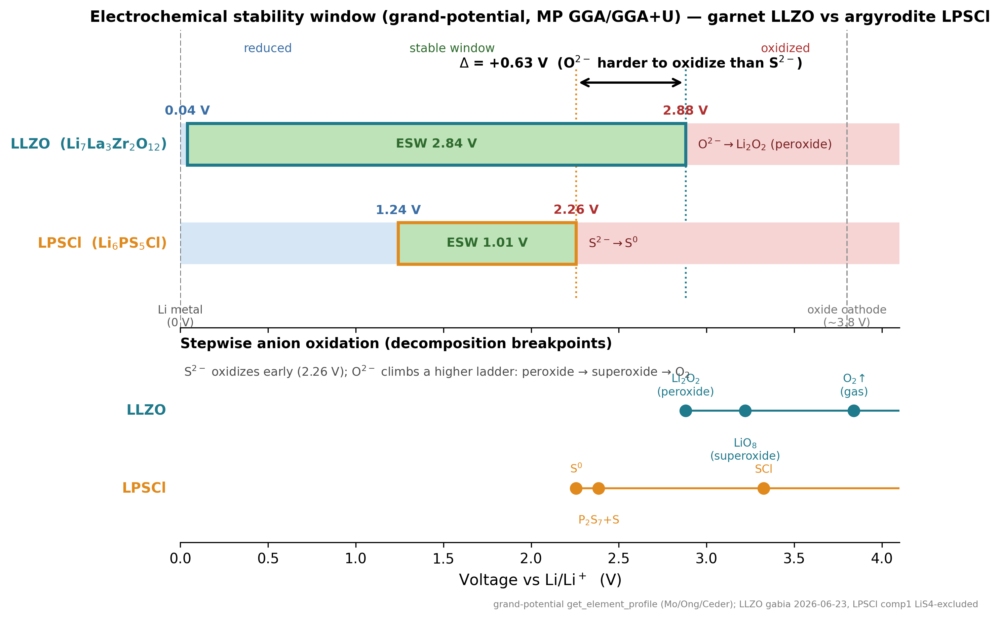

# Solid-State Li–Metal Batteries: Challenges and Horizons of Oxide and Sulfide Solid Electrolytes and Their Interfaces — Kim/Balaish/Rupp (Adv. Energy Mater. 2021)

> slug `kim2021_review_oxide_sulfide_se_interfaces` · DOI `10.1002/aenm.202002689` · type `review (DFT+exp 종합)` · PDF `4229e857…SolidState_Li_Metal_Batteries…pdf` (+ SI `98afe5b4…`) · digested `2026-06-23` · status ✅
> **저자**: **Kun Joong Kim, Moran Balaish** (공동 1저자), Masaki Wadaguchi (NGK Spark Plug), Lingping Kong, **Jennifer L. M. Rupp\*** (MIT, Dept. Materials Science & Eng. + EECS; Electrochemical Materials Lab) · Adv. Energy Mater. **11** (2021) 2002689, **63 페이지 리뷰** · Received 20 Aug / Revised 22 Sep / Published 9 Nov 2020 · © Wiley-VCH

---

## 0. 이 digest를 읽는 법 (리뷰의 thesis + litdb 내 위치)

**이 논문은 우리 litdb의 "landscape/지도" 논문이다.** 다른 digest들(Zuo·Ke·GG·Lu·Liu23)은 전부 *argyrodite 한 조성·한 레버(Cl-rich / Mg 도핑 / 자리 점유)* 를 깊게 파는 논문인 반면, 이 Rupp 리뷰는 **산화물 vs 황화물 SE 전체 패밀리 + 양극계면 + 음극(Li metal)계면**을 한 장의 지도로 펼친다. 우리가 LPSCl vs LPSCl1.6를 비교할 때 "그래서 황화물이 산화물 대비 어디에 서 있나", "우리가 보는 ESW onset 2.26 V / 환원 1.24 V / 연성(B/G) 같은 숫자가 *문헌의 어느 reference 값*과 같은 줄에 놓이나"를 확인하는 용도.

**리뷰의 핵심 주장(thesis) 3가지**:
1. **ASSLB(전고체 Li-metal 전지)는 액체 LIB 대비 안전·에너지밀도(부피 +~70 %, 무게 +~40 %, Li-metal+고전압 양극 가정)에서 이길 잠재력이 있다** — 단, 그 잠재력은 **계면(interface)** 에서 다 깎인다.
2. **SE는 두 패밀리로 수렴**: **산화물**(garnet LLZO·perovskite LLTO·NASICON LATP/LAGP·LiPON·anti-perovskite)은 *단단·취성·고온소결·Li/산화 안정성 우수*; **황화물**(LGPS·**argyrodite Li6PS5X**·glass/glass-ceramic Li2S–P2S5·Li3PS4)은 *부드럽고 연성·냉간가압·초이온전도(최대 25 mS/cm)지만 산화/환원/대기 안정성 취약*.
3. **모든 길은 계면으로 통한다**: 양극|SE(화학·전기화학 분해, 상호확산, chemo-mechanical 부피변화)와 음극|SE(환원 분해→interphase, dendrite 침투, wetting, CCD)가 진짜 병목. SE 자체보다 **계면 엔지니어링(coating·interlayer·3D)** 이 ASSLB 상용화의 관건.

> 🔗 **litdb 내 위치**: **리뷰·oxide/sulfide·계면 landscape 축**. 이 digest는 다른 5개 digest의 "배경 좌표계"다. 특히:
> - **§5 argyrodite/LPSCl row** + **§10 DFT grand-potential** → 우리 ESW(2.26 V onset, 환원 1.24 V)·연성·band-gap의 *문헌 reference 줄*.
> - **§7 oxide vs sulfide 표** → deck에서 "왜 우리는 황화물을 하나"를 한 슬라이드로.
> - **§10 Monroe-Newman dendrite 기준** → 우리 elastic(E_VRH, B/G)이 dendrite 논의로 연결되는 다리.
> - reference key `[Rupp]` 로 `comparison_vs_ours.md`에 등록.

---

## 1. 한 줄 요약

산화물·황화물 SE를 **5개 파라미터**(에너지밀도·출력밀도·장기안정성·공정성·안전)와 **3개 ASSLB 컴포넌트**(음극·SE·양극)로 분해해 정리한 63쪽 리뷰. 결론: **SE 본질 성능은 충분히 좋아졌고, 진짜 병목은 양극|SE·음극|SE 계면(화학·전기화학·chemo-mechanical 분해 + dendrite)이며, coating/interlayer/3D 같은 계면 엔지니어링이 high-energy-density ASSLB의 핵심이다.** Argyrodite Li6PS5X(우리 LPSCl)는 황화물 대표로서 σ~10⁻³ S/cm·연성(B/G 1.25–2.5)·**DFT 산화 onset ~2.0–2.2 V / 환원 ~1.7 V**·실효 ESW는 passivation(Li3P/Li2S/LiX) 덕에 더 넓게 관찰됨으로 표에 정리됨.

## 2. 메타

| 항목 | 내용 |
|---|---|
| 저자/소속 | Kim·Balaish·Wadaguchi·Kong·**Rupp** (MIT MSE+EECS; NGK Spark Plug) |
| 저널/년 | Adv. Energy Mater. 11, 2002689 (2021), **review, 63 pp** |
| DOI | 10.1002/aenm.202002689 |
| 대상 | **모든** Li-conducting SE (산화물 5종 + 황화물 5종 + 질화물 LiPON/Li3N) + 양극·음극 계면 |
| 우리 관심 조성 | **Argyrodite Li6PS5X (X=Cl,Br,I) = 우리 LPSCl/LPSCl1.6의 모재** + 비교군 LGPS, glass/glass-ceramic Li2S–P2S5, β-Li3PS4 |
| 연구유형 | 종합 리뷰 (실험·DFT 문헌 메타분석; **자체 신규 계산/실험 없음**) |
| 핵심 표 | **SI Table 1**(전 SE 물성 총람), **Table 1**(양극계면 분해), **Table 2**(coating), **Table 3**(음극 passivation층), **Table 4**(Li/SE 계면 처리) |

---

## 3. 리뷰의 조직 틀: 5 파라미터 + 3 컴포넌트 (p.1, p.4, p.52)

리뷰 전체를 관통하는 평가 축. deck에서 "ASSLB를 어떤 잣대로 보나"의 표준 프레임으로 차용 가능.

**5 파라미터** (abstract·§1.2·§5):
1. **Energy density** — Li-metal+고전압 양극(5 V)으로 부피 +~70 %·무게 +~40 % (graphite 대비 -10 % 무게손실은 SE 무게로 상쇄). 목표 >500 Wh/kg, >700 Wh/L.
2. **Power density** — 목표 >10 kW/kg. 계면 저항(R_int)·bulk σ에 의해 제한.
3. **Long-term stability** — 계면 분해·dendrite·부피변화로 cycle 중 R_int 증가가 병목.
4. **Processing** — 산화물 고온소결(>1000 ℃) vs 황화물 냉간가압(RT)·열압(~글래스전이 T). 비용·박막화(10–25 µm) 직결.
5. **Safety** — 불연·비휘발 SE가 핵심 동기. 단 "SE = 자동 안전"은 아님(Li-metal 사용 시 dendrite·발열 여전).

**3 컴포넌트** — 리뷰는 ASSLB를 (i) **음극(Li metal)**, (ii) **SE**, (iii) **양극(composite)** 으로 분해(§3, §4). 셀 전압·분극의 기원은 Eq.(1):
`V = V_oc − iR_Ohm − [(η_p,k)a+(η_p,k)c] − [(η_p,t)a+(η_p,t)c]` — ohmic + kinetic(charge-transfer) + transport(diffusion) 3종 과전압 (Fig 2). EIS의 3영역(ohmic/contact·interface/charge-transfer·diffusion-Warburg)과 대응.

**state-of-the-art 셀 저항(인용값)**: sulfide(β-Li3PS4) ASSLB total cell resistance **350–450 Ω cm²**@0.16–0.19 C (NCM622); garnet(LLZO) Li2CO3-coated LCO total interfacial ~**270 Ω cm²**@0.05 C. 상용 LIB는 10–25 Ω cm² → **아직 한 자릿수 이상 차이**.

---

## 4. 산화물 SE 패밀리 ★ (수치 = SI Table 1 + 본문 §2.1.1, §2.4.1, §2.5.1)

> RT = 상온. ESW "Calc"는 DFT grand-potential(Zhu/He/Mo류) 값, "CV"는 실험 관찰창(passivation 포함이라 더 넓음).

| 패밀리 (대표조성) | σ (RT, S/cm) | Ea (eV) | Calc 환원/산화 (V) | CV 창 (V) | E (GPa) | B (GPa) | G (GPa) | 핵심 이슈 |
|---|---|---|---|---|---|---|---|---|
| **Perovskite LLTO** (Li₃ₓLa₂/₃₋ₓTiO₃) | ~10⁻³ (grain) / ~10⁻⁴ (pellet) | 0.3–0.4 | 1.75 / 3.71 | 0–8 | ~183–200 | 133 | 80 | **Ti⁴⁺ 환원(1.75 V)→Li 비호환**; grain-boundary σ가 ~10⁻⁵로 급락 |
| **Garnet LLZO** (Li₇La₃Zr₂O₁₂, Ta/Al-도핑) | **1.8×10⁻³** (cubic, >1 mS/cm 유일) | 0.22–0.30 | **0.05 / 2.91** | 0–6, 0–9 | ~140–160 | ~100 | ~60 | **Li 안정성 최고(환원 0.05 V)**; Li₂CO₃ 대기오염·소결 >1000 ℃·취성(K_IC 0.99) |
| **NASICON LATP** (Li₁.₃Al₀.₃Ti₁.₇(PO₄)₃) | 10⁻⁴–10⁻³ | 0.33 | 2.2 / 4.21 (또는 0.66/3.13) | >2.4 | 115 | 92 | 55 | **고산화창(4.21 V)**이나 **Ti⁴⁺ 환원(2.17 V)→Li 비호환**; 소결성 나쁨 |
| **NASICON LAGP** (Li₁.₅Al₀.₅Ge₁.₅(PO₄)₃) | 6.65×10⁻³ (Cr-codope) | 0.292 | 2.7 / 4.27 | 0–7 | 49.6 | — | — | Ge⁴⁺ 환원(2.7 V)→Li 비호환; mixed ionic-electronic interphase |
| **γ-Li₃PO₄ / LiPON** (Li₂.₉₄PO₃.₅N₀.₃₁) | LiPON ~10⁻⁸–10⁻⁶ (박막) | 0.46–0.55 | **0.69 / 1.07(또는 2.63)** | 0–5.5 | 77 (LiPON) | — | ~4 (LiPON) | **유일하게 Monroe-Newman 만족 안 해도 dendrite 억제** (박막 전지서 수천 cycle); σ는 매우 낮음 |
| **Anti-perovskite Li₃OX** (Li₂(OH)₀.₉F₀.₁Cl) | 10⁻⁴–10⁻² (박막) / 10⁻⁶–10⁻³ (pellet) | 0.2–0.36 | – / 2.55 | 2.2–4.2, 0–9 | ~90 | 55 | 40 | 신생, 데이터 부족 |
| (질화물) **Li₃N** | 10⁻⁴–10⁻³ | 0.25–0.29 | 0 / 0.44 (분해창 좁음) | 0–0.9~3.8 | — | — | — | **Li에 열역학 안정(음극 interphase 후보)**이나 산화창 0.44 V로 매우 좁음 |

**산화물 핵심 메시지**:
- **garnet LLZO만이** "1 mS/cm 초과 σ + Li 안정성(환원 0.05 V) + 넓은 산화창" 3박자를 동시에 → 리뷰가 LLZO를 산화물 대표·집중 분석 대상으로 삼음.
- 산화물 공통 약점 = **취성**(E 100–200 GPa, K_IC 0.8–1.6 MPa·m¹ᐟ²). garnet/perovskite/LATP 모두 hardness 6.8–9.9 GPa. → 양극·음극과 **단단한 점접촉**, 부피변화 수용 못 함, **고온소결 필수** → chemo-mechanical 균열·고계면저항.
- LLTO/LATP/LAGP는 **전이금속(Ti⁴⁺/Ge⁴⁺)이 저전압서 환원**되어 mixed ionic-electronic interphase 형성 → Li 비호환(LLZO만 예외).
- LLZO 대기오염: H₂O·CO₂ → Li₂CO₃ 층 형성 → Li/LLZO R_int를 54→**>3000 Ω cm²**(습공기 37000)까지 폭증.

---

## 5. 황화물 SE 패밀리 ★ — **argyrodite/LPSCl 집중** (SI Table 1 + §2.1.2, §2.3.2, §2.4.2, §2.5.2)

| 패밀리 (대표조성) | σ (RT, S/cm) | Ea (eV) | Calc 환원/산화 (V) | CV 창 (V) | E (GPa) | B (GPa) | G (GPa) | 대기/공정 |
|---|---|---|---|---|---|---|---|---|
| **Glassy (100−x)Li₂S–xP₂S₅** | ~10⁻⁶–10⁻³ | 0.187 | 1.7 / 2.1 | 0–10 | ~13–28 | ~10–25 | ~5–12 | 대기 취약(H₂S); RT 냉간가압 |
| **Glass-ceramic** (70Li₂S·30P₂S₅ 등) | 10⁻³–10⁻² | 0.15–0.18 | – | 0–10, 0–5 | — | — | — | 결정화로 σ↑(P₂S₇⁴⁻); 대기 취약 |
| **⭐ Argyrodite Li₆PS₅X (X=Cl,Br,I)** | **~10⁻³** | **0.3–0.45** | **1.71 / 2.01** | **0–10 (CV)**, 1.25–2.5 | **92–100** ⚠ | — | **38–43** ⚠ | **대기 최악(H₂S)**, 건조 불활성분위기 필수; **RT 냉간가압** |
| **Li₇P₃S₁₁ (crystalline)** | 2.9×10⁻³~1.7×10⁻² | 0.145–0.176 | 2.28 / 2.31 | 0–5 | 22 | 24 | 8 | 대기 취약; glass→결정화 |
| **β-Li₃PS₄** | 1.6×10⁻⁴ | 0.356 | 1.71 / 2.31 | 0–5 | 29.5 | 23.3 | 11.4 | ortho-PS₄³⁻이라 **상대적으로 가수분해 내성↑** |
| **LGPS Li₁₀GeP₂S₁₂** | **1.2×10⁻²** | 0.249 | **1.71 / 2.1** (CV는 0–10/0–5) | 0–10, 0–5 | ~37 | ~30 | ~14 | Ge⁴⁺ 환원→전자전도 interphase; 대기 취약 |
| **Li₉.₅₄Si₁.₇₄P₁.₄₄S₁₁.₇Cl₀.₃** | **2.5×10⁻²** (최고급) | 0.238 | – | 0–5 | — | — | — | record σ (25 mS/cm급) |
| **Li₃S(BF₄)₀.₅Cl₀.₅** | 10⁻¹ (!) | 0.176 | – | – | 142 | — | 46 | cluster-ion 신물질 |

> ⚠ **주의 — SI Table 1 argyrodite mechanical row**: E=92–100, G=38–43 GPa (ref [24]=Deng/Ong DFT). 이 값은 **다른 황화물(glass 13–28, LGPS ~37)보다 훨씬 높고**, 우리·[Kaur](E22.1)·[JPCC](E27.4)·[GG] 등 대부분 LPSCl DFT(20–30 GPa)와도 **크게 다름**. → **리뷰 표의 argyrodite 92–100 GPa는 outlier로 취급**, 우리 E_VRH 22–28과 직접 비교 금지(§13 caveat 참조). **B/G 연성 결론(1.25–2.5)** 만 robust.

**Argyrodite Li₆PS₅Cl(=우리 모재) 관련, 리뷰가 명시한 LPSCl-특정 수치·사실** (deck 인용 가능):
- **구조/무질서**(p.9): Li₆PS₅I = S²⁻ 완전 ordered; **Li₆PS₅Cl = S²⁻와 Cl⁻ 완전 disordered**; Li₆PS₅Br = ordered/disordered 혼합. → **Cl이 가장 강한 site-disorder = 가장 빠른 Li⁺ mobility** (우리 AIMD가 Cl-rich서 D↑·Ea↓ 보는 것의 구조적 근거).
- **DFT ESW**(§2.5.2, p.20): "indirect, kinetically favored decomposition route through (de)lithiation of argyrodite **Li₆PS₅Cl**, showed excellent agreement to the stability window measured experimentally by galvanostatic investigation of **~1.25 V (=1.25–2.5 V)**, where oxidation and reduction were conducted on separate cells." (Schwietert/Wagemaker, **Nat. Mater. 2020**, ref 308 = 우리 INDEX 계산시트 #14 "Clarifying the relationship between redox activity and electrochemical stability" 논문 — **[GG]=Gil-González ESM 2022와는 별개 논문**)
- **분해 stoichiometry**(§2.5.2): "For oxidation and reduction of **Li₆PS₅Cl**, the compounds **Li₄PS₄Cl and Li₁₁PS₅Cl** were suggested to **first form**, followed by further decomposition to **Li₃PS₄, S, LiCl** (산화) and **P, Li₂S, LiCl** (환원), respectively." → **우리 grand-potential onset 산물(Li3PS4+LiCl+S)·환원 산물(Li3P+Li2S+LiCl)과 동일 화학** (단 리뷰는 indirect 2단계 강조).
- **DFT 분해전위 표(Table 1, B 카테고리)**: `Li₆PS₅Cl → Li₃PS₄, S, LiCl @2.01 V` (ref 59=Zhu/He/Mo); `Li₆PS₅Cl(vs LiCoO₂) → LiCl, Li₄P₂S₆, Li₂S @2.2 V` (ref 302). → **우리 onset 2.26(LiS4제외)/2.14(포함)와 같은 줄**(2.0–2.2 V band).
- **음극 환원**(Table 3, p.37): **Li₆PS₅X reduction potential = 1.7 V**, 분해산물 **Li₃P + Li₂S + LiX** (in-situ XPS+시간분해 EIS, ref 318). → **우리 환원 한계 1.24 V·산물(Li₃P+Li₂S+LiCl)과 같은 chemistry**.
- **계면 SEI 성장(idle)**(§4.4.1, p.50): Li₆PS₅X(X=Cl,Br)·Li₇P₃S₁₁은 **무전류(idle)서도** Li과 R_int가 시간에 따라 증가, 10년 외삽 시 **수십~수백 Ω cm²** (Li₆PS₅I이 가장 심함) → 액체 LIB 0.2 Ω cm²보다 2자릿수↑. interphase = 저전도 Li₂S 지배.
- **양극계면 cycling**(§3.1.2, Fig 10): LPSCl은 LCO/LMO/NMC와 cycling 시 **S, Li₂Sₙ, P₂Sₓ, phosphate, sulfate, LiCl** 산물 형성(XPS·ToF-SIMS, refs 361–363). LMO‖LPSC 셀은 **첫 25 cycle 급락 후 300 cycle 가역**(가역적 S/polysulfide 형성, ref 308).
- **flagship 셀**(§4.2, §5, Fig 12): **LZO-coated NMC ‖ Li₆PS₅Cl ‖ Ag–C** 600 mAh pouch full cell, **CE >99.8 %, 1000 cycle @0.1C(0.68 mA/cm²)** (Ye/Cui Nat. Energy 2021류, ref 346) — 리뷰가 "important breakthrough, EV 800 km·1000 charge 가능성"으로 강조.
- **L₃PS₄/argyrodite Li 보호 처리**(Table 4): Li₆PS₅X은 LiF/LiCl/LiBr/LiI 같은 **Li-halide buffer**로 CCD·수명 개선(예 LiI coating on Li₃PS₄·Li₇P₃S₁₁).

**황화물 핵심 메시지**:
- **장점**: σ 최대 25 mS/cm(액체급), **부드러움(E~10–30 GPa, 연성 B/G 1.25–2.5)**, **RT 냉간가압**으로 치밀화·intimate contact → 양극 composite를 *눌러서* 만든다.
- **단점 3종**: ① **대기 최악**(H₂S 발생, Li–S 결합이 약해 NBS 단위가 가수분해) → 건조실 필수, 비용↑; ② **산화/환원 둘 다 산화물보다 좁음**(Calc 산화 ~2.0–2.3 V로 LCO 3.8 V·NMC 3.8 V·LMO 4.1 V·LFP 3.5 V보다 한참 낮아 양극서 분해); ③ **저 fracture toughness**(LPS K_IC ~0.23 MPa·m¹ᐟ², garnet 대비 ~80 %↓) → dendrite nucleation 위험.
- **대기·전기화학 안정성 개선 = O 치환**: S→O 부분치환(P–O > P–S 결합)으로 ESW 확대+가수분해 내성↑ (예 LGPSO, Li₆PS₅O-doped). **HSAB(hard-soft acid-base)**: hard base O가 soft acid Sn/As와 잘 맞아 H₂S 내성↑ (Sn/As-substituted thio-LISICON).

---

## 6. 산화물 vs 황화물 head-to-head ★ (§2 전반 종합 — deck 1슬라이드용 표)

| 축 | **산화물** (garnet LLZO 대표) | **황화물** (argyrodite/LGPS 대표) | 리뷰의 결론 |
|---|---|---|---|
| **σ (RT)** | LLZO ~1 mS/cm (그 외는 grain만 높고 pellet 낮음) | **~3–25 mS/cm** (record Li₉.₅₄Si…=25, LGPS=12) | **황화물 승** |
| **Ea** | 0.22–0.4 eV | **0.15–0.35 eV** (glass-ceramic 0.15 최저) | 황화물 약우위 |
| **기계** | **단단·취성** (E 100–200 GPa, K_IC 0.8–1.6) | **부드럽·연성** (E ~10–37 GPa, B/G 1.25–2.5, K_IC ~0.23) | 용도 갈림(아래) |
| **공정 T** | **고온소결 >1000 ℃** (LLZO 900–1230 ℃) | **RT 냉간가압 / 열압 ~200 ℃** | **황화물 승(저비용)** |
| **가공성(formability)** | 낮음(점접촉, buffer층 필요) | **높음**(등방·자유부피 → 눌러서 치밀화·intimate contact) | **황화물 승** |
| **Li 안정성(환원)** | **LLZO 0.05 V(최고)** ; LLTO/LATP/LAGP는 Ti/Ge 환원 비호환 | argyrodite/LGPS 환원 1.7 V → interphase 필요 | **garnet 승** |
| **산화창** | LATP/LAGP 4.2 V, LLZO 2.9 V(Calc) | **2.0–2.3 V(Calc, 좁음)** → 고전압 양극서 분해 | **산화물 승** |
| **대기 안정성** | **우수**(LATP/LLTO 안정; LLZO만 Li₂CO₃) | **최악**(H₂S) | **산화물 승** |
| **계면(양극)** | **고온소결서 상호확산**(LLZO·LCO @700 ℃~) | **RT cycling서 전기화학 분해**(점진 R_int↑) | 둘 다 문제(기전 다름) |
| **계면(Li metal)** | LLZO: wetting 나쁨+Li₂CO₃→고R_int; 압력 필요 | argyrodite: 환원 분해 interphase 성장 | 둘 다 문제 |
| **안전** | 불연·고온안정 | 불연이나 H₂S/연소 잔존 위험 | 산화물 약우위 |
| **비용** | 고온소결로 높음 | **저온공정으로 잠재적 저비용** (단 건조실) | 황화물 약우위 |

**한 줄 종합(리뷰)**: *"산화물(garnet)은 Li 안정성·산화창·대기안정성이 좋지만 단단·취성·고온소결이 발목; 황화물(argyrodite/LGPS)은 σ·연성·냉간가압이 좋지만 산화/환원/대기 안정성이 발목."* → **둘 다 계면이 진짜 문제**이고, **하나의 SE로 양극·음극을 다 만족 못 하니** 다층(양극엔 산화물/halide, 음극엔 황화물/Li-binary) 또는 coating 전략이 필요.

---

## 7. 계면 ① 양극 | SE ★ (§3, Table 1, Fig 7–11)

리뷰는 양극계면 분해를 **4 카테고리**로 나눔(외부조건 2개 = 공정T·전압으로 분류; Table 1):
- **A: cell fabrication 중 화학반응**(고온소결) — 주로 garnet/cathode 계면(LLZO+LCO @664–700 ℃ → La₂CoO₄ 등; Fig 8 = garnet–oxide-cathode 화학호환 T 지도).
- **B: cycle 중 전기화학 산화 분해** — 주로 황화물(LPSCl·LGPS·Li₃PS₄가 carbon/전류집전체 접촉서 산화).
- **C: cycle 중 화학반응**(상호확산).
- **D: chemo-mechanical 분해**(부피변화→균열, Fig 7c·11).

**핵심 기전·수치**:
1. **chemical(고온) — garnet 주도**: LLZO–LCO는 700 ℃부터 La₂Zr₂O₇/La₂CoO₄ 등 형성; **LCO–LLZO가 가장 안정**(LMO·LFP보다), driving force LCO 1 meV/atom ≪ LMO 63 ≪ LFP 94 meV/atom. → 황화물은 RT 공정이라 이 경로는 *주로 garnet에서* 보고됨.
2. **electrochemical(cycle) — 황화물 주도**: DFT상 대부분 SE의 산화한계 < 양극 redox전위(LCO 3.8·NMC 3.8·LMO 4.1·LFP 3.5 V). LPSCl/LGPS는 ~2.0–2.3 V서 산화 → S–S(폴리설파이드)·P₂Sₓ·phosphate·sulfate 형성(Fig 9 = β-Li₃PS₄–NCM811, cut-off 4.0/4.3/4.6/5.0 V별 R_cathode·S2p XPS depth profile; 4.0 V는 안정, 5.0 V서 R_int·산화종 폭증). **분해는 전류집전체 접촉면에 집중**(전자 source).
3. **interdiffusion(Fig 7a)**: LLZO↔LCO Co/La 상호확산층(STEM-EDS line); 황화물–oxide-cathode는 PS₄³⁻↔oxide의 **O↔S 교환**으로 PO₄³⁻ 형성(LPSCl/NMC622 ~10 nm shell, ToF-SIMS POₓ⁻/SOₓ⁻ 증가, Fig 10b).
4. **chemo-mechanical(Fig 7c, 11)**: 양극활물질 부피변화(NMC811 충전 시 -~6 %, LCO는 반대로 +) → SE와의 microgap·균열 → contact loss·R_int↑. NMC811+β-Li₃PS₄ 1차 충전 후 contact loss SEM 직접관찰. **LCO+NMC 혼합**으로 응력 상쇄(부피변화 +~2 vs -~2 % 상쇄). **quasi-zero-strain Co-rich NCM(<1 %)** 이 해법으로 제시. FEM: 입자팽창 <7.5 %·G_c >4 J/m²·E_SE~15 GPa면 균열 억제 → **연성·중간모듈러스 SE(=황화물)가 부피변화 수용에 유리**.

**LPSCl 양극 거동(Fig 10)**: LMO‖LPSC 충전 시 SAM(scanning Auger)로 **LiCl 입자 상분리** 확인; **LMO가 LCO보다 산화종 더 많이** 생성(LCO < NMC ≪ LMO 순 반응성); 25 cycle 급락 후 **가역적 S/polysulfide로 300 cycle 회복**.

> **우리 연결**: 우리 grand-potential은 **B① intrinsic onset**만 본다(2.26 V). 리뷰의 양극계면은 **B②③④**(전류집전체 접촉·상호확산·chemo-mechanical)까지 — 우리 ESW가 *못 보는* 축들. Fig 9(cut-off별 R_int)·Fig 10(LPSCl 산물)은 우리 "분해 *양*·산물" 논의([Zuo] CV 2배와 같은 축)의 reference.

## 7b. 계면 ② 음극 | SE / Li metal ★ (§4, Table 3, Table 4, Fig 13–18)

**핵심 개념(Fig 13a,b)**: 이상적 interphase = **이온전도 + 전자절연**(nanometrically thin, electronic insulator). 그래야 interphase의 Li 화학퍼텐셜이 SE 창 안으로 들어와 추가분해 차단(self-limiting). 전자전도성 interphase(LLTO·LATP·LAGP의 Ti/Ge 환원물)는 계속 성장→short.

**Table 3 — Li에 대한 SE 환원전위 + 분해산물** (deck 핵심표):

| SE | 환원전위 vs Li (V) | 분해산물 | 안정/불안정 |
|---|---|---|---|
| **LiPON** | 0 | Li₃PO₄, Li₃P, Li₃N, Li₂O | **안정 passivation** |
| **LLZO** | 0.05 | Li₂O, La₂O₃, Zr₃O, Zr (0 V) | **안정**(kinetic) |
| Li₇P₃S₁₁ | 2.3 | Li₂S, Li₃P, LiₓPOₓ류 | (반응성) |
| **β-Li₃PS₄** | **1.7** | Li₂S, Li₃P (P₂S₆⁴⁻+Li₂S) | passivation 형성 |
| **⭐ Li₆PS₅X (X=Cl,Br,I)** | **1.7** | **Li₃P, Li₂S, LiX** | passivation 형성 |
| **LLTO** | 1.75 | Ti³⁺ 환원→Li₂O+TiₓO | **불안정**(mixed e⁻/Li⁺ 전도) |
| **LGPS** | 1.71 | Li₃P, Li₂S, Li–Ge alloy, Li₁₅Ge₄ | **불안정**(Ge 환원→전자전도) |
| **LATP** | 2.17 | Ti⁴⁺→Ti³⁺, mixed 전도층 | **불안정** |
| **LAGP** | 2.7 | Ge⁴⁺→Geˣ⁺, mixed 전도층 | **불안정** |

> **우리 LPSCl 직접 연결**: 리뷰가 **Li₆PS₅X 환원전위 1.7 V, 산물 Li₃P+Li₂S+LiX**로 못 박음. → 우리 grand-potential 환원 한계 **1.24 V** + 산물 **Li₃P+Li₂S+LiCl**과 **같은 chemistry**(전위 절대값은 방법차; 우리 0-pressure vs 리뷰 인용은 indirect/실험). **LiX(=LiCl)이 passivation 산물**이라는 점은 [Lu]·[Liu23]와도 일치 → 우리 modelc(Cl-rich)가 LiCl을 더 많이 내는 게 음극 passivation 측면에선 이점일 수 있음([Lu] 논지).

**Dendrite / CCD / Monroe-Newman(§2.4.1, §4.2)**:
- **Monroe-Newman 기준**: SE의 **shear modulus G_SE > ~2 × G_Li (≈ 2 × 3.4–4.25 GPa)** 면 이론상 dendrite 억제. → 약 **6.8–8.5 GPa 이상**. (단 polymer 가정 모델이라 한계 — 아래)
- **반례·정정**: 실제로는 **거의 모든 무기 SE에서 dendrite 관찰됨**(유일 예외 LiPON, G~4 GPa인데도 억제 — 박막·전자트랩 덕). → Monroe-Newman만으론 불충분; **grain boundary·pore·전자전도·wettability**가 진짜 변수. Wolfenstein: **grain-boundary shear modulus(12–36 GPa)** 가 더 적절. **fracture toughness**가 CCD를 4제곱으로 지배(균열→dendrite).
- **CCD 수치**: LLZO RT **0.3–0.4 mA/cm²**(처리 전) → coating/3D로 **1–10 mA/cm²**까지. dense LLZO grain-boundary dendrite 한계 ~0.6 & 1 mA/cm²(LGPS·β-Li₃PS₄). 목표 >1–3 mA/cm²(EV급).
- **압력 효과(Fig 14)**: Li/LLZO에 **35 MPa**면 stripping contact loss 없음; 무압이면 1.2 mA·cm⁻²서 심각한 void.
- **Li wettability**: Li₂CO₃ 오염층이 Li/LLZO wetting 망침→R_int 수백~수천 Ω cm²; 무오염+가압이면 **0.01–2 Ω cm²**.

**음극 interphase·mitigation(Table 4, Fig 16–18)**:
- **garnet(LLZO) 처리**: Au/Ag/Sn/Si/Ge/Al/ZnO/Al₂O₃/Li₃PO₄ 등 박막coating·합금interlayer로 R_int 1000–1900 → 20–187 Ω cm²; **3D porous LLZO**(trilayer)로 CCD 10 mA/cm². **Li₃PO₄(LPO) ALD**(~10 nm): R_int 17→1 Ω cm², CCD 1 mA/cm²·180 h, 게다가 **LLZO 전자전도 10⁻⁸→10⁻⁹**(전자절연화로 dendrite 억제, Fig 17).
- **황화물(LPS/argyrodite/Li₃PS₄/LGPS) 처리**: **Li-halide(LiF/LiI/LiCl/LiBr) buffer**(고band-gap 절연: LiI 6.4 eV) + **Li-alloy(Li–In 0.6 V, Li–Al, Li–Sn) 음극**. **O-doping(Li₆PS₅O류, Li₁₀GeP₂S₁₁.₇O₀.₃, Ba-doped)**: CCD 0.45→0.89, 0.4→1 mA/cm²; overpotential ↓; **shear modulus↑·전자전도↓**가 기전. LiF/LiI coating on Li₃PS₄: R 50–65 Ω cm², 200 cycle 12 mV.
- **anode-less / Ag–C buffer**: LZO-NMC‖LPSC‖**Ag–C** = Li 무여분, CE >99.8 %·1000 cycle (Fig 12a) — 황화물 ASSLB의 대표 성과.

> **우리 연결**: 우리 reduction(1.24 V)·환원산물(Li₃P+Li₂S+LiCl)·연성(B/G·G)·전자전도 논의가 전부 이 절의 frame과 맞물림. 특히 **"interphase = 이온전도+전자절연" 기준**은 [Ke]·[Lu]·[Liu23]의 LiCl/Li₂O/LiF 절연 interphase 논리와 동일 — 우리 cascade(Mg/Cl/O/F)의 음극 동기를 리뷰 frame 위에 올릴 수 있음.

## 8. 계면 엔지니어링 전략 종합 (§3.2, §4, Table 2·4)

**양극 coating(Table 2, ~50 entries)** — coating 재료가 갖춰야 할 6조건(§3.2.1): ⓐ 고분해전압 >4.5 V·전자절연, ⓑ 활물질·SE 양쪽과 화학안정, ⓒ 균일피복(percolation 유지), ⓓ 연성(부피변화 수용), ⓔ 친환경·저비용, ⓕ 고온공정 시 상호확산 차단.
- **대표 coating**: **LiNbO₃(LNO)**(황화물·garnet 양쪽 효과적, capacity·rate↑), **Li₄Ti₅O₁₂**, **Li₃PO₄**, **Li₂SiO₃**(Li-ternary가 binary SiO₂보다 우수), **LZO(Li₂O–ZrO₂)**(NCA/NMC, 4.82 V) — **LZO-NMC‖LPSCl pouch**가 flagship(CE>99.8 %, 1000 cycle, Fig 12a). R_cathode 수십~수백 Ω cm²로 감소.
- garnet 양극 coating은 검증 사례 매우 적음(Nb 1건) — **연구공백**으로 지적.

**음극 interlayer/architecture(Table 4)**: Li-alloy(Li–In/Al/Sn/Si), Li-halide buffer(LiF/LiI), 금속·산화물 박막(Au/Ag/Sn/ZnO/Al₂O₃), **Li₃PO₄/LiPON 전자절연층**, **3D porous host**(LLZO trilayer, Ag–C nanoporous buffer), **soft PDMS substrate**로 wrinkle 완화(Fig 15b), **porous 집전체**(Au/Ni)로 pore 안에 Li 증착 유도(Fig 15a).

## 9. Figure / Table set ★ (리뷰 주요 도표 — 우리가 쓸 것 표시)

| Fig/Table | 내용 | 우리가 참고할 점 |
|---|---|---|
| **Fig 1** | 액체LIB → 전고체LIB → 전고체 Li-metal 전지 에너지밀도 변화(부피 +>70 %, 무게 +>40 %) | "왜 ASSLB+Li metal" 동기 1장 |
| Fig 2 | 방전곡선 분극 3종(ohmic/kinetic/transport) + EIS 등가회로(R_Ohm/2×R_int/Warburg) + 셀 모식 | 분극·EIS 기본 frame |
| **Fig 3** | **전 SE의 σ·Ea·Calc환원/산화·CV창·E·B·G·hardness·K_IC·공정T 한눈 산점도** (oxide vs sulfide) | **deck "SE landscape" 1장 — 우리 LPSCl 위치 찍기** |
| Fig 4 | LLZO·LGPS Li 경로 + 냉간가압(sulfide) vs 공소결(oxide) 공정 모식 | 공정 차이 시각화 |
| Fig 5 | LLZO 대기오염(Li₂CO₃ 형성 단계)·R_int 폭증(54→37000 Ω cm²) | 산화물 대기 약점(우리 황화물 H₂S와 대비) |
| **Fig 6** | **LGPS·LLZO grand-potential ESW phase diagram** + LGPS/LiPON/LLTO/LATP/LISICON/NASICON phase vs stoichiometry stability창 비교 + **argyrodite LPSC oxidation/reduction 모식(d)** | **우리 grand-potential ESW 방법·LPSCl 분해도의 직접 reference** |
| Fig 7 | 양극계면 실패 3모드(a interdiffusion, b 산화/Li-deficient, c 부피변화 균열) | 우리 ESW가 못 보는 B②③④ 축 |
| **Table 1** | **양극계면 분해 문헌 총람**(A/B/C/D, SE·활물질·측정·산물·전위) — **LPSCl/LGPS/Li₃PS₄ DFT 분해전위 포함** | **LPSCl 2.01 V(→Li₃PS₄+S+LiCl), 2.2 V(vs LCO→LiCl+Li₄P₂S₆+Li₂S) = 우리 onset 2.0–2.2 band reference** |
| Fig 8 | garnet–oxide-cathode 화학호환 T 지도(LCO·NMC·LMO·LFP별 반응 onset T) | garnet 양극(우리 범위 밖이나 oxide 대비용) |
| **Fig 9** | β-Li₃PS₄–NCM811 cut-off(4.0–5.0 V)별 R_cathode·**S2p XPS depth profile**(산화종 P-[S]ₙ-P, S⁰) | **황화물 양극 산화 "양" 정량 — 우리 분해 양 논의 reference** |
| **Fig 10** | LPSC 양극계면 SAM/ToF-SIMS(LiCl 상분리, POₓ/SOₓ 증가, LCO<NMC≪LMO 반응성) | **LPSCl-특정 양극 산물 직접 데이터** |
| Fig 11 | garnet LLZO–LCO chemo-mechanical 균열(100 cycle, R 1138→5807 Ω cm²) | 부피변화→균열 |
| **Table 2** | **양극 coating 총람**(재료·조건·양극·SE·R_int) | LNO·LZO·Li₃PO₄ 등 — 우리 음극 interphase descriptor와 별개로 양극 coating 참고 |
| **Table 3** | **SE별 Li 환원전위 + 분해산물 (안정/불안정)** | **LPSCl 1.7 V → Li₃P+Li₂S+LiX = 우리 환원 chemistry reference** |
| **Table 4** | **Li/SE 계면 처리 총람**(coating·R_int 전후·CCD·full cell) | 음극 interlayer 전략 카탈로그 |
| Fig 13 | Li/SE interphase 안정(a)/불안정(b) 모식 + Li/LLZO dissolution-deposition void(c) | interphase "이온전도+전자절연" 기준 |
| Fig 14 | 압력(35 MPa)·long stripping·3D LLZO CCD(10 mA/cm²) | 압력·3D 효과 |
| Fig 15 | dendrite 억제: porous 집전체(a)·PDMS soft substrate(b) | 음극 architecture |
| Fig 16 | Li/LLZO wetting: Al/Sn coating으로 lithiophilic화 + LFP full cell | wetting 전략 |
| Fig 17 | **Li₃PO₄(LPO) ALD on LLZO**: CCD 1 mA/cm²·180 h, 전자전도 10⁻⁸→10⁻⁹, LPO ESW(0.7–4.21 V) | **전자절연 interphase로 dendrite 억제 — 우리 LiCl(gap)·Li₃N 논리와 같은 축** |
| Fig 18 | **LiF/LiI buffer on Li₃PS₄/Li₇P₃S₁₁ + O-doping(LPSOB)**: CCD↑, radar chart(O 도핑이 6축 개선) | **황화물 음극 O/halide 도핑 — 우리 Cl/O/F cascade와 직접 같은 패밀리** |
| **SI Table 1** | **전 SE 물성 마스터표**(σ·Ea·preexp·t_Li⁺·Calc/CV ESW·E·B·G·Hv·K_IC) | **모든 reference 수치의 출처 — argyrodite row = 우리 LPSCl 비교 줄** |

## 10. DFT / 계산 콘텐츠 ★ (우리 grand-potential·elastic과 직결)

리뷰는 자체 계산은 안 하지만 **DFT 문헌을 비판적으로 종합**한다. 우리 방법론과 직결되는 부분:

**(1) 전기화학 안정성창(ESW) 계산 4방법 비교**(§2.5, Fig 6) — 우리 grand-potential의 메타 컨텍스트:
- **HOMO–LUMO 방법**: inert 전극 가정, ESW의 *상한*(가장 넓게 나옴).
- **Stoichiometry stability 방법**: SE에 Li 한 개 넣고/빼는 (de)lithiation 반응 → 중간창.
- **⭐ Phase stability (grand canonical / grand-potential phase diagram) 방법**: 가능한 분해반응의 평형 chempot. **가장 좁은(보수적) 창**. → **우리가 쓰는 바로 그 방법**(get_element_profile). Ceder/Mo 계열(Zhu/He/Mo 2015·2016 = ACS AMI / JMCA; Richards/Miara/Ceder 2016 Chem Mater; Ong/Mo/Richards 2013 EES).
- **⭐ Indirect, kinetically-favored (de)lithiation route**: SE가 직접 원소로 안 가고 **(de)lithiated 중간상**(LPSCl→Li₄PS₄Cl/Li₁₁PS₅Cl)을 거쳐 분해 → **실험 관찰창과 더 잘 맞음**(Schwietert/Wagemaker 2020 Nat. Mater. = ref 308). 이게 "**실효 ESW가 왜 넓게 보이나**"(passivation+indirect)의 핵심.

> **우리 연결(중요)**: 우리 onset 2.256 V(LiS4 제외)는 **phase-stability(grand-potential)** 값이고, 리뷰가 인용한 LPSCl 직접분해 2.01 V(ref 59)·2.2 V vs LCO(ref 302)와 **같은 방법·같은 2.0–2.2 V band**. 리뷰의 **indirect route(Li₄PS₄Cl 중간상)** 는 우리가 *안 본* 경로 → "우리 onset이 실험보다 낮은 이유 = indirect/passivation/kinetics"의 문헌 근거(=[GG]·[Zuo] Q1 논의와 정합).

**(2) Li에 대한 환원 안정성 = grand-potential**(Table 3, §4): LLZO 0.05 V(환원 driving force -0.02 eV/atom으로 매우 작음), LPSCl/Li₃PS₄ 1.7 V, LGPS 1.71 V 등 전부 **Li grand potential phase diagram**(Zhu/He/Mo, Ong/Ceder)에서 나온 값. → 우리 환원 한계 1.24 V와 같은 framework.

**(3) 계면 반응에너지 DFT**(Table 1, §3.1): SE|cathode·SE|Li의 chempot 평형 분해산물·반응에너지(Richards/Miara/Wang/Ceder 2016 "Interface Stability in Solid-State Batteries"; Miara/Ceder 2015). LLZO·LCO·LPSCl 등 산물 예측 → 실험 XPS/TEM과 대조. 우리가 *아직 못 하는* 계면 slab 반응에너지([Lu] Fig6 류)의 방법 근거.

**(4) Monroe-Newman dendrite 모델**(§2.4.1): Monroe & Newman 2005 (J. Electrochem. Soc.) — **linear elasticity**로 Li/SE 계면 dendrite 안정성. **G_SE > ~2 G_Li**면 억제. DFT elastic(Deng/Ong 2016 = [Kaur]와 같은 ref 24)으로 G_Li 3.4–4.25 GPa 계산. → **우리 elastic(E_VRH, G, B/G)이 dendrite 논의로 이어지는 다리**. (단 리뷰가 한계 명시: polymer 가정·grain boundary 무시·LiPON 반례.)

**(5) 기계물성 DFT**: LPSCl·LGPS·anti-perovskite 등 elastic constants를 first-principles로(Deng/Ong 2016; Wang/Ouyang 2014 for LGPS). LGPS E=37.19, B=30.36, G=14.35 GPa, ν=0.296, **B/G=2.12(연성)**. → 우리 LPSCl B/G·연성 결론과 같은 결.

**인용된 주요 계산그룹**: **Ceder/Mo(MIT→UCB; Richards·Miara·Zhu·He·Wang)** = grand-potential ESW·계면 반응의 원조; **Ong(UCSD; Deng)** = elastic; **Wagemaker(Delft; Schwietert)** = indirect decomposition; **Monroe & Newman** = dendrite elasticity.

## 🧮 [우리 계산] LLZO 산화창이 왜 넓은가 — grand-potential 재현 (anion p-band 깊이)
> 리뷰는 garnet LLZO의 Calc 산화창을 **2.91 V**(§4 표)로, sulfide(~2.0–2.3 V)보다 넓다고만 적는다. **왜** 넓은지를 우리 `tools/oxidation/esw_grand_potential.py`(= comp1 onset 2.256 V를 뽑은 *바로 그 방법*, MP GGA_GGA+U 훌)로 LLZO에 직접 적용해 규명.

### 핵심 물리 — 산화 onset ≈ **음이온 p-band(VBM) 깊이**
grand-potential 산화는 μ_Li를 낮추며(V↑) Li를 방출시키다가, 골격이 **자기 음이온을 산화**시키는 순간 분해한다. 따라서 산화 onset 전위는 본질적으로 **그 음이온을 산화(전자 빼내기)하기가 얼마나 어려운가** = **음이온 p-band가 얼마나 깊은가**가 결정한다.

| 음이온 | 성질 (HSAB·전기음성도) | p-band(VBM) 위치 | 산화 난이도 | → 산화 onset |
|---|---|---|---|---|
| **S²⁻** (sulfide) | soft·polarizable, χ=2.58 | **S 3p 얕음(높이)** | S²⁻→S₂²⁻/S⁰ **쉬움** | **낮음 ~2.0–2.3 V** |
| **O²⁻** (garnet) | hard, χ=3.44 | **O 2p 깊음(낮음)** | O²⁻→O₂²⁻/O₂ **어려움** | **높음 ~2.9 V** |
| **PO₄³⁻** (LATP) | O가 P와 공유결합(polyanion)으로 더 안정화 | O 2p 더 깊음 | 더 어려움 | **더 높음 ~4.2 V** |

- **즉 LLZO의 넓은 산화창 ≈ O 2p가 S 3p보다 훨씬 깊다**는 사실의 직접 귀결. → **우리 PDOS 결과(LPSCl VBM = S 3p; [Banik] HAXPES 확인)와 같은 그림의 양면**: "VBM이 S 3p라 얕다 = 산화 onset이 낮다."
- 추가로 LLZO 양이온 **Zr⁴⁺(d⁰)·La³⁺(f⁰)** 은 이미 최고 산화상태 → 저전압서 *양이온* 산화 기여 없음. (반대로 환원 쪽에서 Ti⁴⁺/Ge⁴⁺를 가진 LATP/LAGP는 저전압서 환원돼 Li 비호환 — LLZO만 환원 0.05 V로 안정.)
- **한 줄**: 산화 onset 서열 **S²⁻(sulfide ~2.2) < O²⁻(garnet ~2.9) < PO₄³⁻(phosphate ~4.2)** = 음이온 p-band 깊이(+polyanion 공유 안정화) 순서.

### 실행 (gabia — MP API 필요; 로컬 환경은 `api.materialsproject.org` egress 차단)
```bash
cd tools/oxidation                       # 브랜치 pull 후 (print hint 일반화 반영됨)
python3 esw_grand_potential.py \
    --target "Li7La3Zr2O12:LLZO" \
    --elements Li La Zr O \
    --out esw_llzo.json
# (선택) 같은 방법으로 sulfide 재대조: --target "Li6PS5Cl:comp1" --elements Li P S Cl
```
comp1(LPSCl) 2.256 V와 **동일 방법·동일 GGA_GGA+U 훌** → 절대 비교 가능.

### 결과 ✅ (gabia 재현, 2026-06-23 · `tools/oxidation/esw_llzo_result.txt` · MP GGA_GGA+U 143 entries, μ_Li ref −1.9089 eV)
| 조성 | 환원 한계 (V) | 산화 onset (V) | 산화 onset 반응 | ESW 폭 |
|---|---|---|---|---|
| **LLZO** Li₇La₃Zr₂O₁₂ | **0.04** (OCV 자기분해 0.05) | **2.88** | →Li₆Zr₂O₇ + 0.25 **Li₂O₂** + 1.5 La₂O₃ + 0.5 Li (**O²⁻→peroxide**) | **~2.84 V** |
| LPSCl comp1 (참고, 기존값) | 1.24 | 2.256 | →Li₃PS₄+LiCl+**S**+2Li (**S²⁻→S⁰**) | ~1.0 V |

→ **리뷰 Calc(0.05 / 2.91 V) 거의 정확 재현** (우리 0.04 / 2.88 V, 격차 0.03 V).


> 그림 `litdb/figures/esw_llzo_vs_lpscl.png` (스크립트 `tools/oxidation/plot_esw_llzo_vs_lpscl.py`, 재현 가능). **(a)** ESW 막대 — LLZO 0.04–2.88 V(폭 2.84) vs LPSCl 1.24–2.26 V(폭 1.0), 산화 onset 격차 **+0.63 V**(음이온 효과). **(b)** 단계적 음이온 산화 사다리 — O²⁻는 peroxide→superoxide→O₂로 *높은* 전위에서, S²⁻는 2.26 V에서 *일찍* 산화.

**산화 staircase (음이온 단계적 산화 = 넓은 창의 정체)**:
| V | Li 교환 | 반응 (음이온 산화 단계) |
|---|---|---|
| **2.88** | −0.5 | →Li₆Zr₂O₇ + 0.25 **Li₂O₂** + 1.5 La₂O₃ + 0.5 Li — **O²⁻→peroxide(O₂²⁻) onset** |
| 3.15 | −3.5 | →1.75 Li₂O₂ + La₂Zr₂O₇ + 0.5 La₂O₃ + 3.5 Li (peroxide 확대) |
| 3.22 | −6.56 | →0.44 **LiO₈**(superoxide류) + La₂Zr₂O₇ + … (더 산화된 O) |
| **3.84** | −7.0 | →La₂Zr₂O₇ + 0.5 La₂O₃ + 1.75 **O₂↑** + 7 Li — **완전산화(O₂ 기체)** |

**핵심 결론 (음이온 효과 정량)**: 산화 onset **LLZO 2.88 vs LPSCl 2.256 = +0.63 V**. 둘 다 onset이 *음이온 산화*(LLZO O²⁻→peroxide / LPSCl S²⁻→S⁰)인데, **O 2p가 S 3p보다 깊어** +0.63 V 더 높은 전위가 필요. → 위 "anion p-band 깊이" 예측 및 **우리 PDOS VBM=S 3p** 결과와 정확히 일치.

**환원 쪽이 LLZO의 더 큰 무기**: LLZO는 **0.04 V**(=Li 금속 코앞)까지 환원 안정 — Zr⁴⁺(d⁰)·La³⁺(f⁰)이 저전압서 안 환원되기 때문(0.04 V 이하서야 Zr→Zr₃O/Zr₄O 준금속 suboxide + Li₂O). 반면 LPSCl은 1.24 V서 이미 환원. → 총 창 **LLZO 0.04–2.88 (≈2.84 V) ≫ LPSCl 1.24–2.26 (≈1.0 V)**, 특히 *환원* 쪽 차이가 큼(= garnet이 Li 금속에 안정하다는 정설의 근거).

> **주의(over-claim 방지)**: OCV(0.05 V)서 LLZO는 Li 교환 없이도 **Li₆Zr₂O₇ + Li₂O + La₂O₃로 자기분해** — 순수 Li₇La₃Zr₂O₁₂(cubic)가 GGA 훌 위 metastable이라는 뜻(실제로 Al/Ta 도핑으로 cubic 안정화하므로, 도핑 LLZO는 이 자기분해가 억제됨). 또 LLZO **실험** 창은 ~6 V로 더 넓게 보이는데 도핑·표면 passivation·kinetics 때문 — 여기 비교는 comp1과 같은 잣대인 **intrinsic grand-potential onset** 한정.

## 11. 우리 DFT 대비 / 맥락 (comp1=LPSCl / modelc=LPSCl1.6) → `../our_dft_baseline.md`

| 항목 | 이 리뷰 (Rupp 2021) | 우리 (comp1 / modelc) | 관계 / 해석 |
|---|---|---|---|
| **σ Cl-disorder 기전** | Li₆PS₅Cl = S²⁻/Cl⁻ **완전 disordered → 가장 빠른 Li⁺**(p.9) | AIMD D(600K) 3.09→7.90e-6, Ea 0.253→0.224 (Cl-rich 빠름) | **✓ 구조적 근거 일치** (Cl disorder가 σ↑의 원인) |
| **ESW 산화 onset** | LPSCl **2.01 V**(→Li₃PS₄+S+LiCl, ref59); **2.2 V** vs LCO(→LiCl+Li₄P₂S₆+Li₂S, ref302) | onset **2.256 V**(LiS4제외) / 2.14(포함) | **✓ 같은 grand-potential 방법·같은 2.0–2.2 V band** |
| **ESW 방법 차이** | indirect (de)lithiation(Li₄PS₄Cl 중간) → 실험창 ~1.25–2.5 V | 우리 = direct phase-stability(중간상 안 봄) | 우리가 *안 본* indirect route = "실험창이 왜 넓나"의 근거 |
| **환원 한계·산물** | Li₆PS₅X **1.7 V → Li₃P+Li₂S+LiX**(Table 3) | 1.24 V → **Li₃P+Li₂S+LiCl** | **✓ 동일 chemistry** (전위 절대값은 방법차) |
| **기계 — 연성** | 황화물 **B/G 1.25–2.5(연성)**, E~10–37 GPa | B/G·연성 결론 동일; E_VRH 22–28 | **✓ 연성 결론 robust** |
| **기계 — argyrodite E절대값** | SI Table 1 argyrodite **E=92–100, G=38–43 GPa** | E_VRH 22.06/27.66 | **✗ 리뷰 표 outlier** — 직접 비교 금지(§13) |
| **전자구조 gap** | "wide-band-gap"(구체 LPSCl gap 본문 없음; LiI 6.4·LiI buffer 언급) | comp1 2.066 / modelc 2.098 (PBE) | 리뷰는 gap 절대값 안 줌 → "wide-gap insulator" 수준만 일치 |
| **전자전도 interphase** | interphase는 **전자절연**이어야 self-limiting(Fig 13, LPO로 LLZO σ_e 10⁻⁸→10⁻⁹) | (우리 σ_e 미측정; [Liu23] 8.16e-9 인용) | 우리 σ_e 논의의 *개념* frame |
| **dendrite·CCD** | Monroe-Newman G>2G_Li(~6.8–8.5 GPa); 실제론 K_IC·grain·σ_e가 변수 | 우리 G_VRH·B/G·E | **우리 elastic→dendrite 다리** (단 단일기준 불충분) |

**핵심 정리**: 이 리뷰는 우리 결과를 *검증*한다기보다 **우리 숫자를 문헌 좌표계에 놓아준다**. 우리 LPSCl ESW(2.0–2.2 V band)·환원산물(Li₃P+Li₂S+LiCl)·연성(B/G)은 전부 리뷰 표의 argyrodite 줄과 **같은 줄**에 놓인다. 차이가 나는 곳(E 절대값, gap 절대값)은 전부 **방법/정의 의존**이지 물리적 불일치가 아님.

## 12. 인용 가능 문장 (deck/paper용)

- "Solid electrolytes split into two families: hard, brittle, oxidation- and Li-stable but high-temperature-sintered **oxides** (garnet LLZO is the only one with >1 mS/cm RT conductivity *and* a 0.05 V reduction potential vs Li), versus soft, ductile, cold-pressable, super-ionic (up to 25 mS/cm) but air-/redox-unstable **sulfides** (argyrodite Li₆PS₅X, LGPS) — and for both families the real bottleneck is the cathode|SE and Li|SE *interface*, not the bulk SE (Kim/Balaish/Rupp, Adv. Energy Mater. 2021)."
- "For argyrodite **Li₆PS₅Cl**, first-principles grand-potential calculations place the oxidation onset at **~2.0–2.2 V** (Li₆PS₅Cl → Li₃PS₄ + S + LiCl at 2.01 V; → LiCl + Li₄P₂S₆ + Li₂S at 2.2 V vs LiCoO₂), in the same band as our computed onset of 2.26 V (Rupp review 2021, Tables 1 & SI-1)."
- "Li₆PS₅X is reduced by Li metal at **~1.7 V vs Li⁺/Li**, decomposing to **Li₃P + Li₂S + LiX**, which form a (partially) passivating interphase — exactly the reduction chemistry our 0 V grand-potential analysis predicts for LPSCl/LPSCl1.6 (Li₃P + Li₂S + LiCl) (Rupp review, Table 3)."
- "Sulfide electrolytes are mechanically **ductile (Pugh's ratio B/G ≈ 1.25–2.5, E ≈ 10–37 GPa)** and cold-pressable, which lets composite cathodes be densified at room temperature and better accommodates active-material volume change than the hard, brittle oxides (E ≈ 100–200 GPa) — consistent with our LPSCl/LPSCl1.6 elastic results showing ductile behavior (Rupp review 2021)."
- "The Monroe–Newman criterion (shear modulus of the SE > ~2× that of Li, ≈ 6.8–8.5 GPa) is necessary but **not sufficient** for dendrite suppression: Li dendrites are observed in nearly all inorganic SEs (LiPON excepted), with grain boundaries, pores, electronic conductivity and fracture toughness being the decisive variables (Rupp review 2021, §2.4/§4.2)."

## 13. 주의 / 한계 (over-claim 방지 · 비판적)

- **2021 리뷰(2020 문헌 기준)** → **dated**: 이후 발전(Cl-rich argyrodite ESW 정밀화 [GG]2022, MgClO/MgF₂ 음극 도핑 [Ke][Liu23], halide SE Li₃MX₆의 고전압 양극 활약, NMC811 quasi-zero-strain 실증 등)이 빠져 있음. 특히 **Cl-rich(LPSCl1.5/1.6) 자체를 별도로 다루지 않음** — argyrodite를 Li₆PS₅X 일반으로만 취급. 우리 LPSCl vs LPSCl1.6 *비교*는 이 리뷰에 직접 없음(우리만의 기여 여지).
- **⚠ SI Table 1 argyrodite mechanical(E 92–100, G 38–43 GPa)는 신뢰 낮음**: 같은 표의 glass(13–28)·LGPS(37)와도, 우리/[Kaur]/[JPCC]/[GG] LPSCl DFT(20–30)와도 크게 어긋남. 단일 ref(Deng/Ong)에서 온 값으로, **outlier로 보고 인용하지 말 것**. 연성(B/G) 결론만 차용.
- **gap 절대값 없음**: 리뷰는 LPSCl band gap을 명시 안 함("wide-gap"만). 우리 2.066/2.098(PBE)을 리뷰와 절대비교 불가 — 애초에 비교대상이 없음.
- **ESW 방법 혼재**: 표의 "Calc 환원/산화"는 grand-potential과 stoichiometry가 섞여 있고(ref 14/15 vs 59), 같은 SE도 source에 따라 다름(LATP 2.2/4.21 vs 0.66/3.13). → **단일 숫자로 인용 말고 "2.0–2.2 V band"처럼 범위로**.
- **자체 검증 없음**: 종합 리뷰라 모든 수치가 2차 인용. 원전(Zhu/He/Mo, Schwietert 등)을 직접 확인하는 게 안전(우리 [GG]·Nat.Mater. digest와 cross-check).
- **Monroe-Newman 한계 명시는 좋으나**, 리뷰조차 "어떤 단일 기계 기준이 dendrite를 지배하는가"는 미해결로 남김 — 우리가 elastic을 dendrite로 연결할 때 **G 하나로 결론내지 말 것**(K_IC·grain·σ_e 동반 필요).
- **산화물 편향**: 저자(Rupp)가 garnet/LLZO 전문가라 음극계면·양극계면 분석이 **garnet 중심**(Fig 8·11·13·14·16·17 다수 LLZO). 황화물 계면은 상대적으로 간략 — 우리 argyrodite 관심사엔 §2.5.2·§3.1.2·§4.4·Fig 9·10·18이 핵심 부분.

## 14. 기법 / 용어 미니사전

- **5-parameter framework**: 리뷰가 ASSLB를 평가하는 5축 — energy density / power density / long-term stability / processing / safety.
- **grand-potential (phase-stability) ESW**: SE를 Li-reservoir(가변 μ_Li)와 평형시켜 분해 시작 전위를 얻는 DFT 방법. 가장 보수적(좁은) 창. **우리가 쓰는 방법**(Ceder/Mo 원조).
- **indirect / kinetically-favored decomposition**: SE가 원소로 직접 안 가고 (de)lithiated 중간상(LPSCl→Li₄PS₄Cl)을 거쳐 분해 → 실험 관찰창이 넓어 보이는 이유(Schwietert/Wagemaker).
- **stoichiometry stability method**: SE에 Li 1개 (de)insertion 반응으로 ESW 추정. grand-potential보다 넓음.
- **passivating interphase (SEI in solid)**: Li과 SE가 만나 생기는 분해층. **이온전도+전자절연**이면 self-limiting(좋음), 전자전도면 계속 성장(나쁨). LPSCl→Li₃P+Li₂S+LiCl이 이 예.
- **Monroe-Newman criterion**: linear elasticity 기반 dendrite 억제 조건 G_SE > ~2 G_Li. 무기SE엔 불충분(grain/pore/σ_e/K_IC가 진짜 변수).
- **CCD (critical current density)**: dendrite 단락 없이 견디는 최대 전류밀도. EV급 목표 >1–3 mA/cm². LLZO 0.3–0.4(소재)→3D로 10.
- **chemo-mechanical degradation**: 활물질 부피변화→SE와 microgap/균열→contact loss·R_int↑. 연성 SE(황화물)가 수용 유리.
- **HSAB (hard-soft acid-base)**: hard base O가 soft acid(Sn/As)와 잘 맞아 H₂S 내성↑ — 황화물 대기안정성 개선 원리.
- **NBS (non-bridging sulfur)**: glass 황화물의 Li–S 단위. 가수분해(H₂S) 취약점. O-치환·modifier로 NBS↓ → 대기안정↑.
- **anode-less / Ag–C buffer**: Li 무여분, 충전 시 양극 Li가 음극에 증착. Ag–C nanoporous buffer가 균일 Li 핵생성 유도(LPSCl flagship 셀).
- **B/G (Pugh's ratio)**: >1.75면 연성(ductile), <1.75 취성(brittle). 황화물 1.25–2.5(연성), garnet LLZO 1.59–1.75(취성 경계).
- **formability**: 눌러서(냉간가압) 치밀화·intimate contact 만드는 능력. 등방·자유부피인 glass 황화물이 결정질보다↑.
